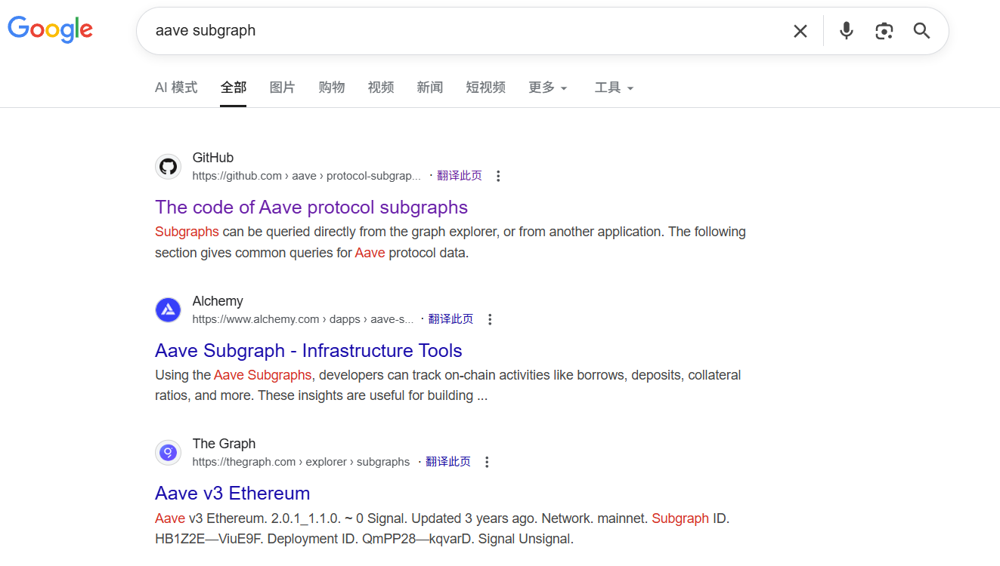
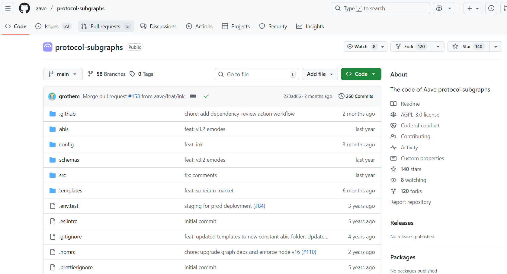
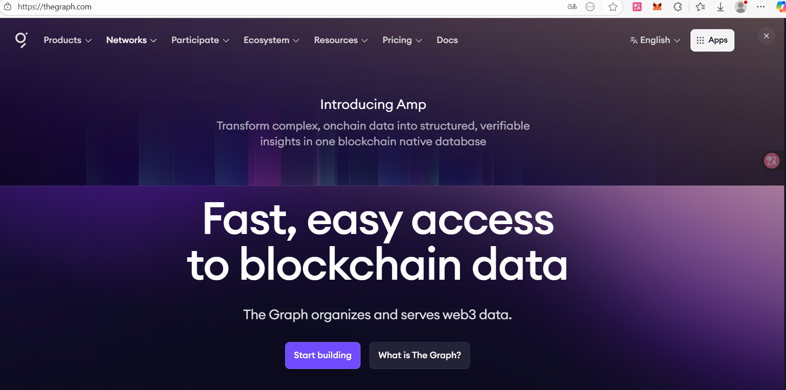
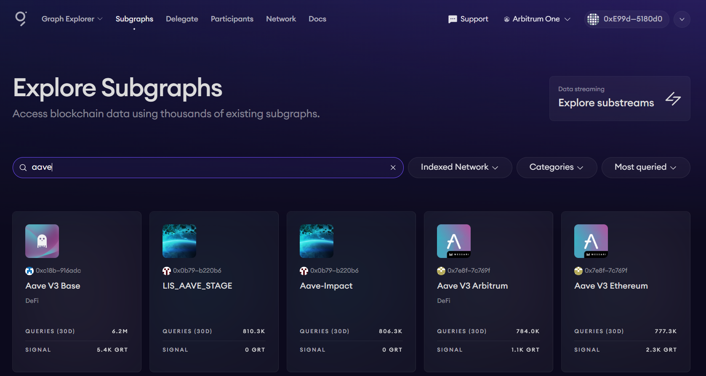
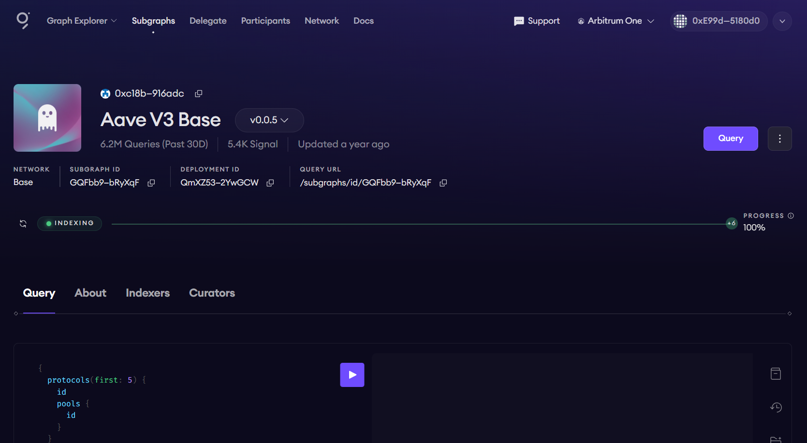
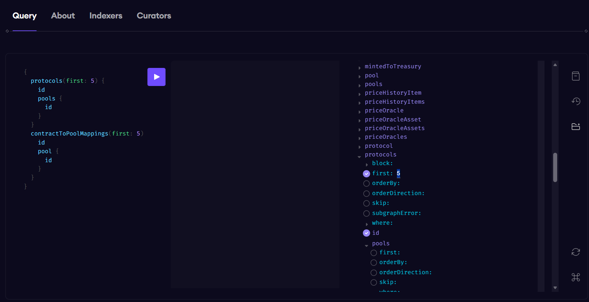
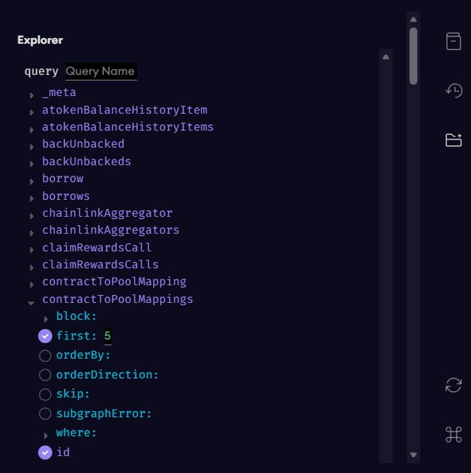
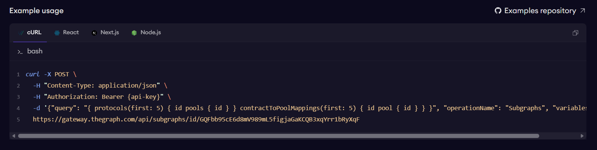
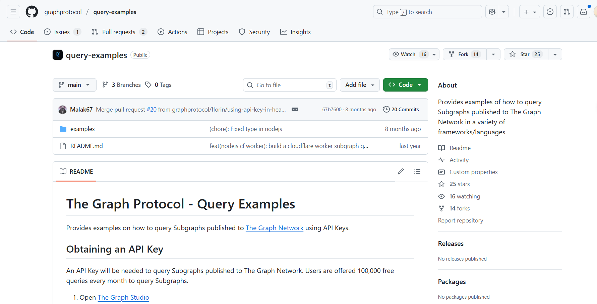
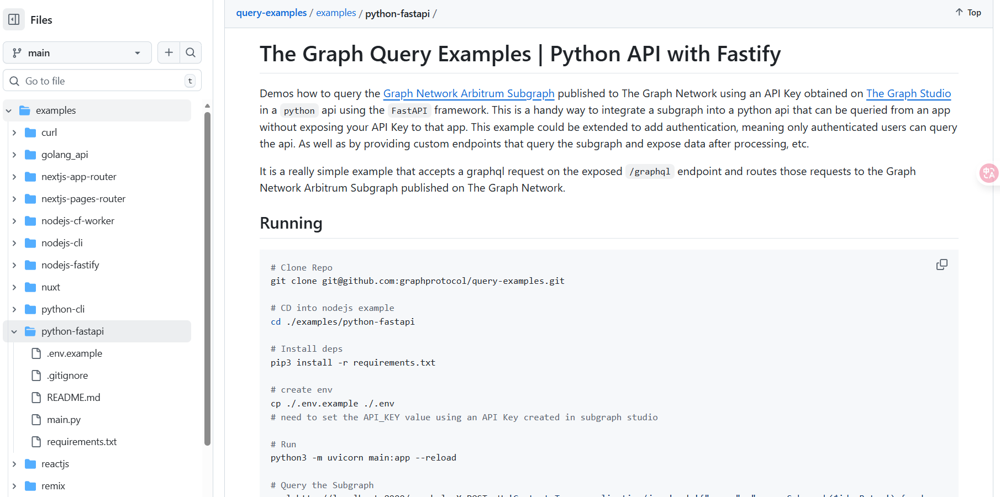

# Subgraph介绍

## 什么是 Subgraph？(核心概念)

简单来说，**Subgraph 是 The Graph 协议中的“数据索引蓝图”**。

区块链本质上是一个按时间顺序排列的账本（链表），它非常擅长处理交易和保证安全性，但非常**不擅长数据查询**。
* **困难场景：** 如果你想知道“Aave 平台上过去一年借款额最高的前 10 个用户是谁”，在没有 Subgraph 的情况下，你需要扫描 Aave 上线以来的每一个区块，解析每一笔交易，这可能需要几天时间。
* **解决方案：** Subgraph 就像是区块链世界的“Google 爬虫”。它定义了如何从区块链的杂乱数据中提取特定信息，并将其整理成结构化的数据库。

**一句话总结：** Subgraph 定义了要监听哪些链上事件，以及如何将这些事件转化为可供查询的数据实体。

## Subgraph 的工作原理 (黑盒内部)

一个 Subgraph 的运行包含三个核心步骤：**监听 (Listening)** -> **处理 (Processing)** -> **服务 (Serving)**。

### A. 定义阶段 (The Blueprint)
一个 Subgraph 由三个主要部分组成（概念上）：
1.  **Manifest (清单):** 告诉索引器去哪里看。比如：“去以太坊主网，监听地址为 `0x...` 的 Aave Lending Pool 合约。”
2.  **Schema (模式):** 定义数据存成什么样。比如：“我们需要一张‘用户表’，包含余额、借贷历史；还需要一张‘资产表’，包含利率、总流动性。”
3.  **Mappings (映射逻辑):** 定义如何转换。这是核心逻辑层。比如：“当链上发生 `Deposit`（存款）事件时，找到对应的‘用户表’记录，把他的余额加 100。”

### B. 运行流程 (The Flow)
1.  **事件触发：** Aave 智能合约在链上被交互（例如有人存钱），发出了一个 `Deposit` Event。
2.  **捕获：** The Graph 的节点（Graph Node）一直在扫描新区块，它发现了这个 Event 符合你的 Subgraph 清单。
3.  **处理 (Handler)：** 节点运行你定义的映射逻辑（Mapping）。它读取当前的数据库状态，进行计算（例如：更新总锁仓量 TVL），然后保存新状态。
4.  **存储：** 处理后的数据被存入底层的数据库（通常是 PostgreSQL）。
5.  **查询：** 你（用户）通过 **GraphQL API** 向节点发送请求，节点瞬间返回结构化的 JSON 数据。

## Subgraph 在 Aave 场景下的具体应用

在我的项目中，使用的是 Aave 的数据。Aave 的逻辑非常复杂，涉及存款、借款、闪电贷、清算、利率变动等。Subgraph 在这里起到了至关重要的“翻译”作用。

### 如果没有 Subgraph：
只能获得原始的 Hex（十六进制）数据。你必须自己计算复利，自己跟踪每个时刻的利率变化，这极易出错。

### 有了 Subgraph (现在的优势)：
Aave 的官方 Subgraph 已经为你做好了极其复杂的预处理：

* **聚合数据：** 它可以直接告诉你某个资产（比如 USDC）当前的 `utilizationRate`（资金利用率）、`variableBorrowRate`（浮动借款利率），而不需要你自己去合约里读。
* **历史快照：** 它可以查询“用户 X 在 30 天前的健康因子（Health Factor）是多少”。这对于训练你的模型或回测策略非常有用。
* **关联关系：** 它可以轻松通过 GraphQL 查询到一个用户借了哪些币、存了哪些币，以及这些操作对应的具体交易哈希。

## 在你的“链上链下交互”架构中的位置

我最终的项目是实现**链上与链下的交互**。Subgraph 是这个闭环中的**感知层（Sensor）**。

请看这个概念性的数据流向：

1.  **链上发生动作 (Aave Protocol):** 用户在链上操作，数据状态改变。
2.  **数据索引 (The Graph):** Subgraph 捕捉到这些改变，更新索引数据库。
3.  **数据拉取 (Off-chain Analysis - 你的 Python 程序):**
    * 这是**我这个数据拉取的具体过程**。
    * 你的后端定期（或轮询）向 Subgraph 的 GraphQL 端点发送查询请求（这是动态的，但是现在为了方便研究只研究一段时间的静态数据，只拉取一次）。
    * *例如：* “每 5 分钟查询一次，给我清算历史距离现在最近的前100位被清算的人的清算情况”
4.  **策略分析 (Model/Logic):**
    * 你的 Python 代码拿到数据后，运行你的分析模型。
    * *决策：* “发现用户 A 濒临清算，且当前 Gas 费较低，判定这是一个套利/清算机会。”
5.  **执行交互 (On-chain Execution):**
    * 我做了一个使用python驱动合约进行链上决策的原型。具体请见：https://github.com/williamtage5/onchain-offchain-executor。
    * 你的 Python 脚本调用 Web3 库，使用你的私钥签名一个交易。
    * 将交易发送回区块链（例如调用 Aave 的 `liquidationCall` 函数）。

# 为何要选择Subgraph去获取数据？

经过实际部署证明，**“怎么拿数据”**往往比“怎么写智能合约”更耗费精力。那么，十分有必要去选择最为合适的调用数据的方法。

以下将详细对比 **Subgraph (The Graph)** 与其他主流数据获取方案（主要是 **RPC 直连** 和 **专用数据 API**）。
这将帮助你明确为什么 Subgraph 是分析类的首选，以及它在哪些方面可能需要互补方案。

## 1. 方案一：Subgraph (The Graph)
**—— 结构化的区块链数据库**

这是目前选用的方案。它就像是在区块链旁边挂了一个专门为你整理数据的“会计”。

### 优点 (Pros)
* **关系型查询能力 (这是最大优势):**
    你可以像查 SQL 数据库一样提问。
    * *例子：* “找出 Aave 上所有存款大于 1000 USDC 且健康因子小于 1.1 的用户。”
    * *如果不通过 Subgraph，* 你需要遍历成千上万个地址才能找到这些人。
    * 从实际的操作上讲，免费版本的操作将会返回前100个符合这样条件的样本。
* **历史状态回溯:**
    它可以轻松获取“时间序列”数据。
    * *例子：* “给我过去 30 天每一天的借款利率变化曲线。”
    * 这对于**数据分析**至关重要，因为单纯的链上查询通常只能查“当前这一刻”的状态。
* **数据聚合与计算:**
    * Subgraph 在索引时就已经把数据算好了（例如计算好了累计利息）。你查询时拿到的是成品，减轻了你 Python 后端的计算压力。
    * 换句话说，你从原始的交易中是无法直接获取一些数据的。开发者在开发subgraph的时候已经根据最最原始的数据进行了特征的生成和整理。
* **Aave 生态标准化:**
    Aave 官方维护了非常完善的 Subgraph。这意味着你不需要自己重新定义数据结构，直接利用官方现成的逻辑即可。

### 缺点 (Cons)
* **索引延迟 (Indexing Lag):**
    这是最致命的短板。从链上交易确认到 Subgraph 数据库更新，通常有 **几秒到几分钟** 的延迟。
    * *风险：* 如果你想做毫秒级的“清算机器人”抢跑，Subgraph 的数据可能已经过时了（虽然只是几秒）。
    * 在实际操作的过程中，这也意味着由于不同属性的数值的更新并不是总是及时的。有时可能会一个具体的事件对应两个属性。一个属性更新了可以获取，而另一个属性还没有更新没有办法获取。
* **对服务节点的依赖:**
    如果托管 Subgraph 的节点挂了，或者同步卡住了，你的数据流就会中断。

## 2. 方案二：RPC 直连 (Direct RPC Calls)
**—— 与区块链节点的原始对话**

这是使用 `web3.py` 或 `ethers.js` 直接连接 Infura、Alchemy 或自建节点。这是最底层的交互方式。

### 优点 (Pros)
* **绝对实时:**
    只要节点接收到区块，你就能立刻读到数据。对于**高频交易**或**抢跑交易**，必须用 RPC。
* **权威性:**
    这是数据的源头，不经过任何第三方索引层的处理，不存在“索引错误”的可能性。
* **写操作必须用它:**
    Subgraph 只能“读”。你的项目最后一步“链上交互”（发送交易），**必须**通过 RPC 来完成。

### 缺点 (Cons)
* **无法进行复杂筛选:**
    RPC 接口非常笨。你只能问：“这个地址现在的余额是多少？”
    你**不能**问：“谁的余额是 100？”。如果要找，你必须写代码去循环查询几万个地址，速度极慢且效率低下。
* **历史数据查询困难:**
    要查历史数据，通常需要指定区块高度（Block Number）一次次去问。如果跨度很大，请求次数会爆炸，容易被节点服务商封 IP。
* **数据是原始的:**
    你会得到一大堆十六进制（Hex）代码和原始整数（例如 `1000000000` 表示 1 USDC）。你需要自己在 Python 代码里处理精度（Decimals）和复杂的合约逻辑解析。

## 3. 方案三：专用数据 API (如 Dune API, Covalent, Alchemy Enhanced APIs)
**—— 商业化的成品数据服务**

这些是中心化公司提供的“加强版”数据接口。大概率是要钱的，这是我没有选择的主要原因，而且付完钱最终调用的效果如何暂时还不清楚。

### 优点 (Pros)
* **开箱即用:**
    它们通常提供非常人性化的 REST API。
    * *例子：* `GET /v1/address/{address}/balances_v2` 直接给你返回该用户所有代币余额。
* **多链整合:**
    如果你将来要把项目扩展到 Optimism 或 Arbitrum 上的 Aave，这些 API 通常只需要改一个参数就能切换网络。

### 缺点 (Cons)
* **定制性差:**
    如果 Aave 推出了一个新功能（比如 GHO 稳定币的新逻辑），这些通用 API 可能还没来得及更新支持，而 Subgraph 通常更新得更快（因为是社区或协议方自己维护的）。
* **黑盒与成本:**
    你不知道它们的数据是怎么算出来的。而且对于高频的大数据量分析，API 调用费用可能非常昂贵。
* **延迟不可控:**
    类似于 Subgraph，它们也是经过处理的数据，不如 RPC 实时。

### 综合对比总结表

| 特性 | Subgraph (The Graph) | RPC 直连 (Web3.py) | 专用数据 API (Covalent等) |
| :--- | :--- | :--- | :--- |
| **核心用途** | **复杂筛选、历史分析、关系查询** | **实时状态查询、发送交易** | 资产概览、跨链查询 |
| **数据形态** | 高度结构化、已加工 (JSON) | 原始数据、十六进制 | 标准化 JSON |
| **查询灵活性**| 极高，类似 SQL | 极低，只能点对点查 | 中等，受限于接口定义 |
| **实时性** | 中 (秒级~分钟级延迟) | **高 (实时)** | 中/低 (取决于服务商) |
| **开发难度** | 中 (需学习 GraphQL) | 高 (需手动解析数据) | 低 (REST API) |
| **适合场景** | **筛选目标用户、训练分析模型** | **监控最新区块、执行清算/交易** | 制作用户资产面板 |

# 调用Subgraph获取数据的核心：Time Travel

**“时间旅行”（Time Travel Queries）** 是 Subgraph 最具杀伤力、也是最核心的特性之一。对于做 **量化分析、策略回测** 和 **机器学习模型训练**（正是你关注的领域）来说，这一特性是无价的。

普通的 API（如银行接口）通常只能告诉你“现在的余额是 100”。但区块链的数据结构本质是一个按时间顺序链接的账本，Subgraph 完美利用了这一点，让你能够**任意“冻结”时间，查询那个瞬间的世界状态**。

## 1. 时间旅行的本质：基于区块高度（Block Height）的切片

在区块链世界里，“时间”的计量单位不是“秒”，而是**区块高度” (Block Height)**。

* **常规数据库：** 这是一个覆盖式的系统。如果用户 A 的余额从 100 变为了 200，数据库会把 100 擦除，写上 200。你如果不专门做日志记录，就永远失去了 100 这个状态。
* **Subgraph 的时间旅行：** 当你向 Subgraph 发起查询时，你可以附加一个特殊的参数——**`block: { number: 123456 }`**。

当你加上这个参数，Subgraph 会忽略当前最新的状态，而是**回滚**到底层数据库中对应区块高度的那一刻。它就像一个视频播放器的进度条，你可以随意把进度条拖拽到历史上的任何一帧，那一帧的数据就是静止的、确定的。

## 2. 在 Aave 分析中的三大应用场景

对于 Aave 数据分析项目，时间旅行主要解决以下三个核心问题。举三个场景来解释我们在调用数据的时候如何关注到下面的几个方面。

### A. 完美的策略回测 (Perfect Backtesting)
如果我们在训练一个机器学习模型来预测“贷款违约概率”，你不能用今天的宏观数据去预测昨天的违约。你需要**重构历史现场**。

* **场景：** 你想知道“在 ETH 价格暴跌 20% 的那个小时里，Aave 用户的健康因子（Health Factor）是如何变化的？”
* **操作：** 你可以编写一个循环，每隔 100 个区块（约 20 分钟）向 Subgraph 发送一次查询，获取那个时刻所有借款人的数据快照。
* **结果：** 你得到了一个精准的时间序列数据集，这是训练 ML 模型的完美“特征工程”素材。

### B. 状态重现与归因分析 (State Reconstruction & Attribution)
当链上发生了一次奇怪的交互（比如一次意想不到的大额清算），你需要搞清楚**为什么会在那时发生？**。

* **问题：** 现在的价格已经回升了，用户的健康因子看起来很安全，为什么他昨天被清算了？
* **操作：** 找到清算交易发生的那个区块高度 $N$，查询 $N-1$ 高度时的 Subgraph 数据。
* **结果：** 你能看到清算前一秒的真实数据——也许当时的预言机报价瞬间闪崩，或者利率飙升导致债务激增。这是事后诸葛亮（Post-mortem analysis）的唯一工具。

### C. 计算精确的“变化量” (Calculating Exact Deltas)
很多时候，你关心的不是“值”，而是“变化”。

* **操作：**
    1.  查询区块 $T_1$ 时的 `totalBorrows`（总借款）。
    2.  查询区块 $T_2$ 时的 `totalBorrows`。
    3.  计算 $(T_2 - T_1)$。
* **意义：** 这让你能算出具体的区间增长率，排除掉 $T_2$ 之后发生的任何噪音干扰。

## 3. 技术实现原理：它是如何做到的？

了解原理有助于你更好地设计查询逻辑：

1.  **不可变性 (Immutability):** 区块链的历史一旦写入就不可更改。Subgraph 索引节点在处理数据时，会将每一个 Entity（实体）的每一次变更都记录下来，并标记上版本号（对应的区块范围）。
2.  **版本控制数据库:** 当你请求“区块 1000”的数据时，Subgraph 的底层 SQL 查询会自动添加过滤条件，类似于：
    `SELECT * FROM users WHERE valid_from <= 1000 AND (valid_to > 1000 OR valid_to IS NULL)`
    这确保了你拿到的是在该区块高度依然有效的数据版本。

## 4. 使用“时间旅行”的注意事项与代价

虽然功能强大，但在实际工程中（特别是你的 Python 项目中）需要注意以下几点：

* **必须依赖归档节点 (Archive Node):**
    这是最关键的硬件限制。Subgraph 要支持任意深度的历史查询，它背后的区块链节点（Ethereum Node）必须是**全量归档节点（Archive Node）**。这种节点存储了创世区块以来的所有状态。如果你自建节点但只跑了 Full Node（非 Archive），你可能查不到太久以前的历史状态。
    *(注：如果你使用 The Graph 的托管服务或去中心化网络，他们通常已经为你处理好了这个问题。)*

* **查询速度 (Performance):**
    查询“最新状态”通常最快，因为索引器可以直接从缓存或热数据区读取。查询“很久以前的某个随机区块”可能会慢一些，因为数据库需要去深层存储中检索旧版本的数据行。

* **数据一致性:**
    在做跨合约分析时，确保你查询的所有数据都基于**同一个区块高度**。
    * *错误做法：* 查用户余额（未指定区块，默认最新），查 Aave 利率（指定了昨天）。这样拼凑的数据是错乱的。
    * *正确做法：* 无论查什么表，都在 query header 里统一带上 `block: { number: X }`。

# AAVE平台的Subgraph

那如何看一个合约有没有开发和维护其Subgraph?

你只需要去谷歌搜索平台名称加上subgpraph即可。然后最优先看有没有官方文档或者github。



你可以看到github上面这个应该是官方的。


它公开了endpoint hosted在The Graph 这个平台上。

## The Graph 网络

绝大多数合约的subgraph都是防在The Graph这个网络平台上的。所以我觉得有必要介绍一下The Graph(https://thegraph.com/)。


### 什么是 The Graph 与 Subgraph？

在开始使用数据之前，我们需要理解支撑我们数据获取的底层基础设施。这涉及两个核心概念：**The Graph**（协议/平台）和 **Subgraph**（索引蓝图）。

#### 1\. The Graph：区块链世界的“谷歌”

**The Graph** 是一个去中心化的**索引协议（Indexing Protocol）**。

为了理解它的作用，我们需要先看清区块链的本质：区块链是一个为了“写入”和“安全”而优化的账本，但它对于“读取”非常不友好。

  * **没有 The Graph 时：** 区块链就像一堆杂乱无章堆放在仓库里的收据。如果你想知道“过去一年谁买了最多的苹果”，你必须一张一张翻看所有的收据，效率极低。
  * **有了 The Graph 后：** 它就像是雇佣了一群图书管理员（节点/Indexers）。他们夜以继日地整理这些收据，将其分类、排序并存入高效的数据库中。

简而言之，**The Graph 是基础设施层**，它提供了一个全球化的网络，用于存储、处理和分发索引后的区块链数据。

#### 2\. Subgraph：数据的“索引蓝图”

如果说 The Graph 是那个巨大的图书馆，那么 **Subgraph** 就是一本具体的\*\*“图书目录”**或**“API 定义书”\*\*。

The Graph 作为一个通用平台，它本身不知道你要查的是 Aave 的借贷数据，还是 Uniswap 的交易数据。**Subgraph** 就是开发者编写的一套逻辑文件，它明确地告诉 The Graph 的节点：

1.  **监听谁？**（例如：监听 Aave V3 在以太坊上的智能合约地址）。
2.  **找什么？**（例如：每当合约发出 `Deposit` 事件时）。
3.  **存什么？**（例如：记录存款人的地址、金额，并更新该市场的总资金池数字）。

因此，**Subgraph 是特定于应用程序的（Application-Specific）**。Aave 有 Aave 的 Subgraph，Uniswap 有 Uniswap 的 Subgraph。

#### 3\. 核心关系：平台与应用 (The Relationship)

理解它们关系的最好方式是通过类比：

| 概念 | 类比：智能手机生态 | 类比：网站搜索引擎 | 你的项目中的角色 |
| :--- | :--- | :--- | :--- |
| **The Graph** | **iOS / 安卓 操作系统** | **Google 搜索引擎** | **底层服务商**<br>提供计算能力和存储网络，负责运行代码。 |
| **Subgraph** | **App (应用程序)** | **网站 SEO 规则** | **数据接口 (API)**<br>这是你实际调用的对象（即 Aave Subgraph）。 |

#### 它们是如何协作的？

在你的项目中，数据流向是这样的：

1.  **Aave 开发者** 编写了 **Aave Subgraph** 的代码（蓝图），并将其部署到 **The Graph** 网络上。
2.  **The Graph 的节点** 读取这份蓝图，开始扫描以太坊区块链，按照蓝图的要求整理出 Aave 的数据。
3.  **你（数据分析师）** 不需要管底层节点怎么工作，你只需要向 **Aave Subgraph** 发送查询请求，The Graph 平台就会把整理好的数据返回给你。

#### 总结

  * **The Graph** 是**路**（基础设施/网络）。
  * **Subgraph** 是**车**（跑在路上的具体业务逻辑）。

在接下来的开发中，我们将通过访问 **Aave Subgraph**（车），利用 **The Graph**（路）提供的能力，来获取我们所需的链上金融数据。

### 操作AAVE的Subgraph的Playground

你直接搜索aave。然后第一个是调用最多的，应该是官方的。



让我们来解读 Subgraph 仪表盘 (Dashboard Breakdown)：


当你点击进入具体的 Subgraph 详情页时，这个控制台是你获取配置信息的关键位置。

请详细阅读以下核心参数，它们将直接用于你的代码配置：

  * **Query URL (查询链接):**
      * *位置：* 页面中部的 HTTP 链接（通常以 `https://api.thegraph.com/...` 或 `gateway...` 开头）。
      * *作用：* **这是最关键的信息。** 在你的 Python 代码中，这个 URL 就是你发送 HTTP POST 请求的目标地址（Endpoint）。把它理解为数据库的 IP 地址和端口。
  * **Indexing Status (索引状态):**
      * *位置：* 页面中部的进度条（图中显示绿色 `Synced` 或 `Indexing`）。
      * *作用：* 确保进度条显示 **100%** 或 **Synced**。
      * *警告：* 如果进度条未满（例如 99%），意味着该 Subgraph 还在追赶区块链的最新区块。此时查询到的数据会有延迟，不适合做实时交互，仅适合做历史分析。
  * **Network (网络):**
      * *作用：* 二次确认这里显示的网络（如 `Base`）是否与你的 Metamask 钱包或 RPC 节点网络一致，避免跨链数据混淆。
  * **Last Updated (最后更新):**
      * *作用：* 显示该 Subgraph 代码逻辑的最后维护时间。如果是几年前，可能意味着它不支持 Aave 的最新功能。

随后你可以使用 Playground 进行逻辑验证 (Prototyping)：


在仪表盘右侧（或点击 `Query` 按钮后），你会看到一个代码编辑区域，这就是 **GraphQL Playground**。

这是连接“思维”与“代码”的桥梁。**强烈建议不要直接在 Python 里盲写查询语句**，而是先在这里调试。

  * **交互式查询 (Play Button):**
      * 在左侧输入 GraphQL 查询语句（类似 JSON 的结构）。
      * 点击中间的“播放”按钮。
      * 右侧会立刻显示从区块链提取的数据结果。
  * **Schema Explorer (文档浏览器):**
      * 通常在最右侧有一个 `Docs` 或 `Schema` 标签。它可以像字典一样告诉你有哪些表（Entities）可以查（例如 `users`, `reserves`, `borrows`），以及每个表里有哪些字段。这比盲猜字段名高效得多。


可惜的是，官方并没有给出每个Schema的每个属性的详细阐述，为此，我使用解析网页加上Gemini辅助生成阐述的方法制作了一份阐述文档，可以做作为参考，地址在：https://github.com/williamtage5/AAVE-target-customers-Health-Factor-and-Reserves-collection-from-subgraph/blob/main/note/query%E7%9A%84%E5%88%86%E8%AF%B7%E6%B1%82%E5%88%86%E6%9E%90/query%E7%9A%84%E5%88%86%E8%AF%B7%E6%B1%82%E5%88%86%E6%9E%90.md

它详细解释了：

这里列出的基本所有的属性。

从实际部署的角度来讲，一旦你在 Playground 中成功获取了想要的数据（例如：成功列出了前 10 个借款最多的用户），你的开发流程就进入了最后一步：**自动化**。这是我们的实施思路。

这个过程是无缝衔接的：

1.  **验证：** 在 Playground 中调试 Query 语句，直到没有任何报错，且数据符合预期。
2.  **复制：** 直接复制这段经过验证的 Query 字符串。
3.  **集成：** 将这个字符串粘贴到你的 Python 脚本中，作为变量赋值给 `query` 参数。
4.  **自动化：** 此时，Python 只需要负责像“发快递”一样，把这个查询包裹发送给 **步骤 2** 中获取的 `Query URL`。

通过这种方式，你实际上是**用 Playground 编写了数据库逻辑，用 Python 实现了定时执行和后续的数据清洗与分析**。这构成了这一整套链上数据分析系统的基石。

# 任务定义

OK！现在了解了所有的infrastructure，我们终于可以开始我们具体的操作了。

我想要最先明确的是，我们的最终的任务是：

```
查找一定的用户在一定时间的抵押物、债务的变化情况，以及这段时间这个用户的健康因子的变化。
```

我来给限制一下范围和定义：

* 一定用户是某个时间点清算历史中的离查询时间最近的前100位用户。这个用户被清算了，才有清算的历史。清算的历史schema里面记录了每个清算活动的信息。
* 一定时间是指清算的时间到上一步这个用户进行操作的时间。可能是偿还，可能是存款，也可能是其他的例如闪电贷等行为。

请注意：
* 在AAVE的子图中并没有一个子图让调用者能够很方便的直接调出健康因子的变化的情况。必须从这个用户的资产的变化中通过抵押和贷款的情况自己再算一遍。
* 所有的清算不一定是由健康因子跌破1进行的，可能还存在其他的情况导致抵押物清算。我们研究的是正常的跌破1的清算活动。
* 健康因子的核心波动是币种的价格波动。但是，aave的子图中的每个币种的价值更新是离散的。其更新的时机一个取决于chainlink的不连续更新，一个取决于aave由于自身活动而进行的不连续请求。此外，chainlink并不拥有数据库API调用的功能。所以，为了简化问题，币种的价格波动通过chainlink的一个主要的数据源coingecko(https://www.coingecko.com/)。时间粒度设置为小时。因为调取三天以上的默认的调取粒度是小时级别。不管什么粒度，效果是等价的。

所以，具体的任务可以抽象为：
1. 获取清算簿的清算历史，得到被清算人的信息、资产（抵押物贷款）和区块时间。
2. 根据被清算人的清算时间，往前推找到最后一次操作发生的事件，确定研究的事件范围。
3. 根据研究的时间范围，调取涉及到的币种的价格波动。
4. 根据价格波动，计算用户在这段时间的抵押物、贷款的变动情况，从而计算健康因子。

以下我将详细阐述每一步的具体的实现方式。

# Step 1: 获取清算簿的清算历史与事件时间窗界定

此步骤的目标是构建一个高质量的“被清算用户样本库”。我们不仅需要知道谁被清算（Who）以及何时被清算（When），更关键的是要确定分析的**时间窗口（Time Window）**。

本步骤被拆分为三个逻辑子任务：

1.  **初始获取：** 拉取最近发生的清算事件。
2.  **回溯查询：** 针对每个被清算用户，寻找其清算前的最后一次链上操作，以界定研究的起始时间。
3.  **数据清洗：** 剔除无法追溯历史的用户，确保样本的完整性。

但是首先，要从本地与The Graph 网络交互需要中间件。我使用的是fastapi。我的探索的过程如下：

先是发现调用的方法：


然后选取自己偏好的交互方法：


最终在原型的基础上进行调试和修改：


具体的部署过程，以及重启的过程如下：

## 1.0 部署 FastAPI 服务

为了安全、高效地与 The Graph 网络进行交互，我本地部署一个基于 Python FastAPI 的轻量级服务器。该服务器作为一个中间件（Proxy），负责管理 API 密钥并转发查询请求，避免在前端或分析脚本中直接暴露敏感密钥。

以下是完整的环境搭建与启动流程。

### 1.0.1 环境准备与依赖安装

由于原项目的 `requirements.txt` 存在路径硬编码问题，且部分依赖库（如 `aiohttp`）在 Python 3.12 下存在编译冲突，我们需要重建一个干净的 Python 3.10 环境。

我是windows11操作系统。

**1. 获取代码库**
首先克隆 The Graph 官方提供的 Python FastAPI 示例代码：

```bash
git clone https://github.com/graphprotocol/query-examples.git
cd ./query-examples/examples/python-fastapi
```

**2. 创建隔离环境 (Conda)**
为了避免依赖冲突，创建一个指定 Python 3.10 版本的 Conda 环境：

```bash
# 如果已存在旧环境，先删除：conda env remove --name aave
conda create --name aave python=3.10
conda activate aave
```

**3. 修复并安装依赖**
原项目中的 `requirements.txt` 需要修正。注意！这和官方给出的文档不一样，**请严格按照这个执行**。请修改该文件内容如下：

```text
fastapi==0.103.1
uvicorn[standard]==0.23.2
python-dotenv==1.0.0
aiohttp==3.8.5
pydantic-settings==2.0.3
```

然后在激活的 `(aave)` 环境中执行安装，并补充必要的 `requests` 库：

```bash
pip3 install -r requirements.txt
pip install requests
```

### 1.0.2 配置 API 密钥

服务器需要通过环境变量加载您的 Subgraph Studio API 密钥。

1.  **创建配置文件：** 将模板文件复制为 `.env`。
    ```cmd
    copy .\.env.example .\.env
    ```
2.  **编辑密钥：** 打开 `.env` 文件，填入您的密钥。
      * **注意格式：** 必须是 `KEY=VALUE` 格式，等号前后**不要有空格**，密钥本身**不要加引号**或花括号。
      * *正确示例：* `API_KEY=ddx19514d0d3be1982cb8e2c641a3461`

### 1.0.3 启动 FastAPI 服务

配置完成后，使用 `uvicorn` 启动服务器。

**首次启动命令：**

```bash
python -m uvicorn main:app --reload
```

  * `main:app`: 指向 `main.py` 文件中的 `app` 对象。
  * `--reload`: 开启热重载模式，代码修改后自动重启（**注意：** 修改 `.env` 文件后必须手动重启）。

当终端显示 `INFO: Application startup complete.` 时，说明服务已在 `http://localhost:8000` 成功运行。

-----

### 1.0.4 日常运维：重新开启服务

在后续的开发过程中（例如重启电脑或关闭终端后），您需要按照以下标准步骤重新拉起服务。

**标准启动流程：**

1.  **进入项目目录：**
    打开终端（Command Prompt 或 PowerShell），导航至项目文件夹。

    ```cmd
    cd ./query-examples/examples/python-fastapi
    ```

2.  **激活虚拟环境：**
    确保切换到我们配置好依赖的 `aave` 环境。

    ```cmd
    conda activate aave
    ```

3.  **启动服务器：**
    运行 Uvicorn 服务。

    ```cmd
    python -m uvicorn main:app --reload
    ```

**成功运行示例：**

```bash
(base) C:\Users\10158>cd ./query-examples/examples/python-fastapi

(base) C:\Users\10158\query-examples\examples\python-fastapi>conda activate aave

(aave) C:\Users\10158\query-examples\examples\python-fastapi>python -m uvicorn main:app --reload
INFO:     Will watch for changes in these directories: ['C:\\Users\\10158\\query-examples\\examples\\python-fastapi']
INFO:     Uvicorn running on http://127.0.0.1:8000 (Press CTRL+C to quit)
INFO:     Started reloader process [22132] using WatchFiles
INFO:     Started server process [18244]
INFO:     Waiting for application startup.
INFO:     Application startup complete.
```

保持该终端窗口开启，您的 Python 数据分析脚本现在可以通过访问 `http://localhost:8000/graphql` 来间接查询 Aave Subgraph 数据了。

## 1.1 初始拉取：获取最近的清算名单

首先，我们需要从 Aave Subgraph 中提取最新的清算记录。这是我们分析的起点。

  * **操作逻辑：**
    向本地部署的 FastAPI 网关（代理了 The Graph 服务）发送 GraphQL 查询。查询目标是 `liquidationCalls` 实体，按时间戳倒序排列，以获取最新的数据。

  * **输入 (Input):**

      * **Endpoint:** `http://localhost:8000/graphql`
      * **GraphQL Query:**
        ```graphql
        query GetLatestLiquidations {
          liquidationCalls(first: 100, orderBy: timestamp, orderDirection: desc) {
            user {
              id  # 用户钱包地址
            }
            timestamp  # 清算发生的时间戳 (End Time)
            txHash     # 交易哈希，用于后续验证
          }
        }
        ```

  * **输出 (Output):**

      * **中间文件:** `latest_100_liquidations.csv`
      * **数据结构:** 包含 100 行数据，列名为 `user_id` (用户地址), `liquidation_timestamp` (清算时间), `txHash` (交易哈希)。

## 1.2 历史回溯：界定事件研究的时间窗口

仅有清算时间点是不够的。为了计算健康因子的变化轨迹，我们需要确定一个**观察起始点**。理论上，用户在清算前的最后一次主动操作（如存钱、借钱、调整模式）改变了其账户状态，因此我们将“最后一次操作时间”作为研究窗口的起点。

  * **操作逻辑：**
    读取上一步生成的 100 个用户名单，编写一个 Python 循环。对于每一个用户，构建一个动态的 GraphQL 查询，寻找在 `liquidation_timestamp` **之前** 发生的最近一次交互。

  * **输入 (Input):**

      * **数据源:** `latest_100_liquidations.csv` 中的 `user_id` 和 `liquidation_timestamp`。

      * **动态 Query (Function: `build_user_history_query`):**
        针对每个用户，我们需要联合查询三张表，找出时间戳最大的那个事件：

        1.  `reserves`: 包含存款、取款、借款、还款等核心交互。
        2.  `userEmodeSetHistory`: 用户是否切换了效率模式（E-Mode），这会直接改变清算阈值。
        3.  `liquidationCallHistory`: 用户之前是否已经被清算过（多笔清算的情况）。

        查询条件设置为 `where: {timestamp_lt: {liquidation_timestamp}}` 以确保找到的是清算**前**的动作。

  * **处理过程:**
    代码遍历所有用户，对比上述三个查询结果的时间戳，取最大值（即最近的一次操作）记录为 `last_action_timestamp`，并记录操作类型 `last_action_type`。

  * **输出 (Output):**

      * **内存对象:** 包含历史信息的 DataFrame。
      * **新增字段:**
          * `last_action_timestamp`: 研究窗口的起始时间。
          * `last_action_type`: 起始时间的事件类型（如 `reserves` 或 `liquidationCallHistory`）。
          * `liquidation_datetime` / `last_action_datetime`: 转换后的易读日期格式。

## 1.3 数据清洗：生成最终目标样本 (Target Sample)

由于 Subgraph 的索引机制或用户行为的复杂性（例如某些用户在极早期操作，超出索引范围），部分查询可能返回 "No History Found"。为了保证后续计算健康因子时的连续性，必须剔除这些“断头”数据。

  * **操作逻辑：**
    使用 Pandas 对 DataFrame 进行过滤。

  * **过滤条件:**
    移除 `last_action_type` 为以下值的数据行：

      * `"No History Found"` (未找到历史)
      * `"User Not Found in Subgraph"` (子图中无此用户)
      * `"Request Error"` / `"GraphQL Error"` (请求失败)

  * **最终输出 (Final Output):**

      * **文件名称:** `Target_sample.csv`
      * **数据量:** 经过清洗后，通常剩余约 60-70 个高质量样本（例如代码运行结果显示从 100 条清洗至 61 条）。
      * **核心价值:** 该文件定义了明确的 `[last_action_timestamp, liquidation_timestamp]` 时间区间，为后续 Step 3 调取该区间内的币价波动提供了精确的参数。

# Step 2: 确定研究时间范围

这一部分的核心在于**如何通过代码逻辑找到“清算前的最后一个动作”**。这不是一个简单的数据库查询，而是一个结合了动态 GraphQL 构建和 Python 逻辑判断的过程。

在 Step 1 中，我们已经锁定了 **“谁在什么时间被清算了”**（即研究的终点 $T_{end}$）。
本步骤的目标是找到 **“研究的起点 $T_{start}$”**。

**逻辑定义：**
$T_{start}$ 被定义为该用户在清算事件发生之前，最后一次**主动改变账户状态**的时间点。
这构成了我们的**事件研究时间窗口 (Event Study Window)**：$[T_{start}, T_{end}]$。在此期间，用户的抵押品数量和债务数量理论上是保持不变的（除了利息累积），因此健康因子的波动完全由**币价波动**驱动。

本步骤通过 Python 脚本实现了“回溯查找”逻辑，具体包含以下三个子环节：

## 2.1 构建动态 GraphQL 查询 (Dynamic Query Construction)

为了找到 $T_{start}$，我们需要询问 Subgraph：“在这个用户被清算的那一秒之前，他最后一次出现在链上是在什么时候？”。

由于 Aave 的用户交互分散在不同的实体中，我们在 Python 中定义了一个函数 `build_user_history_query(user_id, before_timestamp)`，它针对每一个用户动态生成查询语句。

### 输入 (Input)

  * **`user_id`**: 目标用户的钱包地址（来自 Step 1 的输出）。
  * **`before_timestamp`**: 该用户的清算时间戳（即 $T_{end}$）。我们需要查找严格小于 (`_lt`) 这个时间的记录。

### 核心代码逻辑解释

该函数构建了一个包含三个子查询的 GraphQL 请求，旨在捕捉三种可能改变账户状态的行为：

1.  **`reserves` (资金交互):**
      * **目的:** 捕捉存款、取款、借款、偿还等改变余额的操作。
      * **关键条件:** `where: {lastUpdateTimestamp_lt: before_timestamp}`。
      * **排序:** 按 `lastUpdateTimestamp` 倒序 (`desc`) 取第 1 条。
2.  **`userEmodeSetHistory` (模式变更):**
      * **目的:** 捕捉用户是否切换了 Efficiency Mode (E-Mode)。这会瞬间改变清算阈值，从而剧烈影响健康因子。
      * **关键条件:** `where: {timestamp_lt: before_timestamp}`。
3.  **`liquidationCallHistory` (历史清算):**
      * **目的:** 如果用户之前已经被清算过一次（连环清算），上一次清算就是本次研究的起点。
      * **关键条件:** `where: {timestamp_lt: before_timestamp}`。

**生成的 Query 示例：**

```graphql
query GetUserLastAction {
  user(id: "0xUserAddress...") {
    reserves(
      where: {lastUpdateTimestamp_lt: 1761799793}  # 在此清算时间之前
      first: 1
      orderBy: lastUpdateTimestamp
      orderDirection: desc
    ) {
      lastUpdateTimestamp
    }
    # ... 同理查询 userEmodeSetHistory 和 liquidationCallHistory
  }
}
```

## 2.2 执行回溯与最大值比较 (Execution & Comparison)

获得查询结果后，Python 脚本需要在本地进行逻辑判断，确定哪一个事件才是真正的“最后一次操作”。

### 处理过程 (Process)

脚本遍历 DataFrame 中的每一行，执行以下逻辑：

1.  **发送请求:** 将上述动态 Query 发送给 FastAPI 网关。
2.  **解析响应:** 从返回的 JSON 数据中提取三个字段的时间戳：
      * $t_1$: `reserves.lastUpdateTimestamp`
      * $t_2$: `userEmodeSetHistory.timestamp`
      * $t_3$: `liquidationCallHistory.timestamp`
3.  **逻辑竞逐 (Race Logic):**
      * 将提取到的非空时间戳放入一个字典 `actions`。
      * **取最大值:** 计算 $T_{start} = \max(t_1, t_2, t_3)$。
      * *原理：* 离清算时间最近的那个时间戳，数值最大。
4.  **记录类型:** 同时记录产生该最大值的操作类型（例如，是因为“存钱”还是因为“上次被清算”导致的状态改变）。

### 异常处理

  * **No History Found:** 如果三个子查询都返回空列表，说明该用户在 Subgraph 索引范围内没有历史记录。标记为 `No History Found`。
  * **Error Handling:** 捕获网络错误或 GraphQL 语法错误，标记为 `Request Error`。

## 2.3 输出结果与清洗 (Output & Cleaning)

经过上述计算，我们得到了原始数据集的增强版本，并需要进行清洗以生成最终的分析样本。

### 清洗逻辑

我们移除了所有标记为 `No History Found`、`User Not Found` 或 `Error` 的行。这确保了后续步骤计算健康因子时，我们有确定的区间起点。

### 最终输出 (Output)

脚本生成了一个名为 `Target_sample.csv` 的文件，包含以下关键字段：

| 字段名 | 说明 | 来源 |
| :--- | :--- | :--- |
| **`user_id`** | 目标分析用户 | Step 1 |
| **`liquidation_timestamp`** | 研究结束时间 ($T_{end}$) | Step 1 |
| **`txHash`** | 清算交易哈希 | Step 1 |
| **`last_action_timestamp`** | **研究开始时间 ($T_{start}$)** | **Step 2 计算结果** |
| **`last_action_type`** | 起始事件类型 (如 `reserves`) | **Step 2 计算结果** |
| **`liquidation_datetime`** | 可读格式的结束时间 | Step 2 格式化 |
| **`last_action_datetime`** | 可读格式的开始时间 | Step 2 格式化 |

**总结：**
通过 Step 2，我们成功将每个用户的孤立清算点扩展为了一个**闭合的时间区间 $[T_{start}, T_{end}]$**。接下来的 Step 3 将在这个确定的区间内，调取外部价格数据来复现健康因子的波动。

# Step 3: 调取币种价格波动与历史资产快照 (Retrieving Historical Reserve Snapshots)

在确定了研究的时间窗口 $[T_{start}, T_{end}]$ 后，本步骤需要完成数据的**双轨获取**：

1.  **资产状态（数量）**：通过 Subgraph 的“时间旅行”获取用户在清算前一刻持有的代币**数量**（Balances）和债务规模。
2.  **资产价格（价值）**：通过 CoinGecko API 获取该时间段内所有相关币种的**连续价格波动**，以替代 Subgraph 中不连续的 Chainlink 数据。

本步骤包含三个关键子任务：

## 3.1 区块高度定位 (Block Number Mapping)

由于 Subgraph 的“时间旅行”依赖于区块号（Block Number），而 CoinGecko 依赖于时间戳（Timestamp），我们需要建立两者之间的精确映射。

  * **操作逻辑：**
    遍历样本库中的 `txHash`（清算交易哈希），通过 Etherscan API 查询每笔交易被打包的区块号。

      * *目的：* 获得清算发生时的绝对链上坐标。

  * **代码实现：**
    使用 `get_tx_details_from_etherscan` 函数，遍历 Base, Ethereum 等多条链的 API，将 `txHash` 解析为 `block_number` 和 `found_network`。

  * **输出：**
    生成包含区块号的样本文件 `Target_sample_with_block_numbers.csv`。

## 3.2 状态回滚：构建 N-1 区块资产快照 (N-1 Asset Snapshot Construction)

为了复现清算发生的**原因**，我们必须获取清算执行**前一瞬间**的用户持仓状态。直接查询清算区块（Block $N$）的数据会导致误判，因为此时清算可能已执行，债务已被偿还。

  * **数据源：** Aave Subgraph (via FastAPI)。

  * **操作逻辑：**
    针对每个用户，构建 GraphQL 查询，将 `block` 参数设置为 `block_number - 1`。

  * **GraphQL 关键字段解析 (Function: `build_PRE_snapshot_query`):**
    我们主要关注**数量**和**配置**，而非价格：

    ```graphql
    query GetUserSnapshot {
      userReserves(
        where: {user: "0xUserAddress..."}
        block: {number: 12345677}  # 关键：使用 N-1 区块
      ) {
        # 1. 核心数量 (这是计算的基础)
        currentATokenBalance  # 存款数量 (Quantity)
        currentTotalDebt      # 债务数量 (Quantity)
        
        # 2. 风险配置
        usageAsCollateralEnabledOnUser # 用户是否开启了抵押功能
        
        # 3. 币种基础信息
        reserve {
          symbol
          decimals                    # 用于精度转换
          reserveLiquidationThreshold # 清算阈值 (如 8000 = 80%)
          # 注意：虽然代码中拉取了 priceInEth，但我们在后续分析中将主要依赖 CoinGecko 数据
        }
      }
    }
    ```

  * **输出：**
    将每个用户的资产状态保存为独立的 JSON 文件（存储于 `reserves_picture_PRE_liquidation` 目录），这就是我们的“静态底账”。

## 3.3 调取币种价格波动 (Retrieving Price History via CoinGecko)

这是逻辑变更的核心部分。由于 Subgraph 内部存储的 Chainlink 价格数据是**非连续的**（仅在链上更新时记录），无法直接用于绘制 $[T_{start}, T_{end}]$ 期间完整的健康因子波动曲线。因此，我们引入 CoinGecko 作为外部预言机数据源。

  * **为什么放弃 Subgraph 价格数据？**

      * **数据稀疏性：** Chainlink 仅在价格偏差（如 0.5%）或心跳时间（如 24h）触发时才推送到链上。在两个更新点之间，Subgraph 数据是“静止”的，这会掩盖导致清算的瞬间价格插针。
      * **访问限制：** 并非所有 Chainlink 历史数据都能通过 Subgraph 简单遍历获得。

  * **操作逻辑 (CoinGecko 替代方案)：**

    1.  **Token 映射：** 读取步骤 3.2 JSON 文件中的 `symbol` (如 WBTC, USDC)，将其映射为 CoinGecko 的 `api_id` (如 `wrapped-bitcoin`, `usd-coin`)。
    2.  **时间范围设定：**
          * 开始时间：$T_{start}$ (最后一次操作时间)。
          * 结束时间：$T_{end}$ (清算时间)。
    3.  **数据请求：**
        调用 CoinGecko 的 `/coins/{id}/market_chart/range` 接口。
          * *Granularity (粒度):* 自动匹配（通常为 Hourly）。由于大多数清算研究的时间窗口在几天到几周，小时级数据足以反映导致清算的趋势。
    4.  **数据对齐：** 将 CoinGecko 返回的价格时间序列与用户的资产数量（假设在 $[T_{start}, T_{end}]$ 期间保持不变）进行结合。

  * **目的与合理性：**
    通过 CoinGecko，我们获得了一条平滑、连续的价格曲线。结合 Step 3.2 获取的固定资产数量，我们就可以在下一步（Step 4）中，逐小时计算并复现用户健康因子的变化轨迹，从而精准定位健康因子跌破 1.0 的具体时刻。

-----

**总结：**
经过 Step 3 的改进，我们形成了一个**静态数量 + 动态价格**的数据模型：

  * **静态数量 (Subgraph N-1):** 确保了我们使用的抵押品和债务**数量**是绝对准确的链上状态。
  * **动态价格 (CoinGecko):** 弥补了链上数据的不连续性，提供了高质量的时间序列价格用于趋势分析。

# Step 4: 计算健康因子以及针对用户整理数据 (Calculating Health Factor & Data Aggregation)

这是整个分析流程的高潮部分。在完成了前三步（确定被清算用户、界定研究时间窗、获取资产快照和价格波动）之后，本步骤将把这些数据“熔炼”在一起，逐小时复现每个用户在清算前的健康因子（HF）变化轨迹。

我们的目标是生成一条连续的 HF 曲线，验证它是否在清算时刻（$T_{end}$）跌破了 1.0。

本步骤包含四个核心子任务：
1.  **价格数据归一化：** 将 CoinGecko 的美元价格转换为 ETH 本位价格。
2.  **时间序列对齐：** 将不同币种的价格数据对齐到统一的时间轴上。
3.  **健康因子模拟计算：** 结合静态资产数量和动态价格，逐小时计算 HF。
4.  **数据清洗与归档：** 将成功模拟的样本（Reach）和异常样本（UnReach）分类保存。

## 4.1 价格数据的 ETH 本位归一化 (ETH-Denominated Price Normalization)

Aave 的核心计算逻辑（特别是 V2 和 V3 的早期版本）往往基于 ETH 本位。为了消除 ETH 本身对美元波动的干扰，我们需要将所有资产的美元价格转换为相对于 ETH 的价格。

* **操作逻辑：**
    1.  加载 CoinGecko 的 ETH 历史价格数据（`ETH_hourly_price_data.csv`）作为基准。
    2.  遍历所有其他资产（如 WBTC, USDC, AAVE）的美元价格文件。
    3.  执行除法运算：$P_{asset}(ETH) = \frac{P_{asset}(USD)}{P_{ETH}(USD)}$。
    * *合理性分析：* 这种相对价格计算更能反映 DeFi 协议内部的清算逻辑。如果 ETH 和 WBTC 同时对美元下跌 50%，它们的相对价格可能保持不变，用户的健康因子可能因此保持稳定，而不会仅仅因为法币价格波动被清算。

* **输入 (Input):**
    * 基准：`ETH_hourly_price_data.csv` (USD 计价)
    * 目标：`WBTC_price_sequence.csv`, `USDC_price_sequence.csv` 等 (USD 计价)

* **输出 (Output):**
    * 新目录 `every_icon_price_sequence_in_eth` 下的一系列 CSV 文件（如 `WBTC_price_in_eth.csv`），包含 `datetime_utc` 和 `price_in_eth` 两列。

## 4.2 时间序列对齐与数据加载 (Time Series Alignment)

不同币种的价格数据可能存在缺失值或时间戳微小的偏差。为了进行矢量化计算，必须将它们对齐到同一个时间索引上。

* **操作逻辑 (Function: `load_price_data`):**
    1.  接收一个 `hourly_index`（从 $T_{start}$ 到 $T_{end}$ 的每小时时间点）。
    2.  读取该用户持有的所有资产的 ETH 本位价格文件。
    3.  使用 Pandas 的 `reindex` 和 `interpolate`（插值）功能，填补可能存在的短暂数据空洞，确保每个时间点都有价格。
    * *合理性分析：* 矩阵运算要求维度一致。线性插值是处理金融时间序列缺失值的标准做法，既保证了计算的连续性，又不会引入过大的人为偏差。

## 4.3 健康因子模拟计算 (HF Simulation Logic)

这是核心算法。对于每一个时间点 $t$，我们使用 Step 3 获取的**静态资产数量** $Q$ 和本步骤处理好的**动态价格** $P_t$ 来计算 HF。

* **计算公式 (Aave Protocol V3):**
    $$HF_t = \frac{\sum (Q_{Collateral} \times P_t \times LT)}{\sum (Q_{Debt} \times P_t)}$$
    其中 $LT$ 是清算阈值 (Liquidation Threshold)。

* **操作逻辑 (Function: `simulate_hf_for_sample`):**
    1.  **解析配方 (Recipe Parsing):** 从 JSON 快照中提取用户的持仓结构：
        * 分子项（抵押品）：`symbol`, `amount` (数量), `lt` (阈值)。
        * 分母项（债务）：`symbol`, `amount` (数量)。
    2.  **矢量化计算:** 利用 Pandas 的广播机制，一次性计算整个时间序列：
        * `Total_Collateral_Value_Series` = $\sum (Amount_i \times Price\_Series_i \times LT_i)$
        * `Total_Debt_Value_Series` = $\sum (Amount_j \times Price\_Series_j)$
    3.  **调整因子 (Adjustment Factor - GAF):**
        由于 CoinGecko 价格与链上预言机价格存在微小偏差，模拟出的最终 HF 可能不完全等于链上记录的真实 HF。我们计算一个比例因子：
        $$GAF = \frac{HF_{True\_OnChain}}{HF_{Simulated\_Final}}$$
        并用它修正整条曲线，使其在终点精确回归到链上真实值。
    * *合理性分析：* GAF 修正了数据源之间的系统性误差，确保我们的模拟曲线在趋势上正确，且在关键的清算点上绝对精准。

## 4.4 样本分类与数据归档 (Classification & Archiving)

并非所有样本都能成功复现清算过程（例如某些用户可能在 $T_{end}$ 时 HF 依然大于 1，这可能是由于我们尚未捕捉到的链上瞬时插针或套利行为）。我们需要将样本分类。

* **分类逻辑:**
    * **Reach (可达样本):** 模拟出的最低 HF < 1.0，成功解释了清算原因。
    * **UnReach (不可达样本):** 模拟出的最低 HF 始终 $\ge$ 1.0，或者由于数据缺失导致计算失败。

* **输出产物 (Artifacts):**
    1.  **HF Fluctuation CSV:** 包含 `datetime` 和 `health_factor` 的时间序列文件，用于后续画图。
    2.  **Recipe JSON:** 记录了该用户的资产组合和计算参数（静态数据）。
    3.  **Details JSON:** 记录了每个时间点每种资产的详细价值贡献（动态数据），用于深度归因分析。
    4.  **Simulation Log:** 一个总表，记录了每个样本的处理状态、GAF 因子和归档位置。

**总结：**
Step 4 完成了从“原材料”到“分析成品”的转化。我们不仅得到了每个被清算用户的 HF 历史走势图，还通过 GAF 因子修正了误差，并筛选出了高质量的 Reach 样本集合，为最终的策略回测和机器学习特征提取做好了准备。

# 执行总结

## 项目背景
在去中心化金融（DeFi）领域，尤其是AAVE等借贷协议中，用户的健康因子（HF）是衡量其清算风险的核心指标。为了构建一个精准的清算预测模型并进行策略回测，我们需要深入理解清算发生的历史原因。然而，区块链的原始数据查询效率极低，难以直接支持复杂的时间序列分析。

## 任务挑战
1.  **数据获取的困难性**：直接查询链上数据效率低，无法高效获取历史状态。
2.  **价格数据的不连续性**：链上预言机价格更新不连续，无法提供连续的价格曲线。
3.  **清算逻辑的复杂性**：清算涉及多种资产的动态变化，且需在特定历史时刻（清算前一刻）进行复现。

## 行动步骤
我们采用了“Subgraph + CoinGecko”的双轨数据获取策略，并遵循以下四个关键步骤：

1.  **获取清算样本（Who & When）**：利用 **Subgraph** 拉取 AAVE 最新的 100 条清算记录，确定被清算用户的地址和清算时间戳。
2.  **界定研究时间窗（Start Point）**：对每个被清算用户进行回溯查询，找到其在清算前的最后一次主动操作（如存款、借款），将该时刻定为研究的起始点 $T_{start}$，从而构建出闭合的研究区间 $[T_{start}, T_{end}]$。
3.  **抓取资产快照与价格（What & How Much）**：
    * 利用 Subgraph 的 **Time Travel** 功能，精准抓取用户在清算前一刻（$T_{end}-1$）的 **静态资产数量**（抵押品与债务）。
    * 通过 **CoinGecko API** 获取该时间段内所有相关资产的 **连续历史价格**（USD计价）。
4.  **复现健康因子（Analysis & Verification）**：
    * 将美元价格转换为 **ETH 本位价格**，消除法币波动干扰。
    * 将不同资产的价格数据对齐到统一的时间轴。
    * 结合静态资产数量和动态价格，逐小时计算健康因子（HF）。
    * 引入 **GAF 因子** 修正数据源误差，确保模拟结果在终点与链上真实值一致。
    * 将模拟成功的样本标记为 **Reach**，用于后续分析。

## 成果与价值
1.  **构建了高质量数据集**：成功生成了包含用户资产组合、历史价格波动及健康因子变化轨迹的完整数据集。
2.  **实现了精准复现**：通过 GAF 因子修正，模拟曲线在清算点上高度还原了链上真实状态，验证了清算发生的根本原因（主要是币价波动导致的 HF 跌破 1.0）。
3.  **筛选了有效样本**：区分了可解释的清算（Reach）和异常清算（UnReach），为后续的机器学习模型训练提供了清洗后的高价值数据。
4.  **建立了可复用的分析框架**：这套从 Subgraph 获取静态数据、结合外部 API 获取动态数据、再进行融合计算的方法论，可直接应用于其他 DeFi 协议的风险分析和策略回测。


