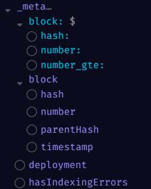
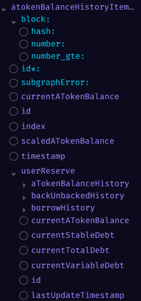
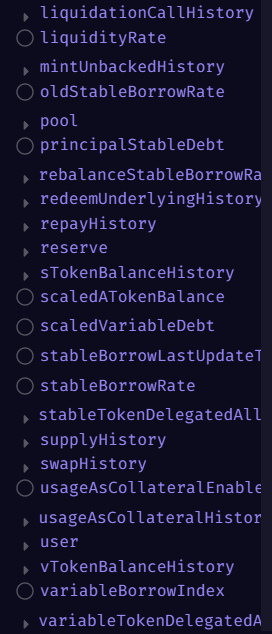
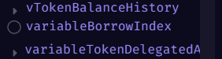
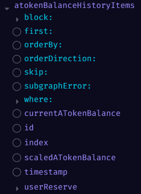
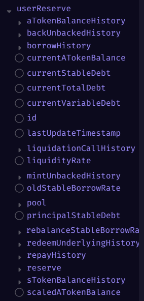
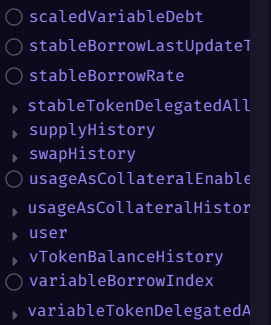
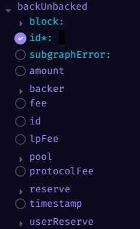

# _meta



好的，我来为你分析截图中的 `_meta` 部分。

这在 The Graph 的 GraphQL API 中是一个非常特殊的、用于获取元数据（Metadata）的字段。它查询的不是 Aave 协议的数据（比如 `pools` 或 `users`），而是**关于这个 subgraph（子图）本身的状态信息**。

从构建 GraphQL 查询的角度，`_meta` 字段及其子字段的含义如下：

### 1\. `_meta` (Top-Level Field)

  * **含义：** 这是你的查询入口，用于请求 subgraph 的元数据。
  * **用途：** 主要用于健康检查、调试和获取 subgraph 的“新鲜度”（即它同步到了哪个区块）。

-----

### 2\. `block: { ... }` (Argument)

截图中的第一个 `block: $`（美元符号代表一个变量）是 `_meta` 字段的一个**参数**。

  * **含义：** 这是一个 "time-travel"（时间旅行）参数。它允许你**查询 subgraph 在过去某个特定区块时的状态**。如果你不提供这个参数，`_meta` 会返回 *最新* 的元数据。
  * **参数详情：**
      * `hash: Bytes`: 你可以提供一个区块哈希，查询“在那个区块被处理后，subgraph 的元数据是什么？”
      * `number: Int`: 你可以提供一个区块号，查询“在那个区块号被处理后，subgraph 的元数据是什么？”
      * `number_gte: Int`:（number greater than or equal）这个参数在这里不太常用，它通常用于实体查询中。

-----

### 3\. `block` (Sub-field)

截图中的第二个 `block` 是你可以在 `_meta` 内部**请求的字段**。

  * **含义：** 这个字段返回一个对象，包含了 **subgraph 当前已经同步到的最新区块的详细信息**。
  * **子字段详情：**
      * `hash: Bytes`: subgraph 同步到的最新区块的哈希。
      * `number: BigInt`: subgraph 同步到的最新区块的编号。
      * `parentHash: Bytes`: 该区块的父区块哈希。
      * `timestamp: BigInt`: 该区块的 Unix 时间戳（以秒为单位）。这是判断数据“新鲜度”的关键字段。

-----

### 4\. `deployment` (Sub-field)

  * **含义：** 这是一个字符串，返回当前查询的 subgraph 部署版本的唯一 ID（一个 IPFS 哈希，通常以 `Qm...` 开头）。
  * **用途：** 这对于版本控制至关重要。当 Aave 的 subgraph 开发者发布一个新版本（比如修复 bug 或添加新功能）时，这个 `deployment` ID 就会改变。你可以查询这个字段来确保你的应用程序正在请求你所期望的 subgraph 版本。

-----

### 5\. `hasIndexingErrors` (Sub-field)

  * **含义：** 这是一个布尔值（`true` 或 `false`）。
  * **用途：** 这是最重要的健康检查字段。
      * 如果为 `false`，说明 subgraph 正在正常运行。
      * 如果为 `true`，说明 subgraph 在处理链上数据时遇到了一个致命错误，它已经停止了索引。此时，你从该 subgraph 获取的数据**可能会不完整或过时**。

-----

# atokenBalanceHistoryItem







好的，根据你提供的截图，我来为你详细地细化 `atokenBalanceHistoryItem` 字段的完整结构。

你截图的这个视图（来自 GraphiQL 资源管理器）展示了两类东西：
1.  **参数 (Arguments)：** 位于顶层的、带有冒号 (`:`) 的字段（如 `block:` 和 `id:`）。这些是你在查询时用来 *过滤* 或 *指定* 你想要的数据的 "输入"。
2.  **子字段 (Sub-fields)：** 不带冒号的字段（如 `currentATokenBalance` 和 `userReserve`）。这些是你可以 *请求返回* 的 "输出" 数据。

### `atokenBalanceHistoryItem`

如前所述，这是用于**查询单个 aToken 余额历史条目**的根字段。

---

### 第 1 部分：参数 (Arguments)

你必须提供 `id` 参数来指定你想要*哪一个*历史条目。

* `block: { ... }`
    * **含义：** 这是一个 "time-travel"（时间旅行）参数。它允许你查询“在*那个*特定区块时，这个 `atokenBalanceHistoryItem` 的数据是什么？”
    * **子参数：**
        * `hash: Bytes`: 按区块哈希查询。
        * `number: Int`: 按区块编号查询。
        * `number_gte: Int`:（*不常用于此*）通常用于查询区块号*大于等于*某个值的实体集合，在这里用于 `block` 参数内部意义不大。

* `id: *` (星号代表 `ID!`)
    * **含义：** 这是**必需的**参数。你必须提供一个 `atokenBalanceHistoryItem` 的唯一 `id`（一个字符串），GraphQL 才能返回该条目。没有它，查询将失败。

    如果想要获取一个任意的id需要进行复数查询。

```
这是一个非常关键且常令人困惑的问题。我来为你详细拆解：

### 1. 这个对应的ID意味着什么？

这个 `id` 是 `atokenBalanceHistoryItem` 这个实体的**唯一标识符**，就像数据库中的**主键 (Primary Key)**。

它**不是**一个随机生成的字符串。相反，它通常是由 subgraph 索引器在处理区块链事件时，根据该事件的**确定性数据**组合而成的。

对于 `atokenBalanceHistoryItem`，这个 `id` 通常是以下几个部分的组合（例如，通过哈希或简单拼接）：
1.  **用户的地址** (`user.id`)
2.  **资产储备的地址** (`reserve.id`)
3.  **导致此次余额变化的交易哈希** (`transaction.hash`)
4.  **该事件在交易中的日志索引** (`logIndex`)

**核心含义：** 这个 `id` 唯一地指向**“某一个用户”**在**“某一个资产”**上于**“某一个特定交易”**中发生的**“那一次余额变动”**。

这就是为什么你不能“猜”到一个 `id`，它与一个真实发生的链上事件是绑定的。

---

### 2. 我如何获取这个ID？

你**永远**不会凭空知道这个 `id`。你获取它的唯一方法是：

**首先查询复数形式的 `atokenBalanceHistoryItems` 字段。**

整个查询流程是颠倒的：

1.  你**先**查询 `atokenBalanceHistoryItems` (复数)，并使用 `where`、`first`、`orderBy` 等参数来*过滤*和*查找*你感兴趣的条目列表。
2.  在你对 `atokenBalanceHistoryItems` (复数) 的查询中，你**必须**请求返回 `id` 字段。
3.  你将收到一个**包含多个历史条目对象的数组（列表）**，每个对象中都包含它自己的 `id`。
4.  你从这个列表中**复制**出你感兴趣的那一个条目的 `id`。
5.  **然后**，你才能使用这个 `id` 去查询 `atokenBalanceHistoryItem` (单数) 字段，以获取该条目的*所有*详细信息（包括我们之前讨论过的 `userReserve` 等所有嵌套数据）。

---

### 3. 我如何随机获取一个任意的ID？

这基于第二个答案。你不能“随机生成”一个ID，但你可以“获取一个任意的”ID。

方法如下：

1.  你构建一个对**复数** `atokenBalanceHistoryItems` 的查询。
2.  为了获取“任意”一个，你可以使用 `first: 1` 参数。这会告诉 GraphQL：“我不需要任何特定的条目，数据库里的第一个就行”。
3.  在你的查询选择集中，你请求返回 `id`。
4.  GraphQL 将返回一个仅包含一个条目的列表，例如：`[ { "id": "0x123...abc" } ]`。
5.  你现在就获得了一个**有效且任意**的ID：`"0x123...abc"`。
6.  你现在可以将这个复制的ID用于你对 `atokenBalanceHistoryItem(id: "0x123...abc")` (单数) 的查询。

**总结：** `atokenBalanceHistoryItem` (单数) 字段就像一个“通过主键查找”的工具，你必须先通过 `atokenBalanceHistoryItems` (复数) 这个“搜索/浏览”工具来找到你想要的主键 (`id`)。
```

* `subgraphError:`
    * **含义：** 这是一个用于调试的参数。你可以用它来查询在索引*这个*特定实体时是否发生了错误（例如 `subgraphError: allow`）。

---

### 第 2 部分：`atokenBalanceHistoryItem` 的直接子字段

当你查询一个 `atokenBalanceHistoryItem` 时，这些是你可以直接请求的、属于该历史条目本身的属性。

* `currentATokenBalance`
    * **含义：** 在这个历史事件（交易）发生时，用户的 `aToken` 余额。这个值是**包含利息**的。它是该用户在该时间点的实际存款凭证余额。

* `id`
    * **含义：** `atokenBalanceHistoryItem` 实体本身的唯一标识符。这与你作为参数传入的 `id` 相同。在查询时包含它是一个好习惯，可以用于在前端进行键(key)管理。

* `index`
    * **含义：** 在这个历史事件发生时，该资产储备（Reserve）的 `liquidityIndex`（流动性指数）。这是一个关键值，用于计算从 `scaledATokenBalance` 到 `currentATokenBalance` 的利息。
    * **公式：** `currentATokenBalance = scaledATokenBalance * index` (在合约层面，`index` 是一个 $10^{27}$ 的 ray 值)。

* `scaledATokenBalance`
    * **含义：** 在这个历史事件发生时，用户的**缩放余额**。这可以被认为是用户的“本金”余额，它**不包括**随时间累积的利息。这个值只在用户存款或取款时才会改变。

* `timestamp`
    * **含义：** 该历史条目被创建时（即相关交易被打包时）的区块时间戳（Unix time，以秒为单位）。

* `userReserve`
    * **含义：** 这是一个**嵌套对象（实体）**。它代表了该用户与该特定资产储备之间的*整体关系*。`atokenBalanceHistoryItem` 只是这个关系下的一条*日志*。通过这个字段，你可以从这条历史日志“跳转”到用户的*当前状态*或*其他所有历史记录*。

---

### 第 3 部分：`userReserve` 的嵌套子字段

当你请求了 `userReserve` 字段，你就可以在它内部请求以下所有字段。这非常强大，因为它提供了该历史事件的**完整上下文**。

#### A. `userReserve` 的直接字段 (用户的当前状态)

* `currentATokenBalance`
    * **含义：** 该用户在该资产储备中的**最新 aToken 余额**（包含利息），*而不是*历史条目时的余额。
* `currentStableDebt`
    * **含义：** 该用户在该资产上的**最新稳定利率债务**（包含利息）。
* `currentTotalDebt`
    * **含义：** 该用户在该资产上的**最新总债务**（`currentStableDebt + currentVariableDebt`）。
* `currentVariableDebt`
    * **含义：** 该用户在该资产上的**最新可变利率债务**（包含利息）。
* `id`
    * **含义：** `UserReserve` 实体本身的唯一 ID（通常由 `user.id + reserve.id` 组合而成）。
* `lastUpdateTimestamp`
    * **含义：** 该用户**最后一次**与该资产储备进行交互（存、取、借、还等）的时间戳。
* `liquidityRate`
    * **含义：** 该资产储备*当前*的存款年利率（APY），通常以 "ray"（$10^{27}$）为单位。
* `oldStableBorrowRate`
    * **含义：** 在利率重置（rebalance）事件中，用户*旧*的稳定借款利率。
* `pool`
    * **含义：** 一个嵌套实体，链接到该资产所属的**池（Pool）**（例如 "Aave V3 Ethereum"）。
* `principalStableDebt`
    * **含义：** 该用户的**最新稳定债务本金**（不含利息）。
* `reserve`
    * **含义：** 一个嵌套实体，链接到该资产的**储备（Reserve）**（例如 "DAI Reserve"），包含该资产的全局信息。
* `scaledATokenBalance`
    * **含义：** 该用户的**最新缩放 aToken 余额**（本金，不含利息）。
* `scaledVariableDebt`
    * **含义：** 该用户的**最新缩放可变债务**（本金，不含利息）。
* `stableBorrowLastUpdateT...` (stableBorrowLastUpdateTimestamp)
    * **含义：** 该用户稳定借款*最后更新*的时间戳。
* `stableBorrowRate`
    * **含义：** 该用户*当前*正在支付的稳定借款利率（以 "ray" 为单位）。
* `usageAsCollateralEnable...` (usageAsCollateralEnabled)
    * **含义：** 一个布尔值 (`true`/`false`)，表示该用户**当前是否**将此资产用作抵押品。
* `user`
    * **含义：** 一个嵌套实体，链接到**用户（User）**本身（包含用户的地址、总健康因子等信息）。
* `variableBorrowIndex`
    * **含义：** 该资产*当前*的可变借款指数，用于计算可变债务的利息。

#### B. `userReserve` 的嵌套历史列表 (用户的完整历史)

这些字段允许你从一个历史条目出发，查询该用户与该资产相关的**所有其他历史记录**。这些字段都会返回一个**数组（列表）**。

* `aTokenBalanceHistory`
    * **含义：** 返回该用户在该资产上的**所有** `aToken` 余额历史条目（包括你当前查询的这一个）。
* `backUnbackedHistory`
    * **含义：** （针对特定资产如 GHO）返回所有 "back/unbacked" 事件的历史记录。
* `borrowHistory`
    * **含义：** 返回该用户在该资产上的**所有**借款（Borrow）事件的历史记录。
* `liquidationCallHistory`
    * **含义：** 返回该用户**所有**被清算的记录（其中该资产被用作抵押品或被清算）。
* `mintUnbackedHistory`
    * **含义：** （针对特定资产如 GHO）返回所有 "mintUnbacked" 事件的历史记录。
* `rebalanceStableBorrowRate`
    * **含义：** 返回该用户**所有**稳定利率重置（Rebalance）事件的历史记录。
* `redeemUnderlyingHistory`
    * **含义：** 返回该用户在该资产上的**所有**取款（Redeem）事件的历史记录。
* `repayHistory`
    * **含义：** 返回该用户在该资产上的**所有**还款（Repay）事件的历史记录。
* `sTokenBalanceHistory`
    * **含义：** 返回该用户稳定债务代币（sToken）的**所有**余额变化历史。
* `stableTokenDelegatedAll...` (stableTokenDelegatedAllowances)
    * **含义：** 返回该用户设置的**所有**稳定债务委托授权。
* `supplyHistory`
    * **含义：** 返回该用户在该资产上的**所有**存款（Supply）事件的历史记录。
* `swapHistory`
    * **含义：** 返回该用户**所有**借款利率交换（Swap，例如从稳定换到可变）事件的历史记录。
* `usageAsCollateralHistor...` (usageAsCollateralHistory)
    * **含义：** 返回该用户**所有**切换（启用/禁用）此资产作为抵押品的操作历史。
* `vTokenBalanceHistory`
    * **含义：** 返回该用户可变债务代币（vToken）的**所有**余额变化历史。
* `variableTokenDelegatedA...` (variableTokenDelegatedAllowances)
    * **含义：** 返回该用户设置的**所有**可变债务委托授权。


# atokenBalanceHistoryItems







好的，我来为你详细分析 `atokenBalanceHistoryItems` (复数形式) 字段。

这与你之前问的 `atokenBalanceHistoryItem` (单数) 完全不同，它是你在 Aave Subgraph 中**最常用到的查询字段之一**。

* `atokenBalanceHistoryItem` (单数)：是“通过唯一ID查找*一个*条目”。
* `atokenBalanceHistoryItems` (复数)：是“搜索、过滤、排序并返回*一批*条目”。

**这就是你用来获取 `id` 的地方。**

---

### `atokenBalanceHistoryItems`

这是用于**查询 aToken 余额历史条目*列表***的根字段。

---

### 第 1 部分：参数 (Arguments) - 你的搜索工具

这些是你在查询时用来过滤、排序和分页的“输入”选项。

* `block: { ... }`
    * **含义：** "Time-travel"（时间旅行）参数。允许你查询“在*那个*特定区块时，符合我搜索条件的条目列表是什么？”

* `first: Int`
    * **含义：** 用于**分页**。它限制查询返回的条目数量。
    * **用途：** 比如 `first: 10` 意味着“只给我列表中的前 10 个条目”。这对于防止返回数百万条数据至关重要。

* `orderBy: String`
    * **含义：** 用于**排序**。你告诉 GraphQL 应该*按照哪个子字段*来对结果列表进行排序。
    * **用途：** 比如 `orderBy: timestamp` 是最常见的用法，它会按时间戳排序。你也可以 `orderBy: scaledATokenBalance` 来按“本金”排序。

* `orderDirection: String`
    * **含义：** 用于**排序**。指定排序的方向。
    * **用途：** 必须与 `orderBy` 配合使用。`orderDirection: asc` (ascending) 是升序（从最早到最新），`orderDirection: desc` (descending) 是降序（从最新到最早）。

* `skip: Int`
    * **含义：** 用于**分页**。它让你“跳过”指定数量的条目。
    * **用途：** 必须与 `first` 配合使用。例如，`first: 10, skip: 20` 意味着“请跳过前 20 个条目，然后给我第 21 到第 30 个条目”。

* `subgraphError:`
    * **含义：** 调试参数，用于查询索引过程中是否存在错误。

* `where: { ... }`
    * **含义：** 这是**最强大、最重要的参数**。它允许你**过滤**出你真正想要的条目。
    * **用途：** `where` 内部可以包含 `atokenBalanceHistoryItems` 的*任何子字段*。
    * **示例：**
        * `where: { userReserve: "0x..." }`：获取某个特定 `UserReserve`（即某个用户和某个资产的组合）的所有历史。
        * `where: { timestamp_gt: 1678886400 }`：获取某个时间点（`_gt` = greater than）*之后*的所有历史条目。
        * `where: { scaledATokenBalance_gt: "1000000000" }`：获取所有本金余额*大于*某个值的历史条目。

---

### 第 2 部分：直接子字段 (Outputs)

这些是 `ATokenBalanceHistoryItem` 对象本身包含的数据。当你请求一个列表时，列表中的*每一个*条目都会包含你所请求的这些字段。

* `currentATokenBalance`
    * **含义：** 在**这个历史事件发生时**，用户的 `aToken` 余额（包含利息）。

* `id`
    * **含义：** **这就是你之前问的 `id`！** 它是这个历史条目本身的唯一标识符。你在查询 `atokenBalanceHistoryItems` 列表时**必须**请求这个字段，以便在你的应用中唯一地标识每一个条目。

* `index`
    * **含义：** 在这个历史事件发生时，该资产储备的 `liquidityIndex`（流动性指数），用于计算利息。

* `scaledATokenBalance`
    * **含义：** 在**这个历史事件发生时**，用户的**缩放余额**（不含利息的“本金”）。

* `timestamp`
    * **含义：** 该历史事件发生时的区块时间戳（Unix time）。这是 `orderBy` 最常用的字段。

* `userReserve`
    * **含义：** 这是一个**嵌套对象（实体）**。它代表了该用户与该特定资产储备之间的*整体关系*。这是非常有用的，因为它允许你从*一个*历史条目出发，获取到关于这个用户的*所有其他信息*。

---

### 第 3 部分：`userReserve` 的嵌套子字段

当你请求了 `userReserve` 字段，你就可以在它内部请求以下所有字段。

**关键区别：** `atokenBalanceHistoryItems` 顶层的字段（如 `scaledATokenBalance`）是**历史快照**。而 `userReserve` 内部的字段（如 `userReserve.scaledATokenBalance`）是该用户/资产的**最新状态**。

这允许你进行这样的查询：“获取一个用户*所有*的存款历史，并且对于*每一次*存款，都告诉我他*现在*的余额是多少。”

#### A. `userReserve` 的直接字段 (用户的最新状态)

* `currentATokenBalance`: 用户的**最新** aToken 余额（含利息）。
* `currentStableDebt`: 用户的**最新**稳定债务（含利息）。
* `currentTotalDebt`: 用户的**最新**总债务（含利息）。
* `currentVariableDebt`: 用户的**最新**可变债务（含利息）。
* `id`: `UserReserve` 实体本身的唯一 ID（通常是 `user.id + reserve.id`）。
* `lastUpdateTimestamp`: 该用户与此资产**最后一次**交互的时间戳。
* `liquidityRate`: 此资产**当前**的存款 APY。
* `oldStableBorrowRate`:（用于利率重置）用户旧的稳定借款利率。
* `principalStableDebt`: 用户的**最新**稳定债务本金（不含利息）。
* `scaledATokenBalance`: 用户的**最新**缩放 aToken 余额（本金）。
* `scaledVariableDebt`: 用户的**最新**缩放可变债务（本金）。
* `stableBorrowLastUpdateT...`: **最新**稳定借款更新时间戳。
* `stableBorrowRate`: 用户**当前**的稳定借款利率。
* `usageAsCollateralEnable...`:（`usageAsCollateralEnabled`）布尔值，表示用户**当前**是否将此资产用作抵押品。
* `variableBorrowIndex`: 此资产**当前**的可变借款指数。

#### B. `userReserve` 的嵌套实体 (链接)

* `pool`: 链接到该资产所属的池（Pool）对象。
* `reserve`: 链接到该资产的储备（Reserve）对象。
* `user`: 链接到该用户（User）对象。

#### C. `userReserve` 的嵌套历史列表 (该用户/资产的完整历史)

这些字段返回一个**数组（列表）**。

* `aTokenBalanceHistory`: 该用户在此资产上的**所有** aToken 余额历史。
* `backUnbackedHistory`: **所有** back/unbacked 事件历史。
* `borrowHistory`: **所有**借款事件历史。
* `liquidationCallHistory`: **所有**被清算事件历史。
* `mintUnbackedHistory`: **所有** mintUnbacked 事件历史。
* `rebalanceStableBorrowRa...`: **所有**利率重置事件历史。
* `redeemUnderlyingHistory`: **所有**取款事件历史。
* `repayHistory`: **所有**还款事件历史。
* `sTokenBalanceHistory`: **所有** sToken 余额历史。
* `stableTokenDelegatedAll...`: **所有**稳定债务委托授权。
* `supplyHistory`: **所有**存款事件历史。
* `swapHistory`: **所有**利率交换事件历史。
* `usageAsCollateralHistor...`: **所有**“用作抵押品”切换事件历史。
* `vTokenBalanceHistory`: **所有** vToken 余额历史。
* `variableTokenDelegatedA...`: **所有**可变债务委托授权。

# backUnbacked



好的，我来为你详细介绍 `backUnbacked` 这个字段。

这是一个与 Aave GHO 稳定币相关的特定事件。GHO 允许 "Facilitators"（促进者）铸造无抵押（unbacked）的 GHO。`backUnbacked` 事件就是指**一个用户（"backer"）为之前无抵押的 GHO 提供了抵押品，从而“支持”了它**。

`backUnbacked`（单数形式）这个字段是你用来查询**一个特定 `backUnbacked` 事件**的入口。

---

### 第 1 部分：参数 (Arguments) - 如何查找

这些是你在查询时用来指定你想要*哪一个*事件的“输入”选项。

* `block: { ... }`
    * **含义：** “Time-travel”（时间旅行）参数。它允许你查询“在*那个*特定区块时，这个 `backUnbacked` 事件的数据是什么？”

* `id: *` (星号代表 `ID!`)
    * **含义：** 这是**必需的**参数。你必须提供一个 `backUnbacked` 事件的唯一 `id`（一个字符串），GraphQL 才能返回该条目。
    * **如何获取：** 正如我们之前讨论的，你不能“猜”到这个 `id`。你必须先查询 `backUnbackeds`（复数形式）列表，从列表中获取你感兴趣的那个事件的 `id`，然后才能使用这个 `backUnbacked`（单数）字段来查询它的详细信息。

* `subgraphError:`
    * **含义：** 调试参数，用于查询在索引此实体时是否发生了错误。

---

### 第 2 部分：子字段 (Sub-fields) - 你能获取什么数据

当你通过 `id` 指定了一个 `backUnbacked` 事件后，这些是你可以请求返回的详细数据。

* `amount`
    * **含义：** 在这个事件中被“支持”（backed）的 GHO 数量，或者提供的抵押品数量。这通常是一个 `BigDecimal` 或 `BigInt` 类型。

* `backer`
    * **含义：** 这是一个**嵌套对象（实体）**。它链接到执行此“支持”操作的**用户（User）**。通过这个字段，你可以进一步查询该用户的地址、总健康因子等信息。

* `fee`
    * **含义：** 该用户在此次操作中支付的**总费用**。

* `id`
    * **含义：** `backUnbacked` 事件实体本身的唯一标识符。

* `lpFee`
    * **含义：** `fee` 的一部分，这部分费用流向了流动性提供者（LP）。

* `pool`
    * **含义：** 这是一个**嵌套对象（实体）**。它链接到该事件发生的**池（Pool）**（例如 "Aave V3 Ethereum Pool"）。

* `protocolFee`
    * **含义：** `fee` 的一部分，这部分费用流向了 Aave 协议金库。

* `reserve`
    * **含义：** 这是一个**嵌套对象（实体）**。它链接到此次操作中涉及的**资产储备（Reserve）**。这很可能是指 GHO 资产的储备。

* `timestamp`
    * **含义：** 该事件（交易）被打包时的区块时间戳（Unix time，以秒为单位）。

* `userReserve`
    * **含义：** 这是一个**嵌套对象（实体）**，非常关键。它链接到 `UserReserve` 实体，即执行此操作的 `backer`（用户）与所涉及的 `reserve`（资产）之间的*关系*。
    * **用途：** 这允许你从这个*历史事件*出发，去查询该用户在该资产上的*当前状态*（例如，他们现在持有的 GHO 债务，或他们提供的抵押品总额）以及他们的所有其他交易历史。

# backUnbackeds

好的，我来为你详细介绍 `backUnbackeds` (复数形式) 字段。

这个字段与你刚才问的 `backUnbacked` (单数) 对应，但用途完全不同。

* `backUnbacked` (单数)：是“通过唯一ID查找*一个*特定事件”。
* `backUnbackeds` (复数)：是“搜索、过滤、排序并返回*一批*事件”。

**这是你用来查找 `id` 的主要工具。** 你通过这个字段来*发现*事件，然后才可能使用单数形式的 `backUnbacked` 字段来深入研究某一个事件。

---

### `backUnbackeds`

这是用于**查询 `BackUnbacked` 事件*列表***的根字段。

---

### 第 1 部分：参数 (Arguments) - 你的搜索工具

这些是你在查询时用来过滤、排序和分页的“输入”选项。

* `block: { ... }`
    * **含义：** “Time-travel”（时间旅行）参数。允许你查询“在*那个*特定区块时，符合我搜索条件的事件列表是什么？”

* `first: Int`
    * **含义：** 用于**分页**。它限制查询返回的事件数量。
    * **用途：** 比如 `first: 10` 意味着“只给我列表中的前 10 个事件”。

* `orderBy: String`
    * **含义：** 用于**排序**。你告诉 GraphQL 应该*按照哪个子字段*来对结果列表进行排序。
    * **用途：** 比如 `orderBy: timestamp` (按时间排序) 或 `orderBy: amount` (按金额排序)。

* `orderDirection: String`
    * **含义：** 用于**排序**。指定排序的方向。
    * **用途：** 必须与 `orderBy` 配合使用。`orderDirection: asc` (升序) 或 `orderDirection: desc` (降序)。

* `skip: Int`
    * **含义：** 用于**分页**。它让你“跳过”指定数量的条目。
    * **用途：** 必须与 `first` 配合使用。例如，`first: 10, skip: 20` 意味着“请跳过前 20 个事件，然后给我第 21 到第 30 个事件”。

* `subgraphError:`
    * **含义：** 调试参数，用于查询索引过程中是否存在错误。

* `where: { ... }`
    * **含义：** 这是**最强大、最重要的参数**。它允许你**过滤**出你真正想要的事件列表。
    * **用途：** `where` 内部可以包含 `backUnbackeds` 的*任何子字段*。
    * **示例：**
        * 你可以设置 `where: { backer: "0x..." }` 来获取某个特定用户（backer）执行的*所有* `backUnbacked` 事件。
        * 你可以设置 `where: { reserve: "0x..." }` 来获取某个特定资产储备（例如 GHO）的*所有* `backUnbacked` 事件。
        * 你可以设置 `where: { timestamp_gt: 1678886400 }` 来获取某个时间点（`_gt` = greater than）*之后*的所有事件。

---

### 第 2 部分：子字段 (Sub-fields) - 你能获取什么数据

这些是 `BackUnbacked` 对象本身包含的数据。当你请求一个列表时，列表中的*每一个*事件条目都会包含你所请求的这些字段。

* `amount`
    * **含义：** 在**这个**事件中被“支持”（backed）的数量。

* `backer`
    * **含义：** 这是一个**嵌套对象（实体）**。它链接到执行**这个**“支持”操作的用户。你可以进一步查询 `backer { id }` 来获取其地址。

* `fee`
    * **含义：** 用户在**这个**事件中支付的总费用。

* `id`
    * **含义：** **这就是你需要的 `id`**。它是**这个** `backUnbacked` 事件实体本身的唯一标识符。你在查询列表时必须请求它。

* `lpFee`
    * **含义：** **这个**事件中，流向流动性提供者（LP）的费用。

* `pool`
    * **含义：** 这是一个**嵌套对象（实体）**。它链接到**这个**事件发生的池（Pool）。

* `protocolFee`
    * **含义：** **这个**事件中，流向 Aave 协议金库的费用。

* `reserve`
    * **含义：** 这是一个**嵌套对象（实体）**。它链接到**这个**事件中涉及的资产储备（例如 GHO 储备）。

* `timestamp`
    * **含义：** **这个**事件被打包时的区块时间戳（Unix time）。这是 `orderBy` 最常用的字段。

* `userReserve`
    * **含义：** 这是一个**嵌套对象（实体）**。它链接到 `backer`（用户）与 `reserve`（资产）之间的*关系*。
    * **用途：** 这非常有用，因为它允许你在查询*历史事件*（`backUnbacked` 事件）的同时，获取到该用户在该资产上的*当前状态*（例如 `userReserve { currentATokenBalance }`）。

# borrow

好的，我来为你详细介绍 `borrow` 这个字段。

`borrow`（单数形式）是 Aave subgraph 中一个非常核心的字段。它**不是**用来搜索借款的，而是用来**通过唯一 ID 来精确查找某一个特定的借款事件（Borrow Event）**。

当你想要获取“ID 为 0xyz... 的那笔借款的所有详细信息”时，你就会使用这个字段。

---

### 第 1 部分：参数 (Arguments) - 如何查找

这些是你在查询时用来指定你想要*哪一笔*借款事件的“输入”选项。

* `block: { ... }`
    * **含义：** “Time-travel”（时间旅行）参数。它允许你查询“在*那个*特定区块时，这笔 `borrow` 事件的数据是什么？”

* `id: *` (星号代表 `ID!`)
    * **含义：** 这是**必需的**参数。你必须提供一个 `borrow` 事件的唯一 `id`（一个字符串），GraphQL 才能返回该条目。
    * **如何获取：** 你不能“猜”到这个 `id`。你必须先查询 `borrows`（复数形式）列表，并从该列表中获取你感兴趣的那个借款事件的 `id`，然后才能使用这个 `borrow`（单数）字段来查询它的详细信息。

* `subgraphError:`
    * **含义：** 调试参数，用于查询在索引此实体时是否发生了错误。

---

### 第 2 部分：子字段 (Sub-fields) - 你能获取什么数据

当你通过 `id` 指定了一个 `borrow` 事件后，这些是你可以请求返回的关于**这笔借款**的详细数据。

#### 借款事件本身的信息

* `id`
    * **含义：** `borrow` 事件实体本身的唯一标识符（与你作为参数传入的 `id` 相同）。
* `txHash`
    * **含义：** 发生这笔借款的链上**交易哈希**（Transaction Hash）。
* `timestamp`
    * **含义：** 该借款事件（交易）被打包时的区块时间戳（Unix time，以秒为单位）。
* `action`
    * **含义：** 指示此事件的类型。对于 `borrow` 实体，这个值通常就是 "borrow"。

#### 借款的金融详情

* `amount`
    * **含义：** 用户在**这笔交易中**借入的资产数量（以该资产的最小单位，如 wei，表示）。
* `assetPriceUSD`
    * **含义：** 在**借款发生时**，被借资产的美元价格。
* `borrowRateMode`
    * **含义：** 借款的利率模式。这会是一个枚举值（Enum），例如 `Stable`（稳定利率）或 `Variable`（可变利率）。
* `borrowRate`
    * **含义：** 用户在**这笔交易中**获得的借款利率（年利率，APY），通常以 "ray" ($10^{27}$) 为单位。

#### 借款后的状态快照

* `stableTokenDebt`
    * **含义：** 在**这笔借款发生后**，该用户在该资产上的**稳定利率总债务**。
* `variableTokenDebt`
    * **含义：** 在**这笔借款发生后**，该用户在该资产上的**可变利率总债务**。

#### 关联的实体（“谁”与“什么”）

* `caller`
    * **含义：** 这是一个**嵌套对象（实体）**。它链接到**调用**（call）Aave 协议 `borrow` 函数的地址。
    * **重要区别：** `caller` 可能是用户自己，也可能是一个代表用户操作的智能合约（例如 DeFi 聚合器）。

* `user`
    * **含义：** 这是一个**嵌套对象（实体）**。它链接到**代表其**借款的最终用户地址。这才是**承担这笔债务**的账户。

* `pool`
    * **含义：** 这是一个**嵌套对象（实体）**。它链接到该借款事件发生的**池（Pool）**（例如 "Aave V3 Ethereum Pool"）。

* `referrer`
    * **含义：** 这是一个**嵌套对象（实体）**。如果这笔借款是通过推荐人（Referrer）促成的，这里会链接到该推荐人的信息。

* `reserve`
    * **含义：** 这是一个**嵌套对象（实体）**。它链接到被借资产的**储备（Reserve）**（例如 "USDC Reserve" 或 "DAI Reserve"）。通过这个字段，你可以进一步查询该资产在*那个时间点*的全局信息，比如总借款额、存款利率等。

* `userReserve`
    * **含义：** 这是一个**非常关键的嵌套对象（实体）**。它链接到 `UserReserve` 实体，即执行此操作的 `user`（用户）与所涉及的 `reserve`（资产）之间的*关系*。
    * **用途：** 这允许你从这个*历史事件*（`borrow`）出发，去查询该用户在该资产上的*当前状态*（例如 `userReserve { currentTotalDebt }`）以及他们的所有其他交易历史（例如 `userReserve { repayHistory }` 或 `userReserve { liquidationCallHistory }`）。

# borrows

好的，我来为你详细介绍 `borrows` (复数形式) 字段。

这是 Aave subgraph 中用于查询**借款（Borrow）事件**的*主要*字段，与你之前问的 `borrow` (单数) 字段相辅相成。

* `borrow` (单数)：是“通过唯一ID查找*一个*特定事件”。
* `borrows` (复数)：是“搜索、过滤、排序并返回*一批*事件”。

**这是你用来查找 `id` 的主要工具。** 你通过这个字段来*发现*事件，然后才可能使用单数形式的 `borrow` 字段来深入研究某一个事件。

---

### `borrows`

这是用于**查询 `Borrow` 事件*列表***的根字段。

---

### 第 1 部分：参数 (Arguments) - 你的搜索工具

这些是你在查询时用来过滤、排序和分页的“输入”选项。

* `block: { ... }`
    * **含义：** “Time-travel”（时间旅行）参数。允许你查询“在*那个*特定区块时，符合我搜索条件的事件列表是什么？”

* `first: Int`
    * **含义：** 用于**分页**。它限制查询返回的事件数量。
    * **用途：** 你的截图中显示 `first: 10`，这意味着“只给我列表中的前 10 个事件”。

* `orderBy: String`
    * **含义：** 用于**排序**。你告诉 GraphQL 应该*按照哪个子字段*来对结果列表进行排序。
    * **用途：** 比如 `orderBy: timestamp` (按时间排序) 或 `orderBy: amount` (按借款金额排序)。

* `orderDirection: String`
    * **含义：** 用于**排序**。指定排序的方向。
    * **用途：** 必须与 `orderBy` 配合使用。`orderDirection: asc` (升序，从旧到新) 或 `orderDirection: desc` (降序，从新到旧)。

* `skip: Int`
    * **含义：** 用于**分页**。它让你“跳过”指定数量的条目。
    * **用途：** 必须与 `first` 配合使用。例如，`first: 10, skip: 20` 意味着“请跳过前 20 个事件，然后给我第 21 到第 30 个事件”。

* `subgraphError:`
    * **含义：** 调试参数，用于查询索引过程中是否存在错误。

* `where: { ... }`
    * **含义：** 这是**最强大、最重要的参数**。它允许你**过滤**出你真正想要的事件列表。
    * **用途：** `where` 内部可以包含 `borrows` 的*任何子字段*。
    * **示例：**
        * 你可以设置 `where: { user: "0x..." }` 来获取某个特定用户执行的*所有* `borrow` 事件。
        * 你可以设置 `where: { reserve: "0x..." }` 来获取某个特定资产（例如 "USDC"）的*所有* `borrow` 事件。
        * 你可以设置 `where: { timestamp_gt: 1678886400 }` 来获取某个时间点（`_gt` = greater than）*之后*的所有事件。

---

### 第 2 部分：子字段 (Sub-fields) - 你能获取什么数据

这些是 `Borrow` 对象本身包含的数据。当你请求一个列表时，列表中的*每一个*事件条目都会包含你所请求的这些字段。

#### 借款事件本身的信息

* `id`
    * **含义：** **这就是你需要的 `id`**。它是**这个** `borrow` 事件实体本身的唯一标识符。你在查询列表时必须请求它。
* `txHash`
    * **含义：** 发生**这个**借款的链上**交易哈希**。
* `timestamp`
    * **含义：** **这个**借款事件（交易）被打包时的区块时间戳。这是 `orderBy` 最常用的字段。
* `action`
    * **含义：** 指示此事件的类型，通常就是 "borrow"。

#### 借款的金融详情

* `amount`
    * **含义：** 用户在**这笔交易中**借入的资产数量。
* `assetPriceUSD`
    * **含义：** 在**这笔借款发生时**，被借资产的美元价格。
* `borrowRateMode`
    * **含义：** **这笔**借款的利率模式（`Stable` 或 `Variable`）。
* `borrowRate`
    * **含义：** 用户为**这笔**借款支付的利率（APY）。

#### 借款后的状态快照

* `stableTokenDebt`
    * **含义：** 在**这笔借款发生后**，该用户在该资产上的**稳定利率总债务**的快照。
* `variableTokenDebt`
    * **含义：** 在**这笔借款发生后**，该用户在该资产上的**可变利率总债务**的快照。

#### 关联的实体（“谁”与“什么”）

* `caller`
    * **含义：** 这是一个**嵌套对象（实体）**。它链接到**调用**（call） `borrow` 函数的地址（可能是用户自己，也可能是智能合约）。
* `user`
    * **含义：** 这是一个**嵌套对象（实体）**。它链接到**承担这笔债务**的最终用户账户。
* `pool`
    * **含义：** 这是一个**嵌套对象（实体）**。它链接到**这个**事件发生的池（Pool）。
* `referrer`
    * **含义：** 这是一个**嵌套对象（实体）**。如果这笔借款有推荐人，这里会链接到该推荐人的信息。
* `reserve`
    * **含义：** 这是一个**嵌套对象（实体）**。它链接到被借资产的**储备（Reserve）**（例如 "USDC Reserve"）。
* `userReserve`
    * **含义：** 这是一个**非常关键的嵌套对象（实体）**。它链接到 `user`（用户）与 `reserve`（资产）之间的*关系*。
    * **用途：** 这非常有用，因为它允许你在查询*历史事件*（`borrow` 事件）的同时，获取到该用户在该资产上的*当前状态*（例如 `userReserve { currentTotalDebt }`）以及该用户的*所有*其他历史记录（例如 `userReserve { repayHistory }`）。

# chainlinkAggregator

好的，我来为你详细介绍 `chainlinkAggregator` 这个字段。

这个字段代表 Aave 协议所依赖的**单个 Chainlink 价格聚合器（Aggregator）**。Aave 使用 Chainlink 作为其主要的价格预言机（Price Oracle）来获取所有资产的实时价格。每个资产（如 `DAI/USD` 或 `ETH/USD`）都有一个专属的 Chainlink 聚合器智能合约。

`chainlinkAggregator`（单数形式）这个字段是你用来查询**一个特定 Chainlink 聚合器实体**的入口。

---

### 第 1 部分：参数 (Arguments) - 如何查找

这些是你在查询时用来指定你想要*哪一个*聚合器的“输入”选项。

* `block: { ... }`
    * **含义：** “Time-travel”（时间旅行）参数。它允许你查询“在*那个*特定区块时，这个 `chainlinkAggregator` 实体的数据是什么？”

* `id: *` (星号代表 `ID!`)
    * **含义：** 这是**必需的**参数。你必须提供一个 `chainlinkAggregator` 的唯一 `id`。
    * **这个ID是什么？** 这个 `id` **就是 Chainlink 聚合器智能合约的以太坊地址**（例如，`0x...`）。
    * **如何获取：** 你不能“猜”到这个地址。你必须先通过 `chainlinkAggregators`（复数形式）查询列表，或者通过查询一个 `Reserve`（资产储备），然后深入到它的 `oracleAsset` 链接，来找到这个聚合器的 `id`（地址）。

* `subgraphError:`
    * **含义：** 调试参数，用于查询在索引此实体时是否发生了错误。

---

### 第 2 部分：直接子字段 (Sub-fields)

当你通过 `id`（地址）指定了一个聚合器后，这些是你可以请求返回的直接数据。

* `id`
    * **含义：** `chainlinkAggregator` 实体本身的唯一标识符（即你作为参数传入的合约地址）。

* `oracleAsset`
    * **含义：** 这是一个**嵌套对象（实体）**，也是这个查询**最核心**的部分。`chainlinkAggregator` 只是一个“地址”，而 `oracleAsset` 实体代表了**这个地址所对应的“资产”**在 Aave 预言机系统中的*所有*配置和状态信息。

---

### 第 3 部分：`oracleAsset` 的嵌套子字段

当你请求了 `oracleAsset` 字段，你就可以在它内部请求以下所有关于这个资产价格的详细信息。

* `dependentAssets`
    * **含义：** 这是一个**嵌套列表（数组）**。它列出了所有*依赖*于这个资产价格的其他 `oracleAsset`。例如，`AAVE/ETH` 的价格可能依赖于 `AAVE/USD` 和 `ETH/USD` 的价格。

* `fromChainlinkSourcesReg...` (fromChainlinkSourcesRegistry)
    * **含义：** 一个布尔值 (`true`/`false`)。它表明这个聚合器的地址是否是从 Chainlink 的官方链上注册表（Registry）中获取的。

* `id`
    * **含义：** `oracleAsset` 实体本身的唯一 ID（这通常是被定价资产的*代币地址*，例如 USDC 的合约地址）。

* `isFallbackRequired`
    * **含义：** 一个布尔值 (`true`/`false`)。这是一个健康状态检查。如果为 `true`，意味着这个 Chainlink 聚合器当前可能已失效或出现问题，Aave 协议正在使用一个备用（Fallback）预言机来获取此资产的价格。

* `lastUpdateTimestamp`
    * **含义：** 该资产的 Chainlink 价格**最后一次在链上更新**的区块时间戳（Unix time，以秒为单位）。

* `oracle`
    * **含义：** 这是一个**嵌套对象（实体）**。它链接回 Aave 协议的**主 `PriceOracle` 合约**实体，即*使用*这个 `oracleAsset` 配置的合约。

* `platform`
    * **含义：** 指示价格源的平台。对于这个实体，这个值几乎总是 "Chainlink"。

* `priceHistory`
    * **含义：** 这是一个**嵌套列表（数组）**。它链接到该资产的**所有历史价格点**（`PriceHistoryItem` 实体），允许你构建价格图表。

* `priceInEth`
    * **含义：** **关键数据**。这是该资产**最新**的、以 **ETH** 计价的价格。Aave 内部的大多数计算都使用 ETH 作为基准（numeraire）。

* `priceSource`
    * **含义：** 价格来源的智能合约地址。这*通常*与 `chainlinkAggregator` 的 `id`（地址）相同。

* `type`
    * **含义：** 该资产的类型，例如 "crypto"（加密资产）或 "fiat"（法币，用于稳定币）。

# chainlinkAggregators

好的，我来为你详细介绍 `chainlinkAggregators` (复数形式) 字段。

这个字段与你刚才问的 `chainlinkAggregator` (单数) 对应，但用途完全不同。

* `chainlinkAggregator` (单数)：是“通过唯一ID（合约地址）查找*一个*特定聚合器”。
* `chainlinkAggregators` (复数)：是“搜索、过滤、排序并返回*一批*聚合器”。

**这是你用来发现和获取 `id`（地址）的主要工具。** 你通过这个字段来*发现* Aave 协议正在使用哪些 Chainlink 聚合器，然后才可能使用单数形式的 `chainlinkAggregator` 字段来深入研究某一个。

---

### `chainlinkAggregators`

这是用于**查询 `ChainlinkAggregator` 实体*列表***的根字段。

---

### 第 1 部分：参数 (Arguments) - 你的搜索工具

这些是你在查询时用来过滤、排序和分页的“输入”选项。

* `block: { ... }`
    * **含义：** “Time-travel”（时间旅行）参数。允许你查询“在*那个*特定区块时，符合我搜索条件的聚合器列表是什么？”

* `first: Int`
    * **含义：** 用于**分页**。它限制查询返回的聚合器数量。
    * **用途：** 比如 `first: 10` 意味着“只给我列表中的前 10 个条目”。

* `orderBy: String`
    * **含义：** 用于**排序**。你告诉 GraphQL 应该*按照哪个子字段*来对结果列表进行排序。
    * **用途：** 比如 `orderBy: id` (按合约地址排序)。

* `orderDirection: String`
    * **含义：** 用于**排序**。指定排序的方向。
    * **用途：** 必须与 `orderBy` 配合使用。`orderDirection: asc` (升序) 或 `orderDirection: desc` (降序)。

* `skip: Int`
    * **含义：** 用于**分页**。它让你“跳过”指定数量的条目。
    * **用途：** 必须与 `first` 配合使用。例如，`first: 10, skip: 20` 意味着“请跳过前 20 个条目，然后给我第 21 到第 30 个条目”。

* `subgraphError:`
    * **含义：** 调试参数，用于查询索引过程中是否存在错误。

* `where: { ... }`
    * **含义：** 这是**最强大、最重要的参数**。它允许你**过滤**出你真正想要的聚合器列表。
    * **用途：** `where` 内部可以包含 `chainlinkAggregators` 的*任何子字段*。
    * **示例：**
        * 你可以设置 `where: { oracleAsset: "0x..." }` 来查找“哪个 Chainlink 聚合器正在为*这个*资产（`oracleAsset` 的 ID，即代币地址）提供价格？”
        * 你可以设置 `where: { id_in: ["0x...", "0x..."] }` 来一次性获取多个特定地址的聚合器信息。

---

### 第 2 部分：子字段 (Sub-fields) - 你能获取什么数据

这些是 `ChainlinkAggregator` 对象本身包含的数据。当你请求一个列表时，列表中的*每一个*条目都会包含你所请求的这些字段。

* `id`
    * **含义：** **这就是你需要的 `id`**。它是**这个** `chainlinkAggregator` 实体本身的唯一标识符，即**聚合器智能合约的地址**。

* `oracleAsset`
    * **含义：** 这是一个**嵌套对象（实体）**。它代表了**这个聚合器所对应的“资产”**在 Aave 预言机系统中的所有配置和状态信息。这是你获取实际价格数据的地方。

---

### 第 3 部分：`oracleAsset` 的嵌套子字段

当你请求了 `oracleAsset` 字段，你就可以在它内部请求以下所有关于这个资产价格的详细信息。

* `dependentAssets`
    * **含义：** 这是一个**嵌套列表（数组）**。它列出了所有*依赖*于这个资产价格的其他 `oracleAsset`。
* `fromChainlinkSourcesReg...` (fromChainlinkSourcesRegistry)
    * **含义：** 一个布尔值 (`true`/`false`)，表明这个聚合器的地址是否是从 Chainlink 的官方链上注册表中获取的。
* `id`
    * **含义：** `oracleAsset` 实体本身的唯一 ID（这通常是被定价资产的*代币地址*）。
* `isFallbackRequired`
    * **含义：** 一个布尔值 (`true`/`false`)。一个健康状态检查，表明是否需要备用预言机。
* `lastUpdateTimestamp`
    * **含义：** 该资产的 Chainlink 价格**最后一次在链上更新**的区块时间戳。
* `oracle`
    * **含义：** 这是一个**嵌套对象（实体）**。它链接回 Aave 协议的**主 `PriceOracle` 合约**实体。
* `platform`
    * **含义：** 价格源的平台（例如 "Chainlink"）。
* `priceHistory`
    * **含义：** 这是一个**嵌套列表（数组）**。它链接到该资产的**所有历史价格点**（`PriceHistoryItem` 实体），允许你构建价格图表。
* `priceInEth`
    * **含义：** **关键数据**。这是该资产**最新**的、以 **ETH** 计价的价格。
* `priceSource`
    * **含义：** 价格来源的智能合约地址（通常与 `chainlinkAggregator` 的 `id` 相同）。
* `type`
    * **含义：** 该资产的类型（例如 "crypto"）。

# claimRewardCall

好的，我来为你详细介绍 `claimRewardsCall` 这个字段。

`claimRewardsCall`（单数形式）是 Aave subgraph 中用于**通过唯一 ID 来精确查找某一个特定的“领取奖励”调用**的字段。

在 Aave 中，用户（或代表用户的机器人/合约）会定期调用一个函数来领取他们因存款或借款而累积的激励（Incentives，即 rewards）。这个字段就是用来查询*单次*此类调用事件的。

---

### 第 1 部分：参数 (Arguments) - 如何查找

这些是你在查询时用来指定你想要*哪一个*领取奖励调用的“输入”选项。

* `block: { ... }`
    * **含义：** “Time-travel”（时间旅行）参数。它允许你查询“在*那个*特定区块时，这个 `claimRewardsCall` 事件的数据是什么？”

* `id: *` (星号代表 `ID!`)
    * **含义：** 这是**必需的**参数。你必须提供一个 `claimRewardsCall` 事件的唯一 `id`（一个字符串），GraphQL 才能返回该条目。
    * **如何获取：** 你不能“猜”到这个 `id`。你必须先查询 `claimRewardsCalls`（复数形式）列表，并从该列表中获取你感兴趣的那个领取奖励事件的 `id`，然后才能使用这个 `claimRewardsCall`（单数）字段来查询它的详细信息。

* `subgraphError:`
    * **含义：** 调试参数，用于查询在索引此实体时是否发生了错误。

---

### 第 2 部分：子字段 (Sub-fields) - 你能获取什么数据

当你通过 `id` 指定了一个 `claimRewardsCall` 事件后，这些是你可以请求返回的关于**这次领取奖励**的详细数据。

#### 领取事件本身的信息

* `id`
    * **含义：** `claimRewardsCall` 事件实体本身的唯一标识符（与你作为参数传入的 `id` 相同）。
* `action`
    * **含义：** 指示此事件的类型。对于 `claimRewardsCall` 实体，这个值通常就是 "claimRewards"。
* `amount`
    * **含义：** 在**这笔交易中**被领取的奖励代币的总数量。
* `timestamp`
    * **含义：** 该领取奖励事件（交易）被打包时的区块时间戳（Unix time，以秒为单位）。
* `txHash`
    * **含义：** 发生这笔领取奖励的链上**交易哈希**（Transaction Hash）。

#### 关联的实体（“谁”、“什么”与“为何”）

* `caller`
    * **含义：** 这是一个**嵌套对象（实体）**。它链接到**调用**（call） `claimRewards` 函数的地址。这*可能*是一个代表用户操作的智能合约或机器人。

* `to`
    * **含义：** 这是一个**嵌套对象（实体）**。它链接到**接收**这笔奖励的地址。

* `user`
    * **含义：** 这是一个**嵌套对象（实体）**。它链接到**代表其**领取奖励的最终用户地址。这才是**赚取**这些奖励的账户（通常与 `to` 相同）。

* `rewardsController`
    * **含义：** 这是一个**非常关键的嵌套对象（实体）**。它链接到 `RewardsController` 实体，即**负责管理和分发这些奖励的 Aave 智能合约**。
    * **用途：** 通过这个字段，你可以进一步查询这个奖励计划的详细信息。

---

### 第 3 部分：`rewardsController` 的嵌套子字段

当你请求了 `rewardsController` 字段，你就可以在它内部请求以下关于这个奖励计划的信息：

* `claimIncentives`
    * **含义：** 可能是一个布尔值或配置项，指示该控制器当前是否处于活跃的激励领取期。
* `id`
    * **含义：** `RewardsController` 实体本身的唯一 ID（即该控制器的**合约地址**）。
* `rewardedActions`
    * **含义：** 这是一个**嵌套列表（数组）**。它链接到所有*符合奖励条件的操作*（`RewardedAction` 实体）。例如，这可能会告诉你 "在 WETH 储备上存款" 或 "在 GHO 储备上借款" 是会产生奖励的。
* `rewards`
    * **含义：** 这是一个**嵌套列表（数组）**。它链接到所有由该控制器分发的**奖励代币**（`Reward` 实体）。例如，这会告诉你该控制器分发的是 `stkAAVE`、`MATIC` 还是其他代币。

# claimRewardCalls

好的，我来为你详细介绍 `claimRewardsCalls` (复数形式) 字段。

这个字段与你刚才问的 `claimRewardsCall` (单数) 对应，但用途完全不同。

* `claimRewardsCall` (单数)：是“通过唯一ID查找*一个*特定事件”。
* `claimRewardsCalls` (复数)：是“搜索、过滤、排序并返回*一批*事件”。

**这是你用来查找 `id` 的主要工具。** 你通过这个字段来*发现*事件，然后才可能使用单数形式的 `claimRewardsCall` 字段来深入研究某一个事件。

---

### `claimRewardsCalls`

这是用于**查询 `ClaimRewardsCall` 事件*列表***的根字段。

---

### 第 1 部分：参数 (Arguments) - 你的搜索工具

这些是你在查询时用来过滤、排序和分页的“输入”选项。

* `block: { ... }`
    * **含义：** “Time-travel”（时间旅行）参数。允许你查询“在*那个*特定区块时，符合我搜索条件的事件列表是什么？”

* `first: Int`
    * **含义：** 用于**分页**。它限制查询返回的事件数量。
    * **用途：** 比如 `first: 10` 意味着“只给我列表中的前 10 个事件”。

* `orderBy: String`
    * **含义：** 用于**排序**。你告诉 GraphQL 应该*按照哪个子字段*来对结果列表进行排序。
    * **用途：** 比如 `orderBy: timestamp` (按时间排序) 或 `orderBy: amount` (按领取金额排序)。

* `orderDirection: String`
    * **含义：** 用于**排序**。指定排序的方向。
    * **用途：** 必须与 `orderBy` 配合使用。`orderDirection: asc` (升序，从旧到新) 或 `orderDirection: desc` (降序，从新到旧)。

* `skip: Int`
    * **含义：** 用于**分页**。它让你“跳过”指定数量的条目。
    * **用途：** 必须与 `first` 配合使用。例如，`first: 10, skip: 20` 意味着“请跳过前 20 个事件，然后给我第 21 到第 30 个事件”。

* `subgraphError:`
    * **含义：** 调试参数，用于查询索引过程中是否存在错误。

* `where: { ... }`
    * **含义：** 这是**最强大、最重要的参数**。它允许你**过滤**出你真正想要的事件列表。
    * **用途：** `where` 内部可以包含 `claimRewardsCalls` 的*任何子字段*。
    * **示例：**
        * 你可以设置 `where: { user: "0x..." }` 来获取某个特定用户（奖励归属者）的*所有* `claimRewardsCall` 事件。
        * 你可以设置 `where: { caller: "0x..." }` 来获取某个特定地址（调用者）发起的*所有* `claimRewardsCall` 事件。
        * 你可以设置 `where: { rewardsController: "0x..." }` 来获取从某个特定奖励合约中领取的*所有*事件。
        * 你可以设置 `where: { timestamp_gt: 1678886400 }` 来获取某个时间点（`_gt` = greater than）*之后*的所有事件。

---

### 第 2 部分：子字段 (Sub-fields) - 你能获取什么数据

这些是 `ClaimRewardsCall` 对象本身包含的数据。当你请求一个列表时，列表中的*每一个*事件条目都会包含你所请求的这些字段。

* `action`
    * **含义：** 指示此事件的类型，通常就是 "claimRewards"。

* `amount`
    * **含义：** 在**这个**事件中被领取的奖励代币的总数量。

* `caller`
    * **含义：** 这是一个**嵌套对象（实体）**。它链接到**调用**（call） `claimRewards` 函数的地址（可能是用户自己，也可能是智能合约）。

* `id`
    * **含义：** **这就是你需要的 `id`**。它是**这个** `claimRewardsCall` 事件实体本身的唯一标识符。你在查询列表时必须请求它。

* `rewardsController`
    * **含义：** 这是一个**嵌套对象（实体）**。它链接到**这个**奖励事件所对应的 `RewardsController` 实体（即 Aave 的奖励管理合约）。

* `timestamp`
    * **含义：** **这个**事件被打包时的区块时间戳（Unix time）。这是 `orderBy` 最常用的字段。

* `to`
    * **含义：** 这是一个**嵌套对象（实体）**。它链接到**接收**这笔奖励的地址。

* `txHash`
    * **含义：** 发生**这个**领取奖励的链上**交易哈希**。

* `user`
    * **含义：** 这是一个**嵌套对象（实体）**。它链接到**代表其**领取奖励的最终用户地址（即**赚取**这些奖励的账户）。

# contractToPoolMapping

好的，我来为你详细介绍 `contractToPoolMapping` 这个字段。

这是一个**工具类**的字段，它的核心作用是一个**反向查找映射**。

在 Aave 中，一个“池”（Pool）是由*许多*不同的智能合约组成的（例如，`Pool` 主合约、`PoolConfigurator` 合约、`DataProvider` 合约，以及*每种资产*的 `aToken`、`sToken`、`vToken` 合约）。

`contractToPoolMapping`（单数形式）这个字段就是用来回答这个问题的：“**如果我有一个 Aave 相关的合约地址，我如何知道它属于哪一个主池（Pool）？**”

---

### 第 1 部分：参数 (Arguments) - 如何查找

这些是你在查询时用来指定你想要*哪一个*映射条目的“输入”选项。

* `block: { ... }`
    * **含义：** “Time-travel”（时间旅行）参数。它允许你查询“在*那个*特定区块时，这个合约地址的映射是什么？”

* `id: *` (星号代表 `ID!`)
    * **含义：** 这是**必需的**参数。你必须提供一个 `contractToPoolMapping` 的唯一 `id`。
    * **这个ID是什么？** 这个 `id` **就是你想要查询的那个智能合约的地址**。例如，你可以把 `aUSDC` 代币的合约地址作为 `id` 传入。
    * **如何获取：** 你不能“猜”到这个 `id`。你必须从其他地方获取这个合约地址，比如从一个 `Reserve`（资产储备）实体中查询到它的 `aToken` 地址。

* `subgraphError:`
    * **含义：** 调试参数，用于查询在索引此实体时是否发生了错误。

---

### 第 2 部分：子字段 (Sub-fields) - 你能获取什么数据

当你通过 `id`（合约地址）指定了一个映射条目后，这些是你可以请求返回的详细数据。

* `id`
    * **含义：** `contractToPoolMapping` 实体本身的唯一标识符（即你作为参数传入的合约地址）。

* `pool`
    * **含义：** 这是一个**非常关键的嵌套对象（实体）**。这就是你查找的**结果**。它链接到**这个合约地址所属的主 `Pool` 实体**。

---

### 第 3 部分：`pool` 的嵌套子字段

当你请求了 `pool` 字段，你就可以在它内部请求*这个池（Pool）的所有信息*。这个 `Pool` 实体是 Aave V3 Subgraph 的**核心数据枢纽**。

#### A. 池的状态和配置

* `id`
    * **含义：** 该 `Pool` 实体本身的唯一 ID（通常是 Aave `Pool` 主合约的地址）。
* `active`
    * **含义：** 一个布尔值，指示该池是否被认为是活跃的。
* `lastUpdateTimestamp`
    * **含义：** 该池中发生**最后一次**交互（存款、借款、清算等）的时间戳。
* `paused`
    * **含义：** 一个布尔值 (`true`/`false`)。如果为 `true`，意味着该池的某些核心功能（如新存款、借款）已被协议管理员暂停。

#### B. 池的核心合约地址

* `addressProviderId`
    * **含义：** 该池的 `PoolAddressProvider` 合约地址。
* `poolCollateralManager`
    * **含义：** 该池的抵押品管理器合约地址。
* `poolConfigurator` / `poolConfiguratorImpl`
    * **含义：** 该池的配置器合约地址（`Impl` 指的是实现合约地址）。
* `poolDataProviderImpl`
    * **含义：** 该池的数据提供者合约的实现地址。
* `poolImpl`
    * **含义：** 该池主合约的实现地址。
* `proxyPriceProvider`
    * **含义：** 该池所使用的价格预言机（Oracle）合约地址。

#### C. 池的费用信息

* `bridgeProtocolFee`
    * **含义：** 与跨链桥相关的协议费用。
* `flashloanPremiumToProtocol`
    * **含义：** 闪电贷（Flash Loan）费用中，支付给协议金库的百分比。
* `flashloanPremiumTotal`
    * **含义：** 闪电贷收取的总费用百分比。

#### D. 关联的顶层实体

* `protocol`
    * **含义：** 这是一个**嵌套对象（实体）**。它链接到顶层的 `Protocol` 实体（例如 "Aave V3"）。

#### E. 池的全局历史列表 (Arrays)

`Pool` 实体充当了该池中*所有*事件的聚合器。你可以从这里查询**该池的全部历史记录**。

* `backUnbackedHistory`: 该池中**所有** `BackUnbacked` 事件的列表。
* `borrowHistory`: 该池中**所有** `Borrow`（借款）事件的列表。
* `flashLoanHistory`: 该池中**所有** `FlashLoan` 事件的列表。
* `isolationModeTotalDebtUpdat...`: 该池中**所有**隔离模式债务更新事件的列表。
* `liquidationCallHistory`: 该池中**所有** `LiquidationCall`（清算）事件的列表。
* `mintUnbackedHistory`: 该池中**所有** `MintUnbacked` 事件的列表。
* `mintedToTreasuryHistory`: 该池中**所有** `MintedToTreasury` 事件的列表。
* `rebalanceStableBorrowRateHis...`: 该池中**所有**稳定利率重置事件的列表。
* `redeemUnderlyingHistory`: 该池中**所有** `RedeemUnderlying`（取款）事件的列表。
* `repayHistory`: 该池中**所有** `Repay`（还款）事件的列表。
* `supplyHistory`: 该池中**所有** `Supply`（存款）事件的列表。
* `swapHistory`: 该池中**所有**利率交换（`Swap`）事件的列表。
* `usageAsCollateralHistory`: 该池中**所有**“切换抵押品状态”事件的列表。

#### F. 池的资产列表

* `reserves`
    * **含义：** 这是一个**嵌套列表（数组）**。这是另一个关键链接，它返回该池中支持的**所有资产储备**（`Reserve` 实体，例如 "DAI Reserve", "USDC Reserve" 等）。

# contractPoolMappings

好的，我来为你详细介绍 `contractToPoolMappings` (复数形式) 字段。

这个字段与你刚才问的 `contractToPoolMapping` (单数) 对应，但用途完全不同。

* `contractToPoolMapping` (单数)：是“通过唯一ID（合约地址）查找*一个*特定映射”。
* `contractToPoolMappings` (复数)：是“搜索、过滤、排序并返回*一批*映射”。

**这是你用来查找 `id`（合约地址）的主要工具。** 你通过这个字段来*发现* Aave 协议中的哪些合约地址被映射到了哪些池（Pool）。

---

### `contractToPoolMappings`

这是用于**查询 `ContractToPoolMapping` 实体*列表***的根字段。

---

### 第 1 部分：参数 (Arguments) - 你的搜索工具

这些是你在查询时用来过滤、排序和分页的“输入”选项。

* `block: { ... }`
    * **含义：** “Time-travel”（时间旅行）参数。允许你查询“在*那个*特定区块时，符合我搜索条件的映射列表是什么？”

* `first: Int`
    * **含义：** 用于**分页**。它限制查询返回的映射条目数量。
    * **用途：** 比如 `first: 10` 意味着“只给我列表中的前 10 个条目”。

* `orderBy: String`
    * **含义：** 用于**排序**。你告诉 GraphQL 应该*按照哪个子字段*来对结果列表进行排序。
    * **用途：** 比如 `orderBy: id` (按合约地址排序)。

* `orderDirection: String`
    * **含义：** 用于**排序**。指定排序的方向。
    * **用途：** 必须与 `orderBy` 配合使用。`orderDirection: asc` (升序) 或 `orderDirection: desc` (降序)。

* `skip: Int`
    * **含义：** 用于**分页**。它让你“跳过”指定数量的条目。
    * **用途：** 必须与 `first` 配合使用。例如，`first: 10, skip: 20` 意味着“请跳过前 20 个条目，然后给我第 21 到第 30 个条目”。

* `subgraphError:`
    * **含义：** 调试参数，用于查询索引过程中是否存在错误。

* `where: { ... }`
    * **含义：** 这是**最强大、最重要的参数**。它允许你**过滤**出你真正想要的映射列表。
    * **用途：** `where` 内部可以包含 `contractToPoolMappings` 的*任何子字段*。
    * **示例：**
        * 你可以设置 `where: { pool: "0x..." }` 来获取“属于*这个*特定池（Pool）的*所有*合约地址映射”。
        * 你可以设置 `where: { id: "0x..." }` 来检查一个特定合约地址是否存在于映射中。

---

### 第 2 部分：子字段 (Sub-fields) - 你能获取什么数据

这些是 `ContractToPoolMapping` 对象本身包含的数据。当你请求一个列表时，列表中的*每一个*条目都会包含你所请求的这些字段。

* `id`
    * **含义：** **这就是你需要的 `id`**。它是**这个** `contractToPoolMapping` 实体本身的唯一标识符，即**被映射的智能合约地址**（例如 `aUSDC` 的地址）。

* `pool`
    * **含义：** 这是一个**非常关键的嵌套对象（实体）**。它链接到**这个合约地址所属的主 `Pool` 实体**。

---

### 第 3 部分：`pool` 的嵌套子字段

当你请求了 `pool` 字段，你就可以在它内部请求*这个池（Pool）的所有信息*。这个 `Pool` 实体是 Aave V3 Subgraph 的**核心数据枢纽**。

#### A. 池的状态和配置

* `id`
    * **含义：** 该 `Pool` 实体本身的唯一 ID（通常是 Aave `Pool` 主合约的地址）。
* `active`
    * **含义：** 一个布尔值，指示该池是否被认为是活跃的。
* `lastUpdateTimestamp`
    * **含义：** 该池中发生**最后一次**交互（存款、借款、清算等）的时间戳。
* `paused`
    * **含义：** 一个布尔值 (`true`/`false`)。如果为 `true`，意味着该池的某些核心功能已被暂停。

#### B. 池的核心合约地址

* `addressProviderId`
    * **含义：** 该池的 `PoolAddressProvider` 合约地址。
* `poolCollateralManager`
    * **含义：** 该池的抵押品管理器合约地址。
* `poolConfigurator` / `poolConfiguratorImpl`
    * **含义：** 该池的配置器合约地址（`Impl` 指的是实现合约地址）。
* `poolDataProviderImpl`
    * **含义：** 该池的数据提供者合约的实现地址。
* `poolImpl`
    * **含义：** 该池主合约的实现地址。
* `proxyPriceProvider`
    * **含义：** 该池所使用的价格预言机（Oracle）合约地址。

#### C. 池的费用信息

* `bridgeProtocolFee`
    * **含义：** 与跨链桥相关的协议费用。
* `flashloanPremiumToProtocol`
    * **含义：** 闪电贷（Flash Loan）费用中，支付给协议金库的百分比。
* `flashloanPremiumTotal`
    * **含义：** 闪电贷收取的总费用百分比。

#### D. 关联的顶层实体

* `protocol`
    * **含义：** 这是一个**嵌套对象（实体）**。它链接到顶层的 `Protocol` 实体（例如 "Aave V3"）。

#### E. 池的全局历史列表 (Arrays)

`Pool` 实体充当了该池中*所有*事件的聚合器。你可以从这里查询**该池的全部历史记录**。

* `backUnbackedHistory`: 该池中**所有** `BackUnbacked` 事件的列表。
* `borrowHistory`: 该池中**所有** `Borrow`（借款）事件的列表。
* `flashLoanHistory`: 该池中**所有** `FlashLoan` 事件的列表。
* `isolationModeTotalDebtUpdat...`: 该池中**所有**隔离模式债务更新事件的列表。
* `liquidationCallHistory`: 该池中**所有** `LiquidationCall`（清算）事件的列表。
* `mintUnbackedHistory`: 该池中**所有** `MintUnbacked` 事件的列表。
* `mintedToTreasuryHistory`: 该池中**所有** `MintedToTreasury` 事件的列表。
* `rebalanceStableBorrowRateHis...`: 该池中**所有**稳定利率重置事件的列表。
* `redeemUnderlyingHistory`: 该池中**所有** `RedeemUnderlying`（取款）事件的列表。
* `repayHistory`: 该池中**所有** `Repay`（还款）事件的列表。
* `supplyHistory`: 该池中**所有** `Supply`（存款）事件的列表。
* `swapHistory`: 该池中**所有**利率交换（`Swap`）事件的列表。
* `usageAsCollateralHistory`: 该池中**所有**“切换抵押品状态”事件的列表。

#### F. 池的资产列表

* `reserves`
    * **含义：** 这是一个**嵌套列表（数组）**。这是另一个关键链接，它返回该池中支持的**所有资产储备**（`Reserve` 实体，例如 "DAI Reserve", "USDC Reserve" 等）。

# emodeCategories

好的，我来为你详细介绍 `emodeCategories` (复数形式) 字段。

`emode` 指的是 Aave V3 中的 “High-Efficiency Mode”（高效率模式）。这是一个核心功能，它允许用户以**极高的杠杆率**（即非常高的 LTV - 贷款价值比）来借入**同类别**的资产。例如，一个 "Stablecoin" E-Mode 类别可能允许你用 97% 的 LTV，存入 `USDC` 来借入 `DAI`。

`emodeCategories`（复数形式）这个字段是你用来**查询 Aave 协议中所有可用的 E-Mode 类别*列表***的入口。

---

### `emodeCategories`

这是用于**查询 `EModeCategory` 实体*列表***的根字段。

---

### 第 1 部分：参数 (Arguments) - 你的搜索工具

这些是你在查询时用来过滤、排序和分页的“输入”选项。

* `block: { ... }`
    * **含义：** “Time-travel”（时间旅行）参数。允许你查询“在*那个*特定区块时，符合我搜索条件的 E-Mode 类别列表是什么？”

* `first: Int`
    * **含义：** 用于**分页**。它限制查询返回的类别数量。
    * **用途：** 比如 `first: 5` 意味着“只给我列表中的前 5 个类别”。

* `orderBy: String`
    * **含义：** 用于**排序**。你告诉 GraphQL 应该*按照哪个子字段*来对结果列表进行排序。
    * **用途：** 比如 `orderBy: ltv` (按 LTV 排序) 或 `orderBy: id` (按 ID 排序)。

* `orderDirection: String`
    * **含义：** 用于**排序**。指定排序的方向。
    * **用途：** 必须与 `orderBy` 配合使用。`orderDirection: asc` (升序) 或 `orderDirection: desc` (降序)。

* `skip: Int`
    * **含义：** 用于**分页**。它让你“跳过”指定数量的条目。
    * **用途：** 必须与 `first` 配合使用。例如，`first: 5, skip: 5` 意味着“请跳过前 5 个类别，然后给我第 6 到第 10 个类别”。

* `subgraphError:`
    * **含义：** 调试参数，用于查询索引过程中是否存在错误。

* `where: { ... }`
    * **含义：** 这是**最强大、最重要的参数**。它允许你**过滤**出你真正想要的 E-Mode 类别列表。
    * **用途：** `where` 内部可以包含 `emodeCategories` 的*任何子字段*。
    * **示例：**
        * 你可以设置 `where: { label: "Stablecoins" }` 来精确查找“Stablecoin” E-Mode 类别。
        * 你可以设置 `where: { ltv_gt: "9500" }` 来查找所有 LTV *大于* 95% 的类别（`_gt` = greater than）。

---

### 第 2 部分：子字段 (Sub-fields) - 你能获取什么数据

这些是 `EModeCategory` 对象本身包含的数据。当你请求一个列表时，列表中的*每一个*类别条目都会包含你所请求的这些字段。

* `assets`
    * **含义：** 这是一个**非常关键的嵌套列表（数组）**。它返回一个**属于这个 E-Mode 类别的所有资产储备**（`Reserve` 实体）的列表。
    * **用途：** 这是你用来查找“哪些资产可以一起进行高效率借贷？”的地方。例如，"Stablecoins" 类别下的 `assets` 列表会包含 `USDC`、`DAI`、`USDT` 等。

* `id`
    * **含义：** **这就是你需要的 `id`**。它是**这个** `EModeCategory` 实体本身的唯一标识符。在 Aave 协议中，这通常是一个小整数（例如 `1` 代表 "Stablecoins"）。

* `label`
    * **含义：** Aave 治理为**这个**类别设置的**人类可读的标签**（一个字符串），例如 "Stablecoins" 或 "ETH Correlated"。

* `liquidationBonus`
    * **含义：** 应用于**这个** E-Mode 类别的**特殊清算奖金**。当用户处于此 E-Mode 并被清算时，清算人会收到这个百分比的奖金。这个值通常*低于*默认的清算奖金，以保护借款人。

* `liquidationThreshold`
    * **含义：** 应用于**这个** E-Mode 类别的**特殊清算门槛**。这是一个非常高的百分比（例如 97%）。当用户的（债务 / 抵押品价值）超过这个门槛时，他们就有被清算的风险。

* `ltv` (Loan-to-Value)
    * **含义：** 应用于**这个** E-Mode 类别的**特殊贷款价值比**。这是一个非常高的百分比（例如 95%），它决定了用户在此 E-Mode 下最多可以借入多少钱。

* `oracle`
    * **含义：** 与**这个** E-Mode 类别相关联的**特殊预言机合约地址**（如果有的话）。

# emodeCategory

好的，我来为你详细介绍 `emodeCategory` (单数形式) 字段。

这个字段与你刚才问的 `emodeCategories` (复数) 对应，但用途完全不同。

* `emodeCategories` (复数)：是“搜索、过滤、排序并返回*一批*类别”。
* `emodeCategory` (单数)：是“通过唯一ID查找*一个*特定类别”。

`emodeCategory` 字段是你用来查询**一个特定 E-Mode 类别**的详细信息的入口。

---

### 第 1 部分：参数 (Arguments) - 如何查找

这些是你在查询时用来指定你想要*哪一个* E-Mode 类别的“输入”选项。

* `block: { ... }`
    * **含义：** “Time-travel”（时间旅行）参数。它允许你查询“在*那个*特定区块时，这个 `emodeCategory` 实体的数据是什么？”

* `id: *` (星号代表 `ID!`)
    * **含义：** 这是**必需的**参数。你必须提供一个 `emodeCategory` 的唯一 `id`。
    * **这个ID是什么？** 这个 `id` **就是 E-Mode 类别的唯一标识符**。在 Aave 协议中，这通常是一个小整数（例如 `1`，`2` 等）。`0` 通常代表“未启用 E-Mode”。
    * **如何获取：** 你不能“猜”到这个 `id`。你必须先查询 `emodeCategories`（复数形式）列表，从列表中查看所有可用的 E-Mode 类别及其 `id`（例如 `id: 1, label: "Stablecoins"`），然后才能使用这个 `emodeCategory`（单数）字段来查询它的详细信息。

* `subgraphError:`
    * **含义：** 调试参数，用于查询在索引此实体时是否发生了错误。

---

### 第 2 部分：子字段 (Sub-fields) - 你能获取什么数据

当你通过 `id` 指定了一个 `emodeCategory` 后，这些是你可以请求返回的关于**这个类别**的详细数据。

* `assets`
    * **含义：** 这是一个**非常关键的嵌套列表（数组）**。它返回一个**属于这个特定 E-Mode 类别的所有资产储备**（`Reserve` 实体）的列表。
    * **用途：** 这是你用来查找“哪些资产可以一起进行高效率借贷？”的地方。例如，查询 `id: 1` 的类别，其 `assets` 列表会包含 `USDC`、`DAI`、`USDT` 等。

* `id`
    * **含义：** `emodeCategory` 实体本身的唯一标识符（即你作为参数传入的 `id`）。

* `label`
    * **含义：** Aave 治理为**这个**类别设置的**人类可读的标签**（一个字符串），例如 "Stablecoins"。

* `liquidationBonus`
    * **含义：** 应用于**这个** E-Mode 类别的**特殊清算奖金**。当用户处于此 E-Mode 并被清算时，清算人会收到这个百分比的奖金。

* `liquidationThreshold`
    * **含义：** 应用于**这个** E-Mode 类别的**特殊清算门槛**。这是一个非常高的百分比（例如 97%）。

* `ltv` (Loan-to-Value)
    * **含义：** 应用于**这个** E-Mode 类别的**特殊贷款价值比**。这是一个非常高的百分比（例如 95%），它决定了用户在此 E-Mode 下最多可以借入多少钱。

* `oracle`
    * **含义：** 与**这个** E-Mode 类别相关联的**特殊预言机合约地址**（如果有的话）。

# emodeCategoryConfig

好的，我来为你详细介绍 `emodeCategoryConfig` 这个字段。

这个字段（单数形式）是一个**配置查找**字段。它**不是** E-Mode 类别本身，而是**单个资产（Asset）与 E-Mode 类别的*关联配置***。

当你想要查询“**某个特定资产（比如 USDC）到底属于哪个 E-Mode 类别？以及它在该类别中的具体配置是什么？**”时，你就会使用这个 `emodeCategoryConfig` 字段。

---

### 第 1 部分：参数 (Arguments) - 如何查找

这些是你在查询时用来指定你想要*哪一个*资产配置的“输入”选项。

* `block: { ... }`
    * **含义：** “Time-travel”（时间旅行）参数。它允许你查询“在*那个*特定区块时，这个资产的 E-Mode 配置是什么？”

* `id: *` (星号代表 `ID!`)
    * **含义：** 这是**必需的**参数。你必须提供一个 `emodeCategoryConfig` 的唯一 `id`。
    * **这个ID是什么？** 这个 `id` **就是该资产（Reserve）的智能合约地址**。例如，如果你想查询 USDC 的 E-Mode 配置，你就会在这里传入 USDC 的合约地址（`0x...`）。
    * **如何获取：** 你不能“猜”到这个 `id`。你必须先查询 `reserves`（资产储备列表）来获取你感兴趣的资产地址，或者查询 `emodeCategoryConfigs`（复数形式）列表来查看所有配置。

* `subgraphError:`
    * **含义：** 调试参数，用于查询在索引此实体时是否发生了错误。

---

### 第 2 部分：子字段 (Sub-fields) - 你能获取什么数据

当你通过 `id`（资产地址）指定了一个配置后，这些是你可以请求返回的关于**这个资产 E-Mode 配置**的详细数据。

* `asset`
    * **含义：** **这个**配置所对应的资产地址（一个字符串）。这通常会与你作为参数传入的 `id` 相同。

* `borrowable`
    * **含义：** 一个布尔值 (`true`/`false`)。它指示：当用户**进入**这个 E-Mode 类别后，**这个**特定资产是否**允许被借入**？

* `category`
    * **含义：** 这是一个**非常关键的嵌套对象（实体）**。它链接到**这个资产所属的 `EModeCategory` 实体**。
    * **用途：** 通过这个字段，你可以进一步查询到该类别的 `label`（例如 "Stablecoins"）、`ltv`、`liquidationThreshold` 等所有信息。

* `collateral`
    * **含义：** 一个布尔值 (`true`/`false`)。它指示：当用户**进入**这个 E-Mode 类别后，**这个**特定资产是否**允许被用作抵押品**？

* `id`
    * **含义：** `emodeCategoryConfig` 实体本身的唯一标识符（即你作为参数传入的资产地址）。

# emodeCategoryConfigs

好的，我来为你详细介绍 `emodeCategoryConfigs` (复数形式) 字段。

这个字段与你刚才问的 `emodeCategoryConfig` (单数) 对应，但用途完全不同。

* `emodeCategoryConfig` (单数)：是“通过唯一ID（资产地址）查找*一个*特定资产的配置”。
* `emodeCategoryConfigs` (复数)：是“搜索、过滤、排序并返回*一批*资产的配置”。

**这是你用来查找 `id`（资产地址）的主要工具。** 你通过这个字段来*发现* Aave 协议中所有（或部分）资产的 E-Mode 配置。

---

### `emodeCategoryConfigs`

这是用于**查询 `EModeCategoryConfig` 实体*列表***的根字段。

---

### 第 1 部分：参数 (Arguments) - 你的搜索工具

这些是你在查询时用来过滤、排序和分页的“输入”选项。

* `block: { ... }`
    * **含义：** “Time-travel”（时间旅行）参数。允许你查询“在*那个*特定区块时，符合我搜索条件的配置列表是什么？”

* `first: Int`
    * **含义：** 用于**分页**。它限制查询返回的配置条目数量。
    * **用途：** 比如 `first: 10` 意味着“只给我列表中的前 10 个条目”。

* `orderBy: String`
    * **含义：** 用于**排序**。你告诉 GraphQL 应该*按照哪个子字段*来对结果列表进行排序。
    * **用途：** 比如 `orderBy: asset` (按资产地址排序) 或 `orderBy: category` (按类别 ID 排序)。

* `orderDirection: String`
    * **含义：** 用于**排序**。指定排序的方向。
    * **用途：** 必须与 `orderBy` 配合使用。`orderDirection: asc` (升序) 或 `orderDirection: desc` (降序)。

* `skip: Int`
    * **含义：** 用于**分页**。它让你“跳过”指定数量的条目。
    * **用途：** 必须与 `first` 配合使用。例如，`first: 10, skip: 20` 意味着“请跳过前 20 个条目，然后给我第 21 到第 30 个条目”。

* `subgraphError:`
    * **含义：** 调试参数，用于查询索引过程中是否存在错误。

* `where: { ... }`
    * **含义：** 这是**最强大、最重要的参数**。它允许你**过滤**出你真正想要的配置列表。
    * **用途：** `where` 内部可以包含 `emodeCategoryConfigs` 的*任何子字段*。
    * **示例：**
        * 你可以设置 `where: { category: "1" }` 来获取“属于 E-Mode 类别 `1`（例如 "Stablecoins"）的*所有*资产配置”。
        * 你可以设置 `where: { borrowable: true }` 来获取*所有*在其 E-Mode 下可被借入的资产配置。
        * 你可以设置 `where: { asset: "0x..." }` 来获取某个特定资产的配置（虽然这种情况下使用单数形式的 `emodeCategoryConfig` 更直接）。

---

### 第 2 部分：子字段 (Sub-fields) - 你能获取什么数据

这些是 `EModeCategoryConfig` 对象本身包含的数据。当你请求一个列表时，列表中的*每一个*条目都会包含你所请求的这些字段。

* `asset`
    * **含义：** **这个**配置所对应的资产地址（一个字符串）。

* `borrowable`
    * **含义：** 一个布尔值 (`true`/`false`)。它指示：当用户**进入**这个 E-Mode 类别后，**这个**特定资产是否**允许被借入**？

* `category`
    * **含义：** 这是一个**非常关键的嵌套对象（实体）**。它链接到**这个资产所属的 `EModeCategory` 实体**。
    * **用途：** 通过这个字段，你可以进一步查询到该类别的 `label`（例如 "Stablecoins"）、`ltv`、`liquidationThreshold` 等所有信息。

* `collateral`
    * **含义：** 一个布尔值 (`true`/`false`)。它指示：当用户**进入**这个 E-Mode 类别后，**这个**特定资产是否**允许被用作抵押品**？

* `id`
    * **含义：** **这就是你需要的 `id`**。它是**这个** `emodeCategoryConfig` 实体本身的唯一标识符，即**该资产（Reserve）的智能合约地址**。

# flashLoan

好的，我来为你详细介绍 `flashLoan` 这个字段。

`flashLoan`（闪电贷）是 Aave 协议的一个核心功能，它允许用户在**一笔交易内**借入巨额资产，只要他们在**同一笔交易结束前**连本带息地归还所有资产。

`flashLoan`（单数形式）这个字段是你用来查询**一个特定闪电贷事件**的详细信息的入口。

---

### 第 1 部分：参数 (Arguments) - 如何查找

这些是你在查询时用来指定你想要*哪一笔*闪电贷的“输入”选项。

* `block: { ... }`
    * **含义：** “Time-travel”（时间旅行）参数。它允许你查询“在*那个*特定区块时，这笔 `flashLoan` 事件的数据是什么？”

* `id: *` (星号代表 `ID!`)
    * **含义：** 这是**必需的**参数。你必须提供一个 `flashLoan` 事件的唯一 `id`（一个字符串），GraphQL 才能返回该条目。
    * **如何获取：** 你不能“猜”到这个 `id`。你必须先查询 `flashLoans`（复数形式）列表，并从该列表中获取你感兴趣的那个闪电贷事件的 `id`（通常由交易哈希和日志索引组合而成），然后才能使用这个 `flashLoan`（单数）字段来查询它的详细信息。

* `subgraphError:`
    * **含义：** 调试参数，用于查询在索引此实体时是否发生了错误。

---

### 第 2 部分：子字段 (Sub-fields) - 你能获取什么数据

当你通过 `id` 指定了一个 `flashLoan` 事件后，这些是你可以请求返回的关于**这笔闪电贷**的详细数据。

#### 闪电贷的金融详情

* `amount`
    * **含义：** 在**这笔交易中**被借出的资产数量（以该资产的最小单位，如 wei，表示）。
* `assetPriceUSD`
    * **含义：** 在**闪电贷发生时**，被借资产的美元价格。
* `totalFee`
    * **含义：** **这笔**闪电贷支付的**总费用**。
* `lpFee`
    * **含义：** `totalFee` 的一部分，这部分费用流向了该资产的流动性提供者（LP）。
* `protocolFee`
    * **含义：** `totalFee` 的一部分，这部分费用流向了 Aave 协议金库。

#### 闪电贷事件本身的信息

* `id`
    * **含义：** `flashLoan` 事件实体本身的唯一标识符（与你作为参数传入的 `id` 相同）。
* `timestamp`
    * **含义：** 该闪电贷事件（交易）被打包时的区块时间戳（Unix time，以秒为单位）。
* `target`
    * **含义：** **接收**闪电贷资产的地址（一个字符串）。这通常是一个智能合约的地址，该合约被设计用来执行闪电贷的套利或其他逻辑。

#### 关联的实体（“谁”与“什么”）

* `initiator`
    * **含义：** 这是一个**嵌套对象（实体）**。它链接到**发起**（initiate）这笔闪电贷交易的**用户**或合约。

* `pool`
    * **含义：** 这是一个**嵌套对象（实体）**。它链接到**这个**闪电贷事件发生的**池（Pool）**（例如 "Aave V3 Ethereum Pool"）。

* `reserve`
    * **含义：** 这是一个**嵌套对象（实体）**。它链接到被借出的资产的**储备（Reserve）**（例如 "USDC Reserve" 或 "WETH Reserve"）。

# flashLoans

好的，我来为你详细介绍 `flashLoans` (复数形式) 字段。

这个字段与你刚才问的 `flashLoan` (单数) 对应，但用途完全不同。

* `flashLoan` (单数)：是“通过唯一ID查找*一个*特定事件”。
* `flashLoans` (复数)：是“搜索、过滤、排序并返回*一批*事件”。

**这是你用来查找 `id` 的主要工具。** 你通过这个字段来*发现*事件，然后才可能使用单数形式的 `flashLoan` 字段来深入研究某一个事件。

---

### `flashLoans`

这是用于**查询 `FlashLoan` 事件*列表***的根字段。

---

### 第 1 部分：参数 (Arguments) - 你的搜索工具

这些是你在查询时用来过滤、排序和分页的“输入”选项。

* `block: { ... }`
    * **含义：** “Time-travel”（时间旅行）参数。允许你查询“在*那个*特定区块时，符合我搜索条件的事件列表是什么？”

* `first: Int`
    * **含义：** 用于**分页**。它限制查询返回的事件数量。
    * **用途：** 比如 `first: 10` 意味着“只给我列表中的前 10 个事件”。

* `orderBy: String`
    * **含义：** 用于**排序**。你告诉 GraphQL 应该*按照哪个子字段*来对结果列表进行排序。
    * **用途：** 比如 `orderBy: timestamp` (按时间排序) 或 `orderBy: amount` (按金额排序)。

* `orderDirection: String`
    * **含义：** 用于**排序**。指定排序的方向。
    * **用途：** 必须与 `orderBy` 配合使用。`orderDirection: asc` (升序，从旧到新) 或 `orderDirection: desc` (降序，从新到旧)。

* `skip: Int`
    * **含义：** 用于**分页**。它让你“跳过”指定数量的条目。
    * **用途：** 必须与 `first` 配合使用。例如，`first: 10, skip: 20` 意味着“请跳过前 20 个事件，然后给我第 21 到第 30 个事件”。

* `subgraphError:`
    * **含义：** 调试参数，用于查询索引过程中是否存在错误。

* `where: { ... }`
    * **含义：** 这是**最强大、最重要的参数**。它允许你**过滤**出你真正想要的事件列表。
    * **用途：** `where` 内部可以包含 `flashLoans` 的*任何子字段*。
    * **示例：**
        * 你可以设置 `where: { initiator: "0x..." }` 来获取某个特定用户（发起者）的*所有* `flashLoan` 事件。
        * 你可以设置 `where: { reserve: "0x..." }` 来获取某个特定资产（例如 "WETH"）的*所有* `flashLoan` 事件。
        * 你可以设置 `where: { timestamp_gt: 1678886400 }` 来获取某个时间点（`_gt` = greater than）*之后*的所有事件。

---

### 第 2 部分：子字段 (Sub-fields) - 你能获取什么数据

这些是 `FlashLoan` 对象本身包含的数据。当你请求一个列表时，列表中的*每一个*事件条目都会包含你所请求的这些字段。

#### 闪电贷的金融详情

* `amount`
    * **含义：** 在**这个**事件中被借出的资产数量。
* `assetPriceUSD`
    * **含义：** 在**这个**闪电贷发生时，被借资产的美元价格。
* `totalFee`
    * **含义：** **这个**闪电贷支付的**总费用**。
* `lpFee`
    * **含义：** `totalFee` 的一部分，这部分费用流向了该资产的流动性提供者（LP）。
* `protocolFee`
    * **含义：** `totalFee` 的一部分，这部分费用流向了 Aave 协议金库。

#### 闪电贷事件本身的信息

* `id`
    * **含义：** **这就是你需要的 `id`**。它是**这个** `flashLoan` 事件实体本身的唯一标识符（通常由交易哈希和日志索引组合而成）。
* `timestamp`
    * **含义：** **这个**事件被打包时的区块时间戳（Unix time）。这是 `orderBy` 最常用的字段。
* `target`
    * **含义：** **接收**这笔闪电贷资产的地址（一个字符串）。

#### 关联的实体（“谁”与“什么”）

* `initiator`
    * **含义：** 这是一个**嵌套对象（实体）**。它链接到**发起**这笔闪电贷交易的用户或合约。
* `pool`
    * **含义：** 这是一个**嵌套对象（实体）**。它链接到**这个**事件发生的**池（Pool）**。
* `reserve`
    * **含义：** 这是一个**嵌套对象（实体）**。它链接到被借出的资产的**储备（Reserve）**。

# isolationModeTotalDebtUpdated

好的，我来为你详细介绍 `isolationModeTotalDebtUpdated` 这个字段。

`isolationMode`（隔离模式）是 Aave V3 的一个风险管理功能。它允许用户将某个特定资产（例如 `LUSD`）作为抵押品，但*只能*用它来借入一组特定的稳定币。同时，这个被隔离的资产（`LUSD`）有一个**总债务上限**，即整个协议中所有用户加起来，最多只能以 `LUSD` 为抵押品借出 X 数量的稳定币。

`isolationModeTotalDebtUpdated`（单数形式）这个字段就是用来查询**一个特定的、记录了“某个隔离资产的总债务发生变化”的事件**的入口。

---

### 第 1 部分：参数 (Arguments) - 如何查找

这些是你在查询时用来指定你想要*哪一个*特定事件的“输入”选项。

* `block: { ... }`
    * **含义：** “Time-travel”（时间旅行）参数。它允许你查询“在*那个*特定区块时，这个 `isolationModeTotalDebtUpdated` 事件的数据是什么？”

* `id: *` (星号代表 `ID!`)
    * **含义：** 这是**必需的**参数。你必须提供一个 `isolationModeTotalDebtUpdated` 事件的唯一 `id`（一个字符串），GraphQL 才能返回该条目。
    * **如何获取：** 你不能“猜”到这个 `id`。你必须先查询 `isolationModeTotalDebtUpdateds`（复数形式）列表，并从该列表中获取你感兴趣的那个事件的 `id`（通常由交易哈希和日志索引组合而成），然后才能使用这个 `isolationModeTotalDebtUpdated`（单数）字段来查询它的详细信息。

* `subgraphError:`
    * **含义：** 调试参数，用于查询在索引此实体时是否发生了错误。

---

### 第 2 部分：子字段 (Sub-fields) - 你能获取什么数据

当你通过 `id` 指定了一个 `isolationModeTotalDebtUpdated` 事件后，这些是你可以请求返回的关于**这个事件**的详细数据。

* `id`
    * **含义：** `isolationModeTotalDebtUpdated` 事件实体本身的唯一标识符（与你作为参数传入的 `id` 相同）。

* `isolatedDebt`
    * **含义：** **关键数据**。这是**这笔事件发生后**，该隔离资产的**新的总债务**（以该资产的最小单位，如 wei，表示）。例如，如果一个用户刚用 `LUSD` 借了 `USDC`，这个字段就会显示现在整个协议中以 `LUSD` 为抵押品所产生的总债务额。

* `pool`
    * **含义：** 这是一个**嵌套对象（实体）**。它链接到**这个**事件发生的**池（Pool）**（例如 "Aave V3 Ethereum Pool"）。

* `reserve`
    * **含义：** 这是一个**非常关键的嵌套对象（实体）**。它链接到**被用作隔离抵押品的那个资产的储备（Reserve）**。例如，如果 `LUSD` 是隔离资产，这里就链接到 `LUSD` 的 `Reserve` 实体。

* `timestamp`
    * **含义：** 该事件（交易）被打包时的区块时间戳（Unix time，以秒为单位）。

# isolationModeTotalDebtUpdateds

好的，我来为你详细介绍 `isolationModeTotalDebtUpdateds` (复数形式) 字段。

这个字段与你刚才问的 `isolationModeTotalDebtUpdated` (单数) 对应，但用途完全不同。

* `isolationModeTotalDebtUpdated` (单数)：是“通过唯一ID查找*一个*特定事件”。
* `isolationModeTotalDebtUpdateds` (复数)：是“搜索、过滤、排序并返回*一批*事件”。

**这是你用来查找 `id` 的主要工具。** 你通过这个字段来*发现*事件，然后才可能使用单数形式的 `isolationModeTotalDebtUpdated` 字段来深入研究某一个事件。

---

### `isolationModeTotalDebtUpdateds`

这是用于**查询 `IsolationModeTotalDebtUpdated` 事件*列表***的根字段。

---

### 第 1 部分：参数 (Arguments) - 你的搜索工具

这些是你在查询时用来过滤、排序和分页的“输入”选项。

* `block: { ... }`
    * **含义：** “Time-travel”（时间旅行）参数。允许你查询“在*那个*特定区块时，符合我搜索条件的事件列表是什么？”

* `first: Int`
    * **含义：** 用于**分页**。它限制查询返回的事件数量。
    * **用途：** 比如 `first: 10` 意味着“只给我列表中的前 10 个事件”。

* `orderBy: String`
    * **含义：** 用于**排序**。你告诉 GraphQL 应该*按照哪个子字段*来对结果列表进行排序。
    * **用途：** 比如 `orderBy: timestamp` (按时间排序) 或 `orderBy: isolatedDebt` (按债务金额排序)。

* `orderDirection: String`
    * **含义：** 用于**排序**。指定排序的方向。
    * **用途：** 必须与 `orderBy` 配合使用。`orderDirection: asc` (升序，从旧到新) 或 `orderDirection: desc` (降序，从新到旧)。

* `skip: Int`
    * **含义：** 用于**分页**。它让你“跳过”指定数量的条目。
    * **用途：** 必须与 `first` 配合使用。例如，`first: 10, skip: 20` 意味着“请跳过前 20 个事件，然后给我第 21 到第 30 个事件”。

* `subgraphError:`
    * **含义：** 调试参数，用于查询索引过程中是否存在错误。

* `where: { ... }`
    * **含义：** 这是**最强大、最重要的参数**。它允许你**过滤**出你真正想要的事件列表。
    * **用途：** `where` 内部可以包含 `isolationModeTotalDebtUpdateds` 的*任何子字段*。
    * **示例：**
        * 你可以设置 `where: { reserve: "0x..." }` 来获取某个特定隔离资产（`Reserve`）的*所有*债务更新历史。
        * 你可以设置 `where: { timestamp_gt: 1678886400 }` 来获取某个时间点（`_gt` = greater than）*之后*的所有事件。
        * 你可以设置 `where: { pool: "0x..." }` 来获取某个特定池（`Pool`）的*所有*隔离模式债务更新事件。

---

### 第 2 部分：子字段 (Sub-fields) - 你能获取什么数据

这些是 `IsolationModeTotalDebtUpdated` 对象本身包含的数据。当你请求一个列表时，列表中的*每一个*事件条目都会包含你所请求的这些字段。

* `id`
    * **含义：** **这就是你需要的 `id`**。它是**这个** `isolationModeTotalDebtUpdated` 事件实体本身的唯一标识符（通常由交易哈希和日志索引组合而成）。

* `isolatedDebt`
    * **含义：** **关键数据**。这是**这笔事件发生后**，该隔离资产的**新的总债务**。

* `pool`
    * **含义：** 这是一个**嵌套对象（实体）**。它链接到**这个**事件发生的**池（Pool）**。

* `reserve`
    * **含义：** 这是一个**非常关键的嵌套对象（实体）**。它链接到**被用作隔离抵押品的那个资产的储备（Reserve）**。

* `timestamp`
    * **含义：** **这个**事件被打包时的区块时间戳（Unix time）。这是 `orderBy` 最常用的字段。

# liquidationCall

好的，我来为你详细介绍 `liquidationCall` 这个字段。

`liquidationCall`（清算调用）是 Aave subgraph 中最关键的事件字段之一。它代表一个**清算事件**：当一个用户的健康因子（Health Factor）低于 1 时，另一个用户（清算人）会代表该用户偿还其*部分债务*（`principal`），并以此为交换，获得该用户*打折的抵押品*（`collateral`）。

`liquidationCall`（单数形式）这个字段是你用来查询**一个特定清算事件**的详细信息的入口。

---

### 第 1 部分：参数 (Arguments) - 如何查找

这些是你在查询时用来指定你想要*哪一笔*清算事件的“输入”选项。

* `block: { ... }`
    * **含义：** “Time-travel”（时间旅行）参数。它允许你查询“在*那个*特定区块时，这笔 `liquidationCall` 事件的数据是什么？”

* `id: *` (星号代表 `ID!`)
    * **含义：** 这是**必需的**参数。你必须提供一个 `liquidationCall` 事件的唯一 `id`（一个字符串），GraphQL 才能返回该条目。
    * **如何获取：** 你不能“猜”到这个 `id`。你必须先查询 `liquidationCalls`（复数形式）列表，并从该列表中获取你感兴趣的那个清算事件的 `id`（通常由交易哈希和日志索引组合而成），然后才能使用这个 `liquidationCall`（单数）字段来查询它的详细信息。

* `subgraphError:`
    * **含义：** 调试参数，用于查询在索引此实体时是否发生了错误。

---

### 第 2 部分：子字段 (Sub-fields) - 你能获取什么数据

当你通过 `id` 指定了一个 `liquidationCall` 事件后，这些是你可以请求返回的关于**这笔清算**的详细数据。

#### 清算事件本身的信息

* `id`
    * **含义：** `liquidationCall` 事件实体本身的唯一标识符（与你作为参数传入的 `id` 相同）。
* `action`
    * **含义：** 指示此事件的类型，通常就是 "liquidationCall"。
* `txHash`
    * **含义：** 发生这笔清算的链上**交易哈希**（Transaction Hash）。
* `timestamp`
    * **含义：** 该清算事件（交易）被打包时的区块时间戳（Unix time，以秒为单位）。

#### 清算的参与者

* `liquidator`
    * **含义：** **执行**清算的用户的地址（一个字符串）。
* `user`
    * **含义：** 这是一个**嵌套对象（实体）**。它链接到**被清算**的用户（即健康因子低于 1 的那个账户）。

#### 清算的“交易”详情

这部分最重要，它描述了清算人付出了什么（债务），得到了什么（抵押品）。

**1. 债务（Principal / Borrow）方面（清算人*偿还*的）：**

* `principalAmount`
    * **含义：** 清算人**偿还**的债务资产的数量。
* `borrowAssetPriceUSD`
    * **含义：** 在清算时，**债务资产**的美元价格。
* `principalReserve`
    * **含义：** 这是一个**嵌套对象（实体）**。它链接到被偿还的**债务资产的储备（Reserve）**（例如 "USDC Reserve"）。
* `principalUserReserve`
    * **含义：** 这是一个**嵌套对象（实体）**。它链接到**被清算用户**的、关于**债务资产**的 `UserReserve` 实体。这允许你查看该用户在这笔清算发生*之前*的债务状态。

**2. 抵押品（Collateral）方面（清算人*获得*的）：**

* `collateralAmount`
    * **含义：** 清算人**获得**（或称“扣押”）的抵押品资产的数量。这个数量会包含一个折扣（即 `liquidationBonus`）。
* `collateralAssetPriceUSD`
    * **含义：** 在清算时，**抵押品资产**的美元价格。
* `collateralReserve`
    * **含义：** 这是一个**嵌套对象（实体）**。它链接到被扣押的**抵押品资产的储备（Reserve）**（例如 "WETH Reserve"）。
* `collateralUserReserve`
    * **含义：** 这是一个**嵌套对象（实体）**。它链接到**被清算用户**的、关于**抵押品资产**的 `UserReserve` 实体。这允许你查看该用户在这笔清算发生*之前*的抵押品状态。

#### 清算的上下文

* `pool`
    * **含义：** 这是一个**嵌套对象（实体）**。它链接到**这个**清算事件发生的**池（Pool）**（例如 "Aave V3 Ethereum Pool"）。

# liquidationCalls

好的，我来为你详细介绍 `liquidationCalls` (复数形式) 字段。

这个字段与你刚才问的 `liquidationCall` (单数) 对应，但用途完全不同。

* `liquidationCall` (单数)：是“通过唯一ID查找*一个*特定事件”。
* `liquidationCalls` (复数)：是“搜索、过滤、排序并返回*一批*事件”。

**这是你用来查找 `id` 的主要工具。** 你通过这个字段来*发现*事件，然后才可能使用单数形式的 `liquidationCall` 字段来深入研究某一个事件。

---

### `liquidationCalls`

这是用于**查询 `LiquidationCall`（清算）事件*列表***的根字段。

---

### 第 1 部分：参数 (Arguments) - 你的搜索工具

这些是你在查询时用来过滤、排序和分页的“输入”选项。

* `block: { ... }`
    * **含义：** “Time-travel”（时间旅行）参数。允许你查询“在*那个*特定区块时，符合我搜索条件的事件列表是什么？”

* `first: Int`
    * **含义：** 用于**分页**。它限制查询返回的事件数量。
    * **用途：** 比如 `first: 10` 意味着“只给我列表中的前 10 个事件”。

* `orderBy: String`
    * **含义：** 用于**排序**。你告诉 GraphQL 应该*按照哪个子字段*来对结果列表进行排序。
    * **用途：** 比如 `orderBy: timestamp` (按时间排序) 或 `orderBy: collateralAmount` (按抵押品金额排序)。

* `orderDirection: String`
    * **含义：** 用于**排序**。指定排序的方向。
    * **用途：** 必须与 `orderBy` 配合使用。`orderDirection: asc` (升序，从旧到新) 或 `orderDirection: desc` (降序，从新到旧)。

* `skip: Int`
    * **含义：** 用于**分页**。它让你“跳过”指定数量的条目。
    * **用途：** 必须与 `first` 配合使用。例如，`first: 10, skip: 20` 意味着“请跳过前 20 个事件，然后给我第 21 到第 30 个事件”。

* `subgraphError:`
    * **含义：** 调试参数，用于查询索引过程中是否存在错误。

* `where: { ... }`
    * **含义：** 这是**最强大、最重要的参数**。它允许你**过滤**出你真正想要的事件列表。
    * **用途：** `where` 内部可以包含 `liquidationCalls` 的*任何子字段*。
    * **示例：**
        * 你可以设置 `where: { user: "0x..." }` 来获取某个特定用户（**被清算者**）的*所有*清算事件。
        * 你可以设置 `where: { liquidator: "0x..." }` 来获取某个特定用户（**清算人**）*执行*的*所有*清算事件。
        * 你可以设置 `where: { collateralReserve: "0x..." }` 来获取*所有*“以 `WETH`（`collateralReserve`）作为抵押品被扣押”的清算事件。
        * 你可以设置 `where: { principalReserve: "0x..." }` 来获取*所有*“偿还了 `USDC`（`principalReserve`）债务”的清算事件。

---

### 第 2 部分：子字段 (Sub-fields) - 你能获取什么数据

这些是 `LiquidationCall` 对象本身包含的数据。当你请求一个列表时，列表中的*每一个*事件条目都会包含你所请求的这些字段。

#### 清算事件本身的信息

* `id`
    * **含义：** **这就是你需要的 `id`**。它是**这个** `liquidationCall` 事件实体本身的唯一标识符（通常由交易哈希和日志索引组合而成）。
* `action`
    * **含义：** 指示此事件的类型，通常就是 "liquidationCall"。
* `txHash`
    * **含义：** 发生**这个**清算的链上**交易哈希**。
* `timestamp`
    * **含义：** **这个**清算事件（交易）被打包时的区块时间戳。这是 `orderBy` 最常用的字段。

#### 清算的参与者

* `liquidator`
    * **含义：** **执行**清算的用户的地址（一个字符串）。
* `user`
    * **含义：** 这是一个**嵌套对象（实体）**。它链接到**被清算**的用户（即健康因子低于 1 的那个账户）。

#### 清算的“交易”详情

* **债务（Principal / Borrow）方面（清算人*偿还*的）：**
    * `principalAmount`
        * **含义：** 清算人**偿还**的债务资产的数量。
    * `borrowAssetPriceUSD`
        * **含义：** 在清算时，**债务资产**的美元价格。
    * `principalReserve`
        * **含义：** 这是一个**嵌套对象（实体）**。它链接到被偿还的**债务资产的储备（Reserve）**。
    * `principalUserReserve`
        * **含义：** 这是一个**嵌套对象（实体）**。它链接到**被清算用户**的、关于**债务资产**的 `UserReserve` 实体。

* **抵押品（Collateral）方面（清算人*获得*的）：**
    * `collateralAmount`
        * **含义：** 清算人**获得**（或称“扣押”）的抵押品资产的数量。
    * `collateralAssetPriceUSD`
        * **含义：** 在清算时，**抵押品资产**的美元价格。
    * `collateralReserve`
        * **含义：** 这是一个**嵌套对象（实体）**。它链接到被扣押的**抵押品资产的储备（Reserve）**。
    * `collateralUserReserve`
        * **含义：** 这是一个**嵌套对象（实体）**。它链接到**被清算用户**的、关于**抵押品资产**的 `UserReserve` G's entity.

#### 清算的上下文

* `pool`
    * **含义：** 这是一个**嵌套对象（实体）**。它链接到**这个**清算事件发生的**池（Pool）**。

# mapAssetPool
好的，我来为你详细介绍 `mapAssetPool` 这个字段。

这是一个**工具类**的字段，它的核心作用是一个**反向查找映射**。

这个字段与 `contractToPoolMapping` 类似，但更具体：`contractToPoolMapping` 可以通过 *任何* Aave 相关合约（如 aToken, vToken）来查找池。

而 `mapAssetPool`（单数形式）这个字段是专门用来回答这个问题的：“**如果我有一个*底层资产*（Underlying Asset）的合约地址（比如 DAI 或 USDC 的地址），我如何知道它属于哪一个主池（Pool）？**”

---

### 第 1 部分：参数 (Arguments) - 如何查找

这些是你在查询时用来指定你想要*哪一个*资产映射的“输入”选项。

* `block: { ... }`
    * **含义：** “Time-travel”（时间旅行）参数。它允许你查询“在*那个*特定区块时，这个资产的映射是什么？”

* `id: *` (星号代表 `ID!`)
    * **含义：** 这是**必需的**参数。你必须提供一个 `mapAssetPool` 的唯一 `id`。
    * **这个ID是什么？** 这个 `id` **就是该*底层资产*（Underlying Asset）的智能合约地址**。例如，如果你想查询 USDC 资产，你就会在这里传入 USDC 的合约地址（`0x...`）。
    * **如何获取：** 你不能“猜”到这个 `id`。你必须先查询 `reserves`（资产储备列表）来获取你感兴趣的资产地址，或者查询 `mapAssetPools`（复数形式）列表来查看所有映射。

* `subgraphError:`
    * **含义：** 调试参数，用于查询在索引此实体时是否发生了错误。

---

### 第 2 部分：子字段 (Sub-fields) - 你能获取什么数据

当你通过 `id`（资产地址）指定了一个映射后，这些是你可以请求返回的关于**这个资产映射**的详细数据。

* `id`
    * **含义：** `mapAssetPool` 实体本身的唯一标识符（即你作为参数传入的资产地址）。

* `pool`
    * **含义：** 这是一个**非常关键的嵌套对象（实体）**。这就是你查找的**结果**。它链接到**这个资产所属的主 `Pool` 实体**。
    * **用途：** 通过这个字段，你可以进一步查询到该 `Pool` 的所有信息，例如它的主合约地址、配置、费用，以及它所包含的*所有* `reserves`（资产）和*所有*历史事件（如 `borrowHistory`, `supplyHistory` 等）。

* `underlyingAsset`
    * **含义：** 该底层资产的合约地址（一个 `Bytes` 字符串）。这个值将与你作为参数传入的 `id` 相同，它在这里是为了让返回的数据更清晰。

# mapAssetPools

好的，我来为你详细介绍 `mapAssetPools` (复数形式) 字段。

这个字段与你刚才问的 `mapAssetPool` (单数) 对应，但用途完全不同。

* `mapAssetPool` (单数)：是“通过唯一ID（资产地址）查找*一个*特定映射”。
* `mapAssetPools` (复数)：是“搜索、过滤、排序并返回*一批*映射”。

**这是你用来查找 `id`（资产地址）的主要工具。** 你通过这个字段来*发现* Aave 协议中所有（或部分）底层资产及其所属池的映射关系。

---

### `mapAssetPools`

这是用于**查询 `MapAssetPool` 实体*列表***的根字段。

---

### 第 1 部分：参数 (Arguments) - 你的搜索工具

这些是你在查询时用来过滤、排序和分页的“输入”选项。

* `block: { ... }`
    * **含义：** “Time-travel”（时间旅行）参数。允许你查询“在*那个*特定区块时，符合我搜索条件的映射列表是什么？”

* `first: Int`
    * **含义：** 用于**分页**。它限制查询返回的映射条目数量。
    * **用途：** 比如 `first: 10` 意味着“只给我列表中的前 10 个条目”。

* `orderBy: String`
    * **含义：** 用于**排序**。你告诉 GraphQL 应该*按照哪个子字段*来对结果列表进行排序。
    * **用途：** 比如 `orderBy: id` (按资产地址排序)。

* `orderDirection: String`
    * **含义：** 用于**排序**。指定排序的方向。
    * **用途：** 必须与 `orderBy` 配合使用。`orderDirection: asc` (升序) 或 `orderDirection: desc` (降序)。

* `skip: Int`
    * **含义：** 用于**分页**。它让你“跳过”指定数量的条目。
    * **用途：** 必须与 `first` 配合使用。例如，`first: 10, skip: 20` 意味着“请跳过前 20 个条目，然后给我第 21 到第 30 个条目”。

* `subgraphError:`
    * **含义：** 调试参数，用于查询索引过程中是否存在错误。

* `where: { ... }`
    * **含义：** 这是**最强大、最重要的参数**。它允许你**过滤**出你真正想要的映射列表。
    * **用途：** `where` 内部可以包含 `mapAssetPools` 的*任何子字段*。
    * **示例：**
        * 你可以设置 `where: { pool: "0x..." }` 来获取“属于*这个*特定池（Pool）的*所有*资产映射”。
        * 你可以设置 `where: { id_in: ["0x...", "0x..."] }` 来一次性获取一个特定资产地址列表的映射。

---

### 第 2 部分：子字段 (Sub-fields) - 你能获取什么数据

这些是 `MapAssetPool` 对象本身包含的数据。当你请求一个列表时，列表中的*每一个*条目都会包含你所请求的这些字段。

* `id`
    * **含义：** **这就是你需要的 `id`**。它是**这个** `mapAssetPool` 实体本身的唯一标识符，即**该*底层资产*（Underlying Asset）的智能合约地址**。

* `pool`
    * **含义：** 这是一个**非常关键的嵌套对象（实体）**。它链接到**这个资产所属的主 `Pool` 实体**。
    * **用途：** 通过这个字段，你可以进一步查询到该 `Pool` 的所有信息，例如它的主合约地址、配置、费用，以及它所包含的*所有* `reserves`（资产）和*所有*历史事件（如 `borrowHistory`, `supplyHistory` 等）。

* `underlyingAsset`
    * **含义：** 该底层资产的合约地址（一个 `Bytes` 字符串）。这个值将与 `id` 相同，它在这里是为了让返回的数据更清晰。

# mintUnbacked

好的，我来为你详细介绍 `mintUnbacked` 这个字段。

这个字段与 Aave 协议中的特定资产（最著名的是 GHO 稳定币）相关。`mintUnbacked`（铸造无抵押）是指一个被授权的实体（称为 "Facilitator"，促进者）有能力**在不提供抵押品的情况下铸造 GHO**。

`mintUnbacked`（单数形式）这个字段是你用来查询**一个特定“无抵押铸造”事件**的详细信息的入口。

---

### 第 1 部分：参数 (Arguments) - 如何查找

这些是你在查询时用来指定你想要*哪一笔*“无抵押铸造”事件的“输入”选项。

* `block: { ... }`
    * **含义：** “Time-travel”（时间旅行）参数。它允许你查询“在*那个*特定区块时，这笔 `mintUnbacked` 事件的数据是什么？”

* `id: *` (星号代表 `ID!`)
    * **含义：** 这是**必需的**参数。你必须提供一个 `mintUnbacked` 事件的唯一 `id`（一个字符串），GraphQL 才能返回该条目。
    * **如何获取：** 你不能“猜”到这个 `id`。你必须先查询 `mintUnbackeds`（复数形式）列表，并从该列表中获取你感兴趣的那个事件的 `id`（通常由交易哈希和日志索引组合而成），然后才能使用这个 `mintUnbacked`（单数）字段来查询它的详细信息。

* `subgraphError:`
    * **含义：** 调试参数，用于查询在索引此实体时是否发生了错误。

---

### 第 2 部分：子字段 (Sub-fields) - 你能获取什么数据

当你通过 `id` 指定了一个 `mintUnbacked` 事件后，这些是你可以请求返回的关于**这笔铸造**的详细数据。

#### 铸造事件本身的信息

* `id`
    * **含义：** `mintUnbacked` 事件实体本身的唯一标识符（与你作为参数传入的 `id` 相同）。
* `amount`
    * **含义：** 在**这笔交易中**被无抵押铸造的资产（例如 GHO）的数量（以该资产的最小单位，如 wei，表示）。
* `timestamp`
    * **含义：** 该铸造事件（交易）被打包时的区块时间戳（Unix time，以秒为单位）。
* `referral`
    * **含义：** 如果此操作包含推荐码（referral code），这里会显示该推荐码（通常是一个整数）。

#### 关联的实体（“谁”与“什么”）

* `caller`
    * **含义：** 这是一个**嵌套对象（实体）**。它链接到**调用**（call） `mintUnbacked` 函数的地址。这**通常是 "Facilitator"（促进者）的智能合约地址**。

* `user`
    * **含义：** 这是一个**嵌套对象（实体）**。它链接到**代表其**进行铸造的最终用户地址。在 GHO 的模型中，这通常与 `caller`（促进者）是同一个实体。

* `pool`
    * **含义：** 这是一个**嵌套对象（实体）**。它链接到**这个**事件发生的**池（Pool）**（例如 "Aave V3 Ethereum Pool"）。

* `reserve`
    * **含义：** 这是一个**嵌套对象（实体）**。它链接到被无抵押铸造的资产的**储备（Reserve）**（例如 "GHO Reserve"）。

* `userReserve`
    * **含义：** 这是一个**非常关键的嵌套对象（实体）**。它链接到 `UserReserve` 实体，即执行此操作的 `user`（促进者）与所涉及的 `reserve`（GHO）之间的*关系*。
    - **用途：** 这允许你从这个*历史事件*（`mintUnbacked`）出发，去查询该促进者在该资产上的*当前状态*（例如 `userReserve { currentTotalDebt }`，即该促进者当前总共铸造了多少 GHO）。

# mintUnbackeds

好的，我来为你详细介绍 `mintUnbackeds` (复数形式) 字段。

这个字段与你刚才问的 `mintUnbacked` (单数) 对应，但用途完全不同。

* `mintUnbacked` (单数)：是“通过唯一ID查找*一个*特定事件”。
* `mintUnbackeds` (复数)：是“搜索、过滤、排序并返回*一批*事件”。

**这是你用来查找 `id` 的主要工具。** 你通过这个字段来*发现*事件，然后才可能使用单数形式的 `mintUnbacked` 字段来深入研究某一个事件。

---

### `mintUnbackeds`

这是用于**查询 `MintUnbacked`（无抵押铸造）事件*列表***的根字段。

---

### 第 1 部分：参数 (Arguments) - 你的搜索工具

这些是你在查询时用来过滤、排序和分页的“输入”选项。

* `block: { ... }`
    * **含义：** “Time-travel”（时间旅行）参数。允许你查询“在*那个*特定区块时，符合我搜索条件的事件列表是什么？”

* `first: Int`
    * **含义：** 用于**分页**。它限制查询返回的事件数量。
    * **用途：** 比如 `first: 10` 意味着“只给我列表中的前 10 个事件”。

* `orderBy: String`
    * **含义：** 用于**排序**。你告诉 GraphQL 应该*按照哪个子字段*来对结果列表进行排序。
    * **用途：** 比如 `orderBy: timestamp` (按时间排序) 或 `orderBy: amount` (按铸造金额排序)。

* `orderDirection: String`
    * **含义：** 用于**排序**。指定排序的方向。
    * **用途：** 必须与 `orderBy` 配合使用。`orderDirection: asc` (升序，从旧到新) 或 `orderDirection: desc` (降序，从新到旧)。

* `skip: Int`
    * **含义：** 用于**分页**。它让你“跳过”指定数量的条目。
    * **用途：** 必须与 `first` 配合使用。例如，`first: 10, skip: 20` 意味着“请跳过前 20 个事件，然后给我第 21 到第 30 个事件”。

* `subgraphError:`
    * **含义：** 调试参数，用于查询索引过程中是否存在错误。

* `where: { ... }`
    * **含义：** 这是**最强大、最重要的参数**。它允许你**过滤**出你真正想要的事件列表。
    * **用途：** `where` 内部可以包含 `mintUnbackeds` 的*任何子字段*。
    * **示例：**
        * 你可以设置 `where: { user: "0x..." }` 来获取某个特定用户（“促进者”）的*所有* `mintUnbacked` 事件。
        * 你可以设置 `where: { reserve: "0x..." }` 来获取某个特定资产（例如 "GHO"）的*所有* `mintUnbacked` 事件。
        * 你可以设置 `where: { timestamp_gt: 1678886400 }` 来获取某个时间点（`_gt` = greater than）*之后*的所有事件。

---

### 第 2 部分：子字段 (Sub-fields) - 你能获取什么数据

这些是 `MintUnbacked` 对象本身包含的数据。当你请求一个列表时，列表中的*每一个*事件条目都会包含你所请求的这些字段。

#### 铸造事件本身的信息

* `id`
    * **含义：** **这就是你需要的 `id`**。它是**这个** `mintUnbacked` 事件实体本身的唯一标识符（通常由交易哈希和日志索引组合而成）。
* `amount`
    * **含义：** 在**这个**事件中被无抵押铸造的资产（例如 GHO）的数量。
* `timestamp`
    * **含义：** **这个**事件被打包时的区块时间戳（Unix time）。这是 `orderBy` 最常用的字段。
* `referral`
    * **含义：** **这个**操作中（如果包含）的推荐码（referral code）。

#### 关联的实体（“谁”与“什么”）

* `caller`
    * **含义：** 这是一个**嵌套对象（实体）**。它链接到**调用** `mintUnbacked` 函数的地址（**通常是 "Facilitator"**）。
* `user`
    * **含义：** 这是一个**嵌套对象（实体）**。它链接到**代表其**进行铸造的最终用户地址（通常与 `caller` 相同）。
* `pool`
    * **含义：** 这是一个**嵌套对象（实体）**。它链接到**这个**事件发生的**池（Pool）**。
* `reserve`
    * **含义：** 这是一个**嵌套对象（实体）**。它链接到被无抵押铸造的资产的**储备（Reserve）**（例如 "GHO Reserve"）。
* `userReserve`
    * **含义：** 这是一个**非常关键的嵌套对象（实体）**。它链接到 `user`（促进者）与 `reserve`（GHO）之间的*关系*。
    * **用途：** 这非常有用，因为它允许你在查询*历史事件*（`mintUnbacked` 事件）的同时，获取到该促进者在该资产上的*当前状态*（例如 `userReserve { currentTotalDebt }`）。

# mintedToTreasuries

好的，我来为你详细介绍 `mintedToTreasuries` (复数形式) 字段。

这个字段用于跟踪 Aave 协议的**收入**。当协议从借款利息、闪电贷费用等方面赚取收入时，它通常会以 `aToken`（存款凭证）的形式，将这部分收入“铸造”（mint）到 Aave DAO 的金库（Treasury）中。

`mintedToTreasuries`（复数形式）这个字段就是你用来**查询所有“铸造到金库”事件*列表***的入口。

---

### `mintedToTreasuries`

这是用于**查询 `MintedToTreasury` 事件*列表***的根字段。

---

### 第 1 部分：参数 (Arguments) - 你的搜索工具

这些是你在查询时用来过滤、排序和分页的“输入”选项。

* `block: { ... }`
    * **含义：** “Time-travel”（时间旅行）参数。允许你查询“在*那个*特定区块时，符合我搜索条件的事件列表是什么？”

* `first: Int`
    * **含义：** 用于**分页**。它限制查询返回的事件数量。
    * **用途：** 比如 `first: 10` 意味着“只给我列表中的前 10 个事件”。

* `orderBy: String`
    * **含义：** 用于**排序**。你告诉 GraphQL 应该*按照哪个子字段*来对结果列表进行排序。
    * **用途：** 比如 `orderBy: timestamp` (按时间排序) 或 `orderBy: amount` (按金额排序)。

* `orderDirection: String`
    * **含义：** 用于**排序**。指定排序的方向。
    * **用途：** 必须与 `orderBy` 配合使用。`orderDirection: asc` (升序，从旧到新) 或 `orderDirection: desc` (降序，从新到旧)。

* `skip: Int`
    * **含义：** 用于**分页**。它让你“跳过”指定数量的条目。
    * **用途：** 必须与 `first` 配合使用。例如，`first: 10, skip: 20` 意味着“请跳过前 20 个事件，然后给我第 21 到第 30 个事件”。

* `subgraphError:`
    * **含义：** 调试参数，用于查询索引过程中是否存在错误。

* `where: { ... }`
    * **含义：** 这是**最强大、最重要的参数**。它允许你**过滤**出你真正想要的事件列表。
    * **用途：** `where` 内部可以包含 `mintedToTreasuries` 的*任何子字段*。
    * **示例：**
        * 你可以设置 `where: { reserve: "0x..." }` 来获取“协议从*这个*特定资产（例如 "USDC"）赚取的*所有*收入事件”。
        * 你可以设置 `where: { pool: "0x..." }` 来获取*这个*特定池（Pool）产出的*所有*金库收入事件。
        * 你可以设置 `where: { timestamp_gt: 1678886400 }` 来获取某个时间点（`_gt` = greater than）*之后*的所有收入事件。

---

### 第 2 部分：子字段 (Sub-fields) - 你能获取什么数据

这些是 `MintedToTreasury` 对象本身包含的数据。当你请求一个列表时，列表中的*每一个*事件条目都会包含你所请求的这些字段。

* `amount`
    * **含义：** 在**这个**事件中，被铸造并发送到金库的 `aToken` 的数量。这代表了该笔收入的金额。

* `id`
    * **含义：** **这就是你需要的 `id`**。它是**这个** `MintedToTreasury` 事件实体本身的唯一标识符（通常由交易哈希和日志索引组合而成）。

* `pool`
    * **含义：** 这是一个**嵌套对象（实体）**。它链接到**这个**事件发生的**池（Pool）**。

* `reserve`
    * **含义：** 这是一个**非常关键的嵌套对象（实体）**。它链接到**产生这笔收入的资产储备（Reserve）**（例如 "USDC Reserve" 或 "WETH Reserve"）。

* `timestamp`
    * **含义：** **这个**事件被打包时的区块时间戳（Unix time）。这是 `orderBy` 最常用的字段。

# mintedToTreasury

好的，我来为你详细介绍 `mintedToTreasury` (单数形式) 字段。

这个字段与你刚才问的 `mintedToTreasuries` (复数) 对应，但用途完全不同。

* `mintedToTreasuries` (复数)：是“搜索、过滤、排序并返回*一批*事件”。
* `mintedToTreasury` (单数)：是“通过唯一ID查找*一个*特定事件”。

`mintedToTreasury` 字段是你用来查询**一个特定“铸造到金库”事件**的详细信息的入口。

---

### 第 1 部分：参数 (Arguments) - 如何查找

这些是你在查询时用来指定你想要*哪一个*特定事件的“输入”选项。

* `block: { ... }`
    * **含义：** “Time-travel”（时间旅行）参数。它允许你查询“在*那个*特定区块时，这个 `mintedToTreasury` 事件的数据是什么？”

* `id: *` (星号代表 `ID!`)
    * **含义：** 这是**必需的**参数。你必须提供一个 `mintedToTreasury` 事件的唯一 `id`（一个字符串），GraphQL 才能返回该条目。
    * **如何获取：** 你不能“猜”到这个 `id`。你必须先查询 `mintedToTreasuries`（复数形式）列表，并从该列表中获取你感兴趣的那个事件的 `id`（通常由交易哈希和日志索引组合而成），然后才能使用这个 `mintedToTreasury`（单数）字段来查询它的详细信息。

* `subgraphError:`
    * **含义：** 调试参数，用于查询在索引此实体时是否发生了错误。

---

### 第 2 部分：子字段 (Sub-fields) - 你能获取什么数据

当你通过 `id` 指定了一个 `mintedToTreasury` 事件后，这些是你可以请求返回的关于**这个事件**的详细数据。

* `amount`
    * **含义：** 在**这个**特定事件中，被铸造并发送到金库的 `aToken` 的数量。这代表了该笔收入的金额。

* `id`
    * **含义：** `mintedToTreasury` 事件实体本身的唯一标识符（与你作为参数传入的 `id` 相同）。

* `pool`
    * **含义：** 这是一个**嵌套对象（实体）**。它链接到**这个**事件发生的**池（Pool）**。

* `reserve`
    * **含义：** 这是一个**非常关键的嵌套对象（实体）**。它链接到**产生这笔收入的资产储备（Reserve）**（例如 "USDC Reserve" 或 "WETH Reserve"）。

* `timestamp`
    * **含义：** **这个**事件被打包时的区块时间戳（Unix time，以秒为单位）。

# pool

好的，我来为你详细介绍 `pool` (单数形式) 字段。

`pool` 字段是 Aave subgraph 的**核心实体**。它代表 Aave 协议的一个**特定市场**（例如 "Aave V3 Ethereum" 池或 "Aave V3 Polygon" 池）。这个实体是所有协议活动和配置的**中心枢纽**。

`pool`（单数形式）这个字段是你用来查询**一个特定 `Pool` 市场**的详细信息的入口。

---

### 第 1 部分：参数 (Arguments) - 如何查找

这些是你在查询时用来指定你想要*哪一个* `Pool` 的“输入”选项。

* `block: { ... }`
    * **含义：** “Time-travel”（时间旅行）参数。它允许你查询“在*那个*特定区块时，这个 `Pool` 实体的数据是什么？”

* `id: *` (星号代表 `ID!`)
    * **含义：** 这是**必需的**参数。你必须提供一个 `Pool` 的唯一 `id`。
    * **这个ID是什么？** 这个 `id` **就是该 Aave `Pool` 主智能合约的地址**（例如，`0x...`）。
    * **如何获取：** 你不能“猜”到这个 `id`。你必须先查询 `pools`（复数形式）列表来查看所有可用的池，或者通过 `contractToPoolMapping` 字段来查找。

* `subgraphError:`
    * **含义：** 调试参数，用于查询在索引此实体时是否发生了错误。

---

### 第 2 部分：子字段 (Sub-fields) - 你能获取什么数据

当你通过 `id`（池合约地址）指定了一个 `Pool` 后，这些是你可以请求返回的关于**这个池**的详细数据。

#### A. 池的状态和配置 (Pool State & Config)

* `id`
    * **含义：** `Pool` 实体本身的唯一标识符（即你作为参数传入的池合约地址）。
* `active`
    * **含义：** 一个布尔值，指示该池是否被认为是活跃的。
* `lastUpdateTimestamp`
    * **含义：** **这个**池中发生**最后一次**交互（存款、借款、清算等）的区块时间戳（Unix time，以秒为单位）。
* `paused`
    * **含义：** 一个布尔值 (`true`/`false`)。如果为 `true`，意味着该池的某些核心功能（如新存款、借款）已被协议管理员暂停。

#### B. 池的费用信息 (Fee Info)

* `bridgeProtocolFee`
    * **含义：** 与跨链桥相关的协议费用。
* `flashloanPremiumToProtocol`
    * **含义：** 闪电贷（Flash Loan）费用中，支付给协议金库的百分比。
* `flashloanPremiumTotal`
    * **含义：** 闪电贷收取的总费用百分比。

#### C. 池的核心合约地址 (Core Contract Addresses)

* `addressProviderId`
    * **含义：** **这个**池的 `PoolAddressProvider` 合约地址。
* `poolCollateralManager`
    * **含义：** **这个**池的抵押品管理器合约地址。
* `poolConfigurator` / `poolConfiguratorImpl`
    * **含义：** **这个**池的配置器合约地址（`Impl` 指的是实现合约地址）。
* `poolDataProviderImpl`
    * **含义：** **这个**池的数据提供者合约的实现地址。
* `poolImpl`
    * **含义：** **这个**池主合约的实现地址。
* `proxyPriceProvider`
    * **含义：** **这个**池所使用的价格预言机（Oracle）合约地址。

#### D. 关联的顶层实体 (Linked Entities)

* `protocol`
    * **含义：** 这是一个**嵌套对象（实体）**。它链接到顶层的 `Protocol` 实体（例如 "Aave V3"）。

#### E. 池的全局历史列表 (Global History Arrays)

`Pool` 实体充当了该池中*所有*事件的聚合器。你可以从这里查询**这个池的全部历史记录**。

* `backUnbackedHistory`: **这个**池中**所有** `BackUnbacked` 事件的列表。
* `borrowHistory`: **这个**池中**所有** `Borrow`（借款）事件的列表。
* `flashLoanHistory`: **这个**池中**所有** `FlashLoan` 事件的列表。
* `isolationModeTotalDebtUpdatedH...`: **这个**池中**所有**隔离模式债务更新事件的列表。
* `liquidationCallHistory`: **这个**池中**所有** `LiquidationCall`（清算）事件的列表。
* `mintUnbackedHistory`: **这个**池中**所有** `MintUnbacked` 事件的列表。
* `mintedToTreasuryHistory`: **这个**池中**所有** `MintedToTreasury` 事件的列表。
* `rebalanceStableBorrowRateHis...`: **这个**池中**所有**稳定利率重置事件的列表。
* `redeemUnderlyingHistory`: **这个**池中**所有** `RedeemUnderlying`（取款）事件的列表。
* `repayHistory`: **这个**池中**所有** `Repay`（还款）事件的列表。
* `supplyHistory`: **这个**池中**所有** `Supply`（存款）事件的列表。
* `swapHistory`: **这个**池中**所有**利率交换（`Swap`）事件的列表。
* `usageAsCollateralHistory`: **这个**池中**所有**“切换抵押品状态”事件的列表。

#### F. 池的资产列表 (Asset List)

* `reserves`
    * **含义：** 这是一个**非常关键的嵌套列表（数组）**。它返回**这个池**中支持的**所有资产储备**（`Reserve` 实体，例如 "DAI Reserve", "USDC Reserve" 等）。

# pools

好的，我来为你详细介绍 `pools` (复数形式) 字段。

这个字段与你刚才问的 `pool` (单数) 对应，但用途完全不同。

* `pool` (单数)：是“通过唯一ID（合约地址）查找*一个*特定池”。
* `pools` (复数)：是“搜索、过滤、排序并返回*一批*池”。

**这是你用来查找 `id`（池合约地址）的主要工具。** 你通过这个字段来*发现* Aave 协议部署了哪些池（市场），然后才可能使用单数形式的 `pool` 字段来深入研究某一个。

---

### `pools`

这是用于**查询 `Pool` 实体*列表***的根字段。

---

### 第 1 部分：参数 (Arguments) - 你的搜索工具

这些是你在查询时用来过滤、排序和分页的“输入”选项。

* `block: { ... }`
    * **含义：** “Time-travel”（时间旅行）参数。允许你查询“在*那个*特定区块时，符合我搜索条件的池列表是什么？”

* `first: Int`
    * **含义：** 用于**分页**。它限制查询返回的池（Pool）数量。
    * **用途：** 比如 `first: 5` 意味着“只给我列表中的前 5 个池”。

* `orderBy: String`
    * **含义：** 用于**排序**。你告诉 GraphQL 应该*按照哪个子字段*来对结果列表进行排序。
    * **用途：** 比如 `orderBy: lastUpdateTimestamp` (按最后活动时间排序) 或 `orderBy: id` (按合约地址排序)。

* `orderDirection: String`
    * **含义：** 用于**排序**。指定排序的方向。
    * **用途：** 必须与 `orderBy` 配合使用。`orderDirection: asc` (升序) 或 `orderDirection: desc` (降序)。

* `skip: Int`
    * **含义：** 用于**分页**。它让你“跳过”指定数量的条目。
    * **用途：** 必须与 `first` 配合使用。例如，`first: 5, skip: 5` 意味着“请跳过前 5 个池，然后给我第 6 到第 10 个池”。

* `subgraphError:`
    * **含义：** 调试参数，用于查询索引过程中是否存在错误。

* `where: { ... }`
    * **含义：** 这是**最强大、最重要的参数**。它允许你**过滤**出你真正想要的池列表。
    * **用途：** `where` 内部可以包含 `pools` 的*任何子字段*。
    * **示例：**
        * 你可以设置 `where: { active: true }` 来获取*所有*活跃的池。
        * 你可以设置 `where: { paused: false }` 来获取*所有*未暂停的池。

---

### 第 2 部分：子字段 (Sub-fields) - 你能获取什么数据

这些是 `Pool` 对象本身包含的数据。当你请求一个列表时，列表中的*每一个* `Pool` 条目都会包含你所请求的这些字段。

#### A. 池的状态和配置 (Pool State & Config)

* `id`
    * **含义：** **这就是你需要的 `id`**。它是**这个** `Pool` 实体本身的唯一标识符，即**池（Pool）主智能合约的地址**。
* `active`
    * **含义：** 一个布尔值，指示**这个**池是否被认为是活跃的。
* `lastUpdateTimestamp`
    * **含义：** **这个**池中发生**最后一次**交互的区块时间戳。
* `paused`
    * **含义：** 一个布尔值 (`true`/`false`)。指示**这个**池是否已被管理员暂停。

#### B. 池的费用信息 (Fee Info)

* `bridgeProtocolFee`
    * **含义：** **这个**池的跨链桥相关的协议费用。
* `flashloanPremiumToProtocol`
    * **含义：** **这个**池的闪电贷费用中，支付给协议金库的百分比。
* `flashloanPremiumTotal`
    * **含义：** **这个**池的闪电贷收取的总费用百分比。

#### C. 池的核心合约地址 (Core Contract Addresses)

* `addressProviderId`
    * **含义：** **这个**池的 `PoolAddressProvider` 合约地址。
* `poolCollateralManager`
    * **含义：** **这个**池的抵押品管理器合约地址。
* `poolConfigurator` / `poolConfiguratorImpl`
    * **含义：** **这个**池的配置器合约地址（`Impl` 指的是实现合约地址）。
* `poolDataProviderImpl`
    * **含义：** **这个**池的数据提供者合约的实现地址。
* `poolImpl`
    * **含义：** **这个**池主合约的实现地址。
* `proxyPriceProvider`
    * **含义：** **这个**池所使用的价格预言机（Oracle）合约地址。

#### D. 关联的顶层实体 (Linked Entities)

* `protocol`
    * **含义：** 这是一个**嵌套对象（实体）**。它链接到**这个**池所属的顶层 `Protocol` 实体（例如 "Aave V3"）。

#### E. 池的全局历史列表 (Global History Arrays)

`Pool` 实体充当了该池中*所有*事件的聚合器。你可以从这里查询**这个池的全部历史记录**。

* `backUnbackedHistory`: **这个**池中**所有** `BackUnbacked` 事件的列表。
* `borrowHistory`: **这个**池中**所有** `Borrow`（借款）事件的列表。
* `flashLoanHistory`: **这个**池中**所有** `FlashLoan` 事件的列表。
* `isolationModeTotalDebtUpdatedH...`: **这个**池中**所有**隔离模式债务更新事件的列表。
* `liquidationCallHistory`: **这个**池中**所有** `LiquidationCall`（清算）事件的列表。
* `mintUnbackedHistory`: **这个**池中**所有** `MintUnbacked` 事件的列表。
* `mintedToTreasuryHistory`: **这个**池中**所有** `MintedToTreasury` 事件的列表。
* `rebalanceStableBorrowRateHis...`: **这个**池中**所有**稳定利率重置事件的列表。
* `redeemUnderlyingHistory`: **这个**池中**所有** `RedeemUnderlying`（取款）事件的列表。
* `repayHistory`: **这个**池中**所有** `Repay`（还款）事件的列表。
* `supplyHistory`: **这个**池中**所有** `Supply`（存款）事件的列表。
* `swapHistory`: **这个**池中**所有**利率交换（`Swap`）事件的列表。
* `usageAsCollateralHistory`: **这个**池中**所有**“切换抵押品状态”事件的列表。

#### F. 池的资产列表 (Asset List)

* `reserves`
    * **含义：** 这是一个**非常关键的嵌套列表（数组）**。它返回**这个池**中支持的**所有资产储备**（`Reserve` 实体，例如 "DAI Reserve", "USDC Reserve" 等）。

# PriceHistoryItem

好的，我来为你详细介绍 `priceHistoryItem` (单数形式) 字段。

这个字段代表 Aave 价格预言机（Oracle）所记录的**单个历史价格快照**。它不是用来搜索的，而是用来**通过唯一 ID 来精确查找某一个特定的历史价格点**。

---

### 第 1 部分：参数 (Arguments) - 如何查找

这些是你在查询时用来指定你想要*哪一个*价格快照的“输入”选项。

* `block: { ... }`
    * **含义：** “Time-travel”（时间旅行）参数。它允许你查询“在*那个*特定区块时，这个 `priceHistoryItem` 实体的数据是什么？”

* `id: *` (星号代表 `ID!`)
    * **含义：** 这是**必需的**参数。你必须提供一个 `priceHistoryItem` 的唯一 `id`（一个字符串），GraphQL 才能返回该条目。
    * **这个ID是什么？** 这个 `id` 是一个历史价格快照的唯一标识符。它通常是由**资产的 ID（代币地址）**和**该价格被记录的时间戳**（`timestamp`）组合而成的。
    * **如何获取：** 你不能“猜”到这个 `id`。你必须先查询 `priceHistoryItems`（复数形式）列表，或者通过 `oracleAsset` 实体查询其 `priceHistory` 列表。从该列表中获取你感兴趣的那个价格点的 `id`，然后才能使用这个 `priceHistoryItem`（单数）字段来查询它的详细信息。

* `subgraphError:`
    * **含义：** 调试参数，用于查询在索引此实体时是否发生了错误。

---

### 第 2 部分：子字段 (Sub-fields) - 你能获取什么数据

当你通过 `id` 指定了一个 `priceHistoryItem` 后，这些是你可以请求返回的关于**这个历史价格点**的详细数据。

* `asset`
    * **含义：** 这是一个**非常关键的嵌套对象（实体）**。它链接到这个价格点所属的**资产（`OracleAsset` 实体）**。
    * **用途：** 通过这个字段，你可以进一步查询到这个资产的详细信息，比如它的 `id`（代币地址）、它*当前*的 `priceInEth`（最新价格）等，以便与这个历史价格进行对比。

* `id`
    * **含义：** `priceHistoryItem` 实体本身的唯一标识符（与你作为参数传入的 `id` 相同）。

* `price`
    * **含义：** **关键数据**。这是**在 `timestamp` 那个时间点**，该资产的价格。在 Aave V3 subgraph 中，这个价格**通常是以 ETH 计价的**（即 `priceInEth`）。

* `timestamp`
    * **含义：** **这个**价格快照被记录时的区块时间戳（Unix time，以秒为单位）。

# PriceHistoryItems

好的，我来为你详细介绍 `priceHistoryItems` (复数形式) 字段。

这个字段与你刚才问的 `priceHistoryItem` (单数) 对应，但用途完全不同。

* `priceHistoryItem` (单数)：是“通过唯一ID查找*一个*特定价格点”。
* `priceHistoryItems` (复数)：是“搜索、过滤、排序并返回*一批*价格点”。

**这是你用来查找 `id` 的主要工具，也是构建价格图表所必需的字段。** 你通过这个字段来*发现*一个资产的所有历史价格，然后才可能使用单数形式的 `priceHistoryItem` 字段来深入研究某一个。

---

### `priceHistoryItems`

这是用于**查询 `PriceHistoryItem`（历史价格点）实体*列表***的根字段。

---

### 第 1 部分：参数 (Arguments) - 你的搜索工具

这些是你在查询时用来过滤、排序和分页的“输入”选项。

* `block: { ... }`
    * **含义：** “Time-travel”（时间旅行）参数。允许你查询“在*那个*特定区块时，符合我搜索条件的价格点列表是什么？”

* `first: Int`
    * **含义：** 用于**分页**。它限制查询返回的价格点数量。
    * **用途：** 比如 `first: 100` 意味着“只给我列表中的前 100 个价格点”。

* `orderBy: String`
    * **含义：** 用于**排序**。你告诉 GraphQL 应该*按照哪个子字段*来对结果列表进行排序。
    * **用途：** **最常见的用法是 `orderBy: timestamp`**，这样你可以按时间顺序获取价格。

* `orderDirection: String`
    * **含义：** 用于**排序**。指定排序的方向。
    * **用途：** 必须与 `orderBy` 配合使用。`orderDirection: asc` (升序，从最早到最新) 或 `orderDirection: desc` (降序，从最新到最早)。

* `skip: Int`
    * **含义：** 用于**分页**。它让你“跳过”指定数量的条目。
    * **用途：** 必须与 `first` 配合使用。例如，`first: 100, skip: 100` 意味着“请跳过前 100 个价格点，然后给我第 101 到第 200 个价格点”。

* `subgraphError:`
    * **含义：** 调试参数，用于查询索引过程中是否存在错误。

* `where: { ... }`
    * **含义：** 这是**最强大、最重要的参数**。它允许你**过滤**出你真正想要的价格点列表。
    * **用途：** `where` 内部可以包含 `priceHistoryItems` 的*任何子字段*。
    * **示例：**
        * **（最重要）`where: { asset: "0x..." }`**：获取*这一个*特定资产（`asset` 的 ID，即代币地址）的*所有*历史价格。
        * `where: { timestamp_gt: 1678886400 }`：获取某个时间点（`_gt` = greater than）*之后*的所有价格点。
        * `where: { asset: "0x...", timestamp_gt: 1678886400, timestamp_lt: 1678889400 }`：获取某个特定资产在某个特定时间范围内的所有价格点。

---

### 第 2 部分：子字段 (Sub-fields) - 你能获取什么数据

这些是 `PriceHistoryItem` 对象本身包含的数据。当你请求一个列表时，列表中的*每一个*价格点条目都会包含你所请求的这些字段。

* `asset`
    * **含义：** 这是一个**非常关键的嵌套对象（实体）**。它链接到这个价格点所属的**资产（`OracleAsset` 实体）**。
    * **用途：** 你通常会在 `where` 参数中按 `asset` 过滤，但在返回数据中再次请求它（例如 `asset { id }`）可以帮助你确认这个价格点属于哪个资产。

* `id`
    * **含义：** **这就是你需要的 `id`**。它是**这个** `priceHistoryItem` 实体本身的唯一标识符（通常由 `asset.id` 和 `timestamp` 组合而成）。

* `price`
    * **含义：** **关键数据**。这是**在 `timestamp` 那个时间点**，该资产的价格。在 Aave V3 subgraph 中，这个价格**通常是以 ETH 计价的**。

* `timestamp`
    * **含义：** **关键数据**。**这个**价格快照被记录时的区块时间戳（Unix time，以秒为单位）。这是 `orderBy` 和 `where` 过滤（`_gt`, `_lt`）最常用的字段。

# priceOracle

好的，我来为你详细介绍 `priceOracle` (单数形式) 字段。

`priceOracle`（价格预言机）是 Aave subgraph 中一个**极为核心的顶层实体**。它**不代表某一个资产的价格**，而是代表了 Aave 协议**整个价格预言机系统**本身。它是一个中心枢纽，Aave 协议通过它来获取*所有*资产的价格。

`priceOracle`（单数形式）这个字段是你用来查询**一个特定 `PriceOracle` 系统实体**的详细信息的入口。

---

### 第 1 部分：参数 (Arguments) - 如何查找

这些是你在查询时用来指定你想要*哪一个* `PriceOracle` 实体的“输入”选项。

* `block: { ... }`
    * **含义：** “Time-travel”（时间旅行）参数。它允许你查询“在*那个*特定区块时，这个 `PriceOracle` 实体的数据是什么？”

* `id: *` (星号代表 `ID!`)
    * **含义：** 这是**必需的**参数。你必须提供一个 `PriceOracle` 的唯一 `id`。
    * **这个ID是什么？** 这个 `id` **就是 Aave `PriceOracle` 主智能合约的地址**（或其代理合约地址）。在一个 Aave 部署中（例如 Aave V3 on Ethereum），通常只有一个 `PriceOracle` 实体。
    * **如何获取：** 你不能“猜”到这个 `id`。你必须先查询 `priceOracles`（复数形式）列表来查看可用的预言机实体（通常只有一个），或者通过查询 `Pool` 实体，然后从 `Pool.proxyPriceProvider` 字段获取这个地址。

* `subgraphError:`
    * **含义：** 调试参数，用于查询在索引此实体时是否发生了错误。

---

### 第 2 部分：子字段 (Sub-fields) - 你能获取什么数据

当你通过 `id`（预言机合约地址）指定了一个 `PriceOracle` 实体后，这些是你可以请求返回的关于**这个预言机系统**的详细数据。

#### A. 核心配置和地址 (Core Config & Addresses)

* `id`
    * **含义：** `PriceOracle` 实体本身的唯一标识符（即你作为参数传入的合约地址）。
* `proxyPriceProvider`
    * **含义：** Aave `Pool` 合约*实际*调用的价格预言机代理合约地址（这通常与 `id` 相同）。
* `fallbackPriceOracle`
    * **含义：** **备用（Fallback）**预言机合约的地址。当主预言机（Chainlink）失效时，系统会使用这个备用预言机。
* `version`
    * **含义：** 该预言机合约的版本号（例如 `1`, `2`）。

#### B. 基础货币信息 (Base Currency Info)

* `baseCurrency`
    * **含义：** Aave 协议内部用于计价的**基础货币**。在 Aave V3 中，这个值通常是 **ETH**（尽管 Chainlink 价格源通常是 `/USD`）。
* `baseCurrencyUnit`
    * **含义：** `baseCurrency` 的单位（小数位数）。例如，如果 `baseCurrency` 是 ETH，这个值通常是 $10^{18}$。

#### C. ETH/USD 价格（关键数据）

ETH 对美元的价格是整个系统的关键，因为许多其他资产的价格（例如 `AAVE/USD`）是通过 `AAVE/ETH` 和 `ETH/USD` 计算得出的。

* `usdPriceEth`
    * **含义：** **最新**的 **ETH 价格，以 USD 计价**。这是一个 `BigInt`，包含了小数位数（例如，如果价格是 $3000，这里可能是 `300000000000`）。
* `usdPriceEthMainSource`
    * **含义：** **主 ETH/USD 价格源**的合约地址（即 Chainlink 的 ETH/USD 价格 Feed 地址）。
* `usdPriceEthFallbackRequired`
    * **含义：** **关键健康检查字段**。一个布尔值 (`true`/`false`)。如果为 `true`，意味着**主 ETH/USD 价格源已失效**，系统**当前正在使用备用预言机**来获取 ETH 价格。

#### D. 嵌套的资产和历史列表 (Nested Lists)

* `tokens`
    * **含义：** 这是一个**嵌套列表（数组）**。它返回**这个预言机系统所跟踪的*所有*资产**（`OracleAsset` 实体）的列表。
    * **用途：** 这是你获取“Aave 支持哪些资产”以及“所有资产的*最新*价格（`priceInEth`）”的主要途径。
* `tokensWithFallback`
    * **含义：** 这是一个**嵌套列表（数组）**。它返回**当前正在使用*备用*价格源**的*所有*资产（`OracleAsset` 实体）的列表。
    * **用途：** **关键健康检查**。如果这个列表不为空，说明一个或多个资产的主价格源（Chainlink）已失效。
* `usdDependentAssets`
    * **含义：** 这是一个**嵌套列表（数组）**。它返回其价格计算*依赖*于 `usdPriceEth` 的所有资产（`OracleAsset` 实体）的列表。
* `usdPriceEthHistory`
    * **含义：** 这是一个**嵌套列表（数组）**。它返回**ETH/USD 价格的历史记录**（`UsdEthPriceHistoryItem` 实体），允许你构建 ETH 价格图表。

#### E. 状态 (Status)

* `lastUpdateTimestamp`
    * **含义：** **这个**预言机系统中*任何*资产的**最后一次**价格更新的区块时间戳（Unix time，以秒为单位）。

# priceOracleAsset

好的，我来为你详细介绍 `priceOracleAsset` (单数形式) 字段。

这个字段是 Aave 预言机系统中的一个**核心实体**。它**不代表整个预言机系统**，而是代表了**系统所跟踪的*单个*资产**（例如 "USDC", "WETH" 或 "DAI"）的价格信息和配置。

`priceOracleAsset`（单数形式）这个字段是你用来查询**一个特定资产在预言机中配置**的详细信息的入口。

---

### 第 1 部分：参数 (Arguments) - 如何查找

这些是你在查询时用来指定你想要*哪一个*资产配置的“输入”选项。

* `block: { ... }`
    * **含义：** “Time-travel”（时间旅行）参数。它允许你查询“在*那个*特定区块时，这个 `priceOracleAsset` 实体的数据是什么？”

* `id: *` (星号代表 `ID!`)
    * **含义：** 这是**必需的**参数。你必须提供一个 `priceOracleAsset` 的唯一 `id`。
    * **这个ID是什么？** 这个 `id` **就是该*底层资产*（Underlying Asset）的智能合约地址**。例如，如果你想查询 USDC 的价格信息，你就会在这里传入 USDC 的合约地址（`0x...`）。
    * **如何获取：** 你不能“猜”到这个 `id`。你必须先查询 `priceOracleAssets`（复数形式）列表，或者通过查询 `Reserve`（资产储备）实体并访问其 `oracleAsset` 链接，来获取这个 `id`（地址）。

* `subgraphError:`
    * **含义：** 调试参数，用于查询在索引此实体时是否发生了错误。

---

### 第 2 部分：子字段 (Sub-fields) - 你能获取什么数据

当你通过 `id`（资产地址）指定了一个 `priceOracleAsset` 后，这些是你可以请求返回的关于**这个资产**的详细数据。

#### A. 关键价格数据 (Price Data)

* `priceInEth`
    * **含义：** **最关键的数据**。这是该资产**最新**的、以 **ETH** 计价的价格。Aave 协议内部的所有计算（如 LTV、健康因子、清算）都依赖这个值。
* `lastUpdateTimestamp`
    * **含义：** 该资产的 `priceInEth` **最后一次在链上更新**的区块时间戳（Unix time，以秒为单位）。

#### B. 价格源和健康状态 (Source & Health)

* `priceSource`
    * **含义：** 为该资产提供价格的**源合约地址**（一个字符串）。这通常是 Chainlink 聚合器（Aggregator）的地址。
* `isFallbackRequired`
    * **含义：** **关键健康检查字段**。一个布尔值 (`true`/`false`)。如果为 `true`，意味着这个资产的主价格源（`priceSource`，即 Chainlink）**当前已失效**或未及时更新，Aave 协议正在使用一个**备用（Fallback）**预言机来获取此资产的价格。
* `fromChainlinkSourcesRegistry`
    * **含义：** 一个布尔值 (`true`/`false`)。它表明这个资产的价格源地址是否是从 Chainlink 的官方链上注册表（Registry）中自动获取的。
* `platform`
    * **含义：** 指示价格源的平台。这个值几乎总是 "Chainlink"。

#### C. 资产信息和 ID (Asset Info & ID)

* `id`
    * **含义：** `priceOracleAsset` 实体本身的唯一标识符（即你作为参数传入的资产合约地址）。
* `type`
    * **含义：** 该资产的类型，例如 "crypto"（加密资产）或 "fiat"（法币，用于稳定币）。

#### D. 嵌套的实体和历史 (Nested Entities & History)

* `oracle`
    * **含义：** 这是一个**嵌套对象（实体）**。它链接回**管理**这个资产的**主 `PriceOracle` 系统实体**。
* `dependentAssets`
    * **含义：** 这是一个**嵌套列表（数组）**。它列出了所有*依赖*于这个资产价格的其他 `priceOracleAsset`。
* `priceHistory`
    * **含义：** 这是一个**非常关键的嵌套列表（数组）**。它链接到**这个资产的所有历史价格点**（`PriceHistoryItem` 实体），允许你为**这个特定资产**构建价格图表。

# priceOracleAssets

好的，我来为你详细介绍 `priceOracleAssets` (复数形式) 字段。

这个字段与你刚才问的 `priceOracleAsset` (单数) 对应，但用途完全不同。

* `priceOracleAsset` (单数)：是“通过唯一ID（资产地址）查找*一个*特定资产的配置”。
* `priceOracleAssets` (复数)：是“搜索、过滤、排序并返回*一批*资产的配置”。

**这是你用来查找 `id`（资产地址）的主要工具。** 你通过这个字段来*发现* Aave 预言机系统正在跟踪哪些资产，或者获取所有资产的最新价格列表。

---

### `priceOracleAssets`

这是用于**查询 `PriceOracleAsset` 实体*列表***的根字段。

---

### 第 1 部分：参数 (Arguments) - 你的搜索工具

这些是你在查询时用来过滤、排序和分页的“输入”选项。

* `block: { ... }`
    * **含义：** “Time-travel”（时间旅行）参数。允许你查询“在*那个*特定区块时，符合我搜索条件的资产配置列表是什么？”

* `first: Int`
    * **含义：** 用于**分页**。它限制查询返回的资产配置数量。
    * **用途：** 比如 `first: 10` 意味着“只给我列表中的前 10 个条目”。

* `orderBy: String`
    * **含义：** 用于**排序**。你告诉 GraphQL 应该*按照哪个子字段*来对结果列表进行排序。
    * **用途：** 比如 `orderBy: lastUpdateTimestamp` (按最后更新时间排序) 或 `orderBy: id` (按资产地址排序)。

* `orderDirection: String`
    * **含义：** 用于**排序**。指定排序的方向。
    * **用途：** 必须与 `orderBy` 配合使用。`orderDirection: asc` (升序) 或 `orderDirection: desc` (降序)。

* `skip: Int`
    * **含义：** 用于**分页**。它让你“跳过”指定数量的条目。
    * **用途：** 必须与 `first` 配合使用。例如`first: 10, skip: 20` 意味着“请跳过前 20 个条目，然后给我第 21 到第 30 个条目”。

* `subgraphError:`
    * **含义：** 调试参数，用于查询索引过程中是否存在错误。

* `where: { ... }`
    * **含义：** 这是**最强大、最重要的参数**。它允许你**过滤**出你真正想要的资产配置列表。
    * **用途：** `where` 内部可以包含 `priceOracleAssets` 的*任何子字段*。
    * **示例：**
        * 你可以设置 `where: { oracle: "0x..." }` 来获取“由*这个*特定预言机（`PriceOracle`）管理的*所有*资产”。
        * 你可以设置 `where: { isFallbackRequired: true }` 来获取**一个关键的健康状况列表**：“*所有*当前正在使用备用（Fallback）价格源的资产”。
        * 你可以设置 `where: { lastUpdateTimestamp_lt: 1678886400 }` 来获取所有价格“陈旧”（`_lt` = less than）的资产。

---

### 第 2 部分：子字段 (Sub-fields) - 你能获取什么数据

这些是 `PriceOracleAsset` 对象本身包含的数据。当你请求一个列表时，列表中的*每一个*资产配置条目都会包含你所请求的这些字段。

#### A. 关键价格数据 (Price Data)

* `priceInEth`
    * **含义：** **最关键的数据**。这是该资产**最新**的、以 **ETH** 计价的价格。
* `lastUpdateTimestamp`
    * **含义：** 该资产的 `priceInEth` **最后一次在链上更新**的区块时间戳。

#### B. 价格源和健康状态 (Source & Health)

* `priceSource`
    * **含义：** 为该资产提供价格的**源合约地址**（例如 Chainlink 聚合器地址）。
* `isFallbackRequired`
    * **含义：** **关键健康检查字段**。一个布尔值 (`true`/`false`)。指示**这个**资产当前是否正在使用备用预言机。
* `fromChainlinkSourcesRegistry`
    * **含义：** 一个布尔值，表明价格源地址是否是从 Chainlink 的官方链上注册表中获取的。
* `platform`
    * **含义：** 价格源的平台（例如 "Chainlink"）。

#### C. 资产信息和 ID (Asset Info & ID)

* `id`
    * **含义：** **这就是你需要的 `id`**。它是**这个** `priceOracleAsset` 实体本身的唯一标识符，即**该*底层资产*的智能合约地址**。
* `type`
    * **含义：** 该资产的类型（例如 "crypto"）。

#### D. 嵌套的实体和历史 (Nested Entities & History)

* `oracle`
    * **含义：** 这是一个**嵌套对象（实体）**。它链接回**管理**这个资产的**主 `PriceOracle` 系统实体**。
* `dependentAssets`
    * **含义：** 这是一个**嵌套列表（数组）**。它列出了所有*依赖*于这个资产价格的其他 `priceOracleAsset`。
* `priceHistory`
    * **含义：** 这是一个**非常关键的嵌套列表（数组）**。它链接到**这个资产的所有历史价格点**（`PriceHistoryItem` 实体），允许你为**这个特定资产**构建价格图表。

# priceOracles

好的，我来为你详细介绍 `priceOracles` (复数形式) 字段。

这个字段与你刚才问的 `priceOracle` (单数) 对应，但用途完全不同。

* `priceOracle` (单数)：是“通过唯一ID（合约地址）查找*一个*特定预言机系统”。
* `priceOracles` (复数)：是“搜索、过滤、排序并返回*一批*预言机系统”。

**这是你用来查找 `id`（预言机合约地址）的主要工具。** 在一个 Aave 部署中（例如 Aave V3 on Ethereum），通常**只有一个** `PriceOracle` 实体，但 The Graph 协议总是提供复数形式的字段来“搜索”它。

---

### `priceOracles`

这是用于**查询 `PriceOracle` 实体*列表***的根字段。

---

### 第 1 部分：参数 (Arguments) - 你的搜索工具

这些是你在查询时用来过滤、排序和分页的“输入”选项。

* `block: { ... }`
    * **含义：** “Time-travel”（时间旅行）参数。允许你查询“在*那个*特定区块时，符合我搜索条件的预言机列表是什么？”

* `first: Int`
    * **含义：** 用于**分页**。它限制查询返回的预言机实体数量。
    * **用途：** 比如 `first: 1` 几乎总是能返回唯一的那个预言机实体。

* `orderBy: String`
    * **含义：** 用于**排序**。你告诉 GraphQL 应该*按照哪个子字段*来对结果列表进行排序。
    * **用途：** 比如 `orderBy: lastUpdateTimestamp` (按最后更新时间排序)。

* `orderDirection: String`
    * **含义：** 用于**排序**。指定排序的方向。
    * **用途：** 必须与 `orderBy` 配合使用。`orderDirection: asc` (升序) 或 `orderDirection: desc` (降序)。

* `skip: Int`
    * **含义：** 用于**分页**。它让你“跳过”指定数量的条目。
    * **用途：** 必须与 `first` 配合使用。

* `subgraphError:`
    * **含义：** 调试参数，用于查询索引过程中是否存在错误。

* `where: { ... }`
    * **含义：** 这是**最强大、最重要的参数**。它允许你**过滤**出你真正想要的预言机列表。
    * **用途：** `where` 内部可以包含 `priceOracles` 的*任何子字段*。
    * **示例：**
        * 你可以设置 `where: { version: 1 }` 来查找版本号为 1 的预言机。
        * 你可以设置 `where: { usdPriceEthFallbackRequired: true }` 来检查是否有*任何*预言机系统当前正处于 ETH 价格的备用（Fallback）模式。

---

### 第 2 部分：子字段 (Sub-fields) - 你能获取什么数据

这些是 `PriceOracle` 对象本身包含的数据。当你请求一个列表时，列表中的*每一个*预言机实体条目都会包含你所请求的这些字段。

#### A. 核心配置和地址 (Core Config & Addresses)

* `id`
    * **含义：** **这就是你需要的 `id`**。它是**这个** `PriceOracle` 实体本身的唯一标识符，即**预言机主智能合约的地址**。
* `proxyPriceProvider`
    * **含义：** **这个**池的 `PoolAddressProvider` 合约地址。
* `fallbackPriceOracle`
    * **含义：** **这个**预言机的**备用（Fallback）**预言机合约的地址。
* `version`
    * **含义：** **这个**预言机合约的版本号。

#### B. 基础货币信息 (Base Currency Info)

* `baseCurrency`
    * **含义：** **这个**预言机系统内部用于计价的**基础货币**（通常是 ETH）。
* `baseCurrencyUnit`
    * **含义：** `baseCurrency` 的单位（小数位数）。

#### C. ETH/USD 价格（关键数据）

* `usdPriceEth`
    * **含义：** **最新**的 **ETH 价格，以 USD 计价**。
* `usdPriceEthMainSource`
    * **含义：** **这个**预言机的主 ETH/USD 价格源的合约地址。
* `usdPriceEthFallbackRequired`
    * **含义：** **关键健康检查字段**。一个布尔值 (`true`/`false`)。指示**这个**预言机**当前是否正在使用备用预言机**来获取 ETH 价格。

#### D. 嵌套的资产和历史列表 (Nested Lists)

* `tokens`
    * **含义：** 这是一个**嵌套列表（数组）**。它返回**这个预言机系统所跟踪的*所有*资产**（`OracleAsset` 实体）的列表。
* `tokensWithFallback`
    * **含义：** 这是一个**嵌套列表（数组）**。它返回**这个**预言机系统中，**当前正在使用*备用*价格源**的*所有*资产（`OracleAsset` 实体）的列表。
* `usdDependentAssets`
    * **含义：** 这是一个**嵌套列表（数组）**。它返回**这个**预言机系统中，其价格计算*依赖*于 `usdPriceEth` 的所有资产（`OracleAsset` 实体）的列表。
* `usdPriceEthHistory`
    * **含义：** 这是一个**嵌套列表（数组）**。它返回**这个**预言机系统的 **ETH/USD 价格的历史记录**（`UsdEthPriceHistoryItem` 实体）。

#### E. 状态 (Status)

* `lastUpdateTimestamp`
    * **含义：** **这个**预言机系统中*任何*资产的**最后一次**价格更新的区块时间戳。

# protocol

好的，我来为你详细介绍 `protocol` (单数形式) 字段。

`protocol` 是 Aave subgraph 中**最高层级的实体**。它不代表某个池（Pool）或某个资产（Asset），而是代表**整个 Aave 协议本身**（例如，"Aave V3"）。它通常作为所有池（Pools）的“容器”或“父”实体。

`protocol`（单数形式）这个字段是你用来查询**一个特定 `Protocol` 实体**的详细信息的入口。

---

### 第 1 部分：参数 (Arguments) - 如何查找

这些是你在查询时用来指定你想要*哪一个* `Protocol` 实体的“输入”选项。

* `block: { ... }`
    * **含义：** “Time-travel”（时间旅行）参数。它允许你查询“在*那个*特定区块时，这个 `protocol` 实体的数据是什么？”

* `id: *` (星号代表 `ID!`)
    * **含义：** 这是**必需的**参数。你必须提供一个 `Protocol` 的唯一 `id`。
    * **这个ID是什么？** 这个 `id` **就是该 Aave 协议的唯一标识符**。在一个 subgraph 中，这个 `id` 通常是一个**固定的、可读的字符串**，例如 `"Aave V3"`。
    * **如何获取：** 你不能“猜”到这个 `id`。你必须先查询 `protocols`（复数形式）列表来查看所有可用的协议实体（通常只有一个），并从中获取 `id`。

* `subgraphError:`
    * **含义：** 调试参数，用于查询在索引此实体时是否发生了错误。

---

### 第 2 部分：子字段 (Sub-fields) - 你能获取什么数据

当你通过 `id`（例如 `"Aave V3"`）指定了一个 `protocol` 实体后，这些是你可以请求返回的关于**这个协议**的详细数据。

* `id`
    * **含义：** `protocol` 实体本身的唯一标识符（即你作为参数传入的 `id`，例如 `"Aave V3"`）。

* `pools`
    * **含义：** 这是一个**非常关键的嵌套列表（数组）**。它链接到**属于这个协议的*所有* `Pool` 实体**。
    * **用途：** 这是从最高层级（"Aave V3"）导航到其下所有具体市场（例如 "Aave V3 Ethereum Pool", "Aave V3 Polygon Pool" 等，取决于该 subgraph 跟踪了多少个池）的主要方式。

# protocols

好的，我来为你详细介绍 `protocols` (复数形式) 字段。

这个字段与你刚才问的 `protocol` (单数) 对应，但用途完全不同。

* `protocol` (单数)：是“通过唯一ID（例如 `"Aave V3"`）查找*一个*特定协议”。
* `protocols` (复数)：是“搜索、过滤、排序并返回*一批*协议”。

**这是你用来查找 `id`（例如 `"Aave V3"`）的主要工具。** 在一个 Aave subgraph 中，通常只有一个 `Protocol` 实体，但 The Graph 协议总是提供复数形式的字段来“搜索”它。

---

### `protocols`

这是用于**查询 `Protocol` 实体*列表***的根字段。

---

### 第 1 部分：参数 (Arguments) - 你的搜索工具

这些是你在查询时用来过滤、排序和分页的“输入”选项。

* `block: { ... }`
    * **含义：** “Time-travel”（时间旅行）参数。允许你查询“在*那个*特定区块时，符合我搜索条件的协议列表是什么？”

* `first: Int`
    * **含义：** 用于**分页**。它限制查询返回的协议实体数量。
    * **用途：** 比如 `first: 1` 几乎总是能返回唯一的那个协议实体。

* `orderBy: String`
    * **含义：** 用于**排序**。你告诉 GraphQL 应该*按照哪个子字段*来对结果列表进行排序。
    * **用途：** 比如 `orderBy: id` (按 ID 字符串排序)。

* `orderDirection: String`
    * **含义：** 用于**排序**。指定排序的方向。
    * **用途：** 必须与 `orderBy` 配合使用。`orderDirection: asc` (升序) 或 `orderDirection: desc` (降序)。

* `skip: Int`
    * **含义：** 用于**分页**。它让你“跳过”指定数量的条目。
    * **用途：** 必须与 `first` 配合使用。

* `subgraphError:`
    * **含义：** 调试参数，用于查询索引过程中是否存在错误。

* `where: { ... }`
    * **含义：** 这是**最强大、最重要的参数**。它允许你**过滤**出你真正想要的协议列表。
    * **用途：** `where` 内部可以包含 `protocols` 的*任何子字段*。
    * **示例：**
        * 你可以设置 `where: { id: "Aave V3" }` 来精确查找 ID 为 "Aave V3" 的协议。

---

### 第 2 部分：子字段 (Sub-fields) - 你能获取什么数据

这些是 `Protocol` 对象本身包含的数据。当你请求一个列表时，列表中的*每一个*协议实体条目都会包含你所请求的这些字段。

* `id`
    * **含义：** **这就是你需要的 `id`**。它是**这个** `protocol` 实体本身的唯一标识符（例如，一个字符串 `"Aave V3"`）。

* `pools`
    * **含义：** 这是一个**非常关键的嵌套列表（数组）**。它链接到**属于这个协议的*所有* `Pool` 实体**。
    * **用途：** 这是从最高层级（"Aave V3"）导航到其下所有具体市场（例如 "Aave V3 Ethereum Pool"）的主要方式。

# rebalanceStableBorrowRate

好的，我来为你详细介绍 `rebalanceStableBorrowRate` (单数形式) 字段。

在 Aave 协议中，用户可以选择以“稳定”利率借款。然而，这种稳定利率并非永久不变。当协议的整体借贷条件发生重大变化时（例如，存款利率远高于稳定借款利率），Aave 协议（或治理）有权对现有的稳定借款头寸进行 "rebalance"（重新平衡），将其利率调整到一个新的、更符合当前市场的稳定水平。

`rebalanceStableBorrowRate`（单数形式）这个字段就是你用来查询**一个特定“稳定利率重置”事件**的详细信息的入口。

---

### 第 1 部分：参数 (Arguments) - 如何查找

这些是你在查询时用来指定你想要*哪一笔*重置事件的“输入”选项。

* `block: { ... }`
    * **含义：** “Time-travel”（时间旅行）参数。它允许你查询“在*那个*特定区块时，这笔 `rebalanceStableBorrowRate` 事件的数据是什么？”

* `id: *` (星号代表 `ID!`)
    * **含义：** 这是**必需的**参数。你必须提供一个 `rebalanceStableBorrowRate` 事件的唯一 `id`（一个字符串），GraphQL 才能返回该条目。
    * **如何获取：** 你不能“猜”到这个 `id`。你必须先查询 `rebalanceStableBorrowRates`（复数形式）列表，并从该列表中获取你感兴趣的那个事件的 `id`（通常由交易哈希和日志索引组合而成），然后才能使用这个 `rebalanceStableBorrowRate`（单数）字段来查询它的详细信息。

* `subgraphError:`
    * **含义：** 调试参数，用于查询在索引此实体时是否发生了错误。

---

### 第 2 部分：子字段 (Sub-fields) - 你能获取什么数据

当你通过 `id` 指定了一个 `rebalanceStableBorrowRate` 事件后，这些是你可以请求返回的关于**这笔重置**的详细数据。

#### 事件本身的信息

* `id`
    * **含义：** `rebalanceStableBorrowRate` 事件实体本身的唯一标识符（与你作为参数传入的 `id` 相同）。
* `action`
    * **含义：** 指示此事件的类型，通常就是 "rebalanceStableBorrowRate"。
* `borrowRateFrom`
    * **含义：** **关键数据**。该用户在**这次重置*之前***的稳定借款利率（APY），通常以 "ray" ($10^{27}$) 为单位。
* `borrowRateTo`
    * **含义：** **关键数据**。该用户在**这次重置*之后***的**新**稳定借款利率（APY），通常以 "ray" ($10^{27}$) 为单位。
* `timestamp`
    * **含义：** 该重置事件（交易）被打包时的区块时间戳（Unix time，以秒为单位）。
* `txHash`
    * **含义：** 发生这笔重置的链上**交易哈希**（Transaction Hash）。

#### 关联的实体（“谁”与“什么”）

* `pool`
    * **含义：** 这是一个**嵌套对象（实体）**。它链接到**这个**事件发生的**池（Pool）**（例如 "Aave V3 Ethereum Pool"）。
* `reserve`
    * **含义：** 这是一个**嵌套对象（实体）**。它链接到**这个**稳定借款所对应的**资产储备（Reserve）**（例如 "USDC Reserve"）。
* `user`
    * **含义：** 这是一个**嵌套对象（实体）**。它链接到**其**稳定借款利率被重置的**用户（User）**。
* `userReserve`
    * **含义：** 这是一个**非常关键的嵌套对象（实体）**。它链接到 `UserReserve` 实体，即执行此操作的 `user`（用户）与所涉及的 `reserve`（资产）之间的*关系*。
    * **用途：** 这允许你从这个*历史事件*（`rebalanceStableBorrowRate`）出发，去查询该用户在该资产上的*当前状态*（例如 `userReserve { currentStableDebt }`）。

# rebalanceStableBorrowRates
好的，我来为你详细介绍 `rebalanceStableBorrowRates` (复数形式) 字段。

这个字段与你刚才问的 `rebalanceStableBorrowRate` (单数) 对应，但用途完全不同。

* `rebalanceStableBorrowRate` (单数)：是“通过唯一ID查找*一个*特定事件”。
* `rebalanceStableBorrowRates` (复数)：是“搜索、过滤、排序并返回*一批*事件”。

**这是你用来查找 `id` 的主要工具。** 你通过这个字段来*发现*事件，然后才可能使用单数形式的 `rebalanceStableBorrowRate` 字段来深入研究某一个事件。

---

### `rebalanceStableBorrowRates`

这是用于**查询 `RebalanceStableBorrowRate`（稳定利率重置）事件*列表***的根字段。

---

### 第 1 部分：参数 (Arguments) - 你的搜索工具

这些是你在查询时用来过滤、排序和分页的“输入”选项。

* `block: { ... }`
    * **含义：** “Time-travel”（时间旅行）参数。允许你查询“在*那个*特定区块时，符合我搜索条件的事件列表是什么？”

* `first: Int`
    * **含义：** 用于**分页**。它限制查询返回的事件数量。
    * **用途：** 比如 `first: 10` 意味着“只给我列表中的前 10 个事件”。

* `orderBy: String`
    * **含义：** 用于**排序**。你告诉 GraphQL 应该*按照哪个子字段*来对结果列表进行排序。
    * **用途：** 比如 `orderBy: timestamp` (按时间排序) 或 `orderBy: borrowRateTo` (按重置后的利率排序)。

* `orderDirection: String`
    * **含义：** 用于**排序**。指定排序的方向。
    * **用途：** 必须与 `orderBy` 配合使用。`orderDirection: asc` (升序，从旧到新) 或 `orderDirection: desc` (降序，从新到旧)。

* `skip: Int`
    * **含义：** 用于**分页**。它让你“跳过”指定数量的条目。
    * **用途：** 必须与 `first` 配合使用。例如，`first: 10, skip: 20` 意味着“请跳过前 20 个事件，然后给我第 21 到第 30 个事件”。

* `subgraphError:`
    * **含义：** 调试参数，用于查询索引过程中是否存在错误。

* `where: { ... }`
    * **含义：** 这是**最强大、最重要的参数**。它允许你**过滤**出你真正想要的事件列表。
    * **用途：** `where` 内部可以包含 `rebalanceStableBorrowRates` 的*任何子字段*。
    * **示例：**
        * 你可以设置 `where: { user: "0x..." }` 来获取某个特定用户的*所有*稳定利率重置事件。
        * 你可以设置 `where: { reserve: "0x..." }` 来获取某个特定资产的*所有*稳定利率重置事件。
        * 你可以设置 `where: { timestamp_gt: 1678886400 }` 来获取某个时间点（`_gt` = greater than）*之后*的所有事件。

---

### 第 2 部分：子字段 (Sub-fields) - 你能获取什么数据

这些是 `RebalanceStableBorrowRate` 对象本身包含的数据。当你请求一个列表时，列表中的*每一个*事件条目都会包含你所请求的这些字段。

#### 事件本身的信息

* `id`
    * **含义：** **这就是你需要的 `id`**。它是**这个** `rebalanceStableBorrowRate` 事件实体本身的唯一标识符（通常由交易哈希和日志索引组合而成）。
* `action`
    * **含义：** 指示此事件的类型，通常就是 "rebalanceStableBorrowRate"。
* `borrowRateFrom`
    * **含义：** **关键数据**。该用户在**这次重置*之前***的稳定借款利率（APY）。
* `borrowRateTo`
    * **含义：** **关键数据**。该用户在**这次重置*之后***的**新**稳定借款利率（APY）。
* `timestamp`
    * **含义：** **这个**事件被打包时的区块时间戳（Unix time）。这是 `orderBy` 最常用的字段。
* `txHash`
    * **含义：** 发生**这个**重置的链上**交易哈希**。

#### 关联的实体（“谁”与“什么”）

* `pool`
    * **含义：** 这是一个**嵌套对象（实体）**。它链接到**这个**事件发生的**池（Pool）**。
* `reserve`
    * **含义：** 这是一个**嵌套对象（实体）**。它链接到**这个**稳定借款所对应的**资产储备（Reserve）**。
* `user`
    * **含义：** 这是一个**嵌套对象（实体）**。它链接到**其**稳定借款利率被重置的**用户（User）**。
* `userReserve`
    * **含义：** 这是一个**非常关键的嵌套对象（实体）**。它链接到 `user`（用户）与 `reserve`（资产）之间的*关系*。
    * **用途：** 这非常有用，因为它允许你在查询*历史事件*（`rebalanceStableBorrowRate` 事件）的同时，获取到该用户在该资产上的*当前状态*（例如 `userReserve { currentStableDebt }`）。

# redeemUnderlying

好的，我来为你详细介绍 `redeemUnderlying` (单数形式) 字段。

`redeemUnderlying`（赎回底层资产）是 Aave 协议中的一个核心事件，它代表用户执行**“取款”（Withdraw）**操作。当用户将其持有的 `aToken`（存款凭证，例如 `aUSDC`）销毁（burn）以换回等值的底层资产（例如 `USDC`）时，就会触发这个事件。

`redeemUnderlying`（单数形式）这个字段是你用来查询**一个特定“取款”事件**的详细信息的入口。

---

### 第 1 部分：参数 (Arguments) - 如何查找

这些是你在查询时用来指定你想要*哪一笔*取款事件的“输入”选项。

* `block: { ... }`
    * **含义：** “Time-travel”（时间旅行）参数。它允许你查询“在*那个*特定区块时，这笔 `redeemUnderlying` 事件的数据是什么？”

* `id: *` (星号代表 `ID!`)
    * **含义：** 这是**必需的**参数。你必须提供一个 `redeemUnderlying` 事件的唯一 `id`（一个字符串），GraphQL 才能返回该条目。
    * **如何获取：** 你不能“猜”到这个 `id`。你必须先查询 `redeemUnderlyings`（复数形式）列表，并从该列表中获取你感兴趣的那个取款事件的 `id`（通常由交易哈希和日志索引组合而成），然后才能使用这个 `redeemUnderlying`（单数）字段来查询它的详细信息。

* `subgraphError:`
    * **含义：** 调试参数，用于查询在索引此实体时是否发生了错误。

---

### 第 2 部分：子字段 (Sub-fields) - 你能获取什么数据

当你通过 `id` 指定了一个 `redeemUnderlying` 事件后，这些是你可以请求返回的关于**这笔取款**的详细数据。

#### 取款事件本身的信息

* `id`
    * **含义：** `redeemUnderlying` 事件实体本身的唯一标识符（与你作为参数传入的 `id` 相同）。
* `action`
    * **含义：** 指示此事件的类型，通常就是 "redeemUnderlying"。
* `amount`
    * **含义：** **关键数据**。用户**取出**的**底层资产**的数量（以该资产的最小单位，如 wei，表示）。
* `assetPriceUSD`
    * **含义：** 在**这笔取款发生时**，被取出的资产的美元价格。
* `timestamp`
    * **含义：** 该取款事件（交易）被打包时的区块时间戳（Unix time，以秒为单位）。
* `txHash`
    * **含义：** 发生这笔取款的链上**交易哈希**（Transaction Hash）。

#### 关联的实体（“谁”与“什么”）

* `user`
    * **含义：** 这是一个**嵌套对象（实体）**。它链接到**执行**取款操作的**用户（User）**（即 `aToken` 的原持有人）。
* `to`
    * **含义：** 这是一个**嵌套对象（实体）**。它链接到**接收**取出的底层资产的地址。在大多数情况下，`to` 和 `user` 是同一个人，但 Aave V3 允许用户取款并将资产发送到另一个地址。
* `pool`
    * **含义：** 这是一个**嵌套对象（实体）**。它链接到**这个**事件发生的**池（Pool）**（例如 "Aave V3 Ethereum Pool"）。
* `reserve`
    * **含义：** 这是一个**嵌套对象（实体）**。它链接到被取出的**资产储备（Reserve）**（例如 "USDC Reserve"）。
* `userReserve`
    * **含义：** 这是一个**非常关键的嵌套对象（实体）**。它链接到 `UserReserve` 实体，即执行此操作的 `user`（用户）与所涉及的 `reserve`（资产）之间的*关系*。
    * **用途：** 这允许你从这个*历史事件*（`redeemUnderlying`）出发，去查询该用户在该资产上的*当前状态*（例如 `userReserve { currentATokenBalance }`）。

# redeemUnderlyings

好的，我来为你详细介绍 `redeemUnderlyings` (复数形式) 字段。

这个字段与你刚才问的 `redeemUnderlying` (单数) 对应，但用途完全不同。

* `redeemUnderlying` (单数)：是“通过唯一ID查找*一个*特定事件”。
* `redeemUnderlyings` (复数)：是“搜索、过滤、排序并返回*一批*事件”。

**这是你用来查找 `id` 的主要工具。** 你通过这个字段来*发现*事件，然后才可能使用单数形式的 `redeemUnderlying` 字段来深入研究某一个事件。

---

### `redeemUnderlyings`

这是用于**查询 `RedeemUnderlying`（取款）事件*列表***的根字段。

---

### 第 1 部分：参数 (Arguments) - 你的搜索工具

这些是你在查询时用来过滤、排序和分页的“输入”选项。

* `block: { ... }`
    * **含义：** “Time-travel”（时间旅行）参数。允许你查询“在*那个*特定区块时，符合我搜索条件的事件列表是什么？”
* `first: Int`
    * **含义：** 用于**分页**。它限制查询返回的事件数量。
    * **用途：** 比如 `first: 10` 意味着“只给我列表中的前 10 个事件”。
* `orderBy: String`
    * **含义：** 用于**排序**。你告诉 GraphQL 应该*按照哪个子字段*来对结果列表进行排序。
    * **用途：** 比如 `orderBy: timestamp` (按时间排序) 或 `orderBy: amount` (按取款金额排序)。
* `orderDirection: String`
    * **含义：** 用于**排序**。指定排序的方向。
    * **用途：** 必须与 `orderBy` 配合使用。`orderDirection: asc` (升序，从旧到新) 或 `orderDirection: desc` (降序，从新到旧)。
* `skip: Int`
    * **含义：** 用于**分页**。它让你“跳过”指定数量的条目。
    * **用途：** 必须与 `first` 配合使用。例如，`first: 10, skip: 20` 意味着“请跳过前 20 个事件，然后给我第 21 到第 30 个事件”。
* `subgraphError:`
    * **含义：** 调试参数，用于查询索引过程中是否存在错误。
* `where: { ... }`
    * **含义：** 这是**最强大、最重要的参数**。它允许你**过滤**出你真正想要的事件列表。
    * **用途：** `where` 内部可以包含 `redeemUnderlyings` 的*任何子字段*。
    * **示例：**
        * 你可以设置 `where: { user: "0x..." }` 来获取某个特定用户的*所有*取款事件。
        * 你可以设置 `where: { reserve: "0x..." }` 来获取某个特定资产（例如 "USDC"）的*所有*取款事件。
        * 你可以设置 `where: { timestamp_gt: 1678886400 }` 来获取某个时间点（`_gt` = greater than）*之后*的所有事件。

---

### 第 2 部分：子字段 (Sub-fields) - 你能获取什么数据

这些是 `RedeemUnderlying` 对象本身包含的数据。当你请求一个列表时，列表中的*每一个*事件条目都会包含你所请求的这些字段。

#### 取款事件本身的信息

* `id`
    * **含义：** **这就是你需要的 `id`**。它是**这个** `redeemUnderlying` 事件实体本身的唯一标识符（通常由交易哈希和日志索引组合而成）。
* `action`
    * **含义：** 指示此事件的类型，通常就是 "redeemUnderlying"。
* `amount`
    * **含义：** **关键数据**。用户在**这个**事件中**取出**的**底层资产**的数量。
* `assetPriceUSD`
    * **含义：** 在**这个**取款事件发生时，被取出的资产的美元价格。
* `timestamp`
    * **含义：** **这个**事件被打包时的区块时间戳（Unix time）。这是 `orderBy` 最常用的字段。
* `txHash`
    * **含义：** 发生**这个**取款的链上**交易哈希**。

#### 关联的实体（“谁”与“什么”）

* `user`
    * **含义：** 这是一个**嵌套对象（实体）**。它链接到**执行**取款操作的**用户（User）**（即 `aToken` 的原持有人）。
* `to`
    * **含义：** 这是一个**嵌套对象（实体）**。它链接到**接收**取出的底层资产的地址（通常与 `user` 相同）。
* `pool`
    * **含义：** 这是一个**嵌套对象（实体）**。它链接到**这个**事件发生的**池（Pool）**。
* `reserve`
    * **含义：** 这是一个**嵌套对象（实体）**。它链接到被取出的**资产储备（Reserve）**（例如 "USDC Reserve"）。
* `userReserve`
    * **含义：** 这是一个**非常关键的嵌套对象（实体）**。它链接到 `user`（用户）与 `reserve`（资产）之间的*关系*。
    * **用途：** 这非常有用，因为它允许你在查询*历史事件*（`redeemUnderlying` 事件）的同时，获取到该用户在该资产上的*当前状态*（例如 `userReserve { currentATokenBalance }`）。

# referrer

好的，我来为你详细介绍 `referrer` (单数形式) 字段。

在 Aave 协议中，"referrer"（推荐人）是指一个实体（例如一个钱包地址、一个应用程序或一个聚合器），它将用户引导至 Aave 进行操作（如存款或借款）。作为回报，推荐人可能会获得一部分协议费用作为奖励。

`referrer`（单数形式）这个字段是你用来查询**一个特定推荐人**的详细信息的入口。

---

### 第 1 部分：参数 (Arguments) - 如何查找

这些是你在查询时用来指定你想要*哪一个*推荐人的“输入”选项。

* `block: { ... }`
    * **含义：** “Time-travel”（时间旅行）参数。它允许你查询“在*那个*特定区块时，这个 `referrer` 实体的数据是什么？”

* `id: *` (星号代表 `ID!`)
    * **含义：** 这是**必需的**参数。你必须提供一个 `referrer` 的唯一 `id`。
    * **这个ID是什么？** 这个 `id` **就是该推荐人的唯一标识符**。在 Aave V3 中，这通常是一个**整数**（例如 `1`, `20`, `123`），代表一个注册的推荐码。
    * **如何获取：** 你不能“猜”到这个 `id`。你必须先查询 `referrers`（复数形式）列表来查看所有已注册的推荐人及其 `id`，或者从一个 `borrow` 或 `supply` 事件中找到它（如果该事件有关联的 `referrer`）。

* `subgraphError:`
    * **含义：** 调试参数，用于查询在索引此实体时是否发生了错误。

---

### 第 2 部分：子字段 (Sub-fields) - 你能获取什么数据

当你通过 `id`（推荐码）指定了一个 `referrer` 后，这些是你可以请求返回的关于**这个推荐人**的详细数据。

* `id`
    * **含义：** `referrer` 实体本身的唯一标识符（即你作为参数传入的 `id`，例如整数 `123`）。

* `borrows`
    * **含义：** 这是一个**非常关键的嵌套列表（数组）**。它链接到**所有通过*这个*推荐人**的推荐码（`id`）而发生的**`Borrow`（借款）事件**。
    * **用途：** 这是用来跟踪一个推荐人“带货”了多少借款量。

* `supplies`
    * **含义：** 这是一个**非常关键的嵌套列表（数组）**。它链接到**所有通过*这个*推荐人**的推荐码（`id`）而发生的**`Supply`（存款）事件**。
    * **用途：** 这是用来跟踪一个推荐人“带货”了多少存款量。

# referrers

好的，我来为你详细介绍 `referrers` (复数形式) 字段。

这个字段与你刚才问的 `referrer` (单数) 对应，但用途完全不同。

* `referrer` (单数)：是“通过唯一ID（推荐码）查找*一个*特定推荐人”。
* `referrers` (复数)：是“搜索、过滤、排序并返回*一批*推荐人”。

**这是你用来查找 `id`（推荐码）的主要工具。** 你通过这个字段来*发现* Aave 协议中所有已注册的推荐人，然后才可能使用单数形式的 `referrer` 字段来深入研究某一个。

---

### `referrers`

这是用于**查询 `Referrer` 实体*列表***的根字段。

---

### 第 1 部分：参数 (Arguments) - 你的搜索工具

这些是你在查询时用来过滤、排序和分页的“输入”选项。

* `block: { ... }`
    * **含义：** “Time-travel”（时间旅行）参数。允许你查询“在*那个*特定区块时，符合我搜索条件的推荐人列表是什么？”

* `first: Int`
    * **含义：** 用于**分页**。它限制查询返回的推荐人实体数量。
    * **用途：** 比如 `first: 10` 意味着“只给我列表中的前 10 个推荐人”。

* `orderBy: String`
    * **含义：** 用于**排序**。你告诉 GraphQL 应该*按照哪个子字段*来对结果列表进行排序。
    * **用途：** 比如 `orderBy: id` (按推荐码 ID 排序)。

* `orderDirection: String`
    * **含义：** 用于**排序**。指定排序的方向。
    * **用途：** 必须与 `orderBy` 配合使用。`orderDirection: asc` (升序) 或 `orderDirection: desc` (降序)。

* `skip: Int`
    * **含义：** 用于**分页**。它让你“跳过”指定数量的条目。
    * **用途：** 必须与 `first` 配合使用。例如，`first: 10, skip: 20` 意味着“请跳过前 20 个推荐人，然后给我第 21 到第 30 个推荐人”。

* `subgraphError:`
    * **含义：** 调试参数，用于查询索引过程中是否存在错误。

* `where: { ... }`
    * **含义：** 这是**最强大、最重要的参数**。它允许你**过滤**出你真正想要的推荐人列表。
    * **用途：** `where` 内部可以包含 `referrers` 的*任何子字段*。
    * **示例：**
        * 你可以设置 `where: { id: "123" }` 来精确查找 ID 为 `123` 的推荐人。
        * 你可以设置 `where: { id_in: ["1", "2", "3"] }` 来获取一个 ID 列表中的所有推荐人。

---

### 第 2 部分：子字段 (Sub-fields) - 你能获取什么数据

这些是 `Referrer` 对象本身包含的数据。当你请求一个列表时，列表中的*每一个*推荐人实体条目都会包含你所请求的这些字段。

* `id`
    * **含义：** **这就是你需要的 `id`**。它是**这个** `referrer` 实体本身的唯一标识符（即**推荐码**，通常是一个整数）。

* `borrows`
    * **含义：** 这是一个**非常关键的嵌套列表（数组）**。它链接到**所有通过*这个*推荐人**的推荐码（`id`）而发生的**`Borrow`（借款）事件**。
    * **用途：** 这是用来跟踪一个推荐人“带货”了多少借款量。

* `supplies`
    * **含义：** 这是一个**非常关键的嵌套列表（数组）**。它链接到**所有通过*这个*推荐人**的推荐码（`id`）而发生的**`Supply`（存款）事件**。
    * **用途：** 这是用来跟踪一个推荐人“带货”了多少存款量。

# repay

好的，我来为你详细介绍 `repay` (单数形式) 字段。

`repay`（还款）是 Aave 协议中的一个核心事件，它代表一个**“还款”**操作。当用户归还他们之前借入的部分或全部债务时，就会触发这个事件。

`repay`（单数形式）这个字段是你用来查询**一个特定“还款”事件**的详细信息的入口。

---

### 第 1 部分：参数 (Arguments) - 如何查找

这些是你在查询时用来指定你想要*哪一笔*还款事件的“输入”选项。

* `block: { ... }`
    * **含义：** “Time-travel”（时间旅行）参数。它允许你查询“在*那个*特定区块时，这笔 `repay` 事件的数据是什么？”

* `id: *` (星号代表 `ID!`)
    * **含义：** 这是**必需的**参数。你必须提供一个 `repay` 事件的唯一 `id`（一个字符串），GraphQL 才能返回该条目。
    * **如何获取：** 你不能“猜”到这个 `id`。你必须先查询 `repays`（复数形式）列表，并从该列表中获取你感兴趣的那个还款事件的 `id`（通常由交易哈希和日志索引组合而成），然后才能使用这个 `repay`（单数）字段来查询它的详细信息。

* `subgraphError:`
    * **含义：** 调试参数，用于查询在索引此实体时是否发生了错误。

---

### 第 2 部分：子字段 (Sub-fields) - 你能获取什么数据

当你通过 `id` 指定了一个 `repay` 事件后，这些是你可以请求返回的关于**这笔还款**的详细数据。

#### 还款事件本身的信息

* `id`
    * **含义：** `repay` 事件实体本身的唯一标识符（与你作为参数传入的 `id` 相同）。
* `action`
    * **含义：** 指示此事件的类型，通常就是 "repay"。
* `amount`
    * **含义：** **关键数据**。用户**归还**的**底层资产**的数量（以该资产的最小单位，如 wei，表示）。
* `assetPriceUSD`
    * **含义：** 在**这笔还款发生时**，被归还资产的美元价格。
* `timestamp`
    * **含义：** 该还款事件（交易）被打包时的区块时间戳（Unix time，以秒为单位）。
* `txHash`
    * **含义：** 发生这笔还款的链上**交易哈希**（Transaction Hash）。
* `useATokens`
    * **含义：** 一个布尔值 (`true`/`false`)。这是一个 Aave V3 的特性。
        * 如果为 `true`，表示用户是通过**使用他们持有的 `aToken`**（存款凭证）来偿还债务的（例如，用 `aUSDC` 偿还 `USDC` 债务）。
        * 如果为 `false`，表示用户是**从他们的钱包中**使用**底层资产**（例如 `USDC`）来偿还债务的。

#### 关联的实体（“谁”与“什么”）

* `repayer`
    * **含义：** 这是一个**嵌套对象（实体）**。它链接到**实际执行**还款操作、**支付**资产的地址（`User` 实体）。
    * **重要区别：** Aave 允许你为*另一个人*还款。因此，`repayer`（还款人）不一定与 `user`（借款人）是同一个人。
* `user`
    * **含义：** 这是一个**嵌套对象（实体）**。它链接到**其**债务被归还的**用户（User）**（即**借款人**）。
* `pool`
    * **含义：** 这是一个**嵌套对象（实体）**。它链接到**这个**事件发生的**池（Pool）**（例如 "Aave V3 Ethereum Pool"）。
* `reserve`
    * **含义：** 这是一个**嵌套对象（实体）**。它链接到被归还的**资产储备（Reserve）**（例如 "USDC Reserve"）。
* `userReserve`
    * **含义：** 这是一个**非常关键的嵌套对象（实体）**。它链接到 `UserReserve` 实体，即**借款人**（`user`）与所涉及的 `reserve`（资产）之间的*关系*。
    * **用途：** 这允许你从这个*历史事件*（`repay`）出发，去查询该借款人在该资产上的*当前状态*（例如 `userReserve { currentTotalDebt }`）。

# repays

好的，我来为你详细介绍 `repays` (复数形式) 字段。

这个字段与你刚才问的 `repay` (单数) 对应，但用途完全不同。

* `repay` (单数)：是“通过唯一ID查找*一个*特定事件”。
* `repays` (复数)：是“搜索、过滤、排序并返回*一批*事件”。

**这是你用来查找 `id` 的主要工具。** 你通过这个字段来*发现*事件，然后才可能使用单数形式的 `repay` 字段来深入研究某一个事件。

---

### `repays`

这是用于**查询 `Repay`（还款）事件*列表***的根字段。

---

### 第 1 部分：参数 (Arguments) - 你的搜索工具

这些是你在查询时用来过滤、排序和分页的“输入”选项。

* `block: { ... }`
    * **含义：** “Time-travel”（时间旅行）参数。允许你查询“在*那个*特定区块时，符合我搜索条件的事件列表是什么？”
* `first: Int`
    * **含义：** 用于**分页**。它限制查询返回的事件数量。
    * **用途：** 比如 `first: 10` 意味着“只给我列表中的前 10 个事件”。
* `orderBy: String`
    * **含义：** 用于**排序**。你告诉 GraphQL 应该*按照哪个子字段*来对结果列表进行排序。
    * **用途：** 比如 `orderBy: timestamp` (按时间排序) 或 `orderBy: amount` (按还款金额排序)。
* `orderDirection: String`
    * **含义：** 用于**排序**。指定排序的方向。
    * **用途：** 必须与 `orderBy` 配合使用。`orderDirection: asc` (升序，从旧到新) 或 `orderDirection: desc` (降序，从新到旧)。
* `skip: Int`
    * **含义：** 用于**分页**。它让你“跳过”指定数量的条目。
    * **用途：** 必须与 `first` 配合使用。例如，`first: 10, skip: 20` 意味着“请跳过前 20 个事件，然后给我第 21 到第 30 个事件”。
* `subgraphError:`
    * **含义：** 调试参数，用于查询索引过程中是否存在错误。
* `where: { ... }`
    * **含义：** 这是**最强大、最重要的参数**。它允许你**过滤**出你真正想要的事件列表。
    * **用途：** `where` 内部可以包含 `repays` 的*任何子字段*。
    * **示例：**
        * 你可以设置 `where: { user: "0x..." }` 来获取某个特定**借款人**（`user`）的*所有*还款事件。
        * 你可以设置 `where: { repayer: "0x..." }` 来获取某个特定**还款人**（`repayer`）*发起*的*所有*还款事件。
        * 你可以设置 `where: { reserve: "0x..." }` 来获取某个特定资产（例如 "USDC"）的*所有*还款事件。
        * 你可以设置 `where: { timestamp_gt: 1678886400 }` 来获取某个时间点（`_gt` = greater than）*之后*的所有事件。

---

### 第 2 部分：子字段 (Sub-fields) - 你能获取什么数据

这些是 `Repay` 对象本身包含的数据。当你请求一个列表时，列表中的*每一个*事件条目都会包含你所请求的这些字段。

#### 还款事件本身的信息

* `id`
    * **含义：** **这就是你需要的 `id`**。它是**这个** `repay` 事件实体本身的唯一标识符（通常由交易哈希和日志索引组合而成）。
* `action`
    * **含义：** 指示此事件的类型，通常就是 "repay"。
* `amount`
    * **含义：** **关键数据**。用户在**这个**事件中**归还**的**底层资产**的数量。
* `assetPriceUSD`
    * **含义：** 在**这个**还款事件发生时，被归还资产的美元价格。
* `timestamp`
    * **含义：** **这个**事件被打包时的区块时间戳（Unix time）。这是 `orderBy` 最常用的字段。
* `txHash`
    * **含义：** 发生**这个**还款的链上**交易哈希**。
* `useATokens`
    * **含义：** 一个布尔值 (`true`/`false`)。指示**这笔**还款是否是通过使用 `aToken`（存款凭证）来完成的。

#### 关联的实体（“谁”与“什么”）

* `repayer`
    * **含义：** 这是一个**嵌套对象（实体）**。它链接到**实际执行**还款操作、**支付**资产的地址（`User` 实体）。
* `user`
    * **含义：** 这是一个**嵌套对象（实体）**。它链接到**其**债务被归还的**用户（User）**（即**借款人**）。
* `pool`
    * **含义：** 这是一个**嵌套对象（实体）**。它链接到**这个**事件发生的**池（Pool）**。
* `reserve`
    * **含义：** 这是一个**嵌套对象（实体）**。它链接到被归还的**资产储备（Reserve）**（例如 "USDC Reserve"）。
* `userReserve`
    * **含义：** 这是一个**非常关键的嵌套对象（实体）**。它链接到**借款人**（`user`）与所涉及的 `reserve`（资产）之间的*关系*。
    * **用途：** 这非常有用，因为它允许你在查询*历史事件*（`repay` 事件）的同时，获取到该借款人在该资产上的*当前状态*（例如 `userReserve { currentTotalDebt }`）。

# reserve

好的，我来为你详细介绍 `reserve` (单数形式) 字段。

这是 Aave subgraph 中**最核心的实体之一**。它不代表整个协议或某个用户，而是代表**一个特定 `Pool`（池）中的单一资产市场**（例如 "Aave V3 Ethereum" 池中的 "USDC 储备"）。

`reserve` 字段是查询**一个特定资产储备**的所有配置、当前状态、实时利率、总额和历史记录的入口。

---

### 第 1 部分：参数 (Arguments) - 如何查找

这些是你在查询时用来指定你想要*哪一个*资产储备的“输入”选项。

* `block: { ... }`
    * **含义：** “Time-travel”（时间旅行）参数。它允许你查询“在*那个*特定区块时，这个 `reserve` 实体的数据是什么？”
* `id: *` (星号代表 `ID!`)
    * **含义：** 这是**必需的**参数。你必须提供一个 `reserve` 的唯一 `id`。
    * **这个ID是什么？** 这个 `id` **就是该*底层资产*（Underlying Asset）的智能合约地址**。例如，如果你想查询 USDC 储备，你就会在这里传入 USDC 的合约地址（`0x...`）。
    * **如何获取：** 你必须先查询 `reserves`（复数形式）列表来查看池中的所有资产，或者通过 `mapAssetPool` 字段来查找，从而获取这个 `id`（地址）。
* `subgraphError:`
    * **含义：** 调试参数，用于查询在索引此实体时是否发生了错误。

---

### 第 2 部分：子字段 (Sub-fields) - 你能获取什么数据

当你通过 `id`（资产地址）指定了一个 `reserve` 后，以下是你可以请求返回的关于**这个资产储备**的所有详细数据。我已将它们分类以便于理解：

#### A. 基本信息 (Basic Information)

* `id`：`reserve` 实体本身的唯一标识符（即你作为参数传入的底层资产合约地址）。
* `underlyingAsset`：底层资产的合约地址（一个 `Bytes` 字符串，与 `id` 相同）。
* `pool`：一个**嵌套对象（实体）**，链接到该资产储备所属的**主 `Pool` 实体**。
* `name`：该底层资产的人类可读名称（例如，"USD Coin"）。
* `symbol`：该底层资产的代币符号（例如，"USDC"）。
* `decimals`：该底层资产代币所使用的小数位数（例如，USDC 是 `6`，DAI 是 `18`）。

#### B. Aave 关联代币 (Aave-specific Tokens)

* `aToken`：一个**嵌套对象（实体）**，链接到该储备的 `aToken`（存款凭证）实体。
* `sToken`：一个**嵌套对象（实体）**，链接到该储备的 `sToken`（稳定债务代币）实体。
* `vToken`：一个**嵌套对象（实体）**，链接到该储备的 `vToken`（可变债务代币）实体。

#### C. 储备状态（Booleans）

* `isActive`：布尔值 (`true`/`false`)。指示该储备当前是否活跃。
* `isFrozen`：布尔值 (`true`/`false`)。指示该储备是否已被治理“冻结”（例如，禁止新的存款和借款）。
* `isPaused`：布尔值 (`true`/`false`)。指示该储备是否已被治理“暂停”（与 `isFrozen` 类似，禁止特定操作）。
* `isDropped`：布尔值 (`true`/`false`)。指示该储备是否已被治理完全移除。
* `borrowingEnabled`：布尔值 (`true`/`false`)。指示该资产当前是否**允许被借入**。
* `stableBorrowRateEnabled`：布尔值 (`true`/`false`)。指示该资产当前是否**允许以稳定利率**借入。
* `usageAsCollateralEnabled`：布尔值 (`true`/`false`)。指示该资产当前是否**允许被用作抵押品**。

#### D. 风险与配置参数 (Risk & Config Parameters)

* `baseLTVasCollateral`：“基础贷款价值比”（Loan-to-Value）。这是一个百分比（例如 `8000` = 80%），表示当该资产被用作抵押品时，其价值的多少百分比可以被用来借款。
* `reserveLiquidationThreshold`：“清算门槛”。这是一个百分比（例如 `8500` = 85%），表示当（债务 / 抵押品价值）超过这个比例时，该头寸将面临清算。
* `reserveLiquidationBonus`：“清算奖金”。这是一个百分比（例如 `10500` = 5% 奖金），表示清算人在清算该资产时能获得的“折扣”（即他们能以 95% 的价格买入抵押品）。
* `reserveFactor`：“储备因子”。这是一个百分比（例如 `1000` = 10%），表示借款人支付的利息中有多大比例将作为协议收入进入 Aave DAO 金库。
* `borrowCap`：“借款上限”。该资产在整个池中允许被借出的**最大总额**（以底层资产单位计）。`0` 表示无上限。
* `supplyCap`：“存款上限”。该资产在整个池中允许被存入的**最大总额**（以底层资产单位计）。`0` 表示无上限。
* `debtCeiling`：“债务天花板”。（与隔离模式相关）当该资产处于隔离模式时，整个协议中允许以此为抵押品借出的**最大债务总额**（通常以 USD 计价）。
* `borrowableInIsolation`：布尔值 (`true`/`false`)。指示当用户进入“隔离模式”时，**是否允许借入该资产**。
* `siloedBorrowing`：布尔值 (`true`/`false`)。（V3 新风险参数）如果为 `true`，存入此资产的用户将**只能**借入此资产，而不能借入池中任何其他资产。

#### E. E-Mode 与隔离模式 (E-Mode & Isolation Mode)

* `eMode`：一个**嵌套对象（实体）**，链接到该资产的 `EModeCategoryConfig`（E-Mode 配置），详细说明其所属的 E-Mode 类别和相关参数（LTV 等）。
* `isolationModeTotalDebtUpdatedHistory`：一个**嵌套列表（数组）**，包含该储备作为隔离资产时**所有**的 `IsolationModeTotalDebtUpdated`（隔离模式总债务更新）事件。

#### F. 利率策略 (Interest Rate Strategy)

* `reserveInterestRateStrategy`：该储备用于计算存贷款利率的**利率策略智能合约地址**。
* `optimalUtilisationRate`：“最优利用率”。这是利率曲线上的“拐点”（kink）。当资产利用率（借出 / 存入）低于此值时，利率缓慢增长；高于此值时，利率快速增长。
* `stableRateSlope1`：稳定利率曲线在“拐点”*之前*的斜率。
* `stableRateSlope2`：稳定利率曲线在“拐点”*之后*的斜率。
* `variableRateSlope1`：可变利率曲线在“拐点”*之前*的斜率。
* `variableRateSlope2`：可变利率曲线在“拐点”*之后*的斜率。

#### G. 实时状态与总量 (Current State & Totals)

* `price`：一个**嵌套对象（实体）**，链接到该资产的 `OracleAsset` 实体。这是获取**该资产最新价格**（`price.priceInEth`）的地方。
* `availableLiquidity`：**当前**池中可供借出或取款的该资产的数量。
* `totalLiquidity`：**当前**池中该资产的存款总量。
* `totalATokenSupply`：**当前**该储备 `aToken` 的总供应量（本金 + 已累积的利息）。
* `totalLiquidityAsCollateral`：**当前**用户存入并*明确启用*作为抵押品的该资产的总量。
* `totalPrincipalStableDebt`：**当前**该资产的稳定债务**总本金**（不含利息）。
* `totalCurrentVariableDebt`：**当前**该资产的可变债务**总量**（包含已累积的利息）。
* `totalScaledVariableDebt`：**当前**该资产的可变债务**总本金**（“缩放余额”，不含利息）。
* `accruedToTreasury`：**当前**已累积并等待发送到协议金库的该资产的费用（收入）。
* `utilizationRate`：**当前**该储备的资产利用率（`totalBorrows / totalLiquidity`）。
* `lastUpdateTimestamp`：该储备**最后一次**更新（例如发生交互或利息累积）的区块时间戳。

#### H. 实时利率 (Current Interest Rates)

* `liquidityRate`：**当前**存款人正在赚取的**存款年利率（APY）**，以 "ray" ($10^{27}$) 为单位。
* `liquidityIndex`：“流动性指数”。一个随时间增长的累积指数，用于计算存款人的利息（`currentATokenBalance = scaledBalance * liquidityIndex`）。
* `variableBorrowRate`：**当前**可变利率借款人正在支付的**借款年利率（APY）**，以 "ray" ($10^{27}$) 为单位。
* `variableBorrowIndex`：“可变借款指数”。一个随时间增长的累积指数，用于计算可变债务的总额。
* `stableBorrowRate`：**当前**协议向**新**稳定利率借款人提供的**借款年利率（APY）**。
* `averageStableRate`：**当前**所有**现有**稳定利率借款人支付的**加权平均利率**。
* `stableDebtLastUpdateTimestamp`：该储备的稳定债务最后一次更新的时间戳。

#### I. 终身累积指标 (Lifetime Cumulative Metrics)

* `lifetimeSuppliersInterestEarned`：**所有**存款人从该储备中获得的**累积总利息**。
* `lifetimeBorrows`：该储备**累积**发生过的**总借款额**。
* `lifetimeRepayments`：该储备**累积**发生过的**总还款额**。
* `lifetimeWithdrawals`：该储备**累积**发生过的**总取款额**。
* `lifetimeLiquidity`：该储备**累积**发生过的**总存款额**。
* `lifetimeLiquidated`：该储备**累积**被清算的**总债务额**。
* `lifetimeFlashLoans`：该储备**累积**发生过的**总闪电贷额**。
* `lifetimeFlashLoanLPPremium`：**累积**支付给流动性提供者（LP）的**总闪电贷费用**。
* `lifetimeFlashLoanProtocolPremium`：**累积**支付给协议的**总闪电贷费用**。
* `lifetimePortalLPFee`：**累积**支付给 LP 的**总跨链桥（Portal）费用**。
* `lifetimePortalProtocolFee`：**累积**支付给协议的**总跨链桥（Portal）费用**。
* `lifetimeReserveFactorAccrued`：**累积**通过 `reserveFactor`（储备因子）收取的**总协议收入**。
* （`lifetimeCurrentVariableDebt`, `lifetimePrincipalStableDebt`, `lifetimeScaledVariableDebt` 这几个字段命名不符合累积指标的规范，可能已弃用或有特殊含义，通常不用于累积统计）。

#### J. 嵌套的历史事件列表 (Nested History Lists)

这些字段返回一个**数组（列表）**，允许你查询该储备的**所有**相关历史事件：

* `backUnbackedHistory`：所有 `BackUnbacked` 事件的列表。
* `borrowHistory`：所有 `Borrow`（借款）事件的列表。
* `configurationHistory`：所有 `ReserveConfigurationHistoryItem`（配置变更，如 LTV、清算门槛变更）事件的列表。
* `flashLoanHistory`：所有 `FlashLoan` 事件的列表。
* `liquidationCallHistory`：所有 `LiquidationCall`（清算）事件的列表（无论该资产是作为抵押品被扣押还是作为债务被偿还）。
* `mintUnBackedHistory`：所有 `MintUnbacked` 事件的列表（例如 GHO 铸造）。
* `mintedToTreasuryHistory`：所有 `MintedToTreasury`（协议收入）事件的列表。
* `paramsHistory`：所有 `ReserveParamsHistoryItem`（利率策略变更）事件的列表。
* `rebalanceStableBorrowRateHistory`：所有 `RebalanceStableBorrowRate`（稳定利率重置）事件的列表。
* `redeemUnderlyingHistory`：所有 `RedeemUnderlying`（取款）事件的列表。
* `repayHistory`：所有 `Repay`（还款）事件的列表。
* `supplyHistory`（`supplies` 可能是 `supplyHistory` 的别名或错误）：所有 `Supply`（存款）事件的列表。
* `swapHistory`：所有 `SwapBorrowRate`（利率交换）事件的列表。
* `usageAsCollateralHistory`：所有 `UsageAsCollateral`（启用/禁用抵押品）事件的列表。
* `userReserves`：一个**嵌套列表（数组）**，链接到**所有与该储备有过交互的 `UserReserve` 实体**。这是连接**资产**和**所有用户**的关键桥梁。

# reserveConfigurationHistoryItem

好的，我来为你详细介绍 `reserveConfigurationHistoryItem` (单数形式) 字段。

`reserveConfigurationHistoryItem` 是一个**历史日志条目**。当 Aave 协议的治理（Governance）对某个资产储备（`Reserve`）的**核心风险参数进行更改**时，就会创建一个这样的条目。

例如，如果 Aave 治理投票决定将 USDC 的 LTV（贷款价值比）从 80% 提高到 82%，这个变更就会被记录为一个 `reserveConfigurationHistoryItem`。

`reserveConfigurationHistoryItem`（单数形式）这个字段是你用来查询**一个特定“配置变更”事件**的详细信息的入口。

---

### 第 1 部分：参数 (Arguments) - 如何查找

这些是你在查询时用来指定你想要*哪一个*特定变更事件的“输入”选项。

* `block: { ... }`
    * **含义：** “Time-travel”（时间旅行）参数。它允许你查询“在*那个*特定区块时，这笔 `reserveConfigurationHistoryItem` 事件的数据是什么？”

* `id: *` (星号代表 `ID!`)
    * **含义：** 这是**必需的**参数。你必须提供一个 `reserveConfigurationHistoryItem` 事件的唯一 `id`（一个字符串），GraphQL 才能返回该条目。
    * **如何获取：** 你不能“猜”到这个 `id`。你必须先查询 `reserveConfigurationHistoryItems`（复数形式）列表，或者通过一个 `reserve` 实体查询其 `configurationHistory` 列表（`reserve { configurationHistory { id } }`）。从该列表中获取你感兴趣的那个变更事件的 `id`，然后才能使用这个 `reserveConfigurationHistoryItem`（单数）字段来查询它的详细信息。

* `subgraphError:`
    * **含义：** 调试参数，用于查询在索引此实体时是否发生了错误。

---

### 第 2 部分：子字段 (Sub-fields) - 你能获取什么数据

当你通过 `id` 指定了一个 `reserveConfigurationHistoryItem` 后，这些是你可以请求返回的关于**这笔变更**的详细数据。

**关键点**：以下所有配置字段代表的是**变更发生*后*的新值**。

* `id`
    * **含义：** `reserveConfigurationHistoryItem` 事件实体本身的唯一标识符（与你作为参数传入的 `id` 相同）。

* `timestamp`
    * **含义：** **关键数据**。这个配置变更事件发生的区块时间戳（Unix time，以秒为单位）。

* `reserve`
    * **含义：** 这是一个**非常关键的嵌套对象（实体）**。它链接回**这个历史变更所属的资产储备（Reserve）**。
    * **用途：** 这允许你从这个*历史*快照出发，去查询该资产的*当前*状态（例如 `reserve { baseLTVasCollateral }`），并与这个历史值进行对比。

#### 配置快照（变更后的新值）

* `baseLTVasCollateral`
    * **含义：** **变更后**的“基础贷款价值比”（Loan-to-Value）。
* `borrowingEnabled`
    * **含义：** **变更后**的“是否允许借款”状态（布尔值 `true`/`false`）。
* `isActive`
    * **含义：** **变更后**的“是否活跃”状态（布尔值 `true`/`false`）。
* `isFrozen`
    * **含义：** **变更后**的“是否冻结”状态（布尔值 `true`/`false`）。
* `reserveInterestRateStrategy`
    * **含义：** **变更后**的利率策略智能合约地址。
* `reserveLiquidationBonus`
    * **含义：** **变更后**的清算奖金百分比。
* `reserveLiquidationThreshold`
    * **含义：** **变更后**的清算门槛百分比。
* `stableBorrowRateEnabled`
    * **含义：** **变更后**的“是否允许稳定利率借款”状态（布尔值 `true`/`false`）。
* `usageAsCollateralEnabled`
    * **含义：** **变更后**的“是否允许用作抵押品”状态（布尔值 `true`/`false`）。

# reserveConfigurationHistoryItems

好的，我来为你详细介绍 `reserveConfigurationHistoryItems` (复数形式) 字段。

这个字段与你刚才问的 `reserveConfigurationHistoryItem` (单数) 对应，但用途完全不同。

* `reserveConfigurationHistoryItem` (单数)：是“通过唯一ID查找*一个*特定事件”。
* `reserveConfigurationHistoryItems` (复数)：是“搜索、过滤、排序并返回*一批*事件”。

**这是你用来查找 `id` 的主要工具。** 你通过这个字段来*发现*某个资产（`Reserve`）的所有历史配置变更，然后才可能使用单数形式的 `reserveConfigurationHistoryItem` 字段来深入研究某一个变更。

---

### `reserveConfigurationHistoryItems`

这是用于**查询 `ReserveConfigurationHistoryItem`（配置变更）事件*列表***的根字段。

---

### 第 1 部分：参数 (Arguments) - 你的搜索工具

这些是你在查询时用来过滤、排序和分页的“输入”选项。

* `block: { ... }`
    * **含义：** “Time-travel”（时间旅行）参数。允许你查询“在*那个*特定区块时，符合我搜索条件的事件列表是什么？”
* `first: Int`
    * **含义：** 用于**分页**。它限制查询返回的事件数量。
    * **用途：** 比如 `first: 10` 意味着“只给我列表中的前 10 个事件”。
* `orderBy: String`
    * **含义：** 用于**排序**。你告诉 GraphQL 应该*按照哪个子字段*来对结果列表进行排序。
    * **用途：** **最常见的用法是 `orderBy: timestamp`**，这样你可以按时间顺序查看一个资产的配置变更历史。
* `orderDirection: String`
    * **含义：** 用于**排序**。指定排序的方向。
    * **用途：** 必须与 `orderBy` 配合使用。`orderDirection: asc` (升序，从最早到最新) 或 `orderDirection: desc` (降序，从最新到最早)。
* `skip: Int`
    * **含义：** 用于**分页**。它让你“跳过”指定数量的条目。
    * **用途：** 必须与 `first` 配合使用。例如，`first: 10, skip: 20` 意味着“请跳过前 20 个事件，然后给我第 21 到第 30 个事件”。
* `subgraphError:`
    * **含义：** 调试参数，用于查询索引过程中是否存在错误。
* `where: { ... }`
    * **含义：** 这是**最强大、最重要的参数**。它允许你**过滤**出你真正想要的事件列表。
    * **用途：** `where` 内部可以包含 `reserveConfigurationHistoryItems` 的*任何子字段*。
    * **示例：**
        * **（最重要）`where: { reserve: "0x..." }`**：获取*这一个*特定资产储备（`reserve` 的 ID，即代币地址）的*所有*历史配置变更。
        * `where: { timestamp_gt: 1678886400 }`：获取某个时间点（`_gt` = greater than）*之后*的所有配置变更事件。
        * `where: { reserveLiquidationThreshold_gt: "8000" }`：获取所有“将清算门槛设置在 80% 以上”的变更事件。

---

### 第 2 部分：子字段 (Sub-fields) - 你能获取什么数据

这些是 `ReserveConfigurationHistoryItem` 对象本身包含的数据。当你请求一个列表时，列表中的*每一个*事件条目都会包含你所请求的这些字段（**代表变更*后*的新值**）。

* `id`
    * **含义：** **这就是你需要的 `id`**。它是**这个** `reserveConfigurationHistoryItem` 事件实体本身的唯一标识符。
* `timestamp`
    * **含义：** **关键数据**。**这个**配置变更事件发生的区块时间戳（Unix time）。这是 `orderBy` 最常用的字段。
* `reserve`
    * **含义：** 这是一个**非常关键的嵌套对象（实体）**。它链接回**这个历史变更所属的资产储备（Reserve）**。
    * **用途：** 你通常会在 `where` 参数中按 `reserve` 过滤，但在返回数据中再次请求它（例如 `reserve { id symbol }`）可以帮助你确认这个变更属于哪个资产。

#### 配置快照（变更后的新值）

* `baseLTVasCollateral`
    * **含义：** **变更后**的“基础贷款价值比”（LTV）。
* `borrowingEnabled`
    * **含义：** **变更后**的“是否允许借款”状态（布尔值 `true`/`false`）。
* `isActive`
    * **含义：** **变更后**的“是否活跃”状态（布尔值 `true`/`false`）。
* `isFrozen`
    * **含义：** **变更后**的“是否冻结”状态（布尔值 `true`/`false`）。
* `reserveInterestRateStrategy`
    * **含义：** **变更后**的利率策略智能合约地址。
* `reserveLiquidationBonus`
    * **含义：** **变更后**的清算奖金百分比。
* `reserveLiquidationThreshold`
    * **含义：** **变更后**的清算门槛百分比。
* `stableBorrowRateEnabled`
    * **含义：** **变更后**的“是否允许稳定利率借款”状态（布尔值 `true`/`false`）。
* `usageAsCollateralEnabled`
    * **含义：** **变更后**的“是否允许用作抵押品”状态（布尔值 `true`/`false`）。

# reserveParamHistoryItem

好的，我来为你详细介绍 `reserveParamsHistoryItem` (单数形式) 字段。

这是一个**非常详细的历史快照**字段。`reserve` 实体代表一个资产（例如 "USDC"）*当前*的实时状态。而 `reserveParamsHistoryItem` 则是该资产储备在**过去某个特定时间点（`timestamp`）的所有动态参数、利率和总额的*完整快照***。

这些快照通常是定期（例如，每天）或在每次重大交互（存款、借款等）时生成的，用于对该资产储备的历史表现（例如，历史 APY、历史总存款量、历史总借款量等）进行分析。

`reserveParamsHistoryItem`（单数形式）这个字段是你用来查询**一个特定历史快照条目**的详细信息的入口。

---

### 第 1 部分：参数 (Arguments) - 如何查找

这些是你在查询时用来指定你想要*哪一个*特定快照的“输入”选项。

* `block: { ... }`
    * **含义：** “Time-travel”（时间旅行）参数。它允许你查询“在*那个*特定区块时，这个 `reserveParamsHistoryItem` 实体的数据是什么？”

* `id: *` (星号代表 `ID!`)
    * **含义：** 这是**必需的**参数。你必须提供一个 `reserveParamsHistoryItem` 的唯一 `id`（一个字符串），GraphQL 才能返回该条目。
    * **如何获取：** 你不能“猜”到这个 `id`。你必须先查询 `reserveParamsHistoryItems`（复数形式）列表，并从该列表中获取你感兴趣的那个快照条目的 `id`（通常由 `reserve.id` 和 `timestamp` 组合而成），然后才能使用这个 `reserveParamsHistoryItem`（单数）字段来查询它的详细信息。

* `subgraphError:`
    * **含义：** 调试参数，用于查询在索引此实体时是否发生了错误。

---

### 第 2 部分：子字段 (Sub-fields) - 快照数据

当你通过 `id` 指定了一个 `reserveParamsHistoryItem` 后，以下所有字段代表了该资产储备在**那个特定 `timestamp` 时**的状态。

#### A. 标识与上下文 (Identification & Context)

* `id`
    * **含义：** `reserveParamsHistoryItem` 实体本身的唯一标识符（与你作为参数传入的 `id` 相同）。
* `timestamp`
    * **含义：** **关键数据**。这个快照被记录时的区块时间戳（Unix time，以秒为单位）。
* `reserve`
    * **含义：** 这是一个**非常关键的嵌套对象（实体）**。它链接回**这个历史快照所属的资产储备（Reserve）**。
    * **用途：** 这允许你从这个*历史*快照出发，去查询该资产的*当前*状态（例如 `reserve { liquidityRate }`），并与这个历史值（`liquidityRate`）进行对比。

#### B. 实时利率与指数 (Rates & Indexes at snapshot time)

* `liquidityRate`
    * **含义：** **快照时**的存款年利率（APY），以 "ray" ($10^{27}$) 为单位。
* `liquidityIndex`
    * **含义：** **快照时**的流动性（存款）累积指数。
* `variableBorrowRate`
    * **含义：** **快照时**的可变借款年利率（APY），以 "ray" ($10^{27}$) 为单位。
* `variableBorrowIndex`
    * **含义：** **快照时**的可变借款累积指数。
* `stableBorrowRate`
    * **含义：** **快照时**协议向*新*借款人提供的稳定借款年利率（APY）。
* `averageStableBorrowRate`
    * **含义：** **快照时**所有*现有*稳定借款人支付的加权平均利率。
* `utilizationRate`
    * **含义：** **快照时**的资产利用率（`总借款 / 总存款`）。

#### C. 价格 (Price at snapshot time)

* `priceInEth`
    * **含义：** **快照时**该资产以 ETH 计价的价格。
* `priceInUsd`
    * **含义：** **快照时**该资产以 USD 计价的价格。

#### D. 总量快照 (Total Balances at snapshot time)

* `availableLiquidity`
    * **含义：** **快照时**池中可供借出的该资产的数量。
* `totalLiquidity`
    * **含义：** **快照时**池中该资产的存款总量。
* `totalATokenSupply`
    * **含义：** **快照时**该储备 `aToken` 的总供应量（本金 + 已累积的利息）。
* `totalLiquidityAsCollateral`
    * **含义：** **快照时**用户存入并*启用*作为抵押品的该资产的总量。
* `totalCurrentVariableDebt`
    * **含义：** **快照时**该资产的可变债务**总量**（包含已累积的利息）。
* `totalScaledVariableDebt`
    * **含义：** **快照时**该资产的可变债务**总本金**（不含利息）。
* `totalPrincipalStableDebt`
    * **含义：** **快照时**该资产的稳定债务**总本金**（不含利息）。
* `accruedToTreasury`
    * **含义：** **快照时**已累积并等待发送到协议金库的该资产的费用（收入）。

#### E. 终身累积指标 (Lifetime Metrics as of snapshot time)

**重要：** 这一组数据代表“**截至这个快照时间点**，该储备的*历史累积*总和”。

* `lifetimeBorrows`：**截至快照时**的累积总借款额。
* `lifetimeRepayments`：**截至快照时**的累积总还款额。
* `lifetimeWithdrawals`：**截至快照时**的累积总取款额。
* `lifetimeLiquidity`：**截至快照时**的累积总存款额（Supply）。
* `lifetimeLiquidated`：**截至快照时**的累积被清算总债务额。
* `lifetimeFlashLoans`：**截至快照时**的累积总闪电贷额。
* `lifetimeFlashLoanLPPremium`：**截至快照时**累积支付给 LP 的总闪电贷费用。
* `lifetimeFlashLoanProtocolPremium`：**截至快照时**累积支付给协议的总闪电贷费用。
* `lifetimePortalLPFee`：**截至快照时**累积支付给 LP 的总跨链桥（Portal）费用。
* `lifetimePortalProtocolFee`：**截至快照时**累积支付给协议的总跨链桥（Portal）费用。
* `lifetimeReserveFactorAccrued`：**截至快照时**累积通过 `reserveFactor`（储备因子）收取的总协议收入。
* `lifetimeSuppliersInterestEarned`：**截至快照时**累积支付给所有存款人的总利息。

* （`lifetimeCurrentVariableDebt`, `lifetimePrincipalStableDebt`, `lifetimeScaledVariableDebt` 这几个字段命名不符合累积指标的规范，它们很可能只是 `totalCurrentVariableDebt` 等总量字段在快照时的**重复**，而不是“终身”累积值）。

# reserveParamHistoryItems

好的，我来为你详细介绍 `reserveParamsHistoryItems` (复数形式) 字段。

这个字段与你刚才问的 `reserveParamsHistoryItem` (单数) 对应，但用途完全不同。

* `reserveParamsHistoryItem` (单数)：是“通过唯一ID查找*一个*特定快照”。
* `reserveParamsHistoryItems` (复数)：是“搜索、过滤、排序并返回*一批*快照”。

**这是你用来查找 `id` 的主要工具，也是为资产储备（Reserve）构建历史图表（如历史 APY、历史总存款等）所必需的字段。** 你通过这个字段来*发现*一个资产的所有历史快照，然后才可能使用单数形式的 `reserveParamsHistoryItem` 字段来深入研究某一个。

---

### `reserveParamsHistoryItems`

这是用于**查询 `ReserveParamsHistoryItem`（资产储备历史快照）实体*列表***的根字段。

---

### 第 1 部分：参数 (Arguments) - 你的搜索工具

这些是你在查询时用来过滤、排序和分页的“输入”选项。

* `block: { ... }`
    * **含义：** “Time-travel”（时间旅行）参数。允许你查询“在*那个*特定区块时，符合我搜索条件的快照列表是什么？”
* `first: Int`
    * **含义：** 用于**分页**。它限制查询返回的快照条目数量。
    * **用途：** 比如 `first: 100` 意味着“只给我列表中的前 100 个条目”。
* `orderBy: String`
    * **含义：** 用于**排序**。你告诉 GraphQL 应该*按照哪个子字段*来对结果列表进行排序。
    * **用途：** **最常见的用法是 `orderBy: timestamp`**，这样你可以按时间顺序获取历史快照。
* `orderDirection: String`
    * **含义：** 用于**排序**。指定排序的方向。
    * **用途：** 必须与 `orderBy` 配合使用。`orderDirection: asc` (升序，从最早到最新) 或 `orderDirection: desc` (降序，从最新到最早)。
* `skip: Int`
    * **含义：** 用于**分页**。它让你“跳过”指定数量的条目。
    * **用途：** 必须与 `first` 配合使用。例如，`first: 100, skip: 100` 意味着“请跳过前 100 个条目，然后给我第 101 到第 200 个条目”。
* `subgraphError:`
    * **含义：** 调试参数，用于查询索引过程中是否存在错误。
* `where: { ... }`
    * **含义：** 这是**最强大、最重要的参数**。它允许你**过滤**出你真正想要的快照列表。
    * **用途：** `where` 内部可以包含 `reserveParamsHistoryItems` 的*任何子字段*。
    * **示例：**
        * **（最重要）`where: { reserve: "0x..." }`**：获取*这一个*特定资产储备（`reserve` 的 ID，即代币地址）的*所有*历史快照。
        * `where: { timestamp_gt: 1678886400 }`：获取某个时间点（`_gt` = greater than）*之后*的所有快照。
        * `where: { reserve: "0x...", timestamp_gt: 1678886400, timestamp_lt: 1678889400 }`：获取某个特定资产在某个特定时间范围内的所有快照。

---

### 第 2 部分：子字段 (Sub-fields) - 你能获取什么数据

这些是 `ReserveParamsHistoryItem` 对象本身包含的数据。当你请求一个列表时，列表中的*每一个*快照条目都会包含你所请求的这些字段（**代表在那个 `timestamp` 时的状态**）。

#### A. 标识与上下文 (Identification & Context)

* `id`
    * **含义：** **这就是你需要的 `id`**。它是**这个** `reserveParamsHistoryItem` 实体本身的唯一标识符（通常由 `reserve.id` 和 `timestamp` 组合而成）。
* `timestamp`
    * **含义：** **关键数据**。**这个**快照被记录时的区块时间戳（Unix time）。这是 `orderBy` 和 `where` 过滤最常用的字段。
* `reserve`
    * **含义：** 这是一个**非常关键的嵌套对象（实体）**。它链接回**这个历史快照所属的资产储备（Reserve）**。
    * **用途：** 你通常会在 `where` 参数中按 `reserve` 过滤，但在返回数据中再次请求它（例如 `reserve { id symbol }`）可以帮助你确认这个快照属于哪个资产。

#### B. 实时利率与指数 (Rates & Indexes at snapshot time)

* `liquidityRate`：**快照时**的存款年利率（APY），以 "ray" ($10^{27}$) 为单位。
* `liquidityIndex`：**快照时**的流动性（存款）累积指数。
* `variableBorrowRate`：**快照时**的可变借款年利率（APY），以 "ray" ($10^{27}$) 为单位。
* `variableBorrowIndex`：**快照时**的可变借款累积指数。
* `stableBorrowRate`：**快照时**协议向*新*借款人提供的稳定借款年利率（APY）。
* `averageStableBorrowRate`：**快照时**所有*现有*稳定借款人支付的加权平均利率。
* `utilizationRate`：**快照时**的资产利用率（`总借款 / 总存款`）。

#### C. 价格 (Price at snapshot time)

* `priceInEth`：**快照时**该资产以 ETH 计价的价格。
* `priceInUsd`：**快照时**该资产以 USD 计价的价格。

#### D. 总量快照 (Total Balances at snapshot time)

* `availableLiquidity`：**快照时**池中可供借出的该资产的数量。
* `totalLiquidity`：**快照时**池中该资产的存款总量。
* `totalATokenSupply`：**快照时**该储备 `aToken` 的总供应量（本金 + 已累积的利息）。
* `totalLiquidityAsCollateral`：**快照时**用户存入并*启用*作为抵押品的该资产的总量。
* `totalCurrentVariableDebt`：**快照时**该资产的可变债务**总量**（包含已累积的利息）。
* `totalScaledVariableDebt`：**快照时**该资产的可变债务**总本金**（不含利息）。
* `totalPrincipalStableDebt`：**快照时**该资产的稳定债务**总本金**（不含利息）。
* `accruedToTreasury`：**快照时**已累积并等待发送到协议金库的该资产的费用（收入）。

#### E. 终身累积指标 (Lifetime Metrics as of snapshot time)

**重要：** 这一组数据代表“**截至这个快照时间点**，该储备的*历史累积*总和”。

* `lifetimeBorrows`：**截至快照时**的累积总借款额。
* `lifetimeRepayments`：**截至快照时**的累积总还款额。
* `lifetimeWithdrawals`：**截至快照时**的累积总取款额。
* `lifetimeLiquidity`：**截至快照时**的累积总存款额（Supply）。
* `lifetimeLiquidated`：**截至快照时**的累积被清算总债务额。
* `lifetimeFlashLoans`：**截至快照时**的累积总闪电贷额。
* `lifetimeFlashLoanLPPremium`：**截至快照时**累积支付给 LP 的总闪电贷费用。
* `lifetimeFlashLoanProtocolPremium`：**截至快照时**累积支付给协议的总闪电贷费用。
* `lifetimePortalLPFee`：**截至快照时**累积支付给 LP 的总跨链桥（Portal）费用。
* `lifetimePortalProtocolFee`：**截至快照时**累积支付给协议的总跨链桥（Portal）费用。
* `lifetimeReserveFactorAccrued`：**截至快照时**累积通过 `reserveFactor`（储备因子）收取的总协议收入。
* `lifetimeSuppliersInterestEarned`：**截至快
    照时**累积支付给所有存款人的总利息。

* （`lifetimeCurrentVariableDebt`, `lifetimePrincipalStableDebt`, `lifetimeScaledVariableDebt` 这几个字段命名不符合累积指标的规范，它们很可能只是 `totalCurrentVariableDebt` 等总量字段在快照时的**重复**，而不是“终身”累积值）。

# reserves

好的，我来为你详细介绍 `reserves` (复数形式) 字段。

这个字段与你之前问的 `reserve` (单数) 对应，但用途完全不同。

* `reserve` (单数)：是“通过唯一ID（资产地址）查找*一个*特定资产储备”。
* `reserves` (复数)：是“搜索、过滤、排序并返回*一批*资产储备”。

**这是你用来查找 `id`（资产地址）的主要工具。** 你通过这个字段来*发现*一个池（Pool）中所有可用的资产，或者根据特定标准（例如“所有可作为抵押品的资产”）来过滤它们。

---

### `reserves`

这是用于**查询 `Reserve`（资产储备）实体*列表***的根字段。

---

### 第 1 部分：参数 (Arguments) - 你的搜索工具

这些是你在查询时用来过滤、排序和分页的“输入”选项。

* `block: { ... }`
    * **含义：** “Time-travel”（时间旅行）参数。允许你查询“在*那个*特定区块时，符合我搜索条件的储备列表是什么？”
* `first: Int`
    * **含义：** 用于**分页**。它限制查询返回的储备条目数量。
    * **用途：** 比如 `first: 10` 意味着“只给我列表中的前 10 个资产”。
* `orderBy: String`
    * **含义：** 用于**排序**。你告诉 GraphQL 应该*按照哪个子字段*来对结果列表进行排序。
    * **用途：** 比如 `orderBy: liquidityRate` (按存款利率排序) 或 `orderBy: totalLiquidity` (按总存款额排序)。
* `orderDirection: String`
    * **含义：** 用于**排序**。指定排序的方向。
    * **用途：** 必须与 `orderBy` 配合使用。`orderDirection: asc` (升序) 或 `orderDirection: desc` (降序)。
* `skip: Int`
    * **含义：** 用于**分页**。它让你“跳过”指定数量的条目。
    * **用途：** 必须与 `first` 配合使用。例如，`first: 10, skip: 20` 意味着“请跳过前 20 个资产，然后给我第 21 到第 30 个资产”。
* `subgraphError:`
    * **含义：** 调试参数，用于查询索引过程中是否存在错误。
* `where: { ... }`
    * **含义：** 这是**最强大、最重要的参数**。它允许你**过滤**出你真正想要的储备列表。
    * **用途：** `where` 内部可以包含 `reserves` 的*任何子字段*。
    * **示例：**
        * 你可以设置 `where: { pool: "0x..." }` 来获取*这个*特定池（Pool）的*所有*资产储备。
        * 你可以设置 `where: { usageAsCollateralEnabled: true }` 来获取*所有*“可作为抵押品”的资产。
        * 你可以设置 `where: { borrowingEnabled: true, isActive: true }` 来获取*所有*“活跃且可借款”的资产。

---

### 第 2 部分：子字段 (Sub-fields) - 你能获取什么数据

这些是 `Reserve` 对象本身包含的数据。当你请求一个列表时，列表中的*每一个*资产储备条目都会包含你所请求的这些字段（**代表该资产的*当前*状态**）。

#### A. 基本信息 (Basic Information)

* `id`：**这就是你需要的 `id`**。它是**这个** `reserve` 实体本身的唯一标识符，即**底层资产的合约地址**（例如 "USDC" 的地址）。
* `underlyingAsset`：底层资产的合约地址（一个 `Bytes` 字符串，与 `id` 相同）。
* `pool`：一个**嵌套对象（实体）**，链接到该资产储备所属的**主 `Pool` 实体**。
* `name`：该底层资产的人类可读名称（例如，"USD Coin"）。
* `symbol`：该底层资产的代币符号（例如，"USDC"）。
* `decimals`：该底层资产代币所使用的小数位数（例如，USDC 是 `6`）。

#### B. Aave 关联代币 (Aave-specific Tokens)

* `aToken`：一个**嵌套对象（实体）**，链接到该储备的 `aToken`（存款凭证）实体。
* `sToken`：一个**嵌套对象（实体）**，链接到该储备的 `sToken`（稳定债务代币）实体。
* `vToken`：一个**嵌套对象（实体）**，链接到该储备的 `vToken`（可变债务代币）实体。

#### C. 储备状态（Booleans）

* `isActive`：布尔值 (`true`/`false`)。指示该储备当前是否活跃。
* `isFrozen`：布尔值 (`true`/`false`)。指示该储备是否已被治理“冻结”。
* `isPaused`：布尔值 (`true`/`false`)。指示该储备是否已被治理“暂停”。
* `isDropped`：布尔值 (`true`/`false`)。指示该储备是否已被治理完全移除。
* `borrowingEnabled`：布尔值 (`true`/`false`)。指示该资产当前是否**允许被借入**。
* `stableBorrowRateEnabled`：布尔值 (`true`/`false`)。指示该资产当前是否**允许以稳定利率**借入。
* `usageAsCollateralEnabled`：布尔值 (`true`/`false`)。指示该资产当前是否**允许被用作抵押品**。

#### D. 风险与配置参数 (Risk & Config Parameters)

* `baseLTVasCollateral`：“基础贷款价值比”（LTV）。表示当该资产被用作抵押品时，其价值的多少百分比可以被用来借款。
* `reserveLiquidationThreshold`：“清算门槛”。表示当（债务 / 抵押品价值）超过这个比例时，该头寸将面临清算。
* `reserveLiquidationBonus`：“清算奖金”。表示清算人在清算该资产时能获得的“折扣”。
* `liquidationProtocolFee`：清算奖金中，支付给 Aave 协议金库的**百分比**。
* `reserveFactor`：“储备因子”。表示借款人支付的利息中有多大比例将作为协议收入进入 Aave DAO 金库。
* `borrowCap`：“借款上限”。该资产在整个池中允许被借出的**最大总额**。
* `supplyCap`：“存款上限”。该资产在整个池中允许被存入的**最大总额**。
* `debtCeiling`：“债务天花板”。（与隔离模式相关）当该资产处于隔离模式时，允许以此为抵押品借出的**最大债务总额**。
* `borrowableInIsolation`：布尔值 (`true`/`false`)。指示当用户进入“隔离模式”时，**是否允许借入该资产**。
* `siloedBorrowing`：布尔值 (`true`/`false`)。（V3 新风险参数）如果为 `true`，存入此资产的用户将**只能**借入此资产。
* `unbackedMintCap`：（针对 GHO 等资产）无抵押铸造的上限。

#### E. E-Mode 与隔离模式 (E-Mode & Isolation Mode)

* `eMode`：一个**嵌套对象（实体）**，链接到该资产的 `EModeCategoryConfig`（E-Mode 配置）。
* `isolationModeTotalDebtUpdatedHistory`：一个**嵌套列表（数组）**，包含该储备作为隔离资产时**所有**的 `IsolationModeTotalDebtUpdated`（隔离模式总债务更新）事件。

#### F. 利率策略 (Interest Rate Strategy)

* `reserveInterestRateStrategy`：该储备用于计算存贷款利率的**利率策略智能合约地址**。
* `optimalUtilisationRate`：“最优利用率”。利率曲线上的“拐点”。
* `stableRateSlope1` / `stableRateSlope2`：稳定利率曲线在“拐点”前后的斜率。
* `variableRateSlope1` / `variableRateSlope2`：可变利率曲线在“拐点”前后的斜率。

#### G. 实时状态与总量 (Current State & Totals)

* `price`：一个**嵌套对象（实体）**，链接到该资产的 `OracleAsset` 实体。这是获取**该资产最新价格**（`price.priceInEth`）的地方。
* `availableLiquidity`：**当前**池中可供借出或取款的该资产的数量。
* `totalLiquidity`：**当前**池中该资产的存款总量。
* `totalSupplies`：**当前**该资产的总供应量（通常与 `totalLiquidity` 相同）。
* `totalATokenSupply`：**当前**该储备 `aToken` 的总供应量（本金 + 已累积的利息）。
* `totalLiquidityAsCollateral`：**当前**用户存入并*明确启用*作为抵押品的该资产的总量。
* `totalPrincipalStableDebt`：**当前**该资产的稳定债务**总本金**（不含利息）。
* `totalCurrentVariableDebt`：**当前**该资产的可变债务**总量**（包含已累积的利息）。
* `totalScaledVariableDebt`：**当前**该资产的可变债务**总本金**（“缩放余额”，不含利息）。
* `accruedToTreasury`：**当前**已累积并等待发送到协议金库的该资产的费用（收入）。
* `utilizationRate`：**当前**该储备的资产利用率（`totalBorrows / totalLiquidity`）。
* `lastUpdateTimestamp`：该储备**最后一次**更新（例如发生交互或利息累积）的区块时间戳。

#### H. 实时利率 (Current Interest Rates)

* `liquidityRate`：**当前**存款人正在赚取的**存款年利率（APY）**，以 "ray" ($10^{27}$) 为单位。
* `liquidityIndex`：“流动性指数”。一个随时间增长的累积指数，用于计算存款人的利息。
* `variableBorrowRate`：**当前**可变利率借款人正在支付的**借款年利率（APY）**，以 "ray" ($10^{27}$) 为单位。
* `variableBorrowIndex`：“可变借款指数”。一个随时间增长的累积指数，用于计算可变债务的总额。
* `stableBorrowRate`：**当前**协议向**新**稳定利率借款人提供的**借款年利率（APY）**。
* `averageStableRate`：**当前**所有**现有**稳定利率借款人支付的**加权平均利率**。
* `stableDebtLastUpdateTimestamp`：该储备的稳定债务最后一次更新的时间戳。

#### I. 终身累积指标 (Lifetime Cumulative Metrics)

* `lifetimeSuppliersInterestEarned`：**所有**存款人从该储备中获得的**累积总利息**。
* `lifetimeBorrows`：该储备**累积**发生过的**总借款额**。
* `lifetimeRepayments`：该储备**累积**发生过的**总还款额**。
* `lifetimeWithdrawals`：该储备**累积**发生过的**总取款额**。
* `lifetimeLiquidity`：该储备**累积**发生过的**总存款额**（Supply）。
* `lifetimeLiquidated`：该储备**累积**被清算的**总债务额**。
* `lifetimeFlashLoans`：该储备**累积**发生过的**总闪电贷额**。
* `lifetimeFlashLoanLPPremium`：**累积**支付给流动性提供者（LP）的**总闪电贷费用**。
* `lifetimeFlashLoanProtocolPremium`：**累积**支付给协议的**总闪电贷费用**。
* `lifetimePortalLPFee`：**累积**支付给 LP 的**总跨链桥（Portal）费用**。
* `lifetimePortalProtocolFee`：**累积**支付给协议的**总跨链桥（Portal）费用**。
* `lifetimeReserveFactorAccrued`：**累积**通过 `reserveFactor`（储备因子）收取的**总协议收入**。
* （`lifetimeCurrentVariableDebt`, `lifetimePrincipalStableDebt`, `lifetimeScaledVariableDebt` 这几个字段命名不符合累积指标的规范，通常不用于累积统计）。

#### J. 嵌套的历史事件列表 (Nested History Lists)

这些字段返回一个**数组（列表）**，允许你查询该储备的**所有**相关历史事件：

* `backUnbackedHistory`：所有 `BackUnbacked` 事件的列表。
* `borrowHistory`：所有 `Borrow`（借款）事件的列表。
* `configurationHistory`：所有 `ReserveConfigurationHistoryItem`（配置变更）事件的列表。
* `flashLoanHistory`：所有 `FlashLoan` 事件的列表。
* `liquidationCallHistory`：所有 `LiquidationCall`（清算）事件的列表。
* `mintUnBackedHistory`：所有 `MintUnbacked` 事件的列表（例如 GHO 铸造）。
* `mintedToTreasuryHistory`：所有 `MintedToTreasury`（协议收入）事件的列表。
* `paramsHistory`：所有 `ReserveParamsHistoryItem`（参数与利率快照）事件的列表。
* `rebalanceStableBorrowRateHistory`：所有 `RebalanceStableBorrowRate`（稳定利率重置）事件的列表。
* `redeemUnderlyingHistory`：所有 `RedeemUnderlying`（取款）事件的列表。
* `repayHistory`：所有 `Repay`（还款）事件的列表。
* `supplies` / `supplyHistory`：所有 `Supply`（存款）事件的列表（这两个字段通常是别名，指向同一事物）。
* `swapHistory`：所有 `SwapBorrowRate`（利率交换）事件的列表。
* `usageAsCollateralHistory`：所有 `UsageAsCollateral`（启用/禁用抵押品）事件的列表。
* `userReserves`：一个**嵌套列表（数组）**，链接到**所有与该储备有过交互的 `UserReserve` 实体**。这是连接**资产**和**所有用户**的关键桥梁。

# reward

好的，我来为你详细介绍 `reward` (单数形式) 字段。

`reward` 实体不代表用户*领取*的奖励，而是代表一个**奖励分发程序（Incentive Program）的配置**。例如，Aave 协议可能会创建一个 "stkAAVE 奖励计划"，用来激励 USDC 的存款人。这个 `reward` 实体就定义了该计划的*所有*参数，比如 "奖励代币是 stkAAVE"、"每秒分发 0.05 stkAAVE"、"此计划到 X 月 X 日结束" 等。

`reward`（单数形式）这个字段是你用来查询**一个特定奖励分发程序配置**的详细信息的入口。

---

### 第 1 部分：参数 (Arguments) - 如何查找

这些是你在查询时用来指定你想要*哪一个*奖励程序配置的“输入”选项。

* `block: { ... }`
    * **含义：** “Time-travel”（时间旅行）参数。它允许你查询“在*那个*特定区块时，这个 `reward` 实体的数据是什么？”

* `id: *` (星号代表 `ID!`)
    * **含义：** 这是**必需的**参数。你必须提供一个 `reward` 实体的唯一 `id`（一个字符串），GraphQL 才能返回该条目。
    * **这个ID是什么？** 这个 `id` 通常是由**奖励代币的地址**和/或**管理它的 `RewardsController` 合约地址**组合而成的唯一标识符。
    * **如何获取：** 你不能“猜”到这个 `id`。你必须先查询 `rewards`（复数形式）列表，或者通过一个 `rewardsController` 实体查询其 `rewards` 列表（`rewardsController { rewards { id } }`）。从该列表中获取你感兴趣的那个奖励程序的 `id`，然后才能使用这个 `reward`（单数）字段来查询它的详细信息。

* `subgraphError:`
    * **含义：** 调试参数，用于查询在索引此实体时是否发生了错误。

---

### 第 2 部分：子字段 (Sub-fields) - 你能获取什么数据

当你通过 `id` 指定了一个 `reward` 实体后，这些是你可以请求返回的关于**这个奖励程序**的详细数据。

#### A. 奖励代币信息 (What is the reward?)

* `id`
    * **含义：** `reward` 实体本身的唯一标识符（与你作为参数传入的 `id` 相同）。
* `rewardToken`
    * **含义：** **关键数据**。被作为奖励分发的**代币的智能合约地址**（例如 `stkAAVE` 或 `MATIC` 的地址）。
* `rewardTokenSymbol`
    * **含义：** 该奖励代币的符号（例如 "stkAAVE"）。
* `rewardTokenDecimals`
    * **含义：** 该奖励代币的小数位数（例如 `18`）。
* `asset`
    * **含义：** 这是一个**嵌套对象（实体）**。它链接到**这个奖励代币**在预言机系统中的 `OracleAsset` 实体，以便你查询其价格。
* `rewardFeedOracle`
    * **含义：** 这是一个**嵌套对象（实体）**。它链接到用于获取**这个奖励代币**价格的 `PriceOracle` 实体。

#### B. 分发配置 (How is it distributed?)

* `emissionsPerSecond`
    * **含义：** **关键数据**。协议**每秒**分发（"emit"）的该奖励代币的数量（以该代币的最小单位表示）。这是计算 APY 的核心。
* `distributionEnd`
    * **含义：** **关键数据**。这个奖励分发程序计划**结束**的区块时间戳（Unix time，以秒为单位）。
* `index`
    * **含义：** **当前**的累积奖励指数。这是一个随时间增长的数字，协议用它来计算从 `createdAt` 到 `updatedAt` 期间，每个用户应计的奖励份额。
* `precision`
    * **含义：** 用于计算奖励的精度（小数位数）。
* `createdAt`
    * **含义：** 这个奖励程序被创建时的区块时间戳。
* `updatedAt`
    * **含义：** 这个奖励程序的 `index` 或其他参数**最后一次**更新时的区块时间戳。

#### C. 上下文 (Where is this reward active?)

* `rewardsController`
    * **含义：** 这是一个**非常关键的嵌套对象（实体）**。它链接回**管理**这个奖励分发程序的 `RewardsController` 实体。
    * **用途：** `RewardsController` 实体会告诉你这个奖励是*为了什么*（例如，通过 `rewardedActions` 字段告诉你这是为了激励 "USDC 存款" 还是 "DAI 借款"）。

# rewardFeedOracle

好的，我来为你详细介绍 `rewardFeedOracle` (单数形式) 字段。

这个字段是一个**配置映射**实体。它的作用是**将一个奖励代币（Reward Token）与其对应的价格预言机（Price Feed Oracle）地址关联起来**。

例如，Aave 协议需要知道 `stkAAVE`（一种奖励代币）的实时美元价格，以便计算和显示奖励的年化收益率（APY）。`rewardFeedOracle` 实体就是用来存储 "stkAAVE 代币" -> "stkAAVE/USD Chainlink 价格 Feed 地址" 这一映射关系的。

`rewardFeedOracle`（单数形式）这个字段是你用来查询**一个特定“奖励代币价格源”配置**的详细信息的入口。

---

### 第 1 部分：参数 (Arguments) - 如何查找

这些是你在查询时用来指定你想要*哪一个*配置条目的“输入”选项。

* `block: { ... }`
    * **含义：** “Time-travel”（时间旅行）参数。它允许你查询“在*那个*特定区块时，这个 `rewardFeedOracle` 实体的数据是什么？”

* `id: *` (星号代表 `ID!`)
    * **含义：** 这是**必需的**参数。你必须提供一个 `rewardFeedOracle` 实体的唯一 `id`（一个字符串），GraphQL 才能返回该条目。
    * **这个ID是什么？** 这个 `id` **就是该奖励代币的智能合约地址**。例如，如果你想查询 `stkAAVE` 的价格源，你就会在这里传入 `stkAAVE` 的合约地址（`0x...`）。
    * **如何获取：** 你不能“猜”到这个 `id`。你必须先查询 `rewardFeedOracles`（复数形式）列表，或者通过一个 `reward` 实体查询其 `rewardFeedOracle` 链接，来获取这个 `id`（地址）。

* `subgraphError:`
    * **含义：** 调试参数，用于查询在索引此实体时是否发生了错误。

---

### 第 2 部分：子字段 (Sub-fields) - 你能获取什么数据

当你通过 `id`（奖励代币地址）指定了一个 `rewardFeedOracle` 后，这些是你可以请求返回的关于**这个配置**的详细数据。

* `id`
    * **含义：** `rewardFeedOracle` 实体本身的唯一标识符（即你作为参数传入的奖励代币地址）。

* `rewardFeedAddress`
    * **含义：** **关键数据**。这是**价格预言机（Price Feed）的智能合约地址**（一个 `Bytes` 字符串）。这通常是 Chainlink 聚合器（Aggregator）的地址，Aave 通过它来获取 `id` 所代表的奖励代币的价格。

* `createdAt`
    * **含义：** 这个价格源配置**被创建**（即被添加到 Aave 协议中）时的区块时间戳（Unix time，以秒为单位）。

* `updatedAt`
    * **含义：** 这个价格源配置**最后一次被更新**（例如，如果治理将其更改为新的预言机地址）时的区块时间戳（Unix time，以秒为单位）。

# rewardFeedOracles

好的，我来为你详细介绍 `rewardFeedOracles` (复数形式) 字段。

这个字段与你刚才问的 `rewardFeedOracle` (单数) 对应，但用途完全不同。

* `rewardFeedOracle` (单数)：是“通过唯一ID（奖励代币地址）查找*一个*特定配置”。
* `rewardFeedOracles` (复数)：是“搜索、过滤、排序并返回*一批*配置”。

**这是你用来查找 `id`（奖励代币地址）的主要工具。** 你通过这个字段来*发现* Aave 协议为哪些奖励代币配置了价格源。

---

### `rewardFeedOracles`

这是用于**查询 `RewardFeedOracle`（奖励代币价格源配置）实体*列表***的根字段。

---

### 第 1 部分：参数 (Arguments) - 你的搜索工具

这些是你在查询时用来过滤、排序和分页的“输入”选项。

* `block: { ... }`
    * **含义：** “Time-travel”（时间旅行）参数。允许你查询“在*那个*特定区块时，符合我搜索条件的配置列表是什么？”
* `first: Int`
    * **含义：** 用于**分页**。它限制查询返回的配置条目数量。
    * **用途：** 比如 `first: 10` 意味着“只给我列表中的前 10 个条目”。
* `orderBy: String`
    * **含义：** 用于**排序**。你告诉 GraphQL 应该*按照哪个子字段*来对结果列表进行排序。
    * **用途：** 比如 `orderBy: id` (按奖励代币地址排序) 或 `orderBy: createdAt` (按创建时间排序)。
* `orderDirection: String`
    * **含义：** 用于**排序**。指定排序的方向。
    * **用途：** 必须与 `orderBy` 配合使用。`orderDirection: asc` (升序) 或 `orderDirection: desc` (降序)。
* `skip: Int`
    * **含义：** 用于**分页**。它让你“跳过”指定数量的条目。
    * **用途：** 必须与 `first` 配合使用。例如，`first: 10, skip: 20` 意味着“请跳过前 20 个条目，然后给我第 21 到第 30 个条目”。
* `subgraphError:`
    * **含义：** 调试参数，用于查询索引过程中是否存在错误。
* `where: { ... }`
    * **含义：** 这是**最强大、最重要的参数**。它允许你**过滤**出你真正想要的配置列表。
    * **用途：** `where` 内部可以包含 `rewardFeedOracles` 的*任何子字段*。
    * **示例：**
        * 你可以设置 `where: { id: "0x..." }` 来查找某个特定奖励代币的价格源配置。
        * 你可以设置 `where: { rewardFeedAddress: "0x..." }` 来查找“有哪些奖励代币正在使用*这个*价格预言机地址？”。

---

### 第 2 部分：子字段 (Sub-fields) - 你能获取什么数据

这些是 `RewardFeedOracle` 对象本身包含的数据。当你请求一个列表时，列表中的*每一个*配置条目都会包含你所请求的这些字段。

* `id`
    * **含义：** **这就是你需要的 `id`**。它是**这个** `rewardFeedOracle` 实体本身的唯一标识符，即**该奖励代币的智能合约地址**。
* `rewardFeedAddress`
    * **含义：** **关键数据**。这是**价格预言机（Price Feed）的智能合约地址**（一个 `Bytes` 字符串）。这通常是 Chainlink 聚合器（Aggregator）的地址，Aave 通过它来获取 `id` 所代表的奖励代币的价格。
* `createdAt`
    * **含义：** **这个**价格源配置**被创建**时的区块时间戳（Unix time，以秒为单位）。
* `updatedAt`
    * **含义：** **这个**价格源配置**最后一次被更新**时的区块时间戳（Unix time，以秒为单位）。

# rewardedAction

好的，我来为你详细介绍 `rewardedAction` (单数形式) 字段。

`rewardedAction` 实体代表一个**用户**针对一个**特定的、符合奖励条件的操作**（例如，在某个资产上存款或借款）所**累积但尚未领取**的奖励状态。

它**不是**一个事件（像 `claimRewardsCall`），也不是奖励计划的配置（像 `reward`），而是**一个用户在一个奖励计划下的“计分板”或“累积器”**。

`rewardedAction`（单数形式）这个字段是你用来查询**一个特定用户针对特定奖励操作的累积状态**的详细信息的入口。

---

### 第 1 部分：参数 (Arguments) - 如何查找

这些是你在查询时用来指定你想要*哪一个*累积状态条目的“输入”选项。

* `block: { ... }`
    * **含义：** “Time-travel”（时间旅行）参数。它允许你查询“在*那个*特定区块时，这个 `rewardedAction` 实体的数据是什么？”

* `id: *` (星号代表 `ID!`)
    * **含义：** 这是**必需的**参数。你必须提供一个 `rewardedAction` 实体的唯一 `id`（一个字符串），GraphQL 才能返回该条目。
    * **这个ID是什么？** 这个 `id` 通常是由**用户的地址** (`user.id`)、**管理该奖励的 `RewardsController` 合约地址** (`rewardsController.id`) 以及**一个代表特定奖励操作的标识符**（可能与资产或操作类型相关）组合而成的唯一标识符。
    * **如何获取：** 你不能“猜”到这个 `id`。你必须先查询 `rewardedActions`（复数形式）列表，通常需要按 `user` 和/或 `rewardsController` 过滤，从该列表中获取你感兴趣的那个累积状态的 `id`，然后才能使用这个 `rewardedAction`（单数）字段来查询它的详细信息。

* `subgraphError:`
    * **含义：** 调试参数，用于查询在索引此实体时是否发生了错误。

---

### 第 2 部分：子字段 (Sub-fields) - 你能获取什么数据

当你通过 `id` 指定了一个 `rewardedAction` 实体后，这些是你可以请求返回的关于**这个用户针对这个操作的奖励累积状态**的详细数据。

* `amount`
    * **含义：** **关键数据**。这是该用户针对**这个特定操作**，在**这个奖励计划**下，**当前已累积但尚未领取**的奖励代币数量（以奖励代币的最小单位表示）。

* `id`
    * **含义：** `rewardedAction` 实体本身的唯一标识符（与你作为参数传入的 `id` 相同）。

* `rewardsController`
    * **含义：** 这是一个**非常关键的嵌套对象（实体）**。它链接回**管理**这个奖励累积的 `RewardsController` 实体。
    * **用途：** 通过 `rewardsController`，你可以查询到这个奖励计划的细节，例如奖励代币是什么（`rewardsController { rewards { rewardToken } }`）以及哪些其他操作也被奖励（`rewardsController { rewardedActions }`）。

* `user`
    * **含义：** 这是一个**嵌套对象（实体）**。它链接到**正在累积这些奖励的用户（User）**。

# rewardedActions

好的，我来为你详细介绍 `rewardedActions` (复数形式) 字段。

这个字段与你刚才问的 `rewardedAction` (单数) 对应，但用途完全不同。

* `rewardedAction` (单数)：是“通过唯一ID查找*一个*特定用户的奖励累积状态”。
* `rewardedActions` (复数)：是“搜索、过滤、排序并返回*一批*用户的奖励累积状态”。

**这是你用来查找 `id` 的主要工具。** 你通过这个字段来*发现*某个用户的所有奖励累积状态，或者查找某个奖励计划下的所有用户的累积状态，然后才可能使用单数形式的 `rewardedAction` 字段来深入研究某一个。

---

### `rewardedActions`

这是用于**查询 `RewardedAction`（用户奖励累积状态）实体*列表***的根字段。

---

### 第 1 部分：参数 (Arguments) - 你的搜索工具

这些是你在查询时用来过滤、排序和分页的“输入”选项。

* `block: { ... }`
    * **含义：** “Time-travel”（时间旅行）参数。允许你查询“在*那个*特定区块时，符合我搜索条件的累积状态列表是什么？”
* `first: Int`
    * **含义：** 用于**分页**。它限制查询返回的累积状态条目数量。
    * **用途：** 比如 `first: 10` 意味着“只给我列表中的前 10 个条目”。
* `orderBy: String`
    * **含义：** 用于**排序**。你告诉 GraphQL 应该*按照哪个子字段*来对结果列表进行排序。
    * **用途：** 比如 `orderBy: amount` (按累积奖励金额排序) 或 `orderBy: user` (按用户地址排序)。
* `orderDirection: String`
    * **含义：** 用于**排序**。指定排序的方向。
    * **用途：** 必须与 `orderBy` 配合使用。`orderDirection: asc` (升序) 或 `orderDirection: desc` (降序)。
* `skip: Int`
    * **含义：** 用于**分页**。它让你“跳过”指定数量的条目。
    * **用途：** 必须与 `first` 配合使用。例如，`first: 10, skip: 20` 意味着“请跳过前 20 个条目，然后给我第 21 到第 30 个条目”。
* `subgraphError:`
    * **含义：** 调试参数，用于查询索引过程中是否存在错误。
* `where: { ... }`
    * **含义：** 这是**最强大、最重要的参数**。它允许你**过滤**出你真正想要的累积状态列表。
    * **用途：** `where` 内部可以包含 `rewardedActions` 的*任何子字段*。
    * **示例：**
        * 你可以设置 `where: { user: "0x..." }` 来获取某个特定用户（`user`）的*所有*奖励累积状态。
        * 你可以设置 `where: { rewardsController: "0x..." }` 来获取某个特定奖励控制器（`rewardsController`）下的*所有*用户的累积状态。
        * 你可以设置 `where: { amount_gt: "1000000" }` 来获取所有累积奖励*大于*某个阈值的状态。

---

### 第 2 部分：子字段 (Sub-fields) - 你能获取什么数据

这些是 `RewardedAction` 对象本身包含的数据。当你请求一个列表时，列表中的*每一个*累积状态条目都会包含你所请求的这些字段。

* `amount`
    * **含义：** **关键数据**。这是该用户针对**这个特定操作**，在**这个奖励计划**下，**当前已累积但尚未领取**的奖励代币数量。
* `id`
    * **含义：** **这就是你需要的 `id`**。它是**这个** `rewardedAction` 实体本身的唯一标识符（通常由 `user.id`、`rewardsController.id` 等组合而成）。
* `rewardsController`
    * **含义：** 这是一个**非常关键的嵌套对象（实体）**。它链接回**管理**这个奖励累积的 `RewardsController` 实体。
    * **用途：** 通过 `rewardsController`，你可以查询到这个奖励计划的细节，例如奖励代币是什么以及奖励规则。
* `user`
    * **含义：** 这是一个**嵌套对象（实体）**。它链接到**正在累积这些奖励的用户（User）**。

# rewards

好的，我来为你详细介绍 `rewards` (复数形式) 字段。

这个字段与你之前问的 `reward` (单数) 对应，但用途完全不同。

* `reward` (单数)：是“通过唯一ID查找*一个*特定奖励程序配置”。
* `rewards` (复数)：是“搜索、过滤、排序并返回*一批*奖励程序配置”。

**这是你用来查找 `id` 的主要工具。** 你通过这个字段来*发现* Aave 协议中所有（或部分）正在运行的奖励分发程序，然后才可能使用单数形式的 `reward` 字段来深入研究某一个。

---

### `rewards`

这是用于**查询 `Reward`（奖励分发程序配置）实体*列表***的根字段。

---

### 第 1 部分：参数 (Arguments) - 你的搜索工具

这些是你在查询时用来过滤、排序和分页的“输入”选项。

* `block: { ... }`
    * **含义：** “Time-travel”（时间旅行）参数。允许你查询“在*那个*特定区块时，符合我搜索条件的奖励程序列表是什么？”
* `first: Int`
    * **含义：** 用于**分页**。它限制查询返回的奖励程序实体数量。
    * **用途：** 比如 `first: 10` 意味着“只给我列表中的前 10 个条目”。
* `orderBy: String`
    * **含义：** 用于**排序**。你告诉 GraphQL 应该*按照哪个子字段*来对结果列表进行排序。
    * **用途：** 比如 `orderBy: distributionEnd` (按结束时间排序) 或 `orderBy: emissionsPerSecond` (按分发速率排序)。
* `orderDirection: String`
    * **含义：** 用于**排序**。指定排序的方向。
    * **用途：** 必须与 `orderBy` 配合使用。`orderDirection: asc` (升序) 或 `orderDirection: desc` (降序)。
* `skip: Int`
    * **含义：** 用于**分页**。它让你“跳过”指定数量的条目。
    * **用途：** 必须与 `first` 配合使用。例如，`first: 10, skip: 20` 意味着“请跳过前 20 个条目，然后给我第 21 到第 30 个条目”。
* `subgraphError:`
    * **含义：** 调试参数，用于查询索引过程中是否存在错误。
* `where: { ... }`
    * **含义：** 这是**最强大、最重要的参数**。它允许你**过滤**出你真正想要的奖励程序列表。
    * **用途：** `where` 内部可以包含 `rewards` 的*任何子字段*。
    * **示例：**
        * 你可以设置 `where: { rewardsController: "0x..." }` 来获取“由*这个*特定奖励控制器（`rewardsController`）管理的*所有*奖励程序”。
        * 你可以设置 `where: { rewardToken: "0x..." }` 来获取*所有*“分发*这个*特定奖励代币（`rewardToken`）”的程序。
        * 你可以设置 `where: { distributionEnd_gt: 1678886400 }` 来获取所有“尚未结束”（`_gt` = greater than）的奖励程序。

---

### 第 2 部分：子字段 (Sub-fields) - 你能获取什么数据

这些是 `Reward` 对象本身包含的数据。当你请求一个列表时，列表中的*每一个*奖励程序实体条目都会包含你所请求的这些字段。

#### A. 奖励代币信息 (What is the reward?)

* `id`
    * **含义：** **这就是你需要的 `id`**。它是**这个** `reward` 实体本身的唯一标识符（通常由 `rewardToken` 地址和/或 `rewardsController` 地址组合而成）。
* `rewardToken`
    * **含义：** **关键数据**。被作为奖励分发的**代币的智能合约地址**。
* `rewardTokenSymbol`
    * **含义：** 该奖励代币的符号。
* `rewardTokenDecimals`
    * **含义：** 该奖励代币的小数位数。
* `asset`
    * **含义：** 这是一个**嵌套对象（实体）**。它链接到**这个奖励代币**在预言机系统中的 `OracleAsset` 实体，以便你查询其价格。
* `rewardFeedOracle`
    * **含义：** 这是一个**嵌套对象（实体）**。它链接到用于获取**这个奖励代币**价格的 `PriceOracle` 实体。

#### B. 分发配置 (How is it distributed?)

* `emissionsPerSecond`
    * **含义：** **关键数据**。协议**每秒**分发（"emit"）的该奖励代币的数量。
* `distributionEnd`
    * **含义：** **关键数据**。这个奖励分发程序计划**结束**的区块时间戳（Unix time）。
* `index`
    * **含义：** **当前**的累积奖励指数。
* `precision`
    * **含义：** 用于计算奖励的精度（小数位数）。
* `createdAt`
    * **含义：** **这个**奖励程序被创建时的区块时间戳。
* `updatedAt`
    * **含义：** **这个**奖励程序的 `index` 或其他参数**最后一次**更新时的区块时间戳。

#### C. 上下文 (Where is this reward active?)

* `rewardsController`
    * **含义：** 这是一个**非常关键的嵌套对象（实体）**。它链接回**管理**这个奖励分发程序的 `RewardsController` 实体。
    * **用途：** `RewardsController` 实体会告诉你这个奖励是*为了什么*（例如，通过 `rewardedActions` 字段告诉你这是为了激励 "USDC 存款" 还是 "DAI 借款"）。

# rewardsController

好的，我来为你详细介绍 `rewardsController` (单数形式) 字段。

`rewardsController` 实体代表 Aave 协议中**一个特定的奖励控制器（Rewards Controller）智能合约**。这个合约负责**管理和分发**一组特定的奖励（Incentives）。

例如，Aave 可能会部署一个 `RewardsController` 合约来专门处理 "在 Polygon 网络上激励 MATIC 存款" 的奖励计划，而部署另一个 `RewardsController` 来处理 "在 Ethereum 网络上激励 GHO 借款" 的计划。

`rewardsController`（单数形式）这个字段是你用来查询**一个特定奖励控制器合约**的配置和关联信息的入口。

---

### 第 1 部分：参数 (Arguments) - 如何查找

这些是你在查询时用来指定你想要*哪一个*奖励控制器的“输入”选项。

* `block: { ... }`
    * **含义：** “Time-travel”（时间旅行）参数。它允许你查询“在*那个*特定区块时，这个 `rewardsController` 实体的数据是什么？”

* `id: *` (星号代表 `ID!`)
    * **含义：** 这是**必需的**参数。你必须提供一个 `rewardsController` 的唯一 `id`。
    * **这个ID是什么？** 这个 `id` **就是该 `RewardsController` 智能合约的地址**（例如，`0x...`）。
    * **如何获取：** 你不能“猜”到这个 `id`。你必须先查询 `rewardsControllers`（复数形式）列表来查看所有可用的控制器，或者通过一个 `reward` 实体或 `claimRewardsCall` 事件查询其 `rewardsController` 链接，来获取这个 `id`（地址）。

* `subgraphError:`
    * **含义：** 调试参数，用于查询在索引此实体时是否发生了错误。

---

### 第 2 部分：子字段 (Sub-fields) - 你能获取什么数据

当你通过 `id`（控制器合约地址）指定了一个 `rewardsController` 后，这些是你可以请求返回的关于**这个控制器**的详细数据。

* `id`
    * **含义：** `rewardsController` 实体本身的唯一标识符（即你作为参数传入的合约地址）。

* `claimIncentives`
    * **含义：** 这是一个**嵌套列表（数组）**。它链接到**所有通过*这个*控制器**处理的 `ClaimRewardsCall`（领取奖励）事件。
    * **用途：** 查询所有与这个特定奖励计划相关的领取历史。

* `rewardedActions`
    * **含义：** 这是一个**非常关键的嵌套列表（数组）**。它链接到**所有由*这个*控制器管理**的 `RewardedAction`（用户奖励累积状态）实体。
    * **用途：** 这是用来查找“**这个控制器到底在奖励哪些操作？**”（例如，是存款 USDC 还是借款 DAI？）以及“**哪些用户正在参与这个奖励计划并累积奖励？**”。

* `rewards`
    * **含义：** 这是一个**非常关键的嵌套列表（数组）**。它链接到**所有由*这个*控制器分发**的 `Reward`（奖励程序配置）实体。
    * **用途：** 这是用来查找“**这个控制器正在分发哪些奖励代币？**”（例如，是 stkAAVE 还是 MATIC？）以及每个奖励代币的分发参数（例如 `emissionsPerSecond`, `distributionEnd`）。

# rewardsControllers

好的，我来为你详细介绍 `rewardsControllers` (复数形式) 字段。

这个字段与你刚才问的 `rewardsController` (单数) 对应，但用途完全不同。

* `rewardsController` (单数)：是“通过唯一ID（合约地址）查找*一个*特定控制器”。
* `rewardsControllers` (复数)：是“搜索、过滤、排序并返回*一批*控制器”。

**这是你用来查找 `id`（控制器合约地址）的主要工具。** 你通过这个字段来*发现* Aave 协议部署了哪些奖励控制器合约，然后才可能使用单数形式的 `rewardsController` 字段来深入研究某一个。

---

### `rewardsControllers`

这是用于**查询 `RewardsController` 实体*列表***的根字段。

---

### 第 1 部分：参数 (Arguments) - 你的搜索工具

这些是你在查询时用来过滤、排序和分页的“输入”选项。

* `block: { ... }`
    * **含义：** “Time-travel”（时间旅行）参数。允许你查询“在*那个*特定区块时，符合我搜索条件的控制器列表是什么？”
* `first: Int`
    * **含义：** 用于**分页**。它限制查询返回的控制器实体数量。
    * **用途：** 比如 `first: 5` 意味着“只给我列表中的前 5 个控制器”。
* `orderBy: String`
    * **含义：** 用于**排序**。你告诉 GraphQL 应该*按照哪个子字段*来对结果列表进行排序。
    * **用途：** 比如 `orderBy: id` (按合约地址排序)。
* `orderDirection: String`
    * **含义：** 用于**排序**。指定排序的方向。
    * **用途：** 必须与 `orderBy` 配合使用。`orderDirection: asc` (升序) 或 `orderDirection: desc` (降序)。
* `skip: Int`
    * **含义：** 用于**分页**。它让你“跳过”指定数量的条目。
    * **用途：** 必须与 `first` 配合使用。例如，`first: 5, skip: 5` 意味着“请跳过前 5 个控制器，然后给我第 6 到第 10 个控制器”。
* `subgraphError:`
    * **含义：** 调试参数，用于查询索引过程中是否存在错误。
* `where: { ... }`
    * **含义：** 这是**最强大、最重要的参数**。它允许你**过滤**出你真正想要的控制器列表。
    * **用途：** `where` 内部可以包含 `rewardsControllers` 的*任何子字段*。
    * **示例：**
        * 你可以设置 `where: { id: "0x..." }` 来精确查找某个特定地址的控制器。
        * 你可以设置 `where: { rewards_: { rewardToken: "0x..." } }` 来查找“管理*这个*特定奖励代币（`rewardToken`）的所有控制器”（注意 `rewards_` 用法，表示在嵌套列表 `rewards` 上进行过滤）。

---

### 第 2 部分：子字段 (Sub-fields) - 你能获取什么数据

这些是 `RewardsController` 对象本身包含的数据。当你请求一个列表时，列表中的*每一个*控制器实体条目都会包含你所请求的这些字段。

* `id`
    * **含义：** **这就是你需要的 `id`**。它是**这个** `rewardsController` 实体本身的唯一标识符，即**该 `RewardsController` 智能合约的地址**。
* `claimIncentives`
    * **含义：** 这是一个**嵌套列表（数组）**。它链接到**所有通过*这个*控制器**处理的 `ClaimRewardsCall`（领取奖励）事件。
* `rewardedActions`
    * **含义：** 这是一个**非常关键的嵌套列表（数组）**。它链接到**所有由*这个*控制器管理**的 `RewardedAction`（用户奖励累积状态）实体。
* `rewards`
    * **含义：** 这是一个**非常关键的嵌套列表（数组）**。它链接到**所有由*这个*控制器分发**的 `Reward`（奖励程序配置）实体。

# stableTokenDelegatedAllowance

好的，我来为你详细介绍 `stableTokenDelegatedAllowance` (单数形式) 字段。

`stableTokenDelegatedAllowance` 是 Aave V3 引入的一个功能，称为“信用委托”（Credit Delegation）的一部分。具体来说，这个实体代表一个用户（`fromUser`）**授权**另一个用户（`toUser`）**代表其**借入**稳定利率**债务的许可。

想象一下：Alice（`fromUser`）有很高的抵押品和借款额度，但暂时不需要借款。Bob（`toUser`）需要借款但抵押品不足。Alice 可以设置一个 `stableTokenDelegatedAllowance`，允许 Bob 使用 Alice 的信用额度，以*稳定利率*借入一定数量的 USDC（比如最多 1000 USDC），而这笔债务最终是记在 Alice 头上的。

`stableTokenDelegatedAllowance`（单数形式）这个字段是你用来查询**一个特定稳定利率信用委托授权**的详细信息的入口。

---

### 第 1 部分：参数 (Arguments) - 如何查找

这些是你在查询时用来指定你想要*哪一个*特定授权的“输入”选项。

* `block: { ... }`
    * **含义：** “Time-travel”（时间旅行）参数。它允许你查询“在*那个*特定区块时，这个 `stableTokenDelegatedAllowance` 实体的数据是什么？”

* `id: *` (星号代表 `ID!`)
    * **含义：** 这是**必需的**参数。你必须提供一个 `stableTokenDelegatedAllowance` 的唯一 `id`（一个字符串），GraphQL 才能返回该条目。
    * **这个ID是什么？** 这个 `id` 通常是由**授权人** (`fromUser.id`)、**被授权人** (`toUser.id`) 以及**涉及的资产储备** (`userReserve.reserve.id`，代表稳定债务代币 `sToken` 对应的底层资产）组合而成的唯一标识符。
    * **如何获取：** 你不能“猜”到这个 `id`。你必须先查询 `stableTokenDelegatedAllowances`（复数形式）列表，并从该列表中获取你感兴趣的那个授权条目的 `id`，然后才能使用这个 `stableTokenDelegatedAllowance`（单数）字段来查询它的详细信息。

* `subgraphError:`
    * **含义：** 调试参数，用于查询在索引此实体时是否发生了错误。

---

### 第 2 部分：子字段 (Sub-fields) - 你能获取什么数据

当你通过 `id` 指定了一个 `stableTokenDelegatedAllowance` 后，这些是你可以请求返回的关于**这个授权**的详细数据。

* `id`
    * **含义：** `stableTokenDelegatedAllowance` 实体本身的唯一标识符（与你作为参数传入的 `id` 相同）。

* `amountAllowed`
    * **含义：** **关键数据**。这是 `fromUser` 授权给 `toUser` 的**最大稳定利率借款额度**（以该资产的最小单位表示）。`toUser` 代表 `fromUser` 借入的稳定债务总额不能超过这个数。

* `fromUser`
    * **含义：** 这是一个**嵌套对象（实体）**。它链接到**授权**（delegating）借款额度的用户（`User` 实体）。

* `toUser`
    * **含义：** 这是一个**嵌套对象（实体）**。它链接到**被授权**（delegatee）使用借款额度的用户（`User` 实体）。

* `userReserve`
    * **含义：** 这是一个**非常关键的嵌套对象（实体）**。它链接到**授权人**（`fromUser`）与**授权所涉及的资产**（例如 USDC）之间的 `UserReserve` 实体。
    * **用途：** 这提供了授权发生时的上下文，例如授权人当时在该资产上的存款、债务等信息。

# stableTokenDelegatedAllowances

好的，我来为你详细介绍 `stableTokenDelegatedAllowances` (复数形式) 字段。

这个字段与你刚才问的 `stableTokenDelegatedAllowance` (单数) 对应，但用途完全不同。

* `stableTokenDelegatedAllowance` (单数)：是“通过唯一ID查找*一个*特定授权”。
* `stableTokenDelegatedAllowances` (复数)：是“搜索、过滤、排序并返回*一批*授权”。

**这是你用来查找 `id` 的主要工具。** 你通过这个字段来*发现* Aave 协议中所有（或部分）设置的稳定利率信用委托授权，然后才可能使用单数形式的 `stableTokenDelegatedAllowance` 字段来深入研究某一个。

---

### `stableTokenDelegatedAllowances`

这是用于**查询 `StableTokenDelegatedAllowance`（稳定利率信用委托授权）实体*列表***的根字段。

---

### 第 1 部分：参数 (Arguments) - 你的搜索工具

这些是你在查询时用来过滤、排序和分页的“输入”选项。

* `block: { ... }`
    * **含义：** “Time-travel”（时间旅行）参数。允许你查询“在*那个*特定区块时，符合我搜索条件的授权列表是什么？”
* `first: Int`
    * **含义：** 用于**分页**。它限制查询返回的授权条目数量。
    * **用途：** 比如 `first: 10` 意味着“只给我列表中的前 10 个条目”。
* `orderBy: String`
    * **含义：** 用于**排序**。你告诉 GraphQL 应该*按照哪个子字段*来对结果列表进行排序。
    * **用途：** 比如 `orderBy: amountAllowed` (按授权额度排序) 或 `orderBy: fromUser` (按授权人地址排序)。
* `orderDirection: String`
    * **含义：** 用于**排序**。指定排序的方向。
    * **用途：** 必须与 `orderBy` 配合使用。`orderDirection: asc` (升序) 或 `orderDirection: desc` (降序)。
* `skip: Int`
    * **含义：** 用于**分页**。它让你“跳过”指定数量的条目。
    * **用途：** 必须与 `first` 配合使用。例如，`first: 10, skip: 20` 意味着“请跳过前 20 个条目，然后给我第 21 到第 30 个条目”。
* `subgraphError:`
    * **含义：** 调试参数，用于查询索引过程中是否存在错误。
* `where: { ... }`
    * **含义：** 这是**最强大、最重要的参数**。它允许你**过滤**出你真正想要的授权列表。
    * **用途：** `where` 内部可以包含 `stableTokenDelegatedAllowances` 的*任何子字段*。
    * **示例：**
        * 你可以设置 `where: { fromUser: "0x..." }` 来获取某个特定用户（`fromUser`，授权人）*发出*的*所有*稳定利率授权。
        * 你可以设置 `where: { toUser: "0x..." }` 来获取某个特定用户（`toUser`，被授权人）*收到*的*所有*稳定利率授权。
        * 你可以设置 `where: { userReserve_: { reserve: "0x..." } }` 来获取针对某个特定资产（`reserve`）的所有稳定利率授权（注意 `userReserve_` 的用法）。
        * 你可以设置 `where: { amountAllowed_gt: "0" }` 来获取所有当前额度大于 0 的授权。

---

### 第 2 部分：子字段 (Sub-fields) - 你能获取什么数据

这些是 `StableTokenDelegatedAllowance` 对象本身包含的数据。当你请求一个列表时，列表中的*每一个*授权条目都会包含你所请求的这些字段。

* `id`
    * **含义：** **这就是你需要的 `id`**。它是**这个** `stableTokenDelegatedAllowance` 实体本身的唯一标识符（通常由 `fromUser.id`、`toUser.id` 和 `userReserve.reserve.id` 组合而成）。
* `amountAllowed`
    * **含义：** **关键数据**。这是 `fromUser` 授权给 `toUser` 的**最大稳定利率借款额度**。
* `fromUser`
    * **含义：** 这是一个**嵌套对象（实体）**。它链接到**授权**（delegating）借款额度的用户（`User` 实体）。
* `toUser`
    * **含义：** 这是一个**嵌套对象（实体）**。它链接到**被授权**（delegatee）使用借款额度的用户（`User` 实体）。
* `userReserve`
    * **含义：** 这是一个**非常关键的嵌套对象（实体）**。它链接到**授权人**（`fromUser`）与**授权所涉及的资产**（例如 USDC）之间的 `UserReserve` 实体。

# stokenBalanceHistoryItem

好的，我来为你详细介绍 `stokenBalanceHistoryItem` (单数形式) 字段。

`sToken` (Stable Debt Token) 是 Aave 协议中代表用户**稳定利率债务**头寸的代币。与 `aToken` 不同，`sToken` 的余额**不会**因为利息累积而自动增加。它的余额仅在用户进行借款（Borrow）、还款（Repay）、被清算（LiquidationCall）或经历稳定利率重置（RebalanceStableBorrowRate）时才会发生变化。

`stokenBalanceHistoryItem` 实体记录了用户 `sToken` 余额在**发生变化**时的历史快照。

`stokenBalanceHistoryItem`（单数形式）这个字段是你用来查询**一个特定 `sToken` 余额历史快照条目**的详细信息的入口。

---

### 第 1 部分：参数 (Arguments) - 如何查找

这些是你在查询时用来指定你想要*哪一个*特定快照条目的“输入”选项。

* `block: { ... }`
    * **含义：** “Time-travel”（时间旅行）参数。它允许你查询“在*那个*特定区块时，这个 `stokenBalanceHistoryItem` 实体的数据是什么？”

* `id: *` (星号代表 `ID!`)
    * **含义：** 这是**必需的**参数。你必须提供一个 `stokenBalanceHistoryItem` 的唯一 `id`（一个字符串），GraphQL 才能返回该条目。
    * **这个ID是什么？** 这个 `id` 是一个历史快照的唯一标识符。它通常是由**用户的地址** (`userReserve.user.id`)、**资产储备的地址** (`userReserve.reserve.id`) 以及**导致此次余额变化的交易哈希**和**日志索引**组合而成的。
    * **如何获取：** 你不能“猜”到这个 `id`。你必须先查询 `stokenBalanceHistoryItems`（复数形式）列表，并从该列表中获取你感兴趣的那个快照条目的 `id`，然后才能使用这个 `stokenBalanceHistoryItem`（单数）字段来查询它的详细信息。

* `subgraphError:`
    * **含义：** 调试参数，用于查询在索引此实体时是否发生了错误。

---

### 第 2 部分：子字段 (Sub-fields) - 你能获取什么数据

当你通过 `id` 指定了一个 `stokenBalanceHistoryItem` 后，这些是你可以请求返回的关于**这个历史快照**的详细数据。

* `id`
    * **含义：** `stokenBalanceHistoryItem` 实体本身的唯一标识符（与你作为参数传入的 `id` 相同）。

* `principalStableDebt`
    * **含义：** **关键数据**。代表**在这个历史事件发生时**，用户的**稳定债务本金**余额。这直接对应于用户当时持有的 `sToken` 数量。

* `currentStableDebt`
    * **含义：** **在这个历史事件发生时**，用户的**总稳定债务**（本金加上理论上应计的利息，尽管 sToken 余额本身不体现利息）。通常，这个值会与 `principalStableDebt` 非常接近或相等，因为 sToken 余额记录的是本金变化。

* `avgStableBorrowRate`
    * **含义：** **在这个历史事件发生时**，该用户针对其稳定债务头寸支付的**加权平均稳定借款利率**（APY），以 "ray" ($10^{27}$) 为单位。

* `timestamp`
    * **含义：** **关键数据**。这个 `sToken` 余额变化事件发生的区块时间戳（Unix time，以秒为单位）。

* `userReserve`
    * **含义：** 这是一个**非常关键的嵌套对象（实体）**。它链接回**这个历史快照所属的用户与资产储备之间的关系**（`UserReserve` 实体）。
    * **用途：** 这允许你从这个*历史*快照出发，去查询该用户的*当前*状态（例如 `userReserve { currentStableDebt }` 或 `userReserve { stableBorrowRate }`），以及该用户与该资产相关的其他所有历史记录（如 `borrowHistory`, `repayHistory` 等）。

# stokenBalanceHistoryItems

好的，我来为你详细介绍 `stokenBalanceHistoryItems` (复数形式) 字段。

这个字段与你刚才问的 `stokenBalanceHistoryItem` (单数) 对应，但用途完全不同。

* `stokenBalanceHistoryItem` (单数)：是“通过唯一ID查找*一个*特定快照”。
* `stokenBalanceHistoryItems` (复数)：是“搜索、过滤、排序并返回*一批*快照”。

**这是你用来查找 `id` 的主要工具。** 你通过这个字段来*发现*某个用户在某个资产上的所有稳定债务（`sToken`）余额变化历史，然后才可能使用单数形式的 `stokenBalanceHistoryItem` 字段来深入研究某一个快照。

---

### `stokenBalanceHistoryItems`

这是用于**查询 `STokenBalanceHistoryItem`（sToken 余额历史快照）实体*列表***的根字段。

---

### 第 1 部分：参数 (Arguments) - 你的搜索工具

这些是你在查询时用来过滤、排序和分页的“输入”选项。

* `block: { ... }`
    * **含义：** “Time-travel”（时间旅行）参数。允许你查询“在*那个*特定区块时，符合我搜索条件的快照列表是什么？”
* `first: Int`
    * **含义：** 用于**分页**。它限制查询返回的快照条目数量。
    * **用途：** 比如 `first: 10` 意味着“只给我列表中的前 10 个条目”。
* `orderBy: String`
    * **含义：** 用于**排序**。你告诉 GraphQL 应该*按照哪个子字段*来对结果列表进行排序。
    * **用途：** **最常见的用法是 `orderBy: timestamp`**，这样你可以按时间顺序查看余额变化历史。
* `orderDirection: String`
    * **含义：** 用于**排序**。指定排序的方向。
    * **用途：** 必须与 `orderBy` 配合使用。`orderDirection: asc` (升序，从最早到最新) 或 `orderDirection: desc` (降序，从最新到最早)。
* `skip: Int`
    * **含义：** 用于**分页**。它让你“跳过”指定数量的条目。
    * **用途：** 必须与 `first` 配合使用。例如，`first: 10, skip: 20` 意味着“请跳过前 20 个条目，然后给我第 21 到第 30 个条目”。
* `subgraphError:`
    * **含义：** 调试参数，用于查询索引过程中是否存在错误。
* `where: { ... }`
    * **含义：** 这是**最强大、最重要的参数**。它允许你**过滤**出你真正想要的快照列表。
    * **用途：** `where` 内部可以包含 `stokenBalanceHistoryItems` 的*任何子字段*。
    * **示例：**
        * **（最重要）`where: { userReserve: "..." }`**：获取*这一个*特定用户与特定资产关系（`userReserve` 的 ID）的*所有* `sToken` 余额历史。
        * `where: { timestamp_gt: 1678886400 }`：获取某个时间点（`_gt` = greater than）*之后*的所有快照。
        * `where: { principalStableDebt_gt: "1000000000" }`：获取所有稳定债务本金*大于*某个值的快照。

---

### 第 2 部分：子字段 (Sub-fields) - 你能获取什么数据

这些是 `STokenBalanceHistoryItem` 对象本身包含的数据。当你请求一个列表时，列表中的*每一个*快照条目都会包含你所请求的这些字段（**代表在那个 `timestamp` 时的状态**）。

* `id`
    * **含义：** **这就是你需要的 `id`**。它是**这个** `stokenBalanceHistoryItem` 实体本身的唯一标识符（通常由 `userReserve.id`、交易哈希和日志索引组合而成）。
* `principalStableDebt`
    * **含义：** **关键数据**。**在这个历史事件发生时**，用户的**稳定债务本金**余额（即 `sToken` 余额）。
* `currentStableDebt`
    * **含义：** **在这个历史事件发生时**，用户的**总稳定债务**（本金加上理论上应计的利息）。
* `avgStableBorrowRate`
    * **含义：** **在这个历史事件发生时**，该用户支付的**加权平均稳定借款利率**（APY）。
* `timestamp`
    * **含义：** **关键数据**。**这个** `sToken` 余额变化事件发生的区块时间戳（Unix time）。这是 `orderBy` 和 `where` 过滤最常用的字段。
* `userReserve`
    * **含义：** 这是一个**非常关键的嵌套对象（实体）**。它链接回**这个历史快照所属的用户与资产储备之间的关系**（`UserReserve` 实体）。
    * **用途：** 这非常有用，因为它允许你在查询*历史快照*的同时，获取到该用户在该资产上的*当前状态*（例如 `userReserve { currentStableDebt }`）以及该用户与该资产相关的其他所有历史记录。

# subToken

好的，我来为你详细介绍 `subToken` (单数形式) 字段。

`subToken` 实体似乎是 Aave subgraph 中用来**统一表示** Aave 协议产生的各种衍生代币（如 `aToken`、`sToken`、`vToken`）的一个通用接口或查找实体。它的主要作用可能是通过这些衍生代币的合约地址，反向查找它们所属的池（Pool）、对应的底层资产（Underlying Asset）以及可能关联的奖励（Rewards）。

`subToken`（单数形式）这个字段是你用来查询**一个特定 Aave 衍生代币（`aToken`/`sToken`/`vToken`）** 的通用信息的入口。

---

### 第 1 部分：参数 (Arguments) - 如何查找

这些是你在查询时用来指定你想要*哪一个*特定衍生代币的“输入”选项。

* `block: { ... }`
    * **含义：** “Time-travel”（时间旅行）参数。它允许你查询“在*那个*特定区块时，这个 `subToken` 实体的数据是什么？”

* `id: *` (星号代表 `ID!`)
    * **含义：** 这是**必需的**参数。你必须提供一个 `subToken` 的唯一 `id`（一个字符串），GraphQL 才能返回该条目。
    * **这个ID是什么？** 这个 `id` **就是该 Aave 衍生代币（`aToken`、`sToken` 或 `vToken`）的智能合约地址**。例如，如果你想查询 `aUSDC` 代币，你就会在这里传入 `aUSDC` 的合约地址（`0x...`）。
    * **如何获取：** 你不能“猜”到这个 `id`。你必须先查询 `subTokens`（复数形式）列表，或者通过一个 `Reserve` 实体查询其 `aToken`/`sToken`/`vToken` 的 `id`，来获取这个合约地址。

* `subgraphError:`
    * **含义：** 调试参数，用于查询在索引此实体时是否发生了错误。

---

### 第 2 部分：子字段 (Sub-fields) - 你能获取什么数据

当你通过 `id`（衍生代币合约地址）指定了一个 `subToken` 后，这些是你可以请求返回的关于**这个衍生代币**的详细数据。

* `id`
    * **含义：** `subToken` 实体本身的唯一标识符（即你作为参数传入的衍生代币合约地址）。

* `pool`
    * **含义：** 这是一个**嵌套对象（实体）**。它链接到**这个衍生代币所属的主 `Pool` 实体**。

* `rewards`
    * **含义：** 这是一个**嵌套列表（数组）**。它可能链接到**与持有或使用*这个*特定衍生代币相关的 `Reward`（奖励程序配置）实体**。例如，存款 `USDC` 获得 `aUSDC`，而持有 `aUSDC` 可能会获得 `stkAAVE` 奖励。这个字段可能就链接到那个 `stkAAVE` 奖励程序。

* `tokenContractImpl`
    * **含义：** **这个**衍生代币合约的**实现（Implementation）合约地址**（如果它使用了代理模式）。

* `underlyingAssetAddress`
    * **含义：** **关键数据**。**这个** Aave 衍生代币所对应的**底层资产**（例如 USDC, DAI, WETH）的智能合约地址。

* `underlyingAssetDecimals`
    * **含义：** **这个** Aave 衍生代币所对应的**底层资产**的小数位数。

# subTokens

好的，我来为你详细介绍 `subTokens` (复数形式) 字段。

这个字段与你刚才问的 `subToken` (单数) 对应，但用途完全不同。

* `subToken` (单数)：是“通过唯一ID（衍生代币地址）查找*一个*特定代币”。
* `subTokens` (复数)：是“搜索、过滤、排序并返回*一批*代币”。

**这是你用来查找 `id`（衍生代币地址）的主要工具。** 你通过这个字段来*发现* Aave 协议中所有（或部分）的衍生代币（`aToken`, `sToken`, `vToken`），然后才可能使用单数形式的 `subToken` 字段来深入研究某一个。

---

### `subTokens`

这是用于**查询 `SubToken` 实体*列表***的根字段。

---

### 第 1 部分：参数 (Arguments) - 你的搜索工具

这些是你在查询时用来过滤、排序和分页的“输入”选项。

* `block: { ... }`
    * **含义：** “Time-travel”（时间旅行）参数。允许你查询“在*那个*特定区块时，符合我搜索条件的代币列表是什么？”
* `first: Int`
    * **含义：** 用于**分页**。它限制查询返回的代币实体数量。
    * **用途：** 比如 `first: 10` 意味着“只给我列表中的前 10 个条目”。
* `orderBy: String`
    * **含义：** 用于**排序**。你告诉 GraphQL 应该*按照哪个子字段*来对结果列表进行排序。
    * **用途：** 比如 `orderBy: id` (按衍生代币地址排序) 或 `orderBy: underlyingAssetAddress` (按底层资产地址排序)。
* `orderDirection: String`
    * **含义：** 用于**排序**。指定排序的方向。
    * **用途：** 必须与 `orderBy` 配合使用。`orderDirection: asc` (升序) 或 `orderDirection: desc` (降序)。
* `skip: Int`
    * **含义：** 用于**分页**。它让你“跳过”指定数量的条目。
    * **用途：** 必须与 `first` 配合使用。例如，`first: 10, skip: 20` 意味着“请跳过前 20 个条目，然后给我第 21 到第 30 个条目”。
* `subgraphError:`
    * **含义：** 调试参数，用于查询索引过程中是否存在错误。
* `where: { ... }`
    * **含义：** 这是**最强大、最重要的参数**。它允许你**过滤**出你真正想要的代币列表。
    * **用途：** `where` 内部可以包含 `subTokens` 的*任何子字段*。
    * **示例：**
        * 你可以设置 `where: { pool: "0x..." }` 来获取属于*这个*特定池（Pool）的*所有*衍生代币（aTokens, sTokens, vTokens）。
        * 你可以设置 `where: { underlyingAssetAddress: "0x..." }` 来获取某个特定底层资产（例如 USDC）对应的*所有*衍生代币（即 aUSDC, sUSDC, vUSDC）。
        * 你可以设置 `where: { id: "0x..." }` 来查找某个特定的衍生代币是否存在。

---

### 第 2 部分：子字段 (Sub-fields) - 你能获取什么数据

这些是 `SubToken` 对象本身包含的数据。当你请求一个列表时，列表中的*每一个*代币实体条目都会包含你所请求的这些字段。

* `id`
    * **含义：** **这就是你需要的 `id`**。它是**这个** `subToken` 实体本身的唯一标识符，即**该 Aave 衍生代币（`aToken`、`sToken` 或 `vToken`）的智能合约地址**。
* `pool`
    * **含义：** 这是一个**嵌套对象（实体）**。它链接到**这个衍生代币所属的主 `Pool` 实体**。
* `rewards`
    * **含义：** 这是一个**嵌套列表（数组）**。它可能链接到**与持有或使用*这个*特定衍生代币相关的 `Reward`（奖励程序配置）实体**。
* `tokenContractImpl`
    * **含义：** **这个**衍生代币合约的**实现（Implementation）合约地址**（如果它使用了代理模式）。
* `underlyingAssetAddress`
    * **含义：** **关键数据**。**这个** Aave 衍生代币所对应的**底层资产**（例如 USDC, DAI, WETH）的智能合约地址。
* `underlyingAssetDecimals`
    * **含义：** **这个** Aave 衍生代币所对应的**底层资产**的小数位数。

# supplies

好的，我来为你详细介绍 `supplies` (复数形式) 字段。

`supplies` 是 Aave subgraph 中一个非常核心的字段，它代表用户执行**“存款”（Deposit）**操作的事件。当用户将底层资产（例如 `USDC`）存入 Aave 协议以换取 `aToken`（存款凭证，例如 `aUSDC`）时，就会触发这个事件。

这个 `supplies` 字段与 `supply` (单数) 对应：

* `supply` (单数)：是“通过唯一ID查找*一个*特定存款事件”。
* `supplies` (复数)：是“搜索、过滤、排序并返回*一批*存款事件”。

**这是你用来查找 `id` 的主要工具。** 你通过这个字段来*发现*存款事件，然后才可能使用单数形式的 `supply` 字段来深入研究某一个。

---

### `supplies`

这是用于**查询 `Supply`（存款）事件*列表***的根字段。

---

### 第 1 部分：参数 (Arguments) - 你的搜索工具

这些是你在查询时用来过滤、排序和分页的“输入”选项。

* `block: { ... }`
    * **含义：** “Time-travel”（时间旅行）参数。允许你查询“在*那个*特定区块时，符合我搜索条件的事件列表是什么？”
* `first: Int`
    * **含义：** 用于**分页**。它限制查询返回的事件数量。
    * **用途：** 比如 `first: 10` 意味着“只给我列表中的前 10 个事件”。
* `orderBy: String`
    * **含义：** 用于**排序**。你告诉 GraphQL 应该*按照哪个子字段*来对结果列表进行排序。
    * **用途：** 比如 `orderBy: timestamp` (按时间排序) 或 `orderBy: amount` (按存款金额排序)。
* `orderDirection: String`
    * **含义：** 用于**排序**。指定排序的方向。
    * **用途：** 必须与 `orderBy` 配合使用。`orderDirection: asc` (升序，从旧到新) 或 `orderDirection: desc` (降序，从新到旧)。
* `skip: Int`
    * **含义：** 用于**分页**。它让你“跳过”指定数量的条目。
    * **用途：** 必须与 `first` 配合使用。例如，`first: 10, skip: 20` 意味着“请跳过前 20 个事件，然后给我第 21 到第 30 个事件”。
* `subgraphError:`
    * **含义：** 调试参数，用于查询索引过程中是否存在错误。
* `where: { ... }`
    * **含义：** 这是**最强大、最重要的参数**。它允许你**过滤**出你真正想要的事件列表。
    * **用途：** `where` 内部可以包含 `supplies` 的*任何子字段*。
    * **示例：**
        * 你可以设置 `where: { user: "0x..." }` 来获取某个特定用户（`user`，存款人）的*所有*存款事件。
        * 你可以设置 `where: { reserve: "0x..." }` 来获取某个特定资产（`reserve`，例如 "USDC"）的*所有*存款事件。
        * 你可以设置 `where: { timestamp_gt: 1678886400 }` 来获取某个时间点（`_gt` = greater than）*之后*的所有事件。
        * 你可以设置 `where: { referrer: "123" }` 来获取通过某个特定推荐码（`referrer`）进行的所有存款。

---

### 第 2 部分：子字段 (Sub-fields) - 你能获取什么数据

这些是 `Supply` 对象本身包含的数据。当你请求一个列表时，列表中的*每一个*存款事件条目都会包含你所请求的这些字段。

#### 存款事件本身的信息

* `id`
    * **含义：** **这就是你需要的 `id`**。它是**这个** `supply` 事件实体本身的唯一标识符（通常由交易哈希和日志索引组合而成）。
* `action`
    * **含义：** 指示此事件的类型，通常就是 "supply"。
* `amount`
    * **含义：** **关键数据**。用户在**这个**事件中**存入**的**底层资产**的数量（以该资产的最小单位，如 wei，表示）。
* `assetPriceUSD`
    * **含义：** 在**这个**存款事件发生时，被存入资产的美元价格。
* `timestamp`
    * **含义：** **这个**事件被打包时的区块时间戳（Unix time）。这是 `orderBy` 最常用的字段。
* `txHash`
    * **含义：** 发生**这个**存款的链上**交易哈希**。

#### 关联的实体（“谁”与“什么”）

* `caller`
    * **含义：** 这是一个**嵌套对象（实体）**。它链接到**调用** `supply` 函数的地址。这可能是用户自己，也可能是代表用户操作的智能合约（例如 DeFi 聚合器）。
* `user`
    * **含义：** 这是一个**嵌套对象（实体）**。它链接到**代表其**进行存款的最终用户地址。这才是**获得 `aToken`** 并开始赚取利息的账户。
* `pool`
    * **含义：** 这是一个**嵌套对象（实体）**。它链接到**这个**事件发生的**池（Pool）**。
* `referrer`
    * **含义：** 这是一个**嵌套对象（实体）**。如果这笔存款是通过推荐人（Referrer）促成的，这里会链接到该推荐人的信息（`Referrer` 实体）。
* `reserve`
    * **含义：** 这是一个**嵌套对象（实体）**。它链接到被存入的**资产储备（Reserve）**（例如 "USDC Reserve"）。
* `userReserve`
    * **含义：** 这是一个**非常关键的嵌套对象（实体）**。它链接到**存款人**（`user`）与所涉及的 `reserve`（资产）之间的*关系*（`UserReserve` 实体）。
    * **用途：** 这非常有用，因为它允许你在查询*历史事件*（`supply` 事件）的同时，获取到该用户在该资产上的*当前状态*（例如 `userReserve { currentATokenBalance }`）。

# supply

好的，我来为你详细介绍 `supply` (单数形式) 字段。

`supply`（存款）是 Aave 协议中的一个核心事件，它代表用户执行**“存款”（Deposit）**操作。当用户将底层资产（例如 `USDC`）存入 Aave 协议以换取 `aToken`（存款凭证，例如 `aUSDC`）时，就会触发这个事件。

`supply`（单数形式）这个字段是你用来查询**一个特定“存款”事件**的详细信息的入口。

---

### 第 1 部分：参数 (Arguments) - 如何查找

这些是你在查询时用来指定你想要*哪一笔*存款事件的“输入”选项。

* `block: { ... }`
    * **含义：** “Time-travel”（时间旅行）参数。它允许你查询“在*那个*特定区块时，这笔 `supply` 事件的数据是什么？”

* `id: *` (星号代表 `ID!`)
    * **含义：** 这是**必需的**参数。你必须提供一个 `supply` 事件的唯一 `id`（一个字符串），GraphQL 才能返回该条目。
    * **如何获取：** 你不能“猜”到这个 `id`。你必须先查询 `supplies`（复数形式）列表，并从该列表中获取你感兴趣的那个存款事件的 `id`（通常由交易哈希和日志索引组合而成），然后才能使用这个 `supply`（单数）字段来查询它的详细信息。

* `subgraphError:`
    * **含义：** 调试参数，用于查询在索引此实体时是否发生了错误。

---

### 第 2 部分：子字段 (Sub-fields) - 你能获取什么数据

当你通过 `id` 指定了一个 `supply` 事件后，这些是你可以请求返回的关于**这笔存款**的详细数据。

#### 存款事件本身的信息

* `id`
    * **含义：** `supply` 事件实体本身的唯一标识符（与你作为参数传入的 `id` 相同）。
* `action`
    * **含义：** 指示此事件的类型，通常就是 "supply"。
* `amount`
    * **含义：** **关键数据**。用户在**这笔交易中**存入的**底层资产**的数量（以该资产的最小单位，如 wei，表示）。
* `assetPriceUSD`
    * **含义：** 在**这笔存款发生时**，被存入资产的美元价格。
* `timestamp`
    * **含义：** 该存款事件（交易）被打包时的区块时间戳（Unix time，以秒为单位）。
* `txHash`
    * **含义：** 发生这笔存款的链上**交易哈希**（Transaction Hash）。

#### 关联的实体（“谁”与“什么”）

* `caller`
    * **含义：** 这是一个**嵌套对象（实体）**。它链接到**调用**（call） `supply` 函数的地址。这可能是用户自己，也可能是代表用户操作的智能合约（例如 DeFi 聚合器）。
* `user`
    * **含义：** 这是一个**嵌套对象（实体）**。它链接到**代表其**进行存款的最终用户地址。这才是**获得 `aToken`** 并开始赚取利息的账户。
* `pool`
    * **含义：** 这是一个**嵌套对象（实体）**。它链接到**这个**事件发生的**池（Pool）**（例如 "Aave V3 Ethereum Pool"）。
* `referrer`
    * **含义：** 这是一个**嵌套对象（实体）**。如果这笔存款是通过推荐人（Referrer）促成的，这里会链接到该推荐人的信息（`Referrer` 实体）。
* `reserve`
    * **含义：** 这是一个**嵌套对象（实体）**。它链接到被存入的**资产储备（Reserve）**（例如 "USDC Reserve"）。
* `userReserve`
    * **含义：** 这是一个**非常关键的嵌套对象（实体）**。它链接到 `UserReserve` 实体，即**存款人**（`user`）与所涉及的 `reserve`（资产）之间的*关系*。
    * **用途：** 这允许你从这个*历史事件*（`supply`）出发，去查询该用户在该资产上的*当前状态*（例如 `userReserve { currentATokenBalance }`）以及该用户与该资产相关的其他所有历史记录（如 `borrowHistory`, `redeemUnderlyingHistory` 等）。

# swapBorrowRate

好的，我来为你详细介绍 `swapBorrowRate` (单数形式) 字段。

`swapBorrowRate`（交换借款利率）是 Aave 协议中的一个事件，它代表用户**更改**了他们现有借款头寸的**利率模式**。用户可以在**稳定利率（Stable）**和**可变利率（Variable）**之间进行切换。

`swapBorrowRate`（单数形式）这个字段是你用来查询**一个特定“利率模式切换”事件**的详细信息的入口。

---

### 第 1 部分：参数 (Arguments) - 如何查找

这些是你在查询时用来指定你想要*哪一笔*切换事件的“输入”选项。

* `block: { ... }`
    * **含义：** “Time-travel”（时间旅行）参数。它允许你查询“在*那个*特定区块时，这笔 `swapBorrowRate` 事件的数据是什么？”

* `id: *` (星号代表 `ID!`)
    * **含义：** 这是**必需的**参数。你必须提供一个 `swapBorrowRate` 事件的唯一 `id`（一个字符串），GraphQL 才能返回该条目。
    * **如何获取：** 你不能“猜”到这个 `id`。你必须先查询 `swapBorrowRates`（复数形式）列表，并从该列表中获取你感兴趣的那个切换事件的 `id`（通常由交易哈希和日志索引组合而成），然后才能使用这个 `swapBorrowRate`（单数）字段来查询它的详细信息。

* `subgraphError:`
    * **含义：** 调试参数，用于查询在索引此实体时是否发生了错误。

---

### 第 2 部分：子字段 (Sub-fields) - 你能获取什么数据

当你通过 `id` 指定了一个 `swapBorrowRate` 事件后，这些是你可以请求返回的关于**这笔切换**的详细数据。

#### 事件本身的信息

* `id`
    * **含义：** `swapBorrowRate` 事件实体本身的唯一标识符（与你作为参数传入的 `id` 相同）。
* `action`
    * **含义：** 指示此事件的类型，通常就是 "swapBorrowRate"。
* `borrowRateModeFrom`
    * **含义：** **关键数据**。用户**切换*前***的利率模式。这是一个枚举值（Enum），例如 `Stable` 或 `Variable`。
* `borrowRateModeTo`
    * **含义：** **关键数据**。用户**切换*后***的新利率模式。这是一个枚举值（Enum），例如 `Stable` 或 `Variable`。
* `timestamp`
    * **含义：** 该切换事件（交易）被打包时的区块时间戳（Unix time，以秒为单位）。
* `txHash`
    * **含义：** 发生这笔切换的链上**交易哈希**（Transaction Hash）。

#### 利率快照（切换后的新利率）

* `stableBorrowRate`
    * **含义：** 在**这次切换发生时**，该资产储备的**稳定借款利率**（APY），以 "ray" ($10^{27}$) 为单位。如果用户切换*到*稳定利率，这就是他们获得的新利率。
* `variableBorrowRate`
    * **含义：** 在**这次切换发生时**，该资产储备的**可变借款利率**（APY），以 "ray" ($10^{27}$) 为单位。如果用户切换*到*可变利率，这就是他们获得的新利率。

#### 关联的实体（“谁”与“什么”）

* `user`
    * **含义：** 这是一个**嵌套对象（实体）**。它链接到**执行**利率模式切换的**用户（User）**。
* `pool`
    * **含义：** 这是一个**嵌套对象（实体）**。它链接到**这个**事件发生的**池（Pool）**（例如 "Aave V3 Ethereum Pool"）。
* `reserve`
    * **含义：** 这是一个**嵌套对象（实体）**。它链接到发生利率切换的**资产储备（Reserve）**（例如 "USDC Reserve"）。
* `userReserve`
    * **含义：** 这是一个**非常关键的嵌套对象（实体）**。它链接到 `UserReserve` 实体，即执行此操作的 `user`（用户）与所涉及的 `reserve`（资产）之间的*关系*。
    * **用途：** 这允许你从这个*历史事件*（`swapBorrowRate`）出发，去查询该用户在该资产上的*当前状态*（例如 `userReserve { currentStableDebt }` 或 `userReserve { currentVariableDebt }`）。

# swapBorrowRates

好的，我来为你详细介绍 `swapBorrowRates` (复数形式) 字段。

这个字段与你刚才问的 `swapBorrowRate` (单数) 对应，但用途完全不同。

* `swapBorrowRate` (单数)：是“通过唯一ID查找*一个*特定事件”。
* `swapBorrowRates` (复数)：是“搜索、过滤、排序并返回*一批*事件”。

**这是你用来查找 `id` 的主要工具。** 你通过这个字段来*发现*利率切换事件，然后才可能使用单数形式的 `swapBorrowRate` 字段来深入研究某一个事件。

---

### `swapBorrowRates`

这是用于**查询 `SwapBorrowRate`（利率模式切换）事件*列表***的根字段。

---

### 第 1 部分：参数 (Arguments) - 你的搜索工具

这些是你在查询时用来过滤、排序和分页的“输入”选项。

* `block: { ... }`
    * **含义：** “Time-travel”（时间旅行）参数。允许你查询“在*那个*特定区块时，符合我搜索条件的事件列表是什么？”
* `first: Int`
    * **含义：** 用于**分页**。它限制查询返回的事件数量。
    * **用途：** 比如 `first: 10` 意味着“只给我列表中的前 10 个事件”。
* `orderBy: String`
    * **含义：** 用于**排序**。你告诉 GraphQL 应该*按照哪个子字段*来对结果列表进行排序。
    * **用途：** 比如 `orderBy: timestamp` (按时间排序)。
* `orderDirection: String`
    * **含义：** 用于**排序**。指定排序的方向。
    * **用途：** 必须与 `orderBy` 配合使用。`orderDirection: asc` (升序，从旧到新) 或 `orderDirection: desc` (降序，从新到旧)。
* `skip: Int`
    * **含义：** 用于**分页**。它让你“跳过”指定数量的条目。
    * **用途：** 必须与 `first` 配合使用。例如，`first: 10, skip: 20` 意味着“请跳过前 20 个事件，然后给我第 21 到第 30 个事件”。
* `subgraphError:`
    * **含义：** 调试参数，用于查询索引过程中是否存在错误。
* `where: { ... }`
    * **含义：** 这是**最强大、最重要的参数**。它允许你**过滤**出你真正想要的事件列表。
    * **用途：** `where` 内部可以包含 `swapBorrowRates` 的*任何子字段*。
    * **示例：**
        * 你可以设置 `where: { user: "0x..." }` 来获取某个特定用户的*所有*利率切换事件。
        * 你可以设置 `where: { reserve: "0x..." }` 来获取某个特定资产的*所有*利率切换事件。
        * 你可以设置 `where: { borrowRateModeTo: Variable }` 来获取所有“切换*到*可变利率”的事件。
        * 你可以设置 `where: { timestamp_gt: 1678886400 }` 来获取某个时间点（`_gt` = greater than）*之后*的所有事件。

---

### 第 2 部分：子字段 (Sub-fields) - 你能获取什么数据

这些是 `SwapBorrowRate` 对象本身包含的数据。当你请求一个列表时，列表中的*每一个*事件条目都会包含你所请求的这些字段。

#### 事件本身的信息

* `id`
    * **含义：** **这就是你需要的 `id`**。它是**这个** `swapBorrowRate` 事件实体本身的唯一标识符（通常由交易哈希和日志索引组合而成）。
* `action`
    * **含义：** 指示此事件的类型，通常就是 "swapBorrowRate"。
* `borrowRateModeFrom`
    * **含义：** **关键数据**。用户**切换*前***的利率模式（`Stable` 或 `Variable`）。
* `borrowRateModeTo`
    * **含义：** **关键数据**。用户**切换*后***的新利率模式（`Stable` 或 `Variable`）。
* `timestamp`
    * **含义：** **这个**事件被打包时的区块时间戳（Unix time）。这是 `orderBy` 最常用的字段。
* `txHash`
    * **含义：** 发生**这个**切换的链上**交易哈希**。

#### 利率快照（切换后的新利率）

* `stableBorrowRate`
    * **含义：** 在**这次切换发生时**，该资产储备的**稳定借款利率**（APY）。
* `variableBorrowRate`
    * **含义：** 在**这次切换发生时**，该资产储备的**可变借款利率**（APY）。

#### 关联的实体（“谁”与“什么”）

* `user`
    * **含义：** 这是一个**嵌套对象（实体）**。它链接到**执行**利率模式切换的**用户（User）**。
* `pool`
    * **含义：** 这是一个**嵌套对象（实体）**。它链接到**这个**事件发生的**池（Pool）**。
* `reserve`
    * **含义：** 这是一个**嵌套对象（实体）**。它链接到发生利率切换的**资产储备（Reserve）**。
* `userReserve`
    * **含义：** 这是一个**非常关键的嵌套对象（实体）**。它链接到**用户**（`user`）与所涉及的 `reserve`（资产）之间的*关系*（`UserReserve` 实体）。
    * **用途：** 这非常有用，因为它允许你在查询*历史事件*（`swapBorrowRate` 事件）的同时，获取到该用户在该资产上的*当前状态*（例如 `userReserve { currentStableDebt }`）。

# swapHistories

好的，我来为你详细介绍 `swapHistories` (复数形式) 字段。

`swapHistories` 实体看起来是为了记录 Aave V3 协议内部**资产交换（Swap）**历史而设计的。这可能与 Aave V3 集成的功能有关，例如允许用户直接在 Aave 界面内进行**抵押品互换（Collateral Swap）**或**债务互换（Debt Swap）**，通常是借助像 ParaSwap 这样的 DEX 聚合器来实现的。

`swapHistories`（复数形式）这个字段是你用来**查询这些“内部交换”事件*列表***的入口。

---

### `swapHistories`

这是用于**查询 `SwapHistory`（内部交换历史）实体*列表***的根字段。

---

### 第 1 部分：参数 (Arguments) - 你的搜索工具

这些是你在查询时用来过滤、排序和分页的“输入”选项。

* `block: { ... }`
    * **含义：** “Time-travel”（时间旅行）参数。允许你查询“在*那个*特定区块时，符合我搜索条件的交换列表是什么？”
* `first: Int`
    * **含义：** 用于**分页**。它限制查询返回的交换历史条目数量。
    * **用途：** 比如 `first: 10` 意味着“只给我列表中的前 10 个条目”。
* `orderBy: String`
    * **含义：** 用于**排序**。你告诉 GraphQL 应该*按照哪个子字段*来对结果列表进行排序。
    * **用途：** 比如 `orderBy: timestamp` (按时间排序，如果 `timestamp` 字段存在的话，虽然截图中未显示，但通常会有) 或 `orderBy: fromAmount` (按换出金额排序)。
* `orderDirection: String`
    * **含义：** 用于**排序**。指定排序的方向。
    * **用途：** 必须与 `orderBy` 配合使用。`orderDirection: asc` (升序) 或 `orderDirection: desc` (降序)。
* `skip: Int`
    * **含义：** 用于**分页**。它让你“跳过”指定数量的条目。
    * **用途：** 必须与 `first` 配合使用。例如，`first: 10, skip: 20` 意味着“请跳过前 20 个条目，然后给我第 21 到第 30 个条目”。
* `subgraphError:`
    * **含义：** 调试参数，用于查询索引过程中是否存在错误。
* `where: { ... }`
    * **含义：** 这是**最强大、最重要的参数**。它允许你**过滤**出你真正想要的交换历史列表。
    * **用途：** `where` 内部可以包含 `swapHistories` 的*任何子字段*。
    * **示例：**
        * 你可以设置 `where: { fromAsset: "0x..." }` 来获取所有“换出*这个*特定资产”的交换历史。
        * 你可以设置 `where: { toAsset: "0x..." }` 来获取所有“换入*这个*特定资产”的交换历史。
        * 你可以设置 `where: { swapType: "COLLATERAL_SWAP" }` 来获取所有“抵押品互换”类型的历史。

---

### 第 2 部分：子字段 (Sub-fields) - 你能获取什么数据

这些是 `SwapHistory` 对象本身包含的数据。当你请求一个列表时，列表中的*每一个*交换历史条目都会包含你所请求的这些字段。

* `fromAmount`
    * **含义：** 在**这次**交换中，用户**给出（换出）**的资产数量（以该资产的最小单位表示）。
* `fromAsset`
    * **含义：** 用户在**这次**交换中**给出（换出）**的资产的**合约地址**（通常是底层资产地址）。
* `id`
    * **含义：** **这就是你需要的 `id`**。它是**这个** `swapHistory` 实体本身的唯一标识符（通常由交易哈希和日志索引组合而成）。
* `receivedAmount`
    * **含义：** 在**这次**交换中，用户**收到（换入）**的资产数量（以该资产的最小单位表示）。
* `swapType`
    * **含义：** 标识**这次**交换的类型。这可能是一个字符串或枚举值，例如 `"COLLATERAL_SWAP"`（抵押品互换）、`"DEBT_SWAP"`（债务互换）等。
* `toAsset`
    * **含义：** 用户在**这次**交换中**收到（换入）**的资产的**合约地址**（通常是底层资产地址）。

**注意：** 截图中没有显示 `user` 或 `timestamp` 字段，但通常这类事件实体会包含执行操作的用户信息以及事件发生的时间戳。如果它们存在于实际 schema 中，你也可以查询它们。

# swapHistory

好的，我来为你详细介绍 `swapHistory` (单数形式) 字段。

这个字段与你刚才问的 `swapHistories` (复数) 对应，但用途完全不同。

* `swapHistories` (复数)：是“搜索、过滤、排序并返回*一批*交换历史”。
* `swapHistory` (单数)：是“通过唯一ID查找*一个*特定交换历史”。

`swapHistory` 实体记录了 Aave V3 协议内部**资产交换（Swap）**的单次事件。这通常与抵押品互换（Collateral Swap）或债务互换（Debt Swap）功能相关。

`swapHistory`（单数形式）这个字段是你用来查询**一个特定“内部交换”事件**的详细信息的入口。

---

### 第 1 部分：参数 (Arguments) - 如何查找

这些是你在查询时用来指定你想要*哪一笔*交换事件的“输入”选项。

* `block: { ... }`
    * **含义：** “Time-travel”（时间旅行）参数。它允许你查询“在*那个*特定区块时，这笔 `swapHistory` 事件的数据是什么？”
* `id: *` (星号代表 `ID!`)
    * **含义：** 这是**必需的**参数。你必须提供一个 `swapHistory` 事件的唯一 `id`（一个字符串），GraphQL 才能返回该条目。
    * **如何获取：** 你不能“猜”到这个 `id`。你必须先查询 `swapHistories`（复数形式）列表，并从该列表中获取你感兴趣的那个交换事件的 `id`（通常由交易哈希和日志索引组合而成），然后才能使用这个 `swapHistory`（单数）字段来查询它的详细信息。
* `subgraphError:`
    * **含义：** 调试参数，用于查询在索引此实体时是否发生了错误。

---

### 第 2 部分：子字段 (Sub-fields) - 你能获取什么数据

当你通过 `id` 指定了一个 `swapHistory` 事件后，这些是你可以请求返回的关于**这笔交换**的详细数据。

* `fromAmount`
    * **含义：** 在**这次**交换中，用户**给出（换出）**的资产数量（以该资产的最小单位表示）。
* `fromAsset`
    * **含义：** 用户在**这次**交换中**给出（换出）**的资产的**合约地址**（通常是底层资产地址）。
* `id`
    * **含义：** `swapHistory` 事件实体本身的唯一标识符（与你作为参数传入的 `id` 相同）。
* `receivedAmount`
    * **含义：** 在**这次**交换中，用户**收到（换入）**的资产数量（以该资产的最小单位表示）。
* `swapType`
    * **含义：** 标识**这次**交换的类型。这可能是一个字符串或枚举值，例如 `"COLLATERAL_SWAP"`（抵押品互换）、`"DEBT_SWAP"`（债务互换）等。
* `toAsset`
    * **含义：** 用户在**这次**交换中**收到（换入）**的资产的**合约地址**（通常是底层资产地址）。

**注意：** 截图中没有显示 `user` 或 `timestamp` 字段，但通常这类事件实体会包含执行操作的用户信息以及事件发生的时间戳。如果它们存在于实际 schema 中，你也可以查询它们。

# usageAsCollateral

好的，我来为你详细介绍 `usageAsCollateral` (单数形式) 字段。

`usageAsCollateral` 是 Aave 协议中的一个事件，它记录了用户**更改**其某个已存入资产（Reserve）**是否可以用作抵押品**的状态。

用户可以将存入的资产标记为“可用作抵押品”（Enabled）或“不可用作抵押品”（Disabled）。只有标记为“可用作抵押品”的资产才会计入用户的抵押品总值，从而影响其借款能力和健康因子。

`usageAsCollateral`（单数形式）这个字段是你用来查询**一个特定“切换抵押品状态”事件**的详细信息的入口。

---

### 第 1 部分：参数 (Arguments) - 如何查找

这些是你在查询时用来指定你想要*哪一笔*切换事件的“输入”选项。

* `block: { ... }`
    * **含义：** “Time-travel”（时间旅行）参数。它允许你查询“在*那个*特定区块时，这笔 `usageAsCollateral` 事件的数据是什么？”

* `id: *` (星号代表 `ID!`)
    * **含义：** 这是**必需的**参数。你必须提供一个 `usageAsCollateral` 事件的唯一 `id`（一个字符串），GraphQL 才能返回该条目。
    * **如何获取：** 你不能“猜”到这个 `id`。你必须先查询 `usageAsCollaterals`（复数形式）列表，并从该列表中获取你感兴趣的那个切换事件的 `id`（通常由交易哈希和日志索引组合而成），然后才能使用这个 `usageAsCollateral`（单数）字段来查询它的详细信息。

* `subgraphError:`
    * **含义：** 调试参数，用于查询在索引此实体时是否发生了错误。

---

### 第 2 部分：子字段 (Sub-fields) - 你能获取什么数据

当你通过 `id` 指定了一个 `usageAsCollateral` 事件后，这些是你可以请求返回的关于**这笔切换**的详细数据。

#### 事件本身的信息

* `id`
    * **含义：** `usageAsCollateral` 事件实体本身的唯一标识符（与你作为参数传入的 `id` 相同）。
* `action`
    * **含义：** 指示此事件的类型，通常就是 "usageAsCollateral"。
* `fromState`
    * **含义：** **关键数据**。该资产在**这次切换*之前***的状态。这是一个布尔值 (`true` 表示之前*是*用作抵押品，`false` 表示之前*不是*)。
* `toState`
    * **含义：** **关键数据**。该资产在**这次切换*之后***的新状态。这是一个布尔值 (`true` 表示现在*是*用作抵押品，`false` 表示现在*不是*)。
* `timestamp`
    * **含义：** 该切换事件（交易）被打包时的区块时间戳（Unix time，以秒为单位）。
* `txHash`
    * **含义：** 发生这笔切换的链上**交易哈希**（Transaction Hash）。

#### 关联的实体（“谁”与“什么”）

* `user`
    * **含义：** 这是一个**嵌套对象（实体）**。它链接到**执行**状态切换的**用户（User）**。
* `pool`
    * **含义：** 这是一个**嵌套对象（实体）**。它链接到**这个**事件发生的**池（Pool）**（例如 "Aave V3 Ethereum Pool"）。
* `reserve`
    * **含义：** 这是一个**嵌套对象（实体）**。它链接到其抵押品状态被更改的**资产储备（Reserve）**（例如 "USDC Reserve"）。
* `userReserve`
    * **含义：** 这是一个**非常关键的嵌套对象（实体）**。它链接到 `UserReserve` 实体，即执行此操作的 `user`（用户）与所涉及的 `reserve`（资产）之间的*关系*。
    * **用途：** 这允许你从这个*历史事件*（`usageAsCollateral`）出发，去查询该用户在该资产上的*当前状态*（例如 `userReserve { usageAsCollateralEnabled }`，这应该与 `toState` 相同）。

# usageAsCollaterals

好的，我来为你详细介绍 `usageAsCollaterals` (复数形式) 字段。

这个字段与你刚才问的 `usageAsCollateral` (单数) 对应，但用途完全不同。

* `usageAsCollateral` (单数)：是“通过唯一ID查找*一个*特定事件”。
* `usageAsCollaterals` (复数)：是“搜索、过滤、排序并返回*一批*事件”。

**这是你用来查找 `id` 的主要工具。** 你通过这个字段来*发现*“切换抵押品状态”事件，例如查找某个用户的所有此类操作，或者某个资产的所有状态变更历史，然后才可能使用单数形式的 `usageAsCollateral` 字段来深入研究某一个事件。

---

### `usageAsCollaterals`

这是用于**查询 `UsageAsCollateral`（切换抵押品状态）事件*列表***的根字段。

---

### 第 1 部分：参数 (Arguments) - 你的搜索工具

这些是你在查询时用来过滤、排序和分页的“输入”选项。

* `block: { ... }`
    * **含义：** “Time-travel”（时间旅行）参数。允许你查询“在*那个*特定区块时，符合我搜索条件的事件列表是什么？”
* `first: Int`
    * **含义：** 用于**分页**。它限制查询返回的事件数量。
    * **用途：** 比如 `first: 10` 意味着“只给我列表中的前 10 个事件”。
* `orderBy: String`
    * **含义：** 用于**排序**。你告诉 GraphQL 应该*按照哪个子字段*来对结果列表进行排序。
    * **用途：** 比如 `orderBy: timestamp` (按时间排序)。
* `orderDirection: String`
    * **含义：** 用于**排序**。指定排序的方向。
    * **用途：** 必须与 `orderBy` 配合使用。`orderDirection: asc` (升序，从旧到新) 或 `orderDirection: desc` (降序，从新到旧)。
* `skip: Int`
    * **含义：** 用于**分页**。它让你“跳过”指定数量的条目。
    * **用途：** 必须与 `first` 配合使用。例如，`first: 10, skip: 20` 意味着“请跳过前 20 个事件，然后给我第 21 到第 30 个事件”。
* `subgraphError:`
    * **含义：** 调试参数，用于查询索引过程中是否存在错误。
* `where: { ... }`
    * **含义：** 这是**最强大、最重要的参数**。它允许你**过滤**出你真正想要的事件列表。
    * **用途：** `where` 内部可以包含 `usageAsCollaterals` 的*任何子字段*。
    * **示例：**
        * 你可以设置 `where: { user: "0x..." }` 来获取某个特定用户的*所有*抵押品状态切换事件。
        * 你可以设置 `where: { reserve: "0x..." }` 来获取某个特定资产的*所有*抵押品状态切换事件。
        * 你可以设置 `where: { toState: true }` 来获取所有“启用抵押品”的事件。
        * 你可以设置 `where: { fromState: true, toState: false }` 来获取所有“禁用抵押品”的事件。
        * 你可以设置 `where: { timestamp_gt: 1678886400 }` 来获取某个时间点（`_gt` = greater than）*之后*的所有事件。

---

### 第 2 部分：子字段 (Sub-fields) - 你能获取什么数据

这些是 `UsageAsCollateral` 对象本身包含的数据。当你请求一个列表时，列表中的*每一个*事件条目都会包含你所请求的这些字段。

#### 事件本身的信息

* `id`
    * **含义：** **这就是你需要的 `id`**。它是**这个** `usageAsCollateral` 事件实体本身的唯一标识符（通常由交易哈希和日志索引组合而成）。
* `action`
    * **含义：** 指示此事件的类型，通常就是 "usageAsCollateral"。
* `fromState`
    * **含义：** **关键数据**。该资产在**这次切换*之前***的状态（布尔值 `true`/`false`）。
* `toState`
    * **含义：** **关键数据**。该资产在**这次切换*之后***的新状态（布尔值 `true`/`false`）。
* `timestamp`
    * **含义：** **这个**事件被打包时的区块时间戳（Unix time）。这是 `orderBy` 最常用的字段。
* `txHash`
    * **含义：** 发生**这个**切换的链上**交易哈希**。

#### 关联的实体（“谁”与“什么”）

* `user`
    * **含义：** 这是一个**嵌套对象（实体）**。它链接到**执行**状态切换的**用户（User）**。
* `pool`
    * **含义：** 这是一个**嵌套对象（实体）**。它链接到**这个**事件发生的**池（Pool）**。
* `reserve`
    * **含义：** 这是一个**嵌套对象（实体）**。它链接到其抵押品状态被更改的**资产储备（Reserve）**。
* `userReserve`
    * **含义：** 这是一个**非常关键的嵌套对象（实体）**。它链接到**用户**（`user`）与所涉及的 `reserve`（资产）之间的*关系*（`UserReserve` 实体）。
    * **用途：** 这非常有用，因为它允许你在查询*历史事件*（`usageAsCollateral` 事件）的同时，获取到该用户在该资产上的*当前状态*（例如 `userReserve { usageAsCollateralEnabled }`）。

# usdEthPriceHistoryItem

好的，我来为你详细介绍 `usdEthPriceHistoryItem` (单数形式) 字段。

`usdEthPriceHistoryItem` 是一个专门用于记录**ETH（以太币）以 USD（美元）计价的历史价格快照**的实体。ETH 的美元价格是 Aave 协议（尤其是在以太坊主网上）中一个非常基础且关键的数据点，因为许多其他资产的价格最终都是通过 ETH 价格换算得到的。

`usdEthPriceHistoryItem`（单数形式）这个字段是你用来查询**一个特定 ETH/USD 历史价格快照条目**的详细信息的入口。

---

### 第 1 部分：参数 (Arguments) - 如何查找

这些是你在查询时用来指定你想要*哪一个*特定快照条目的“输入”选项。

* `block: { ... }`
    * **含义：** “Time-travel”（时间旅行）参数。它允许你查询“在*那个*特定区块时，这个 `usdEthPriceHistoryItem` 实体的数据是什么？”

* `id: *` (星号代表 `ID!`)
    * **含义：** 这是**必需的**参数。你必须提供一个 `usdEthPriceHistoryItem` 的唯一 `id`（一个字符串），GraphQL 才能返回该条目。
    * **这个ID是什么？** 这个 `id` 是一个历史 ETH/USD 价格快照的唯一标识符。它通常是由**记录该价格的 `PriceOracle` 实体的 ID**（通常只有一个）和**该价格被记录的时间戳**（`timestamp`）组合而成的。
    * **如何获取：** 你不能“猜”到这个 `id`。你必须先查询 `usdEthPriceHistoryItems`（复数形式）列表，或者通过 `PriceOracle` 实体查询其 `usdPriceEthHistory` 列表（`priceOracle { usdPriceEthHistory { id } }`）。从该列表中获取你感兴趣的那个价格点的 `id`，然后才能使用这个 `usdEthPriceHistoryItem`（单数）字段来查询它的详细信息。

* `subgraphError:`
    * **含义：** 调试参数，用于查询在索引此实体时是否发生了错误。

---

### 第 2 部分：子字段 (Sub-fields) - 你能获取什么数据

当你通过 `id` 指定了一个 `usdEthPriceHistoryItem` 后，这些是你可以请求返回的关于**这个历史 ETH/USD 价格点**的详细数据。

* `id`
    * **含义：** `usdEthPriceHistoryItem` 实体本身的唯一标识符（与你作为参数传入的 `id` 相同）。

* `oracle`
    * **含义：** 这是一个**嵌套对象（实体）**。它链接回**记录并管理**这个 ETH/USD 价格历史的**主 `PriceOracle` 系统实体**。
    * **用途：** 提供上下文信息，确认这个价格是由哪个预言机系统记录的。

* `price`
    * **含义：** **关键数据**。这是**在 `timestamp` 那个时间点**，ETH 的**美元价格**。这通常是一个 `BigInt` 类型，包含了价格的小数位数（例如，如果价格是 $3000，这里可能是 `300000000000`，取决于预言机使用的精度）。

* `timestamp`
    * **含义：** **关键数据**。**这个** ETH/USD 价格快照被记录时的区块时间戳（Unix time，以秒为单位）。

# user

好的，我来为你详细介绍 `user` (单数形式) 字段。

`user` 实体是 Aave subgraph 中代表**单个 Aave 协议参与者（用户）**的核心实体。每一个与 Aave 协议进行过交互（存款、借款、领取奖励等）的唯一以太坊地址都会对应一个 `user` 实体。

`user`（单数形式）这个字段是你用来查询**一个特定用户**的所有 Aave 相关信息和历史记录的入口。

---

### 第 1 部分：参数 (Arguments) - 如何查找

这些是你在查询时用来指定你想要*哪一个*用户的“输入”选项。

* `block: { ... }`
    * **含义：** “Time-travel”（时间旅行）参数。它允许你查询“在*那个*特定区块时，这个 `user` 实体的数据是什么？”
* `id: *` (星号代表 `ID!`)
    * **含义：** 这是**必需的**参数。你必须提供一个 `user` 的唯一 `id`。
    * **这个ID是什么？** 这个 `id` **就是该用户的以太坊地址**（小写形式，例如 `0x...`）。
    * **如何获取：** 你需要知道你想要查询的用户的以太坊地址。你可以从区块链浏览器（如 Etherscan）或其他数据源获取，或者通过查询 `users`（复数形式）列表来查找。
* `subgraphError:`
    * **含义：** 调试参数，用于查询在索引此实体时是否发生了错误。

---

### 第 2 部分：子字段 (Sub-fields) - 你能获取什么数据

当你通过 `id`（用户地址）指定了一个 `user` 后，这些是你可以请求返回的关于**这个用户**的详细数据。

#### A. 基本信息 (Basic Information)

* `id`
    * **含义：** `user` 实体本身的唯一标识符（即你作为参数传入的用户以太坊地址）。

#### B. 用户状态与统计 (User State & Stats)

* `borrowedReservesCount`
    * **含义：** **当前**该用户有多少个**活跃的借款头寸**（即借了多少种不同的资产）。
* `eModeCategoryId`
    * **含义：** **当前**该用户所处的 E-Mode（高效率模式）的**类别 ID**。`0` 通常表示用户未启用 E-Mode。
* `rewardsLastUpdated`
    * **含义：** 该用户的奖励（`rewards` 字段）**最后一次更新**的时间戳。
* `unclaimedRewards`
    * **含义：** **当前**该用户已累积但**尚未领取**的总奖励金额（通常以奖励代币的最小单位表示）。
* `lifetimeRewards`
    * **含义：** 该用户**历史上总共领取过**的奖励金额。

#### C. 用户的历史事件列表 (User's History Lists)

这些字段返回一个**数组（列表）**，允许你查询该用户的所有相关历史事件：

* `backUnbackedHistory`：该用户执行的所有 `BackUnbacked` 事件的列表。
* `borrowHistory`：该用户执行的所有 `Borrow`（借款）事件的列表。
* `claimRewards`：该用户执行的所有 `ClaimRewardsCall`（领取奖励）事件的列表。
* `liquidationCallHistory`：**该用户被清算**的所有 `LiquidationCall` 事件的列表。
* `mintUnbackedHistory`：该用户执行的所有 `MintUnbacked` 事件的列表（通常指 GHO 促进者）。
* `rebalanceStableBorrowRateHistory`：该用户经历的所有 `RebalanceStableBorrowRate`（稳定利率重置）事件的列表。
* `redeemUnderlyingHistory`：该用户执行的所有 `RedeemUnderlying`（取款）事件的列表。
* `repayHistory`：该用户（作为借款人 `user`）的所有 `Repay`（还款）事件的列表（注意：不包括他们作为 `repayer` 替别人还款的事件）。
* `supplyHistory`：该用户执行的所有 `Supply`（存款）事件的列表。
* `swapHistory`：该用户执行的所有 `SwapBorrowRate`（利率交换）事件的列表。
* `usageAsCollateralHistory`：该用户执行的所有 `UsageAsCollateral`（切换抵押品状态）事件的列表。
* `userEModeSetHistory`：该用户执行的所有 `UserEModeSet`（设置 E-Mode）事件的列表。

#### D. 用户的资产与奖励状态 (User's Assets & Rewards State)

* `reserves`
    * **含义：** 这是一个**非常关键的嵌套列表（数组）**。它链接到**所有与该用户有过交互的 `UserReserve` 实体**。
    * **用途：** 这是查询该用户在**每一个资产**上的**当前状态**（存款余额、债务余额、是否用作抵押品等）的核心入口。
* `rewardedActions`
    * **含义：** 这是一个**嵌套列表（数组）**。它链接到该用户的所有 `RewardedAction`（奖励累积状态）实体，显示他们在每个奖励计划下累积了多少未领取的奖励。
* `rewards`
    * **含义：** 这是一个**嵌套列表（数组）**。它链接到该用户所有领取过的奖励记录（`UserReward` 实体）。

# userEModeSet

好的，我来为你详细介绍 `userEModeSet` (单数形式) 字段。

`userEModeSet` 是 Aave 协议中的一个事件，它记录了用户**设置或更改**其账户的 E-Mode（高效率模式）类别的操作。用户可以进入某个 E-Mode 类别（例如 "Stablecoins"），或者退出 E-Mode（设置类别 ID 为 `0`）。

`userEModeSet`（单数形式）这个字段是你用来查询**一个特定“设置 E-Mode”事件**的详细信息的入口。

---

### 第 1 部分：参数 (Arguments) - 如何查找

这些是你在查询时用来指定你想要*哪一笔*设置事件的“输入”选项。

* `block: { ... }`
    * **含义：** “Time-travel”（时间旅行）参数。它允许你查询“在*那个*特定区块时，这笔 `userEModeSet` 事件的数据是什么？”

* `id: *` (星号代表 `ID!`)
    * **含义：** 这是**必需的**参数。你必须提供一个 `userEModeSet` 事件的唯一 `id`（一个字符串），GraphQL 才能返回该条目。
    * **如何获取：** 你不能“猜”到这个 `id`。你必须先查询 `userEModeSets`（复数形式）列表，并从该列表中获取你感兴趣的那个设置事件的 `id`（通常由交易哈希和日志索引组合而成），然后才能使用这个 `userEModeSet`（单数）字段来查询它的详细信息。

* `subgraphError:`
    * **含义：** 调试参数，用于查询在索引此实体时是否发生了错误。

---

### 第 2 部分：子字段 (Sub-fields) - 你能获取什么数据

当你通过 `id` 指定了一个 `userEModeSet` 事件后，这些是你可以请求返回的关于**这笔设置**的详细数据。

#### 事件本身的信息

* `id`
    * **含义：** `userEModeSet` 事件实体本身的唯一标识符（与你作为参数传入的 `id` 相同）。
* `action`
    * **含义：** 指示此事件的类型，通常就是 "userEModeSet"。
* `categoryId`
    * **含义：** **关键数据**。用户在**这次**事件中**设置**的 E-Mode 类别的 **ID**（一个整数）。例如，`1` 可能代表 "Stablecoins"，`0` 代表**禁用 E-Mode**。
* `timestamp`
    * **含义：** 该设置事件（交易）被打包时的区块时间戳（Unix time，以秒为单位）。
* `txHash`
    * **含义：** 发生这笔设置的链上**交易哈希**（Transaction Hash）。

#### 关联的实体（“谁”）

* `user`
    * **含义：** 这是一个**嵌套对象（实体）**。它链接到**执行** E-Mode 设置操作的**用户（User）**。

# userEModeSets

好的，我来为你详细介绍 `userEModeSets` (复数形式) 字段。

这个字段与你刚才问的 `userEModeSet` (单数) 对应，但用途完全不同。

* `userEModeSet` (单数)：是“通过唯一ID查找*一个*特定事件”。
* `userEModeSets` (复数)：是“搜索、过滤、排序并返回*一批*事件”。

**这是你用来查找 `id` 的主要工具。** 你通过这个字段来*发现*“设置 E-Mode”事件，例如查找某个用户的所有 E-Mode 更改历史，或者查找所有进入某个特定 E-Mode 类别的事件，然后才可能使用单数形式的 `userEModeSet` 字段来深入研究某一个事件。

---

### `userEModeSets`

这是用于**查询 `UserEModeSet`（设置 E-Mode）事件*列表***的根字段。

---

### 第 1 部分：参数 (Arguments) - 你的搜索工具

这些是你在查询时用来过滤、排序和分页的“输入”选项。

* `block: { ... }`
    * **含义：** “Time-travel”（时间旅行）参数。允许你查询“在*那个*特定区块时，符合我搜索条件的事件列表是什么？”
* `first: Int`
    * **含义：** 用于**分页**。它限制查询返回的事件数量。
    * **用途：** 比如 `first: 10` 意味着“只给我列表中的前 10 个事件”。
* `orderBy: String`
    * **含义：** 用于**排序**。你告诉 GraphQL 应该*按照哪个子字段*来对结果列表进行排序。
    * **用途：** 比如 `orderBy: timestamp` (按时间排序) 或 `orderBy: user` (按用户地址排序)。
* `orderDirection: String`
    * **含义：** 用于**排序**。指定排序的方向。
    * **用途：** 必须与 `orderBy` 配合使用。`orderDirection: asc` (升序，从旧到新) 或 `orderDirection: desc` (降序，从新到旧)。
* `skip: Int`
    * **含义：** 用于**分页**。它让你“跳过”指定数量的条目。
    * **用途：** 必须与 `first` 配合使用。例如，`first: 10, skip: 20` 意味着“请跳过前 20 个事件，然后给我第 21 到第 30 个事件”。
* `subgraphError:`
    * **含义：** 调试参数，用于查询索引过程中是否存在错误。
* `where: { ... }`
    * **含义：** 这是**最强大、最重要的参数**。它允许你**过滤**出你真正想要的事件列表。
    * **用途：** `where` 内部可以包含 `userEModeSets` 的*任何子字段*。
    * **示例：**
        * 你可以设置 `where: { user: "0x..." }` 来获取某个特定用户的*所有* E-Mode 设置事件。
        * 你可以设置 `where: { categoryId: 1 }` 来获取所有“进入 E-Mode 类别 1”的事件。
        * 你可以设置 `where: { categoryId: 0 }` 来获取所有“退出 E-Mode”的事件。
        * 你可以设置 `where: { timestamp_gt: 1678886400 }` 来获取某个时间点（`_gt` = greater than）*之后*的所有事件。

---

### 第 2 部分：子字段 (Sub-fields) - 你能获取什么数据

这些是 `UserEModeSet` 对象本身包含的数据。当你请求一个列表时，列表中的*每一个*事件条目都会包含你所请求的这些字段。

#### 事件本身的信息

* `id`
    * **含义：** **这就是你需要的 `id`**。它是**这个** `userEModeSet` 事件实体本身的唯一标识符（通常由交易哈希和日志索引组合而成）。
* `action`
    * **含义：** 指示此事件的类型，通常就是 "userEModeSet"。
* `categoryId`
    * **含义：** **关键数据**。用户在**这次**事件中**设置**的 E-Mode 类别的 **ID**（一个整数）。
* `timestamp`
    * **含义：** **这个**事件被打包时的区块时间戳（Unix time）。这是 `orderBy` 最常用的字段。
* `txHash`
    * **含义：** 发生**这个**设置的链上**交易哈希**。

#### 关联的实体（“谁”）

* `user`
    * **含义：** 这是一个**嵌套对象（实体）**。它链接到**执行** E-Mode 设置操作的**用户（User）**。

# userReserve

好的，我来为你详细介绍 `userReserve` (单数形式) 字段。

`userReserve` 是 Aave subgraph 中**极其核心的实体**。它不代表用户本身，也不代表资产本身，而是代表**一个特定用户 (`User`) 与一个特定资产储备 (`Reserve`) 之间的关系和交互状态**。

例如，Alice 在 Aave 的 USDC 储备中有存款和借款。那么就会有一个 `userReserve` 实体来记录 Alice 与 USDC 储备之间的所有当前状态（存款余额、债务余额、是否用作抵押品等）以及历史交互记录。

`userReserve`（单数形式）这个字段是你用来查询**一个特定“用户-资产”关系状态**的详细信息的入口。

---

### 第 1 部分：参数 (Arguments) - 如何查找

这些是你在查询时用来指定你想要*哪一个*特定用户-资产关系状态的“输入”选项。

* `block: { ... }`
    * **含义：** “Time-travel”（时间旅行）参数。它允许你查询“在*那个*特定区块时，这个 `userReserve` 实体的数据是什么？”

* `id: *` (星号代表 `ID!`)
    * **含义：** 这是**必需的**参数。你必须提供一个 `userReserve` 的唯一 `id`（一个字符串），GraphQL 才能返回该条目。
    * **这个ID是什么？** 这个 `id` **通常是由用户的地址 (`user.id`) 和资产储备的底层资产地址 (`reserve.id`) 组合而成的**唯一标识符。例如 `0xuseraddress0xassetaddress`。
    * **如何获取：** 你不能“猜”到这个 `id`。你必须先查询 `userReserves`（复数形式）列表，通常需要按 `user` 和/或 `reserve` 过滤，从该列表中获取你感兴趣的那个关系的 `id`，然后才能使用这个 `userReserve`（单数）字段来查询它的详细信息。

* `subgraphError:`
    * **含义：** 调试参数，用于查询在索引此实体时是否发生了错误。

---

### 第 2 部分：子字段 (Sub-fields) - 你能获取什么数据

当你通过 `id` 指定了一个 `userReserve` 后，这些是你可以请求返回的关于**这个用户与这个资产**之间关系的详细数据。

#### A. 基本信息与关联实体 (Basic Info & Linked Entities)

* `id`
    * **含义：** `userReserve` 实体本身的唯一标识符（即你作为参数传入的 `id`）。
* `user`
    * **含义：** 这是一个**嵌套对象（实体）**，链接回**这个关系所属的用户 (`User` 实体)**。
* `reserve`
    * **含义：** 这是一个**嵌套对象（实体）**，链接回**这个关系所属的资产储备 (`Reserve` 实体)**。
* `pool`
    * **含义：** 这是一个**嵌套对象（实体）**，链接到该 `userReserve` 所属的 `Pool`（池）。

#### B. 当前状态与余额 (Current State & Balances)

* `currentATokenBalance`
    * **含义：** **当前**该用户持有的该资产的 `aToken` 余额（本金 + 已累积的利息）。**这是用户的存款余额**。
* `scaledATokenBalance`
    * **含义：** **当前**该用户持有的该资产 `aToken` 的**缩放余额**（代表存款本金，不含利息）。
* `currentStableDebt`
    * **含义：** **当前**该用户在该资产上的**稳定利率债务总额**（包含应计利息）。
* `principalStableDebt`
    * **含义：** **当前**该用户在该资产上的**稳定利率债务本金**（不含利息，等于 `sToken` 余额）。
* `currentVariableDebt`
    * **含义：** **当前**该用户在该资产上的**可变利率债务总额**（包含已累积的利息）。
* `scaledVariableDebt`
    * **含义：** **当前**该用户在该资产上的**可变利率债务本金**（“缩放余额”，不含利息，等于 `vToken` 余额）。
* `currentTotalDebt`
    * **含义：** **当前**该用户在该资产上的**总债务**（`currentStableDebt + currentVariableDebt`）。
* `usageAsCollateralEnabledOnUser`
    * **含义：** 布尔值 (`true`/`false`)。指示**这个用户**当前是否将**这个资产**用作抵押品。
* `liquidityRate`
    * **含义：** **当前**该资产储备为存款支付的年利率（APY）。
* `variableBorrowIndex`
    * **含义：** **当前**该资产储备的可变借款累积指数。
* `stableBorrowRate`
    * **含义：** **当前**该用户为其稳定债务头寸支付的**实际稳定借款利率**（APY）（可能因 rebalance 而变化）。
* `oldStableBorrowRate`
    * **含义：** 在稳定利率重置（rebalance）事件中，该用户*旧*的稳定借款利率。
* `stableBorrowLastUpdateTimestamp`
    * **含义：** 该用户的稳定债务**最后一次更新**（例如，借款、还款、重置）的时间戳。
* `lastUpdateTimestamp`
    * **含义：** **这个 `userReserve` 实体**最后一次被更新（即用户与该资产发生交互）的时间戳。

#### C. 历史记录列表 (History Lists)

这些字段返回一个**数组（列表）**，允许你查询**这个用户与这个资产**相关的所有历史事件：

* `aTokenBalanceHistory`：该用户在该资产上的**所有** `aToken` 余额历史（存款、取款、利息累积事件）。
* `backUnbackedHistory`：该用户在该资产上的所有 `BackUnbacked` 事件历史。
* `borrowHistory`：该用户在该资产上的**所有** `Borrow`（借款）事件历史。
* `liquidationCallHistory`：该用户**被清算**时，涉及**该资产**（作为抵押品或债务）的**所有** `LiquidationCall` 事件历史。
* `mintUnbackedHistory`：该用户在该资产上的所有 `MintUnbacked` 事件历史。
* `rebalanceStableBorrowRateHistory`：该用户在该资产上的**所有** `RebalanceStableBorrowRate`（稳定利率重置）事件历史。
* `redeemUnderlyingHistory`：该用户在该资产上的**所有** `RedeemUnderlying`（取款）事件历史。
* `repayHistory`：该用户在该资产上的**所有** `Repay`（还款）事件历史。
* `sTokenBalanceHistory`：该用户在该资产上的**所有** `sToken`（稳定债务代币）余额变化历史。
* `supplyHistory`：该用户在该资产上的**所有** `Supply`（存款）事件历史。
* `swapHistory`：该用户在该资产上的**所有** `SwapBorrowRate`（利率模式切换）事件历史。
* `usageAsCollateralHistory`：该用户在该资产上的**所有** `UsageAsCollateral`（切换抵押品状态）事件历史。
* `vTokenBalanceHistory`：该用户在该资产上的**所有** `vToken`（可变债务代币）余额变化历史。

#### D. 信用委托授权列表 (Delegated Allowance Lists)

* `stableTokenDelegatedAllowances`：一个**嵌套列表（数组）**，包含**该用户（作为授权人 `fromUser`）**针对**该资产**发出的**所有稳定利率**信用委托授权。
* `variableTokenDelegatedAllowances`：一个**嵌套列表（数组）**，包含**该用户（作为授权人 `fromUser`）**针对**该资产**发出的**所有可变利率**信用委托授权。

# userReserves

好的，我来为你详细介绍 `userReserves` (复数形式) 字段。

这个字段与你刚才问的 `userReserve` (单数) 对应，但用途完全不同。

* `userReserve` (单数)：是“通过唯一ID查找*一个*特定用户-资产关系状态”。
* `userReserves` (复数)：是“搜索、过滤、排序并返回*一批*用户-资产关系状态”。

**这是你用来查找 `id` 的主要工具。** 你通过这个字段来*发现*用户与资产之间的关系，例如查找某个用户在所有资产上的头寸，或者查找某个资产的所有用户头寸，然后才可能使用单数形式的 `userReserve` 字段来深入研究某一个特定的关系。

---

### `userReserves`

这是用于**查询 `UserReserve`（用户-资产关系状态）实体*列表***的根字段。

---

### 第 1 部分：参数 (Arguments) - 你的搜索工具

这些是你在查询时用来过滤、排序和分页的“输入”选项。

* `block: { ... }`
    * **含义：** “Time-travel”（时间旅行）参数。允许你查询“在*那个*特定区块时，符合我搜索条件的关系列表是什么？”
* `first: Int`
    * **含义：** 用于**分页**。它限制查询返回的关系条目数量。
    * **用途：** 比如 `first: 10` 意味着“只给我列表中的前 10 个条目”。
* `orderBy: String`
    * **含义：** 用于**排序**。你告诉 GraphQL 应该*按照哪个子字段*来对结果列表进行排序。
    * **用途：** 比如 `orderBy: currentATokenBalance` (按存款余额排序) 或 `orderBy: currentTotalDebt` (按总债务排序)。
* `orderDirection: String`
    * **含义：** 用于**排序**。指定排序的方向。
    * **用途：** 必须与 `orderBy` 配合使用。`orderDirection: asc` (升序) 或 `orderDirection: desc` (降序)。
* `skip: Int`
    * **含义：** 用于**分页**。它让你“跳过”指定数量的条目。
    * **用途：** 必须与 `first` 配合使用。例如，`first: 10, skip: 20` 意味着“请跳过前 20 个条目，然后给我第 21 到第 30 个条目”。
* `subgraphError:`
    * **含义：** 调试参数，用于查询索引过程中是否存在错误。
* `where: { ... }`
    * **含义：** 这是**最强大、最重要的参数**。它允许你**过滤**出你真正想要的关系列表。
    * **用途：** `where` 内部可以包含 `userReserves` 的*任何子字段*。
    * **示例：**
        * **（最重要）`where: { user: "0x..." }`**：获取*这一个*特定用户（`user` 的 ID，即地址）的*所有* `UserReserve` 实体（即该用户在所有资产上的头寸）。
        * **（最重要）`where: { reserve: "0x..." }`**：获取*这一个*特定资产储备（`reserve` 的 ID，即地址）的*所有* `UserReserve` 实体（即所有与该资产交互过的用户的头寸）。
        * `where: { currentTotalDebt_gt: "0" }`：获取所有当前有债务（`_gt` = greater than 0）的用户-资产关系。
        * `where: { usageAsCollateralEnabledOnUser: true }`：获取所有用户将其标记为抵押品的用户-资产关系。

---

### 第 2 部分：子字段 (Sub-fields) - 你能获取什么数据

这些是 `UserReserve` 对象本身包含的数据。当你请求一个列表时，列表中的*每一个*用户-资产关系条目都会包含你所请求的这些字段（**代表该关系的*当前*状态**）。

#### A. 基本信息与关联实体 (Basic Info & Linked Entities)

* `id`
    * **含义：** **这就是你需要的 `id`**。它是**这个** `userReserve` 实体本身的唯一标识符（通常由 `user.id` 和 `reserve.id` 组合而成）。
* `user`
    * **含义：** 这是一个**嵌套对象（实体）**，链接回**这个关系所属的用户 (`User` 实体)**。
* `reserve`
    * **含义：** 这是一个**嵌套对象（实体）**，链接回**这个关系所属的资产储备 (`Reserve` 实体)**。
* `pool`
    * **含义：** 这是一个**嵌套对象（实体）**，链接到该 `userReserve` 所属的 `Pool`（池）。

#### B. 当前状态与余额 (Current State & Balances)

* `currentATokenBalance`：**当前**该用户持有的该资产的 `aToken` 余额（**存款余额**）。
* `scaledATokenBalance`：**当前**该用户持有的该资产 `aToken` 的**缩放余额**（存款本金）。
* `currentStableDebt`：**当前**该用户在该资产上的**稳定利率债务总额**。
* `principalStableDebt`：**当前**该用户在该资产上的**稳定利率债务本金**（`sToken` 余额）。
* `currentVariableDebt`：**当前**该用户在该资产上的**可变利率债务总额**。
* `scaledVariableDebt`：**当前**该用户在该资产上的**可变利率债务本金**（`vToken` 余额）。
* `currentTotalDebt`：**当前**该用户在该资产上的**总债务**。
* `usageAsCollateralEnabledOnUser`：布尔值 (`true`/`false`)。指示**这个用户**当前是否将**这个资产**用作抵押品。
* `liquidityRate`：**当前**该资产储备的存款年利率（APY）。
* `variableBorrowIndex`：**当前**该资产储备的可变借款累积指数。
* `stableBorrowRate`：**当前**该用户为其稳定债务头寸支付的**实际稳定借款利率**（APY）。
* `oldStableBorrowRate`：在稳定利率重置（rebalance）事件中，该用户*旧*的稳定借款利率。
* `stableBorrowLastUpdateTimestamp`：该用户的稳定债务**最后一次更新**的时间戳。
* `lastUpdateTimestamp`：**这个 `userReserve` 实体**最后一次被更新（即用户与该资产发生交互）的时间戳。

#### C. 历史记录列表 (History Lists)

这些字段返回一个**数组（列表）**，允许你查询**这个用户与这个资产**相关的所有历史事件：

* `aTokenBalanceHistory`：该用户在该资产上的**所有** `aToken` 余额历史。
* `backUnbackedHistory`：该用户在该资产上的所有 `BackUnbacked` 事件历史。
* `borrowHistory`：该用户在该资产上的**所有** `Borrow`（借款）事件历史。
* `liquidationCallHistory`：该用户**被清算**时，涉及**该资产**的**所有** `LiquidationCall` 事件历史。
* `mintUnbackedHistory`：该用户在该资产上的所有 `MintUnbacked` 事件历史。
* `rebalanceStableBorrowRateHistory`：该用户在该资产上的**所有** `RebalanceStableBorrowRate`（稳定利率重置）事件历史。
* `redeemUnderlyingHistory`：该用户在该资产上的**所有** `RedeemUnderlying`（取款）事件历史。
* `repayHistory`：该用户在该资产上的**所有** `Repay`（还款）事件历史。
* `sTokenBalanceHistory`：该用户在该资产上的**所有** `sToken`（稳定债务代币）余额变化历史。
* `supplyHistory`：该用户在该资产上的**所有** `Supply`（存款）事件历史。
* `swapHistory`：该用户在该资产上的**所有** `SwapBorrowRate`（利率模式切换）事件历史。
* `usageAsCollateralHistory`：该用户在该资产上的**所有** `UsageAsCollateral`（切换抵押品状态）事件历史。
* `vTokenBalanceHistory`：该用户在该资产上的**所有** `vToken`（可变债务代币）余额变化历史。

#### D. 信用委托授权列表 (Delegated Allowance Lists)

* `stableTokenDelegatedAllowances`：一个**嵌套列表（数组）**，包含**该用户（作为授权人 `fromUser`）**针对**该资产**发出的**所有稳定利率**信用委托授权。
* `variableTokenDelegatedAllowances`：一个**嵌套列表（数组）**，包含**该用户（作为授权人 `fromUser`）**针对**该资产**发出的**所有可变利率**信用委托授权。

# 好的，我来为你详细介绍 `userReserves` (复数形式) 字段。

这个字段与你刚才问的 `userReserve` (单数) 对应，但用途完全不同。

* `userReserve` (单数)：是“通过唯一ID查找*一个*特定用户-资产关系状态”。
* `userReserves` (复数)：是“搜索、过滤、排序并返回*一批*用户-资产关系状态”。

**这是你用来查找 `id` 的主要工具。** 你通过这个字段来*发现*用户与资产之间的关系，例如查找某个用户在所有资产上的头寸，或者查找某个资产的所有用户头寸，然后才可能使用单数形式的 `userReserve` 字段来深入研究某一个特定的关系。

---

### `userReserves`

这是用于**查询 `UserReserve`（用户-资产关系状态）实体*列表***的根字段。

---

### 第 1 部分：参数 (Arguments) - 你的搜索工具

这些是你在查询时用来过滤、排序和分页的“输入”选项。

* `block: { ... }`
    * **含义：** “Time-travel”（时间旅行）参数。允许你查询“在*那个*特定区块时，符合我搜索条件的关系列表是什么？”
* `first: Int`
    * **含义：** 用于**分页**。它限制查询返回的关系条目数量。
    * **用途：** 比如 `first: 10` 意味着“只给我列表中的前 10 个条目”。
* `orderBy: String`
    * **含义：** 用于**排序**。你告诉 GraphQL 应该*按照哪个子字段*来对结果列表进行排序。
    * **用途：** 比如 `orderBy: currentATokenBalance` (按存款余额排序) 或 `orderBy: currentTotalDebt` (按总债务排序)。
* `orderDirection: String`
    * **含义：** 用于**排序**。指定排序的方向。
    * **用途：** 必须与 `orderBy` 配合使用。`orderDirection: asc` (升序) 或 `orderDirection: desc` (降序)。
* `skip: Int`
    * **含义：** 用于**分页**。它让你“跳过”指定数量的条目。
    * **用途：** 必须与 `first` 配合使用。例如，`first: 10, skip: 20` 意味着“请跳过前 20 个条目，然后给我第 21 到第 30 个条目”。
* `subgraphError:`
    * **含义：** 调试参数，用于查询索引过程中是否存在错误。
* `where: { ... }`
    * **含义：** 这是**最强大、最重要的参数**。它允许你**过滤**出你真正想要的关系列表。
    * **用途：** `where` 内部可以包含 `userReserves` 的*任何子字段*。
    * **示例：**
        * **（最重要）`where: { user: "0x..." }`**：获取*这一个*特定用户（`user` 的 ID，即地址）的*所有* `UserReserve` 实体（即该用户在所有资产上的头寸）。
        * **（最重要）`where: { reserve: "0x..." }`**：获取*这一个*特定资产储备（`reserve` 的 ID，即地址）的*所有* `UserReserve` 实体（即所有与该资产交互过的用户的头寸）。
        * `where: { currentTotalDebt_gt: "0" }`：获取所有当前有债务（`_gt` = greater than 0）的用户-资产关系。
        * `where: { usageAsCollateralEnabledOnUser: true }`：获取所有用户将其标记为抵押品的用户-资产关系。

---

### 第 2 部分：子字段 (Sub-fields) - 你能获取什么数据

这些是 `UserReserve` 对象本身包含的数据。当你请求一个列表时，列表中的*每一个*用户-资产关系条目都会包含你所请求的这些字段（**代表该关系的*当前*状态**）。

#### A. 基本信息与关联实体 (Basic Info & Linked Entities)

* `id`
    * **含义：** **这就是你需要的 `id`**。它是**这个** `userReserve` 实体本身的唯一标识符（通常由 `user.id` 和 `reserve.id` 组合而成）。
* `user`
    * **含义：** 这是一个**嵌套对象（实体）**，链接回**这个关系所属的用户 (`User` 实体)**。
* `reserve`
    * **含义：** 这是一个**嵌套对象（实体）**，链接回**这个关系所属的资产储备 (`Reserve` 实体)**。
* `pool`
    * **含义：** 这是一个**嵌套对象（实体）**，链接到该 `userReserve` 所属的 `Pool`（池）。

#### B. 当前状态与余额 (Current State & Balances)

* `currentATokenBalance`：**当前**该用户持有的该资产的 `aToken` 余额（**存款余额**）。
* `scaledATokenBalance`：**当前**该用户持有的该资产 `aToken` 的**缩放余额**（存款本金）。
* `currentStableDebt`：**当前**该用户在该资产上的**稳定利率债务总额**。
* `principalStableDebt`：**当前**该用户在该资产上的**稳定利率债务本金**（`sToken` 余额）。
* `currentVariableDebt`：**当前**该用户在该资产上的**可变利率债务总额**。
* `scaledVariableDebt`：**当前**该用户在该资产上的**可变利率债务本金**（`vToken` 余额）。
* `currentTotalDebt`：**当前**该用户在该资产上的**总债务**。
* `usageAsCollateralEnabledOnUser`：布尔值 (`true`/`false`)。指示**这个用户**当前是否将**这个资产**用作抵押品。
* `liquidityRate`：**当前**该资产储备的存款年利率（APY）。
* `variableBorrowIndex`：**当前**该资产储备的可变借款累积指数。
* `stableBorrowRate`：**当前**该用户为其稳定债务头寸支付的**实际稳定借款利率**（APY）。
* `oldStableBorrowRate`：在稳定利率重置（rebalance）事件中，该用户*旧*的稳定借款利率。
* `stableBorrowLastUpdateTimestamp`：该用户的稳定债务**最后一次更新**的时间戳。
* `lastUpdateTimestamp`：**这个 `userReserve` 实体**最后一次被更新（即用户与该资产发生交互）的时间戳。

#### C. 历史记录列表 (History Lists)

这些字段返回一个**数组（列表）**，允许你查询**这个用户与这个资产**相关的所有历史事件：

* `aTokenBalanceHistory`：该用户在该资产上的**所有** `aToken` 余额历史。
* `backUnbackedHistory`：该用户在该资产上的所有 `BackUnbacked` 事件历史。
* `borrowHistory`：该用户在该资产上的**所有** `Borrow`（借款）事件历史。
* `liquidationCallHistory`：该用户**被清算**时，涉及**该资产**的**所有** `LiquidationCall` 事件历史。
* `mintUnbackedHistory`：该用户在该资产上的所有 `MintUnbacked` 事件历史。
* `rebalanceStableBorrowRateHistory`：该用户在该资产上的**所有** `RebalanceStableBorrowRate`（稳定利率重置）事件历史。
* `redeemUnderlyingHistory`：该用户在该资产上的**所有** `RedeemUnderlying`（取款）事件历史。
* `repayHistory`：该用户在该资产上的**所有** `Repay`（还款）事件历史。
* `sTokenBalanceHistory`：该用户在该资产上的**所有** `sToken`（稳定债务代币）余额变化历史。
* `supplyHistory`：该用户在该资产上的**所有** `Supply`（存款）事件历史。
* `swapHistory`：该用户在该资产上的**所有** `SwapBorrowRate`（利率模式切换）事件历史。
* `usageAsCollateralHistory`：该用户在该资产上的**所有** `UsageAsCollateral`（切换抵押品状态）事件历史。
* `vTokenBalanceHistory`：该用户在该资产上的**所有** `vToken`（可变债务代币）余额变化历史。

#### D. 信用委托授权列表 (Delegated Allowance Lists)

* `stableTokenDelegatedAllowances`：一个**嵌套列表（数组）**，包含**该用户（作为授权人 `fromUser`）**针对**该资产**发出的**所有稳定利率**信用委托授权。
* `variableTokenDelegatedAllowances`：一个**嵌套列表（数组）**，包含**该用户（作为授权人 `fromUser`）**针对**该资产**发出的**所有可变利率**信用委托授权。

# userReward

好的，我来为你详细介绍 `userReward` (单数形式) 字段。

`userReward` 实体代表**一个特定用户 (`User`) 与一个特定奖励分发程序 (`Reward`) 之间的状态**。它主要用于跟踪该用户在该奖励程序中的**奖励指数 (`index`)**，这个指数是计算用户应计奖励的关键。

与 `rewardedAction`（记录用户*已累积*的奖励*数量*）不同，`userReward` 更侧重于记录用户在该奖励流中的“位置”或“状态”，特别是他们最后一次更新时的 `index`。

`userReward`（单数形式）这个字段是你用来查询**一个特定“用户-奖励程序”状态**的详细信息的入口。

---

### 第 1 部分：参数 (Arguments) - 如何查找

这些是你在查询时用来指定你想要*哪一个*特定状态条目的“输入”选项。

* `block: { ... }`
    * **含义：** “Time-travel”（时间旅行）参数。它允许你查询“在*那个*特定区块时，这个 `userReward` 实体的数据是什么？”

* `id: *` (星号代表 `ID!`)
    * **含义：** 这是**必需的**参数。你必须提供一个 `userReward` 的唯一 `id`（一个字符串），GraphQL 才能返回该条目。
    * **这个ID是什么？** 这个 `id` 通常是由**用户的地址 (`user.id`)** 和**奖励程序配置的 ID (`reward.id`)** 组合而成的唯一标识符。
    * **如何获取：** 你不能“猜”到这个 `id`。你必须先查询 `userRewards`（复数形式）列表，通常需要按 `user` 和/或 `reward` 过滤，从该列表中获取你感兴趣的那个状态条目的 `id`，然后才能使用这个 `userReward`（单数）字段来查询它的详细信息。

* `subgraphError:`
    * **含义：** 调试参数，用于查询在索引此实体时是否发生了错误。

---

### 第 2 部分：子字段 (Sub-fields) - 你能获取什么数据

当你通过 `id` 指定了一个 `userReward` 实体后，这些是你可以请求返回的关于**这个用户在该奖励程序中的状态**的详细数据。

* `createdAt`
    * **含义：** 该用户**首次**与这个奖励程序交互（或者说，这个 `userReward` 实体被创建）的时间戳（Unix time，以秒为单位）。
* `id`
    * **含义：** `userReward` 实体本身的唯一标识符（与你作为参数传入的 `id` 相同）。
* `index`
    * **含义：** **关键数据**。这是该用户在该奖励程序中的**奖励指数**，记录的是 `updatedAt` 时间戳时的值。协议使用这个 `index` 和全局的当前奖励指数来计算用户自上次更新以来累积了多少奖励。
* `reward`
    * **含义：** 这是一个**嵌套对象（实体）**。它链接回**这个状态所属的 `Reward`（奖励程序配置）实体**。
    * **用途：** 提供关于奖励代币、分发率、结束时间等程序的详细信息。
* `updatedAt`
    * **含义：** **关键数据**。该用户的奖励指数 (`index`) **最后一次被更新**的时间戳（Unix time，以秒为单位）。这通常发生在用户与协议交互（如存款、取款、借款、还款、领取奖励）时。
* `user`
    * **含义：** 这是一个**嵌套对象（实体）**。它链接回**这个状态所属的用户 (`User` 实体)**。

# userRewards

好的，我来为你详细介绍 `userRewards` (复数形式) 字段。

这个字段与你刚才问的 `userReward` (单数) 对应，但用途完全不同。

* `userReward` (单数)：是“通过唯一ID查找*一个*特定用户-奖励程序状态”。
* `userRewards` (复数)：是“搜索、过滤、排序并返回*一批*用户-奖励程序状态”。

**这是你用来查找 `id` 的主要工具。** 你通过这个字段来*发现*用户与奖励程序之间的状态记录，例如查找某个用户参与的所有奖励计划，或者查找某个奖励计划下的所有参与用户及其状态，然后才可能使用单数形式的 `userReward` 字段来深入研究某一个。

---

### `userRewards`

这是用于**查询 `UserReward`（用户-奖励程序状态）实体*列表***的根字段。

---

### 第 1 部分：参数 (Arguments) - 你的搜索工具

这些是你在查询时用来过滤、排序和分页的“输入”选项。

* `block: { ... }`
    * **含义：** “Time-travel”（时间旅行）参数。允许你查询“在*那个*特定区块时，符合我搜索条件的状态列表是什么？”
* `first: Int`
    * **含义：** 用于**分页**。它限制查询返回的状态条目数量。
    * **用途：** 比如 `first: 10` 意味着“只给我列表中的前 10 个条目”。
* `orderBy: String`
    * **含义：** 用于**排序**。你告诉 GraphQL 应该*按照哪个子字段*来对结果列表进行排序。
    * **用途：** 比如 `orderBy: updatedAt` (按最后更新时间排序) 或 `orderBy: user` (按用户地址排序)。
* `orderDirection: String`
    * **含义：** 用于**排序**。指定排序的方向。
    * **用途：** 必须与 `orderBy` 配合使用。`orderDirection: asc` (升序) 或 `orderDirection: desc` (降序)。
* `skip: Int`
    * **含义：** 用于**分页**。它让你“跳过”指定数量的条目。
    * **用途：** 必须与 `first` 配合使用。例如，`first: 10, skip: 20` 意味着“请跳过前 20 个条目，然后给我第 21 到第 30 个条目”。
* `subgraphError:`
    * **含义：** 调试参数，用于查询索引过程中是否存在错误。
* `where: { ... }`
    * **含义：** 这是**最强大、最重要的参数**。它允许你**过滤**出你真正想要的状态列表。
    * **用途：** `where` 内部可以包含 `userRewards` 的*任何子字段*。
    * **示例：**
        * **（最重要）`where: { user: "0x..." }`**：获取*这一个*特定用户（`user` 的 ID，即地址）的*所有* `UserReward` 实体（即该用户参与的所有奖励计划的状态）。
        * **（最重要）`where: { reward: "..." }`**：获取*这一个*特定奖励程序配置（`reward` 的 ID）的*所有* `UserReward` 实体（即所有参与该奖励计划的用户状态）。
        * `where: { updatedAt_lt: 1678886400 }`：获取所有在某个时间点（`_lt` = less than）*之前*最后更新的状态。

---

### 第 2 部分：子字段 (Sub-fields) - 你能获取什么数据

这些是 `UserReward` 对象本身包含的数据。当你请求一个列表时，列表中的*每一个*用户-奖励状态条目都会包含你所请求的这些字段。

* `createdAt`
    * **含义：** **这个**用户-奖励状态实体**被创建**时的时间戳（Unix time）。
* `id`
    * **含义：** **这就是你需要的 `id`**。它是**这个** `userReward` 实体本身的唯一标识符（通常由 `user.id` 和 `reward.id` 组合而成）。
* `index`
    * **含义：** **关键数据**。这是该用户在该奖励程序中的**奖励指数**，记录的是 `updatedAt` 时间戳时的值。
* `reward`
    * **含义：** 这是一个**嵌套对象（实体）**。它链接回**这个状态所属的 `Reward`（奖励程序配置）实体**。
* `updatedAt`
    * **含义：** **关键数据**。该用户的奖励指数 (`index`) **最后一次被更新**的时间戳（Unix time）。这是 `orderBy` 和 `where` 过滤常用的字段。
* `user`
    * **含义：** 这是一个**嵌套对象（实体）**。它链接回**这个状态所属的用户 (`User` 实体)**。

# users

好的，我来为你详细介绍 `users` (复数形式) 字段。

这个字段与你之前问的 `user` (单数) 对应，但用途完全不同。

* `user` (单数)：是“通过唯一ID（用户地址）查找*一个*特定用户”。
* `users` (复数)：是“搜索、过滤、排序并返回*一批*用户”。

**这是你用来查找 `id`（用户地址）的主要工具。** 你通过这个字段来*发现*与 Aave 协议交互过的用户，例如查找所有借款用户、所有启用 E-Mode 的用户，或者根据特定条件过滤用户列表，然后才可能使用单数形式的 `user` 字段来深入研究某一个用户。

---

### `users`

这是用于**查询 `User` 实体*列表***的根字段。

---

### 第 1 部分：参数 (Arguments) - 你的搜索工具

这些是你在查询时用来过滤、排序和分页的“输入”选项。

* `block: { ... }`
    * **含义：** “Time-travel”（时间旅行）参数。允许你查询“在*那个*特定区块时，符合我搜索条件的用户列表是什么？”
* `first: Int`
    * **含义：** 用于**分页**。它限制查询返回的用户实体数量。
    * **用途：** 比如 `first: 100` 意味着“只给我列表中的前 100 个用户”。
* `orderBy: String`
    * **含义：** 用于**排序**。你告诉 GraphQL 应该*按照哪个子字段*来对结果列表进行排序。
    * **用途：** 比如 `orderBy: borrowedReservesCount` (按活跃借款数量排序) 或 `orderBy: unclaimedRewards` (按未领取奖励排序)。
* `orderDirection: String`
    * **含义：** 用于**排序**。指定排序的方向。
    * **用途：** 必须与 `orderBy` 配合使用。`orderDirection: asc` (升序) 或 `orderDirection: desc` (降序)。
* `skip: Int`
    * **含义：** 用于**分页**。它让你“跳过”指定数量的条目。
    * **用途：** 必须与 `first` 配合使用。例如，`first: 100, skip: 100` 意味着“请跳过前 100 个用户，然后给我第 101 到第 200 个用户”。
* `subgraphError:`
    * **含义：** 调试参数，用于查询索引过程中是否存在错误。
* `where: { ... }`
    * **含义：** 这是**最强大、最重要的参数**。它允许你**过滤**出你真正想要的用户列表。
    * **用途：** `where` 内部可以包含 `users` 的*任何子字段*。
    * **示例：**
        * 你可以设置 `where: { borrowedReservesCount_gt: 0 }` 来获取所有*当前有活跃借款*的用户。
        * 你可以设置 `where: { eModeCategoryId: 1 }` 来获取所有*当前处于 E-Mode 类别 1* 的用户。
        * 你可以设置 `where: { reserves_: { currentATokenBalance_gt: "1000000000", reserve: "0x..." } }` 来查找所有在某个特定资产（`reserve`）上存款余额*大于*某个阈值的用户（注意 `reserves_` 的用法）。

---

### 第 2 部分：子字段 (Sub-fields) - 你能获取什么数据

这些是 `User` 对象本身包含的数据。当你请求一个列表时，列表中的*每一个*用户实体条目都会包含你所请求的这些字段（**代表该用户的*当前*状态和完整历史**）。

#### A. 基本信息 (Basic Information)

* `id`
    * **含义：** **这就是你需要的 `id`**。它是**这个** `user` 实体本身的唯一标识符，即**该用户的以太坊地址**（小写形式）。

#### B. 用户状态与统计 (User State & Stats)

* `borrowedReservesCount`
    * **含义：** **当前**该用户有多少个**活跃的借款头寸**。
* `eModeCategoryId`
    * **含义：** **当前**该用户所处的 E-Mode 的**类别 ID**。
* `rewardsLastUpdated`
    * **含义：** 该用户的奖励**最后一次更新**的时间戳。
* `unclaimedRewards`
    * **含义：** **当前**该用户已累积但**尚未领取**的总奖励金额。
* `lifetimeRewards`
    * **含义：** 该用户**历史上总共领取过**的奖励金额。

#### C. 用户的历史事件列表 (User's History Lists)

这些字段返回一个**数组（列表）**，允许你查询该用户的**所有**相关历史事件：

* `backUnbackedHistory`：该用户执行的所有 `BackUnbacked` 事件的列表。
* `borrowHistory`：该用户执行的所有 `Borrow`（借款）事件的列表。
* `claimRewards`：该用户执行的所有 `ClaimRewardsCall`（领取奖励）事件的列表。
* `liquidationCallHistory`：**该用户被清算**的所有 `LiquidationCall` 事件的列表。
* `mintUnbackedHistory`：该用户执行的所有 `MintUnbacked` 事件的列表。
* `rebalanceStableBorrowRateHistory`：该用户经历的所有 `RebalanceStableBorrowRate`（稳定利率重置）事件的列表。
* `redeemUnderlyingHistory`：该用户执行的所有 `RedeemUnderlying`（取款）事件的列表。
* `repayHistory`：该用户（作为借款人 `user`）的所有 `Repay`（还款）事件的列表。
* `supplyHistory`：该用户执行的所有 `Supply`（存款）事件的列表。
* `swapHistory`：该用户执行的所有 `SwapBorrowRate`（利率交换）事件的列表。
* `usageAsCollateralHistory`：该用户执行的所有 `UsageAsCollateral`（切换抵押品状态）事件的列表。
* `userEModeSetHistory`：该用户执行的所有 `UserEModeSet`（设置 E-Mode）事件的列表。

#### D. 用户的资产与奖励状态 (User's Assets & Rewards State)

* `reserves`
    * **含义：** 这是一个**非常关键的嵌套列表（数组）**。它链接到**所有与该用户有过交互的 `UserReserve` 实体**（即该用户在所有资产上的头寸）。
* `rewardedActions`
    * **含义：** 这是一个**嵌套列表（数组）**。它链接到该用户的所有 `RewardedAction`（奖励累积状态）实体。
* `rewards`
    * **含义：** 这是一个**嵌套列表（数组）**。它链接到该用户所有领取过的奖励记录（`UserReward` 实体）。

# variableTokenDelegatedAllowance

好的，我来为你详细介绍 `variableTokenDelegatedAllowance` (单数形式) 字段。

`variableTokenDelegatedAllowance` 与 `stableTokenDelegatedAllowance` 类似，都属于 Aave V3 的“信用委托”（Credit Delegation）功能。不同之处在于，这个实体代表一个用户（`fromUser`）**授权**另一个用户（`toUser`）**代表其**借入**可变利率**债务的许可。

同样，Alice（`fromUser`）可以设置一个 `variableTokenDelegatedAllowance`，允许 Bob（`toUser`）使用 Alice 的信用额度，以*可变利率*借入一定数量的 USDC（比如最多 500 USDC），而这笔债务最终是记在 Alice 头上的。

`variableTokenDelegatedAllowance`（单数形式）这个字段是你用来查询**一个特定可变利率信用委托授权**的详细信息的入口。

---

### 第 1 部分：参数 (Arguments) - 如何查找

这些是你在查询时用来指定你想要*哪一个*特定授权的“输入”选项。

* `block: { ... }`
    * **含义：** “Time-travel”（时间旅行）参数。它允许你查询“在*那个*特定区块时，这个 `variableTokenDelegatedAllowance` 实体的数据是什么？”

* `id: *` (星号代表 `ID!`)
    * **含义：** 这是**必需的**参数。你必须提供一个 `variableTokenDelegatedAllowance` 的唯一 `id`（一个字符串），GraphQL 才能返回该条目。
    * **这个ID是什么？** 这个 `id` 通常是由**授权人** (`fromUser.id`)、**被授权人** (`toUser.id`) 以及**涉及的资产储备** (`userReserve.reserve.id`，代表可变债务代币 `vToken` 对应的底层资产）组合而成的唯一标识符。
    * **如何获取：** 你不能“猜”到这个 `id`。你必须先查询 `variableTokenDelegatedAllowances`（复数形式）列表，并从该列表中获取你感兴趣的那个授权条目的 `id`，然后才能使用这个 `variableTokenDelegatedAllowance`（单数）字段来查询它的详细信息。

* `subgraphError:`
    * **含义：** 调试参数，用于查询在索引此实体时是否发生了错误。

---

### 第 2 部分：子字段 (Sub-fields) - 你能获取什么数据

当你通过 `id` 指定了一个 `variableTokenDelegatedAllowance` 后，这些是你可以请求返回的关于**这个授权**的详细数据。

* `id`
    * **含义：** `variableTokenDelegatedAllowance` 实体本身的唯一标识符（与你作为参数传入的 `id` 相同）。

* `amountAllowed`
    * **含义：** **关键数据**。这是 `fromUser` 授权给 `toUser` 的**最大可变利率借款额度**（以该资产的最小单位表示）。`toUser` 代表 `fromUser` 借入的可变债务总额不能超过这个数。

* `fromUser`
    * **含义：** 这是一个**嵌套对象（实体）**。它链接到**授权**（delegating）借款额度的用户（`User` 实体）。

* `toUser`
    * **含义：** 这是一个**嵌套对象（实体）**。它链接到**被授权**（delegatee）使用借款额度的用户（`User` 实体）。

* `userReserve`
    * **含义：** 这是一个**非常关键的嵌套对象（实体）**。它链接到**授权人**（`fromUser`）与**授权所涉及的资产**（例如 USDC）之间的 `UserReserve` 实体。
    * **用途：** 这提供了授权发生时的上下文，例如授权人当时在该资产上的存款、债务等信息。

# variableTokenDelegatedAllowances

好的，我来为你详细介绍 `variableTokenDelegatedAllowances` (复数形式) 字段。

这个字段与你刚才问的 `variableTokenDelegatedAllowance` (单数) 对应，但用途完全不同。

* `variableTokenDelegatedAllowance` (单数)：是“通过唯一ID查找*一个*特定授权”。
* `variableTokenDelegatedAllowances` (复数)：是“搜索、过滤、排序并返回*一批*授权”。

**这是你用来查找 `id` 的主要工具。** 你通过这个字段来*发现* Aave 协议中所有（或部分）设置的可变利率信用委托授权，然后才可能使用单数形式的 `variableTokenDelegatedAllowance` 字段来深入研究某一个。

---

### `variableTokenDelegatedAllowances`

这是用于**查询 `VariableTokenDelegatedAllowance`（可变利率信用委托授权）实体*列表***的根字段。

---

### 第 1 部分：参数 (Arguments) - 你的搜索工具

这些是你在查询时用来过滤、排序和分页的“输入”选项。

* `block: { ... }`
    * **含义：** “Time-travel”（时间旅行）参数。允许你查询“在*那个*特定区块时，符合我搜索条件的授权列表是什么？”
* `first: Int`
    * **含义：** 用于**分页**。它限制查询返回的授权条目数量。
    * **用途：** 比如 `first: 10` 意味着“只给我列表中的前 10 个条目”。
* `orderBy: String`
    * **含义：** 用于**排序**。你告诉 GraphQL 应该*按照哪个子字段*来对结果列表进行排序。
    * **用途：** 比如 `orderBy: amountAllowed` (按授权额度排序) 或 `orderBy: fromUser` (按授权人地址排序)。
* `orderDirection: String`
    * **含义：** 用于**排序**。指定排序的方向。
    * **用途：** 必须与 `orderBy` 配合使用。`orderDirection: asc` (升序) 或 `orderDirection: desc` (降序)。
* `skip: Int`
    * **含义：** 用于**分页**。它让你“跳过”指定数量的条目。
    * **用途：** 必须与 `first` 配合使用。例如，`first: 10, skip: 20` 意味着“请跳过前 20 个条目，然后给我第 21 到第 30 个条目”。
* `subgraphError:`
    * **含义：** 调试参数，用于查询索引过程中是否存在错误。
* `where: { ... }`
    * **含义：** 这是**最强大、最重要的参数**。它允许你**过滤**出你真正想要的授权列表。
    * **用途：** `where` 内部可以包含 `variableTokenDelegatedAllowances` 的*任何子字段*。
    * **示例：**
        * 你可以设置 `where: { fromUser: "0x..." }` 来获取某个特定用户（`fromUser`，授权人）*发出*的*所有*可变利率授权。
        * 你可以设置 `where: { toUser: "0x..." }` 来获取某个特定用户（`toUser`，被授权人）*收到*的*所有*可变利率授权。
        * 你可以设置 `where: { userReserve_: { reserve: "0x..." } }` 来获取针对某个特定资产（`reserve`）的所有可变利率授权（注意 `userReserve_` 的用法）。
        * 你可以设置 `where: { amountAllowed_gt: "0" }` 来获取所有当前额度大于 0 的授权。

---

### 第 2 部分：子字段 (Sub-fields) - 你能获取什么数据

这些是 `VariableTokenDelegatedAllowance` 对象本身包含的数据。当你请求一个列表时，列表中的*每一个*授权条目都会包含你所请求的这些字段。

* `id`
    * **含义：** **这就是你需要的 `id`**。它是**这个** `variableTokenDelegatedAllowance` 实体本身的唯一标识符（通常由 `fromUser.id`、`toUser.id` 和 `userReserve.reserve.id` 组合而成）。
* `amountAllowed`
    * **含义：** **关键数据**。这是 `fromUser` 授权给 `toUser` 的**最大可变利率借款额度**。
* `fromUser`
    * **含义：** 这是一个**嵌套对象（实体）**。它链接到**授权**（delegating）借款额度的用户（`User` 实体）。
* `toUser`
    * **含义：** 这是一个**嵌套对象（实体）**。它链接到**被授权**（delegatee）使用借款额度的用户（`User` 实体）。
* `userReserve`
    * **含义：** 这是一个**非常关键的嵌套对象（实体）**。它链接到**授权人**（`fromUser`）与**授权所涉及的资产**（例如 USDC）之间的 `UserReserve` 实体。

# vtokenBalanceHistoryItem

好的，我来为你详细介绍 `vtokenBalanceHistoryItem` (单数形式) 字段。

`vToken` (Variable Debt Token) 是 Aave 协议中代表用户**可变利率债务**头寸的代币。与 `aToken` 类似，`vToken` 的余额会因为利息累积而**自动增加**。它的余额也会在用户进行借款（Borrow）、还款（Repay）、被清算（LiquidationCall）或进行利率模式切换（SwapBorrowRate）时发生变化。

`vtokenBalanceHistoryItem` 实体记录了用户 `vToken` 余额在**发生变化**时的历史快照。

`vtokenBalanceHistoryItem`（单数形式）这个字段是你用来查询**一个特定 `vToken` 余额历史快照条目**的详细信息的入口。

---

### 第 1 部分：参数 (Arguments) - 如何查找

这些是你在查询时用来指定你想要*哪一个*特定快照条目的“输入”选项。

* `block: { ... }`
    * **含义：** “Time-travel”（时间旅行）参数。它允许你查询“在*那个*特定区块时，这个 `vtokenBalanceHistoryItem` 实体的数据是什么？”

* `id: *` (星号代表 `ID!`)
    * **含义：** 这是**必需的**参数。你必须提供一个 `vtokenBalanceHistoryItem` 的唯一 `id`（一个字符串），GraphQL 才能返回该条目。
    * **这个ID是什么？** 这个 `id` 是一个历史快照的唯一标识符。它通常是由**用户的地址** (`userReserve.user.id`)、**资产储备的地址** (`userReserve.reserve.id`) 以及**导致此次余额变化的交易哈希**和**日志索引**组合而成的。
    * **如何获取：** 你不能“猜”到这个 `id`。你必须先查询 `vtokenBalanceHistoryItems`（复数形式）列表，并从该列表中获取你感兴趣的那个快照条目的 `id`，然后才能使用这个 `vtokenBalanceHistoryItem`（单数）字段来查询它的详细信息。

* `subgraphError:`
    * **含义：** 调试参数，用于查询在索引此实体时是否发生了错误。

---

### 第 2 部分：子字段 (Sub-fields) - 你能获取什么数据

当你通过 `id` 指定了一个 `vtokenBalanceHistoryItem` 后，这些是你可以请求返回的关于**这个历史快照**的详细数据。

* `id`
    * **含义：** `vtokenBalanceHistoryItem` 实体本身的唯一标识符（与你作为参数传入的 `id` 相同）。

* `scaledVariableDebt`
    * **含义：** **关键数据**。代表**在这个历史事件发生时**，用户的**可变债务本金**（“缩放余额”）。这直接对应于用户当时持有的 `vToken` 数量，但它*不包含*累积的利息。

* `currentVariableDebt`
    * **含义：** **关键数据**。代表**在这个历史事件发生时**，用户的**总可变债务**（本金加上已累积的利息）。这个值是通过 `scaledVariableDebt * index` 计算得出的。

* `index`
    * **含义：** **在这个历史事件发生时**，该资产储备的**可变借款指数** (`variableBorrowIndex`)。这是一个随时间增长的累积指数，用于计算可变债务的利息。

* `timestamp`
    * **含义：** **关键数据**。这个 `vToken` 余额变化事件发生的区块时间戳（Unix time，以秒为单位）。

* `userReserve`
    * **含义：** 这是一个**非常关键的嵌套对象（实体）**。它链接回**这个历史快照所属的用户与资产储备之间的关系**（`UserReserve` 实体）。
    * **用途：** 这允许你从这个*历史*快照出发，去查询该用户的*当前*状态（例如 `userReserve { currentVariableDebt }` 或 `userReserve { variableBorrowRate }`），以及该用户与该资产相关的其他所有历史记录（如 `borrowHistory`, `repayHistory` 等）。

# vtokenBalanceHistoryItems

好的，我来为你详细介绍 `vtokenBalanceHistoryItems` (复数形式) 字段。

这个字段与你刚才问的 `vtokenBalanceHistoryItem` (单数) 对应，但用途完全不同。

* `vtokenBalanceHistoryItem` (单数)：是“通过唯一ID查找*一个*特定快照”。
* `vtokenBalanceHistoryItems` (复数)：是“搜索、过滤、排序并返回*一批*快照”。

**这是你用来查找 `id` 的主要工具。** 你通过这个字段来*发现*某个用户在某个资产上的所有可变债务（`vToken`）余额变化历史，然后才可能使用单数形式的 `vtokenBalanceHistoryItem` 字段来深入研究某一个快照。

---

### `vtokenBalanceHistoryItems`

这是用于**查询 `VTokenBalanceHistoryItem`（vToken 余额历史快照）实体*列表***的根字段。

---

### 第 1 部分：参数 (Arguments) - 你的搜索工具

这些是你在查询时用来过滤、排序和分页的“输入”选项。

* `block: { ... }`
    * **含义：** “Time-travel”（时间旅行）参数。允许你查询“在*那个*特定区块时，符合我搜索条件的快照列表是什么？”
* `first: Int`
    * **含义：** 用于**分页**。它限制查询返回的快照条目数量。
    * **用途：** 比如 `first: 10` 意味着“只给我列表中的前 10 个条目”。
* `orderBy: String`
    * **含义：** 用于**排序**。你告诉 GraphQL 应该*按照哪个子字段*来对结果列表进行排序。
    * **用途：** **最常见的用法是 `orderBy: timestamp`**，这样你可以按时间顺序查看余额变化历史。
* `orderDirection: String`
    * **含义：** 用于**排序**。指定排序的方向。
    * **用途：** 必须与 `orderBy` 配合使用。`orderDirection: asc` (升序，从最早到最新) 或 `orderDirection: desc` (降序，从最新到最早)。
* `skip: Int`
    * **含义：** 用于**分页**。它让你“跳过”指定数量的条目。
    * **用途：** 必须与 `first` 配合使用。例如，`first: 10, skip: 20` 意味着“请跳过前 20 个条目，然后给我第 21 到第 30 个条目”。
* `subgraphError:`
    * **含义：** 调试参数，用于查询索引过程中是否存在错误。
* `where: { ... }`
    * **含义：** 这是**最强大、最重要的参数**。它允许你**过滤**出你真正想要的快照列表。
    * **用途：** `where` 内部可以包含 `vtokenBalanceHistoryItems` 的*任何子字段*。
    * **示例：**
        * **（最重要）`where: { userReserve: "..." }`**：获取*这一个*特定用户与特定资产关系（`userReserve` 的 ID）的*所有* `vToken` 余额历史。
        * `where: { timestamp_gt: 1678886400 }`：获取某个时间点（`_gt` = greater than）*之后*的所有快照。
        * `where: { currentVariableDebt_gt: "1000000000" }`：获取所有总可变债务*大于*某个值的快照。

---

### 第 2 部分：子字段 (Sub-fields) - 你能获取什么数据

这些是 `VTokenBalanceHistoryItem` 对象本身包含的数据。当你请求一个列表时，列表中的*每一个*快照条目都会包含你所请求的这些字段（**代表在那个 `timestamp` 时的状态**）。

* `id`
    * **含义：** **这就是你需要的 `id`**。它是**这个** `vtokenBalanceHistoryItem` 实体本身的唯一标识符（通常由 `userReserve.id`、交易哈希和日志索引组合而成）。
* `scaledVariableDebt`
    * **含义：** **关键数据**。**在这个历史事件发生时**，用户的**可变债务本金**（“缩放余额”，不含利息）。
* `currentVariableDebt`
    * **含义：** **关键数据**。**在这个历史事件发生时**，用户的**总可变债务**（本金加上已累积的利息）。
* `index`
    * **含义：** **在这个历史事件发生时**，该资产储备的**可变借款指数** (`variableBorrowIndex`)。
* `timestamp`
    * **含义：** **关键数据**。**这个** `vToken` 余额变化事件发生的区块时间戳（Unix time）。这是 `orderBy` 和 `where` 过滤最常用的字段。
* `userReserve`
    * **含义：** 这是一个**非常关键的嵌套对象（实体）**。它链接回**这个历史快照所属的用户与资产储备之间的关系**（`UserReserve` 实体）。
    * **用途：** 这非常有用，因为它允许你在查询*历史快照*的同时，获取到该用户在该资产上的*当前状态*（例如 `userReserve { currentVariableDebt }`）以及该用户与该资产相关的其他所有历史记录。

