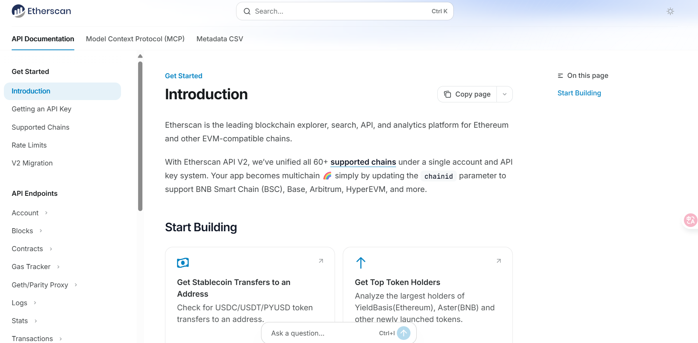

Aave 协议的清算过程会发生在其**所有部署了的市场所在的区块链网络上**。

清算并不是在某个特定的“清算链”上发生的，而是 Aave 协议核心功能的一部分。无论 Aave V3 部署在哪个网络上，该网络上的清算机制都会被激活。

根据 Aave V3 的部署情况，清算会发生在以下主要网络上（以及 Aave 支持的其他网络）：

* **Ethereum** (以太坊主网)
* **Arbitrum**
* **Optimism**
* **Polygon**
* **Avalanche**
* **Base**
* **Fantom** (虽然搜索结果提到过，但请注意，Aave 在 Fantom 上的 V3 市场已被 Aave 治理投票关停)

**核心机制：**

当用户在任何一个网络（例如 Arbitrum）上的 Aave 市场中，其抵押品价值下降或债务价值上升，导致其“健康因子”（Health Factor）低于 1 时，该用户的头寸在该网络上就变得可以被清算。

届时，任何人（通常是清算机器人）都可以在 **Arbitrum 网络上**调用 Aave 的 `liquidationCall()` 智能合约函数，偿还该用户的一部分债务，并以折扣价获得该用户的抵押品。

简而言之：**Aave 在哪个网络上提供借贷服务，清算就会在哪个网络上发生。**

这是一个非常好的问题。简单来说，**之所以有这么多网络，根本原因是为了解决以太坊主网的“拥堵”和“昂贵”问题。**

以太坊（Ethereum）是第一个成功实现了“智能合约”的区块链，就像一个“世界计算机”，允许任何人在上面构建去中心化应用（DApps），例如 Aave。

但它的问题在于：**可扩展性（Scalability）**。

想象一下以太坊主网是一条单车道的高速公路。当Aave、Uniswap和成千上万个其他应用都在这条路上跑时，它会变得极度拥堵。结果就是：

1.  **速度极慢**：一笔交易可能需要几分钟甚至几小时才能确认。
2.  **费用极高**（Gas Fee）：你必须支付高额的“过路费”（Gas）来让别人（矿工/验证者）优先处理你的交易。

这对于像Aave清算这样需要快速反应的操作是致命的，同时也让普通用户无法承受。

为了解决这个问题，出现了不同的“扩容方案”，也就是你列表中的其他网络。它们可以被清晰地分为几类：

---

### 1. 基础层 (Layer 1) - 高速公路本身

这类网络是独立自主的区块链，它们有自己的安全机制（共识）和验证者。

#### 🔹 Ethereum (以太坊主网)
* **类别**: Layer 1 (L1)
* **介绍**: 这是**“结算层”**或**“安全层”**。它是最去中心化、最安全的智能合约平台，也是所有DeFi的起源地。但如前所述，它也是最慢和最贵的。

#### 🔹 Avalanche (AVAX)
* **类别**: Layer 1 (L1) - 以太坊的竞争者
* **介绍**: 这是一个完全独立的区块链，是以太坊的“竞争对手”。它使用了一种不同的共识技术（雪崩共识），旨在实现极高的交易速度和低廉的费用。它通过“子网（Subnets）”技术来分割网络负担，允许多个区块链并行运行。

---

### 2. 二层网络 (Layer 2 Rollups) - 高速公路的“高架桥”

这类网络**不**创建自己的安全。它们在自己的“高架桥”上快速处理成千上万笔交易，然后把这些交易“打包”压缩，再统一提交到以太坊主网上。它们**依赖以太坊主网来保证最终的安全和结算**。

它们的核心优势是：**既享受了以太坊的安全，又实现了极低的Gas费和极快的速度。**

#### 🔹 Arbitrum
* **类别**: Layer 2 (L2) - Optimistic Rollup
* **介绍**: 目前市值和使用量最大的L2网络。它使用“乐观汇总（Optimistic Rollup）”技术，它“乐观地”假设所有交易都是有效的，如果有人认为某笔交易是欺诈性的，他们有7天的时间提交“欺诈证明”来挑战它。

#### 🔹 Optimism
* **类别**: Layer 2 (L2) - Optimistic Rollup
* **介绍**: 另一个主要的L2网络，同样使用“乐观汇总”技术。Optimism 开源了其技术栈（OP Stack），让其他人可以轻松创建自己的L2，这极大地推动了其生态发展。

#### 🔹 Base
* **类别**: Layer 2 (L2) - Optimistic Rollup
* **介绍**: 由著名加密货币交易所 **Coinbase** 推出的L2网络。它**正是使用了 Optimism 的“OP Stack”技术构建的**。它的主要优势在于背后有Coinbase的庞大用户基础和资源支持。

---

### 3. 侧链 (Sidechain) - 高速公路旁的“国道”

这类网络是独立的区块链，但它们通过“桥（Bridge）”与以太坊相连。

#### 🔹 Polygon (PoS)
* **类别**: 侧链 (Sidechain) / Commit-Chain
* **介绍**: （请注意，"Polygon"品牌下有很多技术，但我们通常所说的 Polygon 是指 Polygon PoS 链）。
* 它是一条独立的、使用 Proof-of-Stake (PoS) 共识的区块链。它有自己的验证者节点，**不依赖以太坊保障安全**，这是它与 L2 的最大区别。
* 它通过“桥”将资产从以太坊锁定并转移过来，实现了极低的费用和高速度。它非常受欢迎，但其安全性被认为低于L2 Rollups。

---

### 总结：为什么有这么多网络？

**因为大家都在用不同的方法解决“可扩展性”这个核心问题。**

* **Layer 1 (如 Avalanche)** 的赌注是：造一条全新的、比以太坊更好的高速公路。
* **Layer 2 (如 Arbitrum, Optimism)** 的赌注是：不在主路（L1）上添堵，我们在以太坊主路之上修高架桥（L2），共享主路的安全。
* **侧链 (如 Polygon)** 的赌注是：在主路旁边修一条平行的国道（侧链），用一座桥（Bridge）连起来，跑起来快，但路况安全（共识）得自己负责。
* **Base** 的出现则代表了新趋势：大公司（Coinbase）也想利用 L2 技术（OP Stack）来搭建自己的专属“高架桥”，将其庞大的用户群带入链上世界。

### 概览对比表

| 网络 | 类别 | 与以太坊的关系 | 安全性来源 |
| :--- | :--- | :--- | :--- |
| **Ethereum** | Layer 1 | 基础 | 自身（PoS） |
| **Avalanche** | Layer 1 | 竞争者 | 自身（PoS） |
| **Arbitrum** | Layer 2 | 扩展层（高架桥） | 继承以太坊 |
| **Optimism** | Layer 2 | 扩展层（高架桥） | 继承以太坊 |
| **Base** | Layer 2 | 扩展层（高架桥） | 继承以太坊 |
| **Polygon (PoS)** | 侧链 | 姐妹链（国道） | 自身（PoS） |

这种“多链”和“多层”的未来，使得像Aave这样的协议必须在所有这些有价值的网络上进行部署，以便用户无论在哪里都能使用它们的服务。

您想更深入地了解 Layer 2 和侧链之间的技术差异吗？